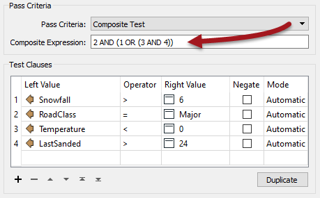
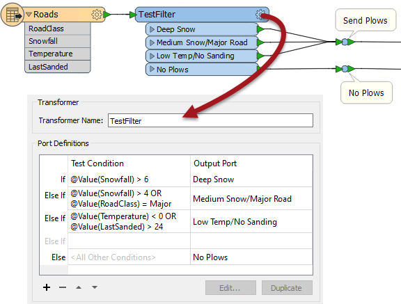

## The Tester and TestFilter Transformers ##

The Tester and TestFilter are the two key transformers for conditional filtering. They are for tests on attribute values.

### Tester ###

The Tester transformer (number 1 in the top 25) is generally for single tests that produce a Yes/No result. 

For example, here we wish to make a decision whether to send out snow plows (ploughs) based on a series of criteria: 

- Has there been more than six inches of snowfall?
- Is this a major road?
- Is the temperature less than zero degrees Celsius?
- Was sand last applied more than 24 hours ago?

Here, features will pass if the value of their Snowfall attribute is greater than six. If it is less than (or equal to) six, the feature will fail the test.

The Tester also allows the combination of multiple tests, where a user can combine any number of clauses using an AND and OR statement. For example, if I was trying to determine whether to send a snow plough to a particular road I might ask:

- Has there been more than six inches of snowfall AND is the temperature less than zero degrees Celsius? 
- Is this a major road AND (has there been more than six inches of snow OR (is the temperature less than zero AND was sand last applied more than 24 hours ago))?

When I have multiple tests I control them using the Pass Criteria field. A mix of AND/OR clauses requires a Composite Test, as shown above. But - however complex the test becomes - it still results in a single Yes/No result; features will either pass or fail this set of tests.

Notice we aren't restricted to simple tests of equality (A=B); in the above there are also "greater than" and "less than" tests. That's because there are many different operators available for use in a test clause.

---

#### Operators ####
The list of operators available in the Tester transformer (or in many of the other locations that make use of the Tester dialog) looks like this:

Besides the usual operators, there are also some based on a SQL where clause. These include:

- In
- Between
- Like
- Contains Regex
- Contains
- Begins With
- Ends With

...plus there are other tests that check for the existence of attributes and values:

- Attribute has a value
- Attribute is Null
- Attribute is Empty String
- Attribute is Missing

---

<!--Tip Section--> 

<table style="border-spacing: 0px">
<tr>
<td style="vertical-align:middle;background-color:darkorange;border: 2px solid darkorange">
<i class="fa fa-info-circle fa-lg fa-pull-left fa-fw" style="color:white;padding-right: 12px;vertical-align:text-top"></i>
TIP
</td>
</tr>

<tr>
<td style="border: 1px solid darkorange">

"Attribute has a value" is the opposite of the three other tests; i.e. this attribute is not Null, AND it is not an empty string, AND it is not missing. Incidentally, "missing" means the attribute does not exist at all on the feature being tested.

</td>
</tr>
</table>

---

<!--Updated Section--> 

<!--Tip Section--> 

<table style="border-spacing: 0px">
<tr>
<td style="vertical-align:middle;background-color:darkorange;border: 2px solid darkorange">
<i class="fa fa-info-circle fa-lg fa-pull-left fa-fw" style="color:white;padding-right: 12px;vertical-align:text-top"></i>
TIP
</td>
</tr>

<tr>
<td style="border: 1px solid darkorange">

"Contains Regex" means only part of the string needs to match. For example...
<pre>
Attribute Value:  abcd
Search String:    ^ab
Contains Regex:  Passed
</pre>
i.e. the entire string doesn't need to match.

</td>
</tr>
</table>

---

### TestFilter ###
The TestFilter (#8 in the top 25) is essentially a way to combine multiple Tester transformers into one. Instead of the Tester's single Passed and Failed ports, you can create a passed port for each condition (it does not need to be called "Passed") with failed features going on to the next test. There is also an output port for features that fail all of the test conditions.

The TestFilter is very similar to the CASE or SWITCH command in programming or scripting languages.

---

<!--Person X Says Section-->

<table style="border-spacing: 0px">
<tr>
<td style="vertical-align:middle;background-color:darkorange;border: 2px solid darkorange">
<i class="fa fa-quote-left fa-lg fa-pull-left fa-fw" style="color:white;padding-right: 12px;vertical-align:text-top"></i>
Sister Intuitive says...
</td>
</tr>

<tr>
<td style="border: 1px solid darkorange">

The TestFilter is very good for filtering a feature by a set of cascading conditions, for example here are a set of tests to again determine whether to send out a snow plough:
  - Has there been more than six inches of snowfall?
 - Has there been more than four inches of snowfall AND is this a major road?
 - Is the temperature less than zero degrees Celsius AND was sand last applied more than 24 hours ago?

  It’s a set of cascading tests, because if there has been more than six inches of snow, the ploughs are sent out anyway; you don’t need to test any other criteria. So the test order can be very important. If every test is a fail, then the plows are not sent out.
  Also notice that you can include composite tests (those with ANDs or ORs in them).

</td>
</tr>
</table>

---

The TestFilter has the full set of operators available with the Tester such as equals, greater than, less than, and so forth. Each condition is tested in turn.

Features that pass are output through the matching output port. Features that fail are sent on to the next condition in the list. Therefore it’s very important to get the conditions in the correct order.

In this example the user has used three Tester transformers and multiple connections (using the above logic) to determine whether to send the snow plows:

With the TestFilter, the three Testers are now replaced with one single transformer and there are fewer connections:

Also notice how the TestFilter output ports have custom naming. This is another advantage to this transformer.

---

<!--Person X Says Section-->

<table style="border-spacing: 0px">
<tr>
<td style="vertical-align:middle;background-color:darkorange;border: 2px solid darkorange">
<i class="fa fa-quote-left fa-lg fa-pull-left fa-fw" style="color:white;padding-right: 12px;vertical-align:text-top"></i>
Chef Bimm says...
</td>
</tr>

<tr>
<td style="border: 1px solid darkorange">

Because the TestFilter can carry out a single test (as well as multiple ones) it's possible to use it exclusively instead of the Tester transformer.

</td>
</tr>
</table>
