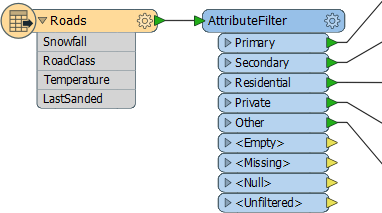
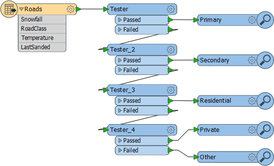
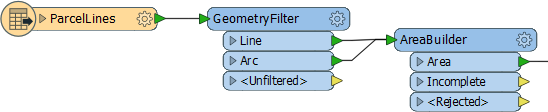

## Other Key Filter Transformers ##
The Tester and TestFilter are not the only useful filter transformers.

### AttributeFilter ###
The AttributeFilter transformer (#9 in the top 25) directs features on the basis of values in a chosen attribute. It is best for testing many values for a single attribute, for example:

- Is that road a Primary , Secondary, Residential, Private, or Other type of road?
- Is the forecast for sun, rain, snow, or fog?

In this example features are divided into different postal codes depending on the value of a PostalCode attribute.

If your workspace looks like this then an AttributeFilter transformer might be a better option.

In this transformer the only "operator" is to find equivalency, so you would rarely use it for arithmetical tests.

---

<!--Person X Says Section-->

<table style="border-spacing: 0px">
<tr>
<td style="vertical-align:middle;background-color:darkorange;border: 2px solid darkorange">
<i class="fa fa-quote-left fa-lg fa-pull-left fa-fw" style="color:white;padding-right: 12px;vertical-align:text-top"></i>
Confused from Interopolis says...
</td>
</tr>

<tr>
<td style="border: 1px solid darkorange">

Dear Aunt Interop
 If the Tester, TestFilter, and AttributeFilter all filter features on the basis of an attribute condition, then what’s the difference? When would I use each?

</td>
</tr>
</table>

<!--Person X Says Section-->

<table style="border-spacing: 0px">
<tr>
<td style="vertical-align:middle;background-color:darkorange;border: 2px solid darkorange">
<i class="fa fa-quote-left fa-lg fa-pull-left fa-fw" style="color:white;padding-right: 12px;vertical-align:text-top"></i>
Aunt Interop says...
</td>
</tr>

<tr>
<td style="border: 1px solid darkorange">

Dear Confused
 The best solution is to check out these two articles on the Safe Software blog:
 - <a href="https://blog.safe.com/2013/03/fmeevangelist113/">Conditional Processing in FME</a>
 - <a href="https://blog.safe.com/2015/05/fmeevangelist133/">A Simple Guide to FME Filter Transformers</a>

</td>
</tr>
</table>

---

### AttributeRangeFilter ###
The AttributeRangeFilter carries out the same operation as the AttributeFilter, except that it can handle a range of numeric values instead of just a simple one-to-one match.

The AttributeRangeFilter parameters dialog has the option to generate ranges automatically from a set of user-defined extents.

---

### GeometryFilter ###
The GeometryFilter (#15 in the top 25) directs features on the basis of geometry type; for example, point, line, area, ellipse.

The GeometryFilter is useful for:

- Filtering out unwanted geometry types; for example removing non-linear features before using an AreaBuilder transformer (above)
- Dividing up geometry types to write to separate destination Feature Types; for example, when writing to a geometry-restricted format such as Esri Shape

