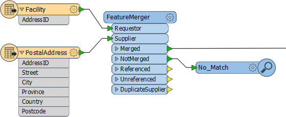
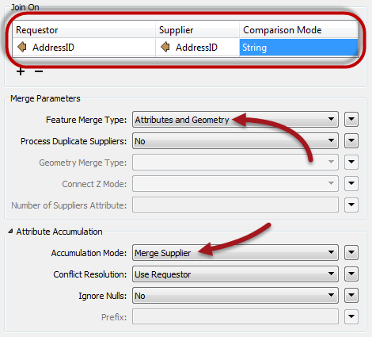
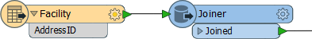
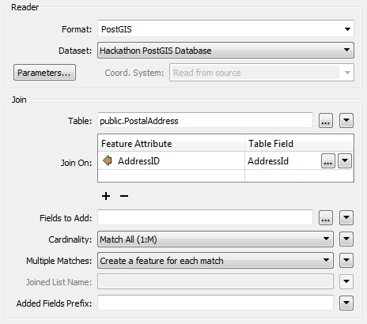

## Attribute Join Transformers ##
These are transformers that join data on the basis of a matching attribute value.

### FeatureMerger ###
The FeatureMerger is the primary transformer for joining two streams of data within a workspace. This is achieved on the basis of one or more matching attribute values (keys).

Here, for example, a dataset of facilities has an AddressId number, but no address. The FeatureMerger is being used to combine data from an address table into the facilities data.

Of interest for QA reasons is the NotMerged port. Here facilities that did not have a matching AddressId are sent to a Inspector transformer to record the fact that there was no match. These records could then be checked to ensure they have a valid AddressId.

The parameters dialog for the FeatureMerger looks like this:

Notice how the AddressId attribute from each set of data is being used to merge the features together. Also notice that the merge can (and in this case does) include both attributes and geometry; i.e. the "requestor" can be updated with the geometry of the "supplier."

Attribute Accumulation parameters allow you to determine what to do if the requestor already has an attribute of the same name as one being supplied to it (for example, if the Facility records already had a Postcode field, which should take precedence?)

---

<!--Tip Section--> 

<table style="border-spacing: 0px">
<tr>
<td style="vertical-align:middle;background-color:darkorange;border: 2px solid darkorange">
<i class="fa fa-info-circle fa-lg fa-pull-left fa-fw" style="color:white;padding-right: 12px;vertical-align:text-top"></i>
TIP
</td>
</tr>

<tr>
<td style="border: 1px solid darkorange">

Another useful parameter is called Number of Suppliers Attribute. This attribute will be used to record the number of suppliers that were matched to any one requestor (assuming Process Duplicate Suppliers is turned on).

</td>
</tr>
</table>

---

### Joiner ###
The Joiner transformer is similar to the FeatureMerger, but instead of merging two streams of features, it merges one stream of features with data from an external database.

Here is the same example as for the FeatureMerger above. In this case the facilities features are obtaining address data directly from an address table in a PostGIS database. 

The parameters dialog for the Joiner looks like this:

Again, AddressId is being used to facilitate a merge between the two sets of data. 

---

<!--Person X Says Section-->

<table style="border-spacing: 0px">
<tr>
<td style="vertical-align:middle;background-color:darkorange;border: 2px solid darkorange">
<i class="fa fa-quote-left fa-lg fa-pull-left fa-fw" style="color:white;padding-right: 12px;vertical-align:text-top"></i>
First-Officer Transformer says...
</td>
</tr>

<tr>
<td style="border: 1px solid darkorange">

The Joiner has a number of advantages over the FeatureMerger. Firstly it has parameters to control how multiple matches are handled, as well as parameters for optimizing the database query.
  Secondly, it allows features to be joined without having to read the entire dataset into a workspace. FME can just query the database and select the individual records it needs. This can improve performance greatly.
  It does, of course, require the supplier records to be stored in an appropriate database format!

</td>
</tr>
</table>