<!--Exercise Section-->

<table style="border-spacing: 0px;border-collapse: collapse;font-family:serif">
<tr>
<td width=25% style="vertical-align:middle;background-color:darkorange;border: 2px solid darkorange">
<i class="fa fa-cogs fa-lg fa-pull-left fa-fw" style="color:white;padding-right: 12px;vertical-align:text-top"></i>
Exercise 1
</td>
<td style="border: 2px solid darkorange;background-color:darkorange;color:white">
Address Open Data Project
</td>
</tr>

<tr>
<td style="border: 1px solid darkorange; font-weight: bold">Data</td>
<td style="border: 1px solid darkorange">Addresses (File Geodatabase)</td>
</tr>

<tr>
<td style="border: 1px solid darkorange; font-weight: bold">Overall Goal</td>
<td style="border: 1px solid darkorange">Convert a File Geodatabase to GML and map the schema</td>
</tr>

<tr>
<td style="border: 1px solid darkorange; font-weight: bold">Demonstrates</td>
<td style="border: 1px solid darkorange">Attribute Management for Schema Mapping</td>
</tr>

<tr>
<td style="border: 1px solid darkorange; font-weight: bold">Start Workspace</td>
<td style="border: 1px solid darkorange">None</td>
</tr>

<tr>
<td style="border: 1px solid darkorange; font-weight: bold">End Workspace</td>
<td style="border: 1px solid darkorange">C:\FMEData2017\Workspaces\DesktopBasic\Transformers-Ex1-Complete.fmw</td>
</tr>

</table>

As part of a push for open government, the city's corporate address database is to be made available online. However, it is currently held in Esri File Geodatabase format and this is not thought suitable to deliver in its raw form. Instead the data will be translated to a GML/XML format and transformed into a new schema.

As custodian of all things to do with data translations, you have been handed this task to carry out.

 **1) Inspect Data**
 As usual, the first task is to familiarize yourself with the data. To do this open the following dataset within the FME Data Inspector:

<table style="border: 0px">

<tr>
<td style="font-weight: bold">Reader Format</td>
<td style="">Esri Geodatabase (File Geodb API)</td>
</tr>

<tr>
<td style="font-weight: bold">Reader Dataset</td>
<td style="">C:\FMEData2017\Data\Addresses\Addresses.gdb</td>
</tr>

</table>

The table that is to be translated is called "PostalAddress." The important thing here is not how the data looks in the graphic display, but more what attributes exist in the Table View window.

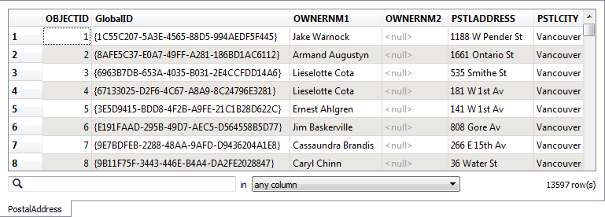

Optionally you may wish to locate the file C:\FMEData2017\Resources\AddressSchema.xsd and open it in a text editor (or other XML file viewer). An xsd file describes the schema of an XML/GML dataset, and this file has been created to define what attributes we wish to have in our address GML dataset.

**2) Create Workspace**
 Now that you are familiar with both the source data and the required output schema, start FME Workbench and begin with an empty workspace. Select Readers > Add Reader from the menubar.

Add the Reader with the same values as in the Data Inspector.

<table style="border: 0px">

<tr>
<td style="font-weight: bold">Reader Format</td>
<td style="">Esri Geodatabase (File Geodb API)</td>
</tr>

<tr>
<td style="font-weight: bold">Reader Dataset</td>
<td style="">C:\FMEData2017\Data\Addresses\Addresses.gdb</td>
</tr>

</table>

When prompted, select only the PostalAddresses table, and no others:

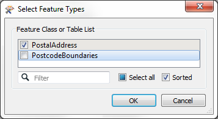

**3) Add Writer**
 Now let's add a Writer to write the output data. Select Writers > Add Writer from the menubar and use the following:

<table style="border: 0px">

<tr>
<td style="font-weight: bold">Writer Format</td>
<td style="">GML (Geography Markup Language)</td>
</tr>

<tr>
<td style="font-weight: bold">Writer Dataset</td>
<td style="">C:\FMEData2017\Output\Training\AddressFile.gml</td>
</tr>

</table>

Select 'Import from Dataset' in the 'Add Feature Types' section of the dialog. Then Click OK to add the Writer.

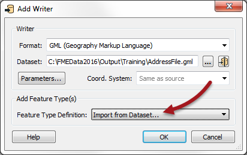

 **4) Import Feature Types**
 When prompted set the following parameters. The Dataset can be left as it is or emptied (left blank). It is not the important part:

<table style="border: 0px">

<tr>
<td style="font-weight: bold">Reader Format</td>
<td style="">GML (Geography Markup Language)</td>
</tr>

<tr>
<td style="font-weight: bold">Reader Dataset</td>
<td style=""></td>
</tr>

<tr>
<td style="font-weight: bold">Reader Parameters</td>
<td style="">Application Schema C:\FMEData2017\Resources\AddressSchema.xsd</td>
</tr>

</table>

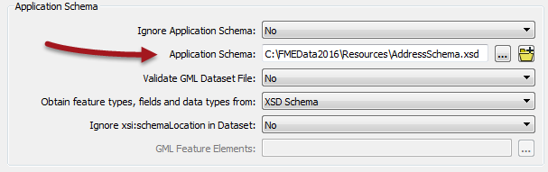

You may also need to set the Namespace Prefix parameter:

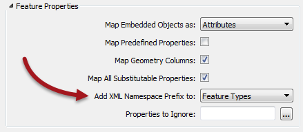

Click OK to accept the values. The new feature type will be created to match the chosen GML application schema.

The workspace will now look like this:

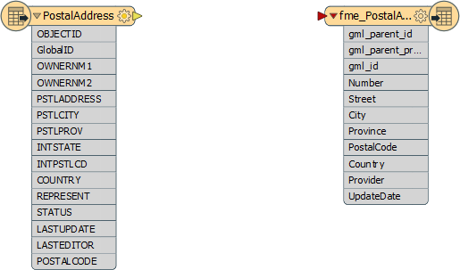

 **5) Add AttributeManager**
 OK, we now have the Reader and Writer in place. Now we can start to map the schema from Reader to Writer. As you'll have noticed, the two do not currently match up very well.

So, place an AttributeManager connected between the two feature types. The dialog will look like this:

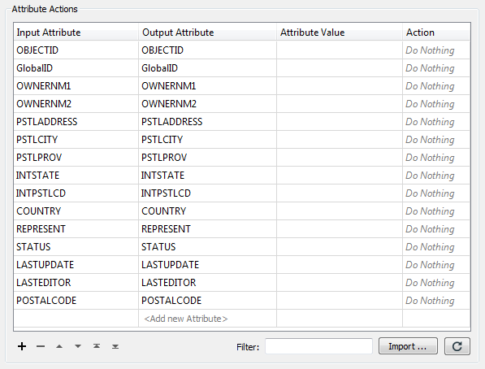

Firstly let's clear up the Reader schema by removing some of the unwanted attributes. 

Click on the following attributes and press the - button to remove them:

- OBJECTID
- GlobalID
- OWNERNM1
- OWNERNM2
- INTSTATE
- INTPSTLCD
- REPRESENT
- STATUS
- LASTUPDATE
- LASTEDITOR

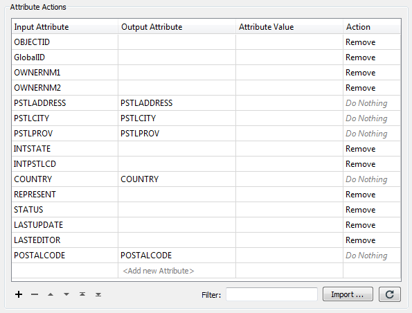

 **6) Rename Attributes**
 Several source attributes can be written to the output as they are, but do need renaming first.

in the AttributeManager rename the following:

- PSTLCITY to City
- PSTLPROV to Province
- POSTALCODE to PostalCode
- COUNTRY to Country

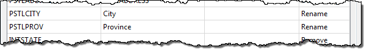

If the AttributeManager is connected to the Writer feature type then you should be able to select the Output Attribute field from a drop-down list instead of typing it in.

 **7) Create Attribute**
 Two attributes on the output (Provider and UpdateDate) are new and cannot be copied from the source data. They must be created. 

In the AttributeManager create the new attribute "Provider". Because the attribute does not already exist, you'll need to type the new name, rather than select it from a drop-down list.

The value can be your own organization name, or "Safe Software" or "City of Interopolis."

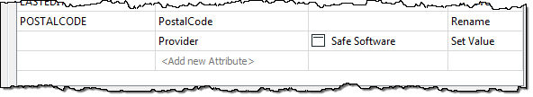

 **8) Create Attribute**
 Now create the new attribute "UpdateDate". Rather than hard-coding a value click on the drop-down arrow in the Attribute Value field and choose Open Text Editor.

In the text editor locate the FME Feature Function called Timestamp and double-click to place it in the editor. Now replace the &lt;STRING&gt; part with ^Y-^m-^d

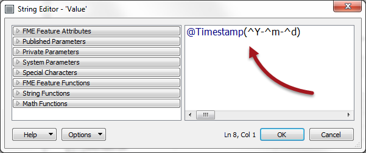

By doing this not only will we get the correct date each time the workspace is run, it will also be in the correct ISO syntax for GML format.

Click OK (and again) to close the AttributeManager dialog.

---

<!--Tip Section--> 

<table style="border-spacing: 0px">
<tr>
<td style="vertical-align:middle;background-color:darkorange;border: 2px solid darkorange">
<i class="fa fa-info-circle fa-lg fa-pull-left fa-fw" style="color:white;padding-right: 12px;vertical-align:text-top"></i>
TIP
</td>
</tr>

<tr>
<td style="border: 1px solid darkorange">

Why not run the translation now, with Redirect to FME Data Inspector turned on, to see what the result of our efforts so far is?

</td>
</tr>
</table>

---

 **9) Add AttributeSplitter**
 Looking at the output schema there are two fields for Number and Street (for example "3305" and "W 10th Av"). However, the source schema condenses that information into one field with &lt;space&gt; characters separating the fields ("3305 W 10th Av"). Therefore we'll have to split the source attribute up in order to match the Writer schema.

Insert an AttributeSplitter transformer. Insert it ***before*** the AttributeManager - then if there are any actions to carry out on the split attributes we can use the same AttributeManager transformer.

Open the AttributeSplitter parameters dialog. Set PSTLADDRESS as the attribute to split and enter a space character into the Delimiter parameter. Ensure that a list name is set in that particular parameter.

Click OK to close the dialog. If you run the workspace now you'll see the address as a list attribute:

<pre>_list{0} (encoded: utf-8) 3305
_list{1} (encoded: utf-8) W
_list{2} (encoded: utf-8) 10th
_list{3} (encoded: utf-8) Av</pre>

Remember a list attribute is one that can store multiple values under a single name (_list).

 **10) Rename Attribute**
 Now let's handle the Number field in the output.

Open the AttributeManager parameters. 

Notice that there is now an entry for the list attribute called _list{}. However, the AttributeManager will not expose list elements like other transformers will. So instead of renaming the attribute we have to copy its value into the new attribute.

In the Output Attribute field select Number from the drop-down list.

For the Attribute Value field click the drop-down arrow and select Attribute Value > _list{}...

You will now be prompted to select the element in the list. Ensure it is set to zero (0) and click OK.

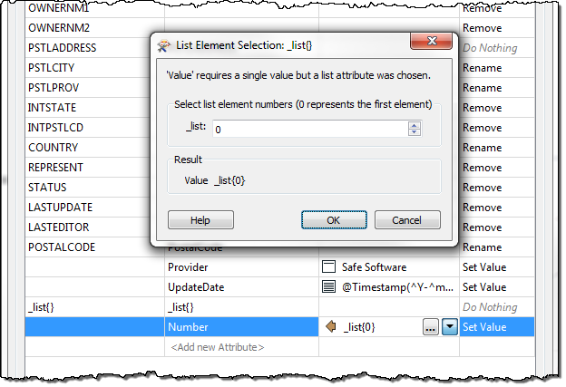

Click OK to close the dialog and run the workspace to ensure the number is being copied.

 **11) Construct Attribute**
 The final step is to recreate the Street attribute, without it being prefixed by the address number.

Open the AttributeManager again. This time in the Output Attribute field select Street from the list.

For the Attribute Value field there are multiple list elements to concatenate. So click the drop down arrow and choose Open Text Editor.

Locate _list{} in the FME Feature Attributes menu and double-click it to place it in the editor. Again you will be prompted to select a list element. This time select element 1

Press the spacebar to enter a &lt;space&gt; character.

Double-click _list{} again and this time select list item 2.

Again press the spacebar for another &lt;space&gt; character.

Double-click _list{} again, this time selecting item 3.

The dialog will now look like this:

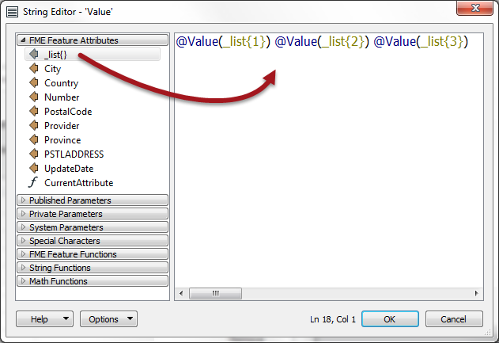

In this way we will have concatenated all parts of the street name back together, for example:

<pre>"W"+"17th"+"St" becomes "W 17th St"</pre>

We're assuming that no street name has more than three parts to it, but that's reasonable for our example.

**12) Run Workspace**
 Save and then run the workspace (remember to turn off any Redirect option!)

Open the containing folder to check the output has been written. There should be both an output file and schema document. Inspect the data in the FME Data Inspector. The output (with a background map turned on) should look like this:

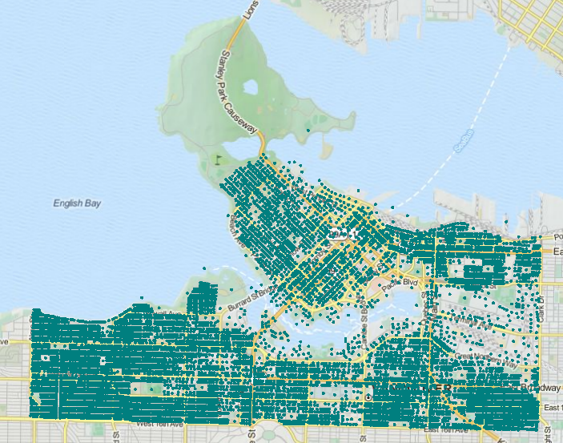
 Tiles Courtesy of <a href="http://www.mapquest.com/">MapQuest</a>

Querying a feature will return all of the attributes we've just put together:

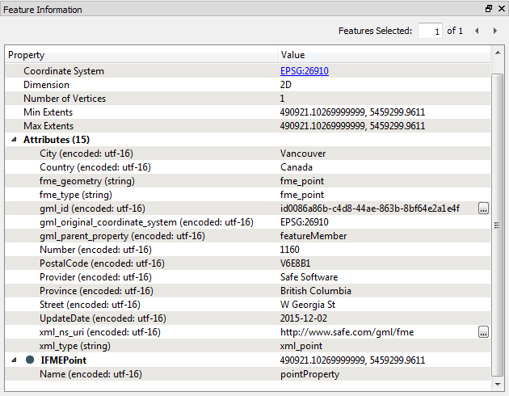

---

<!--Exercise Congratulations Section--> 

<table style="border-spacing: 0px">
<tr>
<td style="vertical-align:middle;background-color:darkorange;border: 2px solid darkorange">
<i class="fa fa-thumbs-o-up fa-lg fa-pull-left fa-fw" style="color:white;padding-right: 12px;vertical-align:text-top"></i>
CONGRATULATIONS
</td>
</tr>

<tr>
<td style="border: 1px solid darkorange">

By completing this exercise you have learned how to:
 
<ul><li>Use the AttributeManager transformer to create, delete, and rename attributes</li>
<li>Use the AttributeSplitter to split attributes into a list attribute</li>
<li>Handle list attributes in the AttributeManager</li>
<li>Use an FME function in the AttributeManager text editor</li>
<li>Import feature types from an XML schema document</li></ul>

</td>
</tr>
</table>
