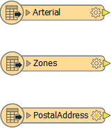
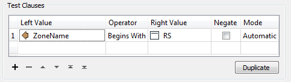
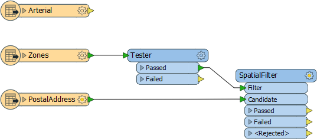
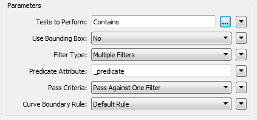
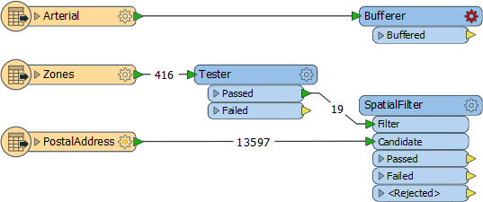
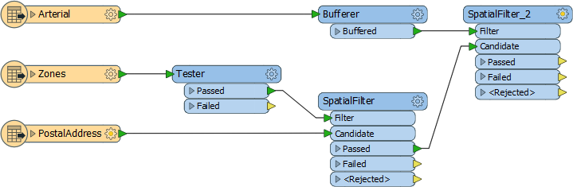
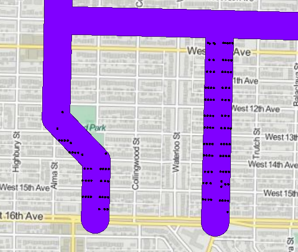

<!--Exercise Section-->

<table style="border-spacing: 0px;border-collapse: collapse;font-family:serif">
<tr>
<td width=25% style="vertical-align:middle;background-color:darkorange;border: 2px solid darkorange">
<i class="fa fa-cogs fa-lg fa-pull-left fa-fw" style="color:white;padding-right: 12px;vertical-align:text-top"></i>
Exercise 2
</td>
<td style="border: 2px solid darkorange;background-color:darkorange;color:white">
Noise Control Laws Project
</td>
</tr>

<tr>
<td style="border: 1px solid darkorange; font-weight: bold">Data</td>
<td style="border: 1px solid darkorange">Addresses (File Geodatabase) Zoning (MapInfo TAB) Roads (AutoCAD DWG)</td>
</tr>

<tr>
<td style="border: 1px solid darkorange; font-weight: bold">Overall Goal</td>
<td style="border: 1px solid darkorange">To find all residential addresses within 50 meters of an arterial highway</td>
</tr>

<tr>
<td style="border: 1px solid darkorange; font-weight: bold">Demonstrates</td>
<td style="border: 1px solid darkorange">Methods of conditional filtering</td>
</tr>

<tr>
<td style="border: 1px solid darkorange; font-weight: bold">Start Workspace</td>
<td style="border: 1px solid darkorange">None</td>
</tr>

<tr>
<td style="border: 1px solid darkorange; font-weight: bold">End Workspace</td>
<td style="border: 1px solid darkorange">C:\FMEData2017\Workspaces\DesktopBasic\Transformers-Ex2-Complete.fmw</td>
</tr>

</table>

City councillors have voted to amend noise control laws. However, local residents living in a single-family residence within 50 metres of a major highway must be contacted to inform them of these changes.

You have been recommended by your manager to take on the task of finding all affected addresses. There's a tight deadline and at least three city councillors are standing watching you work. The pressure is on and it's up to you to deliver!

 **1) Start Workbench**
 Start Workbench and create a new empty workspace.

 **2) Add Reader (Roads data)**
 Use Readers > Add Reader to add a Reader for the roads data. The roads data will be used to determine distance from an arterial route.

<table style="border: 0px">

<tr>
<td style="font-weight: bold">Reader Format</td>
<td style="">Autodesk AutoCAD DWG/DXF</td>
</tr>

<tr>
<td style="font-weight: bold">Reader Dataset</td>
<td style="">C:\FMEData2017\Data\Transportation\Roads.dwg</td>
</tr>

</table>

When prompted, select only the feature type (layer) called Arterial. 

 **3) Add Reader (Zoning data)**
 Use Readers > Add Reader to add a reader for zoning data. The zoning data will be used to determine whether an address is single-family residential or not.

<table style="border: 0px">

<tr>
<td style="font-weight: bold">Reader Format</td>
<td style="">MapInfo TAB (MITAB)</td>
</tr>

<tr>
<td style="font-weight: bold">Reader Dataset</td>
<td style="">C:\FMEData2017\Data\Zoning\Zones.tab</td>
</tr>

</table>

 **4) Add Reader (Address data)**
 Use Readers > Add Reader to add a reader for address data:

<table style="border: 0px">

<tr>
<td style="font-weight: bold">Reader Format</td>
<td style="">Esri Geodatabase (File Geodb API)</td>
</tr>

<tr>
<td style="font-weight: bold">Reader Dataset</td>
<td style="">C:\FMEData2017\Data\Addresses\Addresses.gdb</td>
</tr>

<tr>
<td style="font-weight: bold">Reader Parameters</td>
<td style="">Table List: PostalAddress</td>
</tr>

</table>

Ensure the feature types on the canvas are laid out in the order Arterial - Zones - PostalAddress; the workspace will now look like this:

Feel free to inspect all of the source data to familiarize yourself with the contents.

 **5) Add Tester Transformer**
 Add a Tester transformer to the Zoning feature type.

This Tester will be used to filter residential zones from the other zoning areas.
All single-family residential zones will start with RS, so the Tester should be set up like this:

The important thing is to set up the tests using the “Begins With” predicate.

---

<!--Person X Says Section-->

<table style="border-spacing: 0px">
<tr>
<td style="vertical-align:middle;background-color:darkorange;border: 2px solid darkorange">
<i class="fa fa-quote-left fa-lg fa-pull-left fa-fw" style="color:white;padding-right: 12px;vertical-align:text-top"></i>
Miss Vector says...
</td>
</tr>

<tr>
<td style="border: 1px solid darkorange">

So... why the Tester? Why not use the AttributeFilter? <a href="http://52.73.3.37/fmedatastreaming/Manual/QAResponse2017.fmw?chapter=5&question=5&answer=1&DestDataset_TEXTLINE=C%3A%5CFMEOutput%5CQAResponse.html">Do you know?</a>

</td>
</tr>
</table>

---

 **6) Add SpatialFilter**
 Add a SpatialFilter transformer to the workspace. This will be used to test each address to show whether that address falls inside one of the filtered residential zones.

- Connect the Tester:Passed output to the SpatialFilter:Filter port
- Connect the feature type PostalAddress to the SpatialFilter:Candidate port

 **7) Set up SpatialFilter**
 Open the SpatialFilter parameters dialog. Set up the parameters.

Tests to Perform should be set to 'Contains' (i.e. find addresses that the zones contain). The Filter Type should be set to Multiple Filters (as there are multiple zoning areas). However, the Pass Criteria parameter should be “Pass Against One Filter.”

This parameter is **very** important. The test will fail if it is not set correctly, as a single address cannot be in ALL zones.

 **8) Add Inspectors**
 Now let's test what we have so far. Add Inspectors to both SpatialFilter output ports, and the Tester:Passed port.

 **9) Save and Run Workspace**
 Save the workspace. Run the workspace. Inspect the output to prove that it has worked as expected. The only area features will be the residential zones, and SpatialFilter:Passed (address) features will fall inside these areas.

 **10) Add Bufferer**
 Now we can determine which of the filtered addresses fall within 50 metres of an arterial route.

The SpatialFilter does not have a test for "within X distance" therefore we'll have to set that up a little differently. Add a Bufferer transformer to the workspace. Connect it to the Arterial roadsdata:

Now open the parameters dialog for the Bufferer. Set the buffer amount to be 50.

---

<!--Updated Section--> 

<table style="border-spacing: 0px">
<tr>
<td style="vertical-align:middle;background-color:darkorange;border: 2px solid darkorange">
<i class="fa fa-bolt fa-lg fa-pull-left fa-fw" style="color:white;padding-right: 12px;vertical-align:text-top"></i>
.1 UPDATE
</td>
</tr>

<tr>
<td style="border: 1px solid darkorange">

The Bufferer transformer in the above screenshot gained a &lt;Rejected&gt; port in FME2016.1

</td>
</tr>
</table>

---

<!--Tip Section--> 

<table style="border-spacing: 0px">
<tr>
<td style="vertical-align:middle;background-color:darkorange;border: 2px solid darkorange">
<i class="fa fa-info-circle fa-lg fa-pull-left fa-fw" style="color:white;padding-right: 12px;vertical-align:text-top"></i>
TIP
</td>
</tr>

<tr>
<td style="border: 1px solid darkorange">

Optionally you can add a Dissolver transformer after the Bufferer, to merge all the buffer features together.
  The results of the translation will be the same (in terms of addresses selected) but the data will look better in the FME Data Inspector.

</td>
</tr>
</table>

---

 **11) Add SpatialFilter**
 Add a second SpatialFilter transformer. The buffered arterial routes are the Filter. The prefiltered addresses are the Candidates:

As before, open the parameters dialog and change the settings to be a 'Contains' test against multiple filters.

**12) Run Workspace**
 Attach some Inspector transformers to show you the output from various transformers. Save and run the workspace. The output (zoomed in) should look like this:

 Tiles Courtesy of <a href="http://www.mapquest.com/">MapQuest</a>

---

<!--Exercise Congratulations Section--> 

<table style="border-spacing: 0px">
<tr>
<td style="vertical-align:middle;background-color:darkorange;border: 2px solid darkorange">
<i class="fa fa-thumbs-o-up fa-lg fa-pull-left fa-fw" style="color:white;padding-right: 12px;vertical-align:text-top"></i>
CONGRATULATIONS
</td>
</tr>

<tr>
<td style="border: 1px solid darkorange">

By completing this exercise you have learned how to:
 
<ul><li>Use the Tester transformer to filter by an attribute value</li>
<li>Use the SpatialFilter transformer to filter by geometry</li>
<li>Use the Bufferer transformer to set up a "within x distance of" test</li></ul>

</td>
</tr>
</table>
