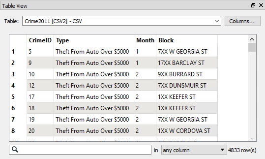
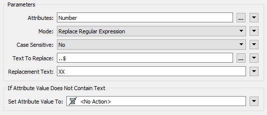
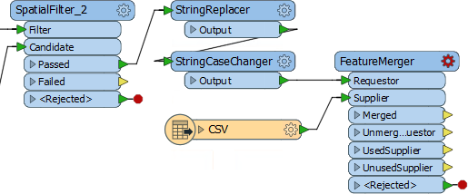
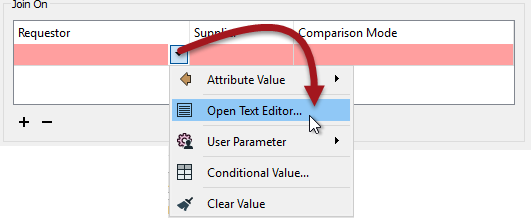
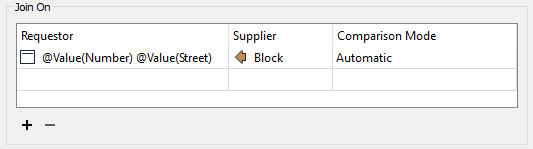

<!--Exercise Section-->

<table style="border-spacing: 0px;border-collapse: collapse;font-family:serif">
<tr>
<td width=25% style="vertical-align:middle;background-color:darkorange;border: 2px solid darkorange">
<i class="fa fa-cogs fa-lg fa-pull-left fa-fw" style="color:white;padding-right: 12px;vertical-align:text-top"></i>
Exercise 3
</td>
<td style="border: 2px solid darkorange;background-color:darkorange;color:white">
Noise Control Laws Project (Crime Data Joins)
</td>
</tr>

<tr>
<td style="border: 1px solid darkorange; font-weight: bold">Data</td>
<td style="border: 1px solid darkorange">Crime Statistics (CSV)</td>
</tr>

<tr>
<td style="border: 1px solid darkorange; font-weight: bold">Overall Goal</td>
<td style="border: 1px solid darkorange">Carry out a join between crime statistics and address features</td>
</tr>

<tr>
<td style="border: 1px solid darkorange; font-weight: bold">Demonstrates</td>
<td style="border: 1px solid darkorange">Attribute-Based Joins</td>
</tr>

<tr>
<td style="border: 1px solid darkorange; font-weight: bold">Start Workspace</td>
<td style="border: 1px solid darkorange">C:\FMEData2017\Workspaces\DesktopBasic\Transformers-Ex3-Begin.fmw</td>
</tr>

<tr>
<td style="border: 1px solid darkorange; font-weight: bold">End Workspace</td>
<td style="border: 1px solid darkorange">C:\FMEData2017\Workspaces\DesktopBasic\Transformers-Ex3-Complete.fmw</td>
</tr>

</table>

As you know, city councillors have voted to amend noise control laws and local residents living in affected areas were informed of these changes.

In the first part of the project you created a workspace to convert addresses from Geodatabase to Excel, mapping the schema at the same time. 

In the second part of the project you continued the workspace to locate all single-family residences within 50 metres of a major highway and filter out all others from the stream of address data.

Now a data journalist with a national newspaper is concerned that the relaxation of noise control laws may lead to more crime in the city. They have therefore made a request for recent crime figures for each of the affected addresses. They intend to compare this against future data to see if their theory is correct.

This is a major test of the city's open data policy and there's no question of not complying.

However, a crisis arises as the current datasets for crime (CSV, non-spatial) is not joined to the address database in any way. 

So, for the final part of this project you must take the existing noise control workspace and amend it to incorporate crime statistics. 

Pull this off and you will be a spatial superhero!

 **1) Inspect Source Data (Crime)**
 The first task is to familiarize yourself with the source data. To do this open the following dataset within the FME Data Inspector or a simple text editor.

<table style="border: 0px">

<tr>
<td style="font-weight: bold">Reader Format</td>
<td style="">Comma Separated Value (CSV)</td>
</tr>

<tr>
<td style="font-weight: bold">Reader Dataset</td>
<td style="">C:\FMEData2017\Data\Emergency\Crime2011.csv</td>
</tr>

<tr>
<td style="font-weight: bold">Reader Parameters</td>
<td style="">Fields:Delimiter Character: , (Comma) Fields:Field Names Line: 1</td>
</tr>

</table>

The data will look like this in the Data Inspector Table View window:

Notice how there is no spatial data as such, but there is a block number. 

---

<!--Person X Says Section-->

<table style="border-spacing: 0px">
<tr>
<td style="vertical-align:middle;background-color:darkorange;border: 2px solid darkorange">
<i class="fa fa-quote-left fa-lg fa-pull-left fa-fw" style="color:white;padding-right: 12px;vertical-align:text-top"></i>
Police-Chief Webb-Mapp says...
</td>
</tr>

<tr>
<td style="border: 1px solid darkorange">

Crime?! In my city? I think not. But if there was... be aware that 7XX W Georgia Street means the seventh block on Georgia Street west of Ontario Street and covers building numbers 700-800. 7XX E Georgia Street would be 14 blocks away, the seventh block east of Ontario. Got it? 

</td>
</tr>
</table>

---

 **2) Start Workbench**
 Start Workbench (if necessary) and open the workspace from Exercise 2. Alternatively you can open C:\FMEData2017\Workspaces\DesktopBasic\Transformers-Ex3-Begin.fmw

The workspace is already set up to read addresses, filter them spatially, and write them to an Excel spreadsheet.

Notice that each address has a number (not a block ID like "7XX"). Another difference is that the road data is stored in Title case ("W Georgia St") in the roads dataset, whereas the crime dataset is upper case ("W GEORGIA ST").

Both of these will make it harder to join the two sets of data together.

 **3) Add Readers**
 Now let's start working with this data. 

Add a Reader to the workspace using Readers > Add Reader from the menubar. This Reader should be used to read the crime (CSV) data. Be sure to use the same parameters as specified for the Data Inspector.

 **4) Add StringReplacer**
 To merge the data we need to reduce the address number to a block number that matches the crime data in structure; for example we need 74XX instead of 7445.

So, add a StringReplacer transformer and connect it to SpatialFilter_2:Passed port. 

Set the following parameters:

<table>
<tr><td>Attributes</td><td>Number</td></tr>
<tr><td>Mode</td><td>Replace Regular Expression</td></tr>
<tr><td>Text to Replace</td><td>..$</td></tr>
<tr><td>Replacement Text</td><td>XX</td></tr>
</table>

The text to replace (..$) means replace the last two characters of the string, and they are replaced with XX to match the crime data. 

This is a regular expression so be sure to set that as the mode. If you wish, attach an Inspector and run the workspace to ensure the transformer is working as expected.

 **5) Add StringCaseChanger**
 The other difference in crime/road data was in UPPER/Title case street names. This disparity can be fixed with a StringCaseChanger transformer.

Add a StringCaseChanger transformer after the StringReplacer and set the parameters to change the value of Street to upper case:

---

<!--Person X Says Section-->

<table style="border-spacing: 0px">
<tr>
<td style="vertical-align:middle;background-color:darkorange;border: 2px solid darkorange">
<i class="fa fa-quote-left fa-lg fa-pull-left fa-fw" style="color:white;padding-right: 12px;vertical-align:text-top"></i>
Miss Vector says...
</td>
</tr>

<tr>
<td style="border: 1px solid darkorange">

So, answer me this. Why do we use the StringCaseChanger on the address data (to UPPERCASE) rather than changing the crime data (to TitleCase)? <a href="http://52.73.3.37/fmedatastreaming/Manual/QAResponse2017.fmw?chapter=5&question=7&answer=1&DestDataset_TEXTLINE=C%3A%5CFMEOutput%5CQAResponse.html">Do you know?</a>

</td>
</tr>
</table>

---

 **6) Add FeatureMerger**
 Now we've sorted out the structure of our join keys we can merge the data together with a FeatureMerger.

Add a FeatureMerger to the canvas. Connect the address data as the Requestor and the crime data as the Supplier (we wish to supply the addresses with crime statistics):

Check the parameters for the FeatureMerger.

For the Join On:Requestor parameter, click in the field, select the drop-down arrow, and choose Open Text Editor:

In the Text Editor dialog enter (select):

<pre>@Trim(@Value(Number) @Value(Street))</pre>

This will match the structure of the crime data (be sure to include a space character between the two attributes). The Trim function is there to ensure there are no excess spaces on those attributes. 

Now back in the FeatureMerger parameters select Block as the Join On:Supplier attribute:

---

<!--Person X Says Section-->

<table style="border-spacing: 0px">
<tr>
<td style="vertical-align:middle;background-color:darkorange;border: 2px solid darkorange">
<i class="fa fa-quote-left fa-lg fa-pull-left fa-fw" style="color:white;padding-right: 12px;vertical-align:text-top"></i>
Dr Workbench says...
</td>
</tr>

<tr>
<td style="border: 1px solid darkorange">

If you are sharp, you may have noticed that the Requestor and Supplier parameters can be defined within a text edit window using functions like @ReplaceString and @UpperCase to replace the previously added transformers.

</td>
</tr>
</table>

---

Now let's set the rest of the FeatureMerger parameters.

<table>
<tr><td>Feature Merge Type</td><td>Attributes Only</td></tr>
<tr><td>Process Duplicate Suppliers</td><td>Yes</td></tr>
<tr><td>Number Of Suppliers Attribute</td><td>NumberofCrimes</td></tr>
</table>

" the Feature Merge Type should be Attributes Only. Because we can expect multiple crimes per block the parameter Process Duplicate Suppliers should be set to Yes. Set the Number of Suppliers Attribute to be "NumberOfCrimes" - this will create an attribute of that name recording how many crimes occurred in that block.

Click Accept/OK to confirm the changes.

 **7) Add Inspectors**
 Add Inspector transformers to the Merged and UnmergedRequestor output ports. This will give us the address data with crime info attached, including addresses where there were no crimes (about half of them). 

Save the workspace and then run the translation. The NumberOfCrimes attribute will tell you how many crimes took place in the block on which the address is located.

---

<!--Tip Section--> 

<table style="border-spacing: 0px">
<tr>
<td style="vertical-align:middle;background-color:darkorange;border: 2px solid darkorange">
<i class="fa fa-info-circle fa-lg fa-pull-left fa-fw" style="color:white;padding-right: 12px;vertical-align:text-top"></i>
TIP
</td>
</tr>

<tr>
<td style="border: 1px solid darkorange">

If you want to see a list of crimes that took place in each block, open the FeatureMerger parameters and check the box to Generate List. Now re-run the workspace and query a feature (the list won't show up in the table view window).

</td>
</tr>
</table>

---

 **8) Write Data**
 Now we know the workspace is performing correctly remove all Inspectors. Connect the Merged and Unmerged ports to the output feature type. Update the output schema to record the NumberOfCrimes attribute.

Rerun the workspace and check the results in the Data Inspector. The data will include the number of crimes and the reworking of the attributes means that individual addresses have been anonymized as well, which is good since this data is being made public.

---

<!--Exercise Congratulations Section--> 

<table style="border-spacing: 0px">
<tr>
<td style="vertical-align:middle;background-color:darkorange;border: 2px solid darkorange">
<i class="fa fa-thumbs-o-up fa-lg fa-pull-left fa-fw" style="color:white;padding-right: 12px;vertical-align:text-top"></i>
CONGRATULATIONS
</td>
</tr>

<tr>
<td style="border: 1px solid darkorange">

By completing this exercise you have learned how to:
 
<ul><li>Pre-process data to get join keys with a matching structure</li>
<li>Join non-spatial data with a join key in the FeatureMerger</li>

</td>
</tr>
</table>
