<!--Exercise Section-->
<!--NB: In GitBook world we don't give a number to exercises-->

<table style="border-spacing: 0px;border-collapse: collapse;font-family:serif">
<tr>
<td style="vertical-align:middle;background-color:darkorange;border: 2px solid darkorange">
<i class="fa fa-cogs fa-lg fa-pull-left fa-fw" style="color:white;padding-right: 12px;vertical-align:text-top"></i>
Exercise
</td>
<td style="border: 2px solid darkorange;background-color:darkorange;color:white">
Crime Mapping Data Request
</td>
</tr>

<tr>
<td style="border: 1px solid darkorange; font-weight: bold">Data</td>
<td style="border: 1px solid darkorange">Roads (AutoCAD DWG) Crime Statistics (CSV)</td>
</tr>

<tr>
<td style="border: 1px solid darkorange; font-weight: bold">Overall Goal</td>
<td style="border: 1px solid darkorange">Carry out a join between crime statistics and city block</td>
</tr>

<tr>
<td style="border: 1px solid darkorange; font-weight: bold">Demonstrates</td>
<td style="border: 1px solid darkorange">Attribute-Based Joins</td>
</tr>

<tr>
<td style="border: 1px solid darkorange; font-weight: bold">Start Workspace</td>
<td style="border: 1px solid darkorange">None</td>
</tr>

<tr>
<td style="border: 1px solid darkorange; font-weight: bold">End Workspace</td>
<td style="border: 1px solid darkorange">C:\FMEData2016\Workspaces\DesktopBasic\Transformers-Ex3-Complete.fmw C:\FMEData2016\Workspaces\DesktopBasic\Transformers-Ex3-Complete-Advanced.fmw</td>
</tr>

</table>

A newspaper data journalist has made a request for spatial data showing the location of crime within the city on a block-by-block basis. However, the current datasets for crime (CSV, non-spatial) and city blocks (AutoCAD) are not joined in any way.

You have been asked to create a join between the crime and city blocks data so that the information can be provided in the format requested.

 **1) Inspect Source Data (Crime)**
 The first task is to familiarize yourself with the source data. To do this open the following dataset within the FME Data Inspector or a simple text editor.

<table style="border: 0px">

<tr>
<td style="font-weight: bold">Reader Format</td>
<td style="">Comma Separated Value (CSV)</td>
</tr>

<tr>
<td style="font-weight: bold">Reader Dataset</td>
<td style="">C:\FMEData2016\Data\Emergency\Crime2011.csv</td>
</tr>

<tr>
<td style="font-weight: bold">Reader Parameters</td>
<td style="">File Has Field Names: Yes (Checked) Lines to Skip: Header 1</td>
</tr>

</table>

The data will look like this in the Data Inspector Table View window:

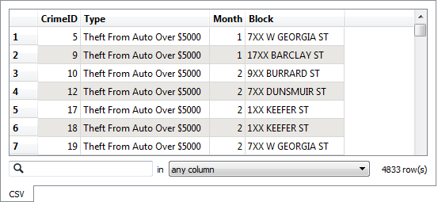

Notice how there is no spatial data as such, but there is a block number. 

---

<!--Person X Says Section-->

<table style="border-spacing: 0px">
<tr>
<td style="vertical-align:middle;background-color:darkorange;border: 2px solid darkorange">
<i class="fa fa-quote-left fa-lg fa-pull-left fa-fw" style="color:white;padding-right: 12px;vertical-align:text-top"></i>
Police-Chief Webb-Mapp says...
</td>
</tr>

<tr>
<td style="border: 1px solid darkorange">

Crime?! In my city? I think not. But if there was... be aware that 7XX W Georgia Street means the seventh block on Georgia Street west of Ontario Street and covers building numbers 700-800. 7XX E Georgia Street would be 14 blocks away, the seventh block east of Ontario. Got it? 

</td>
</tr>
</table>

---

 **2) Inspect Source Data (Roads)**
 Now let's inspect some spatial data that we can merge the crime statistics onto. Open the following dataset in the Data Inspector

<table style="border: 0px">

<tr>
<td style="font-weight: bold">Reader Format</td>
<td style="">Autodesk AutoCAD DWG/DXF</td>
</tr>

<tr>
<td style="font-weight: bold">Reader Dataset</td>
<td style="">C:\FMEData2016\Data\Transportation\Roads.dwg</td>
</tr>

<tr>
<td style="font-weight: bold">Reader Parameters</td>
<td style="">Group Entities By: Attribute Schema</td>
</tr>

</table>

This is a dataset of roads. You'll see that the roads are split up at the junction of each city block, which is perfect for our purposes. It too has a block number attribute:

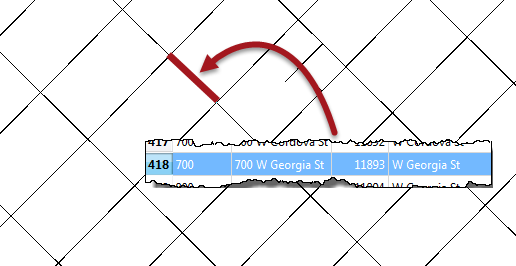

One difference that will make the join harder is that the block number is padded with zeros ("700" instead of "7XX"). Another difference is that the road data is stored in Title case ("W Georgia St") in the roads dataset, whereas the crime dataset is upper case ("W GEORGIA ST").

 **3) Add Readers**
 Now let's start working with this data. Start FME Workbench and begin with a blank canvas.

Add a Reader to the workspace using Readers > Add Reader from the menubar. This
Reader should be used to read the crime (CSV) data. Be sure to use the same parameters as specified for the Data Inspector.

Now add a second Reader to read the roads (DWG) data. However, from inspecting the data, I see that the roads are stored on a set of seven different layers. We don't need that, so set the "Single Merged Feature Type" parameter when adding the Reader, like so:

Again, be sure to use the same Group Entities By parameter as specified for the Data Inspector.

The workspace will now look like this:

If you don't click the Single Merged Feature Type option you'll get a feature type for each AutoCAD layer. That's OK, but you'll have to make sure you connect each of them to the subsequent transformers.

 **4) Add StringReplacer**
 To merge the data we need a common block attribute. The current difference in how the block number is structured can be fixed very simply by replacing "XX" with "00" using a StringReplacer transformer.

Add a StringReplacer transformer and connect it to the Crime dataset feature type.

Open the parameters dialog for the StringReplacer. Set the proper parameters. The Attribute to process will be "Block", the Text to Match will be "XX" and the Replacement Text will be "00", like so:

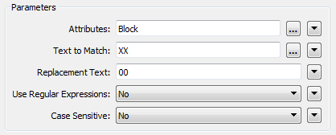

Click OK to accept the values. If you wish, attach Inspector transformers and run the workspace to ensure the transformer is working as expected.

 **5) Add StringCaseChanger**
 The other difference in crime/road data was in UPPER/Title case street names. This disparity can be fixed with a StringCaseChanger transformer.

Add a StringCaseChanger transformer and connect it to the roads dataset feature type:

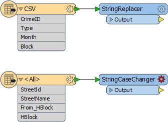

Open the parameters dialog. Set the parameters to change the values of HBlock to upper case:

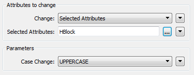

---

<!--Person X Says Section-->

<table style="border-spacing: 0px">
<tr>
<td style="vertical-align:middle;background-color:darkorange;border: 2px solid darkorange">
<i class="fa fa-quote-left fa-lg fa-pull-left fa-fw" style="color:white;padding-right: 12px;vertical-align:text-top"></i>
Miss Vector says...
</td>
</tr>

<tr>
<td style="border: 1px solid darkorange">

So, answer me this. Why do we use the StringCaseChanger on the roads data (to UPPERCASE) rather than changing the crime data (to TitleCase)?

</td>
</tr>
</table>

---

 **6) Add FeatureMerger**
 Now we've sorted out the structure of our join keys we can merge the data together with a FeatureMerger.

Add a FeatureMerger to the canvas. Connect the roads data as the Requestor and the crime data as the Supplier (we wish to supply the roads data with crime statistics):

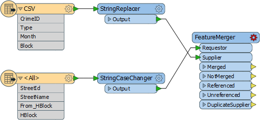

If, like me, you don't like connections that cross over, feel free to swap the position of the objects around to untangle it.

Open the parameters dialog for the FeatureMerger.

For the "Join On" set of parameters, the Requestor join attribute will be HBlock, the Supplier join attribute will be Block, and the Comparison Mode will be String:

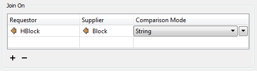

---

<!--Person X Says Section-->

<table style="border-spacing: 0px">
<tr>
<td style="vertical-align:middle;background-color:darkorange;border: 2px solid darkorange">
<i class="fa fa-quote-left fa-lg fa-pull-left fa-fw" style="color:white;padding-right: 12px;vertical-align:text-top"></i>
Dr Workbench says...
</td>
</tr>

<tr>
<td style="border: 1px solid darkorange">

If you are sharp, you may have noticed that the Requestor and Supplier parameters can be defined within a text edit window. 
 That means, instead of using the transformers we just added, we could replicate their functionality using functions inside that text editor, like so:
<pre>
@ReplaceString(@Value(Block),XX,00)
@UpperCase(@Value(HBlock))
</pre>

</td>
</tr>
</table>

---

For the "Merge Parameters" the Feature Merge Type should be Attributes Only. Because we can expect multiple crimes per block the parameter Process Duplicate Suppliers should be set to Yes. Set the Number of Suppliers Attribute to be "NumberOfCrimes" - this will create an attribute of that name recording how many crimes occurred in that block.

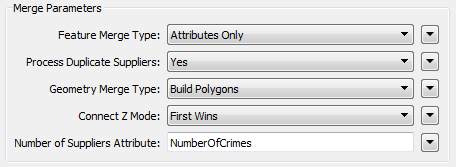

Finally, the attribute accumulation needs to be "Merge Supplier."

Click OK to close the dialog.

 **7) Add Inspectors**
 Add Inspector transformers to the Merged and NotMerged output ports (or connect both outputs to one Inspector). This will give us the roads data with crime info attached. The NotMerged data is important because there may be blocks without any crime.

The Unreferenced output port will show us crimes that didn't match to a known address, so connect a Logger transformer here to record any features that fail in this respect.

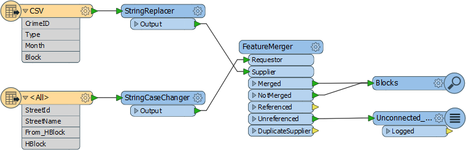

 **8) Save and Run Translation**
 Save the workspace and then run the translation. By querying a block you should be able to see how many crimes took place there. 

---

<!--Tip Section--> 

<table style="border-spacing: 0px">
<tr>
<td style="vertical-align:middle;background-color:darkorange;border: 2px solid darkorange">
<i class="fa fa-info-circle fa-lg fa-pull-left fa-fw" style="color:white;padding-right: 12px;vertical-align:text-top"></i>
TIP
</td>
</tr>

<tr>
<td style="border: 1px solid darkorange">

If you want to see a list of crimes that took place in each block, open the FeatureMerger parameters and check the box to Generate List. Now re-run the workspace and query a feature (the list won't show up in the table view window).

</td>
</tr>
</table>

---

<!--Advanced Exercise Section-->

<table style="border-spacing: 0px">
<tr>
<td style="vertical-align:middle;background-color:darkorange;border: 2px solid darkorange">
<i class="fa fa-cogs fa-lg fa-pull-left fa-fw" style="color:white;padding-right: 12px;vertical-align:text-top"></i>
Advanced Exercise
</td>
</tr>

<tr>
<td style="border: 1px solid darkorange">

You've now successfully merged crime statistics onto a set of spatial data, which is what the data journalist was asking for. However, if he can create a map from that information, then so can we. If you have time, let's give it a try.

</td>
</tr>
</table>

---

 **9) Add MapnikRasterizer**
 The MapnikRasterizer is a way of creating nicely formatted raster map output from a set of vector data.

Place a MapnikRasterizer transformer connected to the Merged output port of the FeatureMerger:

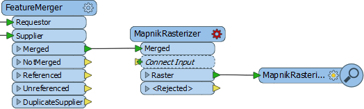

Open the parameters dialog. Set the Merged layer to be a Line symbolizer. Then click the Edit button to the right.

For the Line Width (pixels) parameter click the drop down arrow and select Attribute Value > Number of Crimes. Click OK to close the dialog.

Set the output raster size to be 2500 cells for both Columns and Rows.

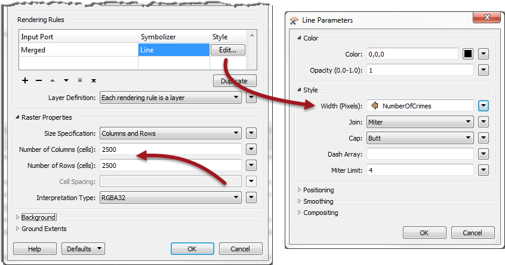

 **10) Add RasterExpressionEvaluator**
 If you run the workspace now you will see a white square containing black "features". To see the background map through the white area we can set the transparency of the white data.

To do this, add a RasterExpressionEvaluator transformer. Open the parameters dialog and set the parameters as follows:

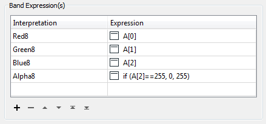

This basically means set the Red-Green-Blue values as they were before. If the blue value was 255 then set transparency to 0, else set it to 255. i.e. If the area is white, then set it to transparent.

 **11) Run Workspace**
 Now you can add an Inspector and run the workspace.

The output will look like this:

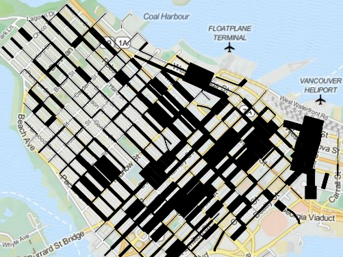

Basically we've created a map where road width reflects the amount of crime on that block.

---

<!--Exercise Congratulations Section--> 

<table style="border-spacing: 0px">
<tr>
<td style="vertical-align:middle;background-color:darkorange;border: 2px solid darkorange">
<i class="fa fa-thumbs-o-up fa-lg fa-pull-left fa-fw" style="color:white;padding-right: 12px;vertical-align:text-top"></i>
CONGRATULATIONS
</td>
</tr>

<tr>
<td style="border: 1px solid darkorange">

By completing this exercise you have learned how to:
  <li>Pre-process data to get join keys with a matching structure
 <li>Join non-spatial data with a join key in the FeatureMerger
 <li>Use the MapnikRasterizer to create a map output 

</td>
</tr>
</table>
