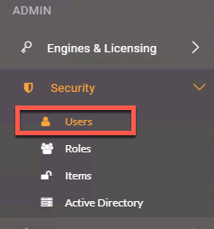
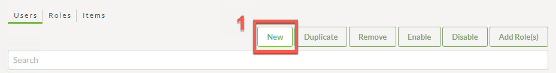
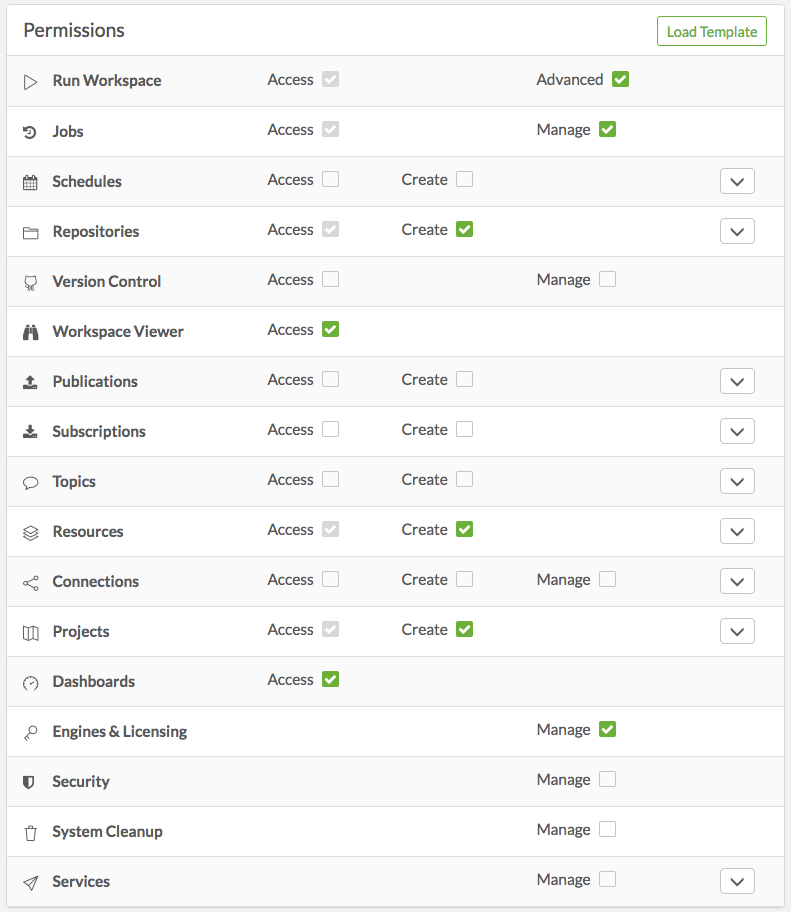
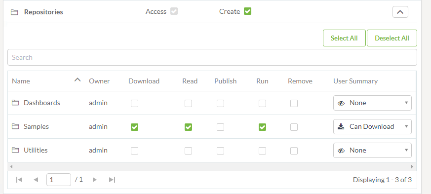
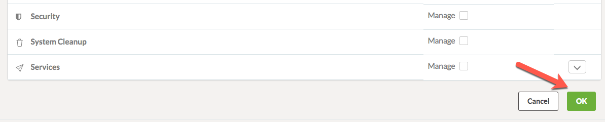
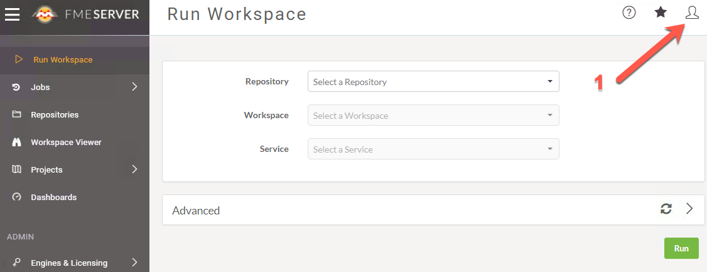
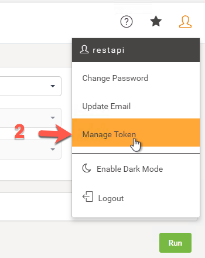
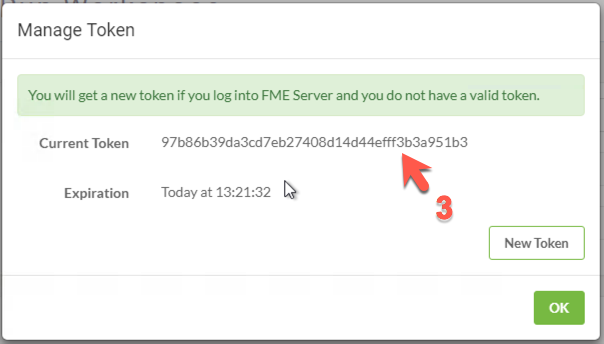

###  1.3 Authorization and Authentication

Security is always a very important consideration when working with any
online service. The REST API works with security in two ways:
authorization and authentication. **Authentication proves that the user is
who they say they are. Authorization verifies that the user is
authorized to make the call.**

Most calls to the FME Server require authorization. The REST API uses
tokens to prove the user is permitted to make the call to the server. A token is a string of encrypted information that is sent between the
client and the server. Token Security will not be as secure as other
methods as the security of the system depends on controlling access to
the tokens.

When replacing <yourServerHost> with your host name. You can use localhost if you are working on the machine where server is installed. If you are accessing from a remote machine you need to specify a accessible url either by IP address or server hostname.

<!--Warning Section-->

<table style="border-spacing: 0px">
<tr>
<td style="vertical-align:middle;background-color:darkorange;border: 2px solid darkorange">
<i class="fa fa-exclamation-triangle fa-lg fa-pull-left fa-fw" style="color:white;padding-right: 12px;vertical-align:text-top"></i>
WARNING
</td>
</tr>

<tr>
<td style="border: 1px solid darkorange">

Tokens can hold a lot of power. Tokens will have the same permissions as the owner of the token. For instance, an admin token will have the power to create an fmesuperuser. Before using a token, consider what permissions that token has.     

</td>
</tr>
</table>

___________

<table style="border-spacing: 0px;border-collapse: collapse;font-family:serif">
<tr>
<td width=25% style="vertical-align:middle;background-color:darkorange;border: 2px solid darkorange">
<i class="fa fa-cogs fa-lg fa-pull-left fa-fw" style="color:white;padding-right: 12px;vertical-align:text-top"></i>
Exercise 1
</td>
<td style="border: 2px solid darkorange;background-color:darkorange;color:white">
Create a new user and token
</td>
</tr>

<tr>
<td style="border: 1px solid darkorange; font-weight: bold">Data</td>
<td style="border: 1px solid darkorange">None</td>
</tr>

<tr>
<td style="border: 1px solid darkorange; font-weight: bold">Overall Goal</td>
<td style="border: 1px solid darkorange">To teach users how to create users with limited permissions and get a token.</td>
</tr>

<tr>
<td style="border: 1px solid darkorange; font-weight: bold">Demonstrates</td>
<td style="border: 1px solid darkorange">How to create a user and a new token</td>
</tr>

</table>

**1) Open FME Server**

Our first step will be to visit the FME Server. We can do this by going to:

    <yourServerHost>/fmeserver
If you are using a training computer go to: localhost/fmeserver

**2) Go to the Users page**

Now, we are going to navigate to the users page. We are going to the left hand panel find **Security** and then click **Users**.

*Image 1.3.1 Users*

**3) Create a new user**

Click the New button at the top right hand corner of the page.

*Image 1.3.2 Create a new user*

When prompted, create a new user with the following parameters:

<ul>
  <li>Username: restapi</li>
  <li>Full Name: Forest Apier</li>
  <li>Password: restapi</li>
</ul>

**4) Scroll down and assign permissions**

When assigning permissions for your future users visit [User Permissions](http://docs.safe.com/fme/2018.1/html/FME_Server_Documentation/Content/WebUI/Roles.htm) to view the full documentation.

Now assign the following permissions:

<table>

<tr>
<th>Permission</th>
<th>Level of Permission</th>
<th>Description of Permission</th>
</tr>

<tr>
<td>Run Workspace</td>
<td>Advanced</td>
<td>Can access the Run Workspace page and access Job Directives when running workspaces.</td>
</tr>

<tr>
<td>Jobs</td>
<td>Manage</td>
<td>  Access and manage the jobs of all users. You can, cancel any job that is currently running, remove the history of jobs that were previously run, and manage Job Queues. (Also requires Manage permission in Engines & Licensing.)</td>
</tr>

<tr>
<td>Repositories</td>
<td>Create</td>
<td>Access the Repositories page and create repositories. </td>
</tr>

<tr>
<td>Individual Repositories   <b>click the down arrow on the right hand corner of the Repositories permissions to show the Individual Repositories permissions. </td>
<td>Samples = Download, Read, Run</td>
<td>Can download workspaces and other repository items from FME Server into Workbench. Can view repository information. Can run repository workspaces from FME Server. </td>
</tr>

<tr>
<td>Workspace Viewer</td>
<td>Access</td>
<td> Can access the Workspace Viewer.
</td>
</tr>

<tr>
<td>Resources</td>
<td>Create</td>
<td>Access the Resources page and create new resources.</td>
</tr>

<tr>
<td>Individual Resources   <b>click the down arrow on the right hand corner of the Resources permissions to show the Individual Resources permissions. </td>
<td>
Data = Full access

Temp= Full access
</td>
<td>Can download workspaces and other repository items from FME Server into Workbench. Can view repository information. Can run repository workspaces from FME Server. </td>
</tr>

<tr>
<td>Projects</td>
<td>Create</td>
<td>Access the Projects page and create projects.</td>
</tr>

<tr>
<td>Dashboards</td>
<td>Access</td>
<td>Access the Dashboards page.</td>
</tr>

<tr>
<td>Engines & Licensing</td>
<td>Manage</td>
<td>Configure engines and licensing, except job queues (Also, requires Manage permission in Jobs).</td>
</tr>

</table>

**If you are creating a web application the permissions for the token should be limited to a specific repository.**

The settings should look like this:

*Image 1.3.3 Permissions.*

The Individual Repositories should look like this:

*Image 1.3.4 Individual Permissions.*

**5) Click OK to create the restapi User**

*Image 1.3.5 Create User.*

**6) Log into the FME Server as the restapi user and find your token**

*Image 1.3.6 New User.*

*Image 1.3.7 Manage Token.*

*Image 1.3.7 View Token.*

<!--Exercise Congratulations Section-->

<table style="border-spacing: 0px">
<tr>
<td style="vertical-align:middle;background-color:darkorange;border: 2px solid darkorange">
<i class="fa fa-thumbs-o-up fa-lg fa-pull-left fa-fw" style="color:white;padding-right: 12px;vertical-align:text-top"></i>
CONGRATULATIONS
</td>
</tr>

<tr>
<td style="border: 1px solid darkorange">

By completing this exercise you have learned how to:
 
<ul><li>Create a new user in FME Server</li>
<li>Assign specific permissions to the user</li>
<li>Get the new users token</li>

</td>
</tr>
</table>
