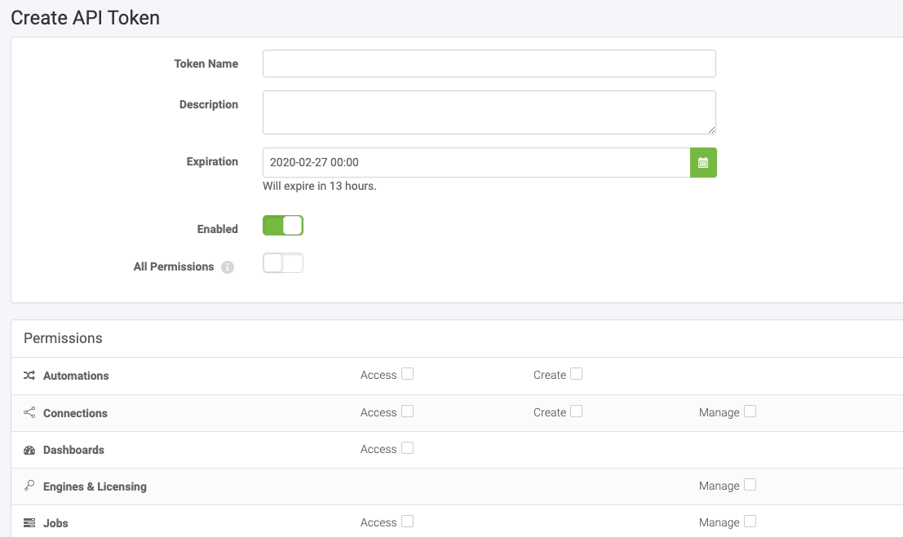
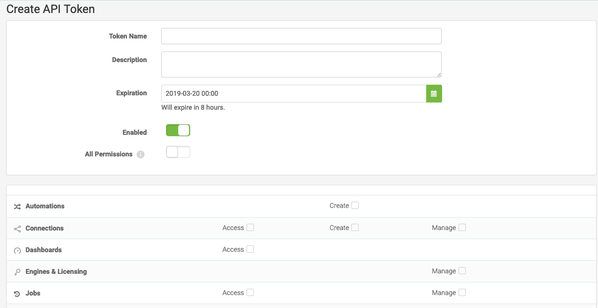

### 1.4 Token Management

There are two ways to get a token to use in FME Server.

#### Ways to get a token

**1) Through your FME Server**

    http://<yourServerHost>/fmeserver/#/tokens/api

You can access the Token Management page through the link above. Or you can access the same page by clicking the user icon in FME Server and then selecting Manage Tokens.

On the Token Management page click New to create a new token.  

This will take you to the Create API Token page where you can create a token, add a description, and assign the permissions for the token. We will create a new token in the next exercise.

**2) Through the REST API Homepage**

    http://<yourServerHost>/fmerest/apidoc/v3/

On the top right-hand corner of the page you will see a Green Button that says "Get Token". Click here, to get a temporary token.

This token will expire in one hour and should not be used in a production app or workspace.

---

#### Using a Token in a Call

There are two methods of including a token in a call to FME Server. You may
include the token in the query parameter or in the authorization header. The actual methods of using these different practices will
be discussed later in the course. However, for now, it's important to
know the pros and cons of each method.

**Query Parameter-** You may include the token right in the Request URL
of the call. This is a quick and easy way to use a call that requires a
token.

    http://<yourServerHost>/fmerest/v3/info?fmetoken=<yourToken>

However, this is not recommended because the token will be visible in
the URL.

**Authorization Header-** You may also include the token in the Request
Header. This is the preferred method because the token will be more hidden
inside the call.

##### Troubleshooting Authorization Errors

If a call is not authorized you will receive an error code back from the
system. You may receive a Forbidden or Unauthorized message. Forbidden
(code 403) means the request was understood but refused. This indicates
you do not have the correct permissions to complete the request.
Unauthorized (code 401) indicates the credentials were missing or
incorrect. This may occur if the request needs a token and it is not
present, or the token is expired.
