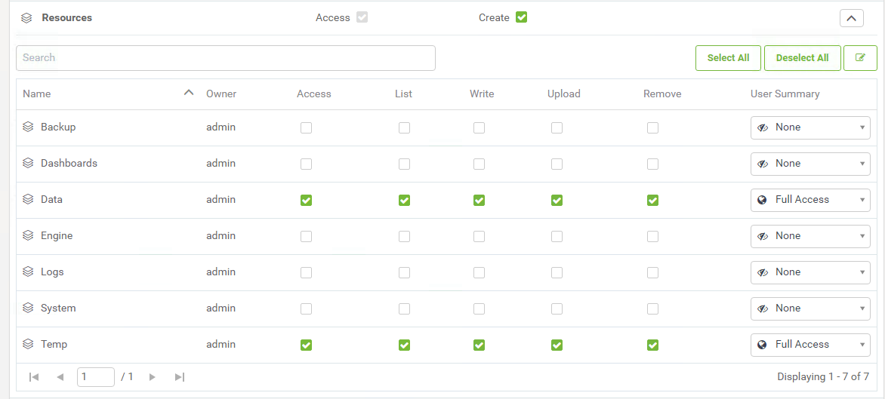

<table style="border-spacing: 0px;border-collapse: collapse;font-family:serif">
<tr>
<td width=25% style="vertical-align:middle;background-color:darkorange;border: 2px solid darkorange">
<i class="fa fa-cogs fa-lg fa-pull-left fa-fw" style="color:white;padding-right: 12px;vertical-align:text-top"></i>
Exercise 1
</td>
<td style="border: 2px solid darkorange;background-color:darkorange;color:white">
Create a new user and token
</td>
</tr>

<tr>
<td style="border: 1px solid darkorange; font-weight: bold">Data</td>
<td style="border: 1px solid darkorange">None</td>
</tr>

<tr>
<td style="border: 1px solid darkorange; font-weight: bold">Overall Goal</td>
<td style="border: 1px solid darkorange">To teach users how to create users with limited permissions and get a token.</td>
</tr>

<tr>
<td style="border: 1px solid darkorange; font-weight: bold">Demonstrates</td>
<td style="border: 1px solid darkorange">How to create a user and a new token</td>
</tr>

</table>

This exercise is meant to teach users how to create a new user with limited permissions. When developing with the REST API it is advised not to use an Admin token. The Admin token has a lot of power that could be dangerous if exposed. By creating an account with limited permissions we are limiting risk if the token is exposed.

 **1) Open FME Server**

Our first step will be to visit the FME Server. We can do this by going to:

    <yourServerHost>/fmeserver
If you are using a training computer go to: localhost/fmeserver

If you  are using a training computer log in as the admin using these credentials:

<b>Username:</b> admin
 
<b>Password:</b> admin

 **2) Go to the Users page**

Now, we are going to navigate to the users page. We are going to the left hand panel find **Security** and then click **Users**.

 **3) Create a new user**

Click the New button at the top right hand corner of the page.

When prompted, create a new user with the following parameters:

- **Username:** restapi
- **Full Name:** Forest Apier
- **Password:** restapi

 **4) Scroll down and assign permissions**

When assigning permissions for your future users visit [User Permissions](http://docs.safe.com/fme/2018.1/html/FME_Server_Documentation/Content/WebUI/Roles.htm) to view the full documentation.

Now assign the following permissions:

<table>

<tr>
<th>Permission</th>
<th>Level of Permission</th>
<th>Description of Permission</th>
</tr>

<tr>
<td>Run Workspace</td>
<td>Advanced</td>
<td>Can access the Run Workspace page and access Job Directives when running workspaces.</td>
</tr>

<tr>
<td>Jobs</td>
<td>Manage</td>
<td>  Access and manage the jobs of all users. You can, cancel any job that is currently running, remove the history of jobs that were previously run, and manage Job Queues. (Also requires Manage permission in Engines & Licensing.)</td>
</tr>

<tr>
<td>Repositories</td>
<td>Create</td>
<td>Access the Repositories page and create repositories. </td>
</tr>

<tr>
<td>Individual Repositories   <b>click the down arrow on the right hand corner of the Repositories permissions to show the Individual Repositories permissions. </td>
<td>Samples = Download, Read, Run</td>
<td>Can download workspaces and other repository items from FME Server into Workbench. Can view repository information. Can run repository workspaces from FME Server. </td>
</tr>

<tr>
<td>Workspace Viewer</td>
<td>Access</td>
<td> Can access the Workspace Viewer.
</td>
</tr>

<tr>
<td>Resources</td>
<td>Create</td>
<td>Access the Resources page and create new resources.</td>
</tr>

<tr>
<td>Individual Resources   <b>click the down arrow on the right hand corner of the Resources permissions to show the Individual Resources permissions. </td>
<td>
Data = Full access

Temp= Full access
</td>
<td>Can access, read and download a file. Can list the folders and files of a resource. Can write to files, upload files, and delete files. </td>
</tr>

<tr>
<td>Projects</td>
<td>Create</td>
<td>Access the Projects page and create projects.</td>
</tr>

<tr>
<td>Dashboards</td>
<td>Access</td>
<td>Access the Dashboards page.</td>
</tr>

<tr>
<td>Engines & Licensing</td>
<td>Manage</td>
<td>Configure engines and licensing, except job queues (Also, requires Manage permission in Jobs).</td>
</tr>

</table>

**If you are creating a web application the permissions for the token should be limited to a specific repository.**

The settings should look like this:

The Individual Repositories should look like this:

The Individual Resources should look like this:

 **5) Click OK to create the restapi User**

 **6) Log into the FME Server as the restapi user and find your token**

Once we log into our FME Server, we can locate the user icon. This is the area we access, if we wish to find more information about the user.

After we have selected the the user icon, you can click Manage Token. To find the token.

Then, we can see the current token. Or, we can get a new token in this area.

 **7) Save this token**

Open a Notepad++ Document and paste the token in the document for easy access.

<!--Exercise Congratulations Section-->

<table style="border-spacing: 0px">
<tr>
<td style="vertical-align:middle;background-color:darkorange;border: 2px solid darkorange">
<i class="fa fa-thumbs-o-up fa-lg fa-pull-left fa-fw" style="color:white;padding-right: 12px;vertical-align:text-top"></i>
CONGRATULATIONS
</td>
</tr>

<tr>
<td style="border: 1px solid darkorange">

By completing this exercise you have learned how to:
 
<ul><li>Create a new user in FME Server</li>
<li>Assign specific permissions to the user</li>
<li>Get the new users token</li>

</td>
</tr>
</table>
