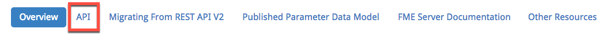
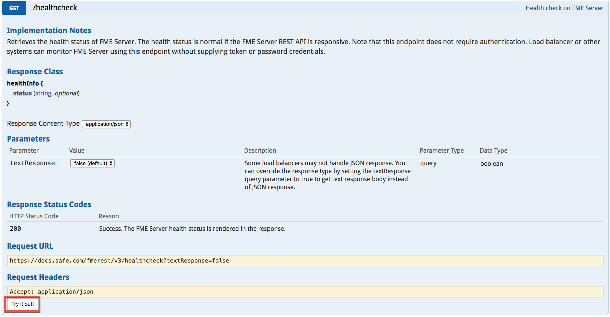
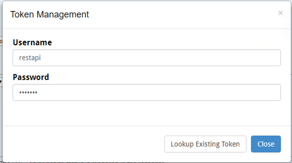

### 2.0 Exploring your REST API Homepage

Now that you know the basic information on using the REST API, we can
explore how to use it. The first step is to visit your homepage for the
REST API. To find this, go to

    http://<yourServerHost>/fmerest/

If you are doing this course on the training computer go to http://localhost/fmerest You may also access this same page through your FME Server. Simply, go to your FME Server homepage. Locate the help button and click on the REST API button.
This page provides helpful resources when first learning the REST API.
This includes sample calls you can make to the server. On the main
toolbar click on the API Link.

*Image 2.1.1 API link on FME REST page*

Here you can explore the various calls you can make to the server. Find
the second category called health check and expand the call. You should
see documentation similar to this.

*Image 2.1.2 Demonstration of a call on a FME REST page*

This page outlines everything you need to know about the call and its
potential. Click "Try it out!", this connects to your server and will
provide a response to your call. However, before you receive a response
you will have to connect to your server.

Here is the message you should receive. You will be prompted for the
server username and password. This is where you will have
to request a token to complete your call.

*Image 2.1.3 Token Management*

First, click Lookup Existing Token then click generate token. You should
receive a message with your token and a statement that you may now try
out the examples. Copy the token and paste it into any text editing
software we will use it in later examples. It is important to note that
token acts as a verification you have permission to gain access to the
server. It is a security feature and you can gain access to tokens on
your FME Server Rest API page

    http://<yourServerHost>/fmerest/

After you have made a call to the FME Server you will receive a response
from the FME Server.
