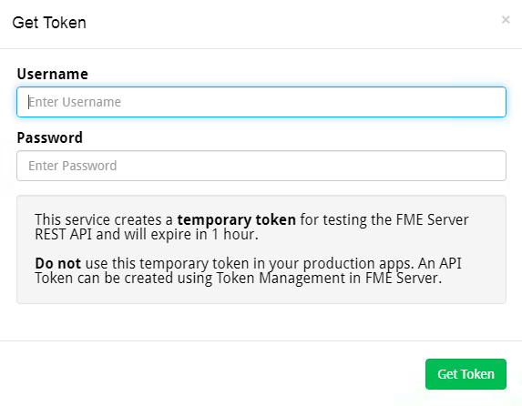

## 2.1 Exploring the REST API Homepage

The FME Server REST API Homepage is an essential tool for any API user. This website provides the documentation needed to learn about the FME Server REST API. It also allows the user to view all calls available on the REST API. Each call has detailed documentation about the call and any parameters connected to the call. It also allows the user to practice a call before implementing it.

Now that you know the basic information on using the REST API, we can
explore how to use it. The first step is to visit your homepage for the
REST API. To find this, go to

    http://<yourServerHost>/fmerest/

If you are doing this course on the training computer go to http://localhost/fmerest You may also access this same page through your FME Server. Simply, go to your FME Server homepage. Locate the help button and click on the REST API button.
This page provides helpful resources when first learning the REST API.
This includes sample calls you can make to FME Server. On the main
toolbar click on the API Link.

Here, you can explore the various calls you can make to FME Server. Find
the third category called health check and expand the call. You should
see documentation similar to this.

This page outlines everything you need to know about the call and its
potential. Click "Try it out!", this connects to your server and will
provide a response to your call. However, before you receive a response
you will have to connect to your server.

Here is the message you should receive. You will be prompted for the
server username and password. This is where you will have
to request a token to complete your call.

Next, click Get Token. Now, you should see the token in the top right-hand corner of the page. Once you click "Try it out!" the call can now be made.

After you have made a call to FME Server, you will receive a response
from FME Server.
