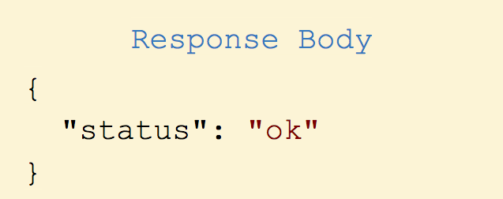
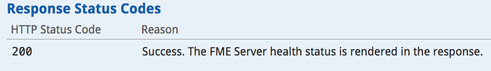

### 2.1 Understanding the REST API Response.

The response structure is very similar to the request structure. This
features the response body, response code, and the response header.

**Response Body**

*Image 2.2.1 Response Body*

Most calls to the FME Server will result in a response. This is what
makes the FME Server REST API a very powerful tool. With this response,
you may automate another process to run. The Response Body
will always be in JSON.

**Response Code**

The request above should result in a code 200 which is outlined in the
example call:

*Image 2.2.2 Response Status Codes*

**Potential Response Codes**

Below there is a table listing common response codes for a full list,
please visit:
[https://docs.safe.com/fme/html/FME\_REST/apidoc/v3/index.html](https://docs.safe.com/fme/html/FME_REST/apidoc/v3/index.html).

<table>

<tr>
<th>Response Code</th>
<th>Meaning</th>

</tr>

<tr>
<td>200</td>
<td>The call has been completed successfully</td>

<tr>
<td>202</td>
<td>The request has been accepted for processing</td>

</tr>

<tr>
<td>422</td>
<td>Some or all the input parameters were invalid</td>

</td>
</tr>

<tr>
<td>401</td>
<td>Unauthorized</td>

</tr>

</table>
