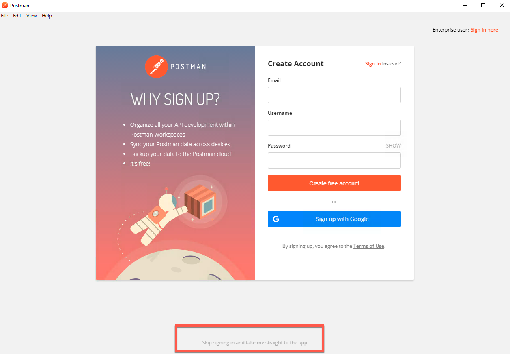
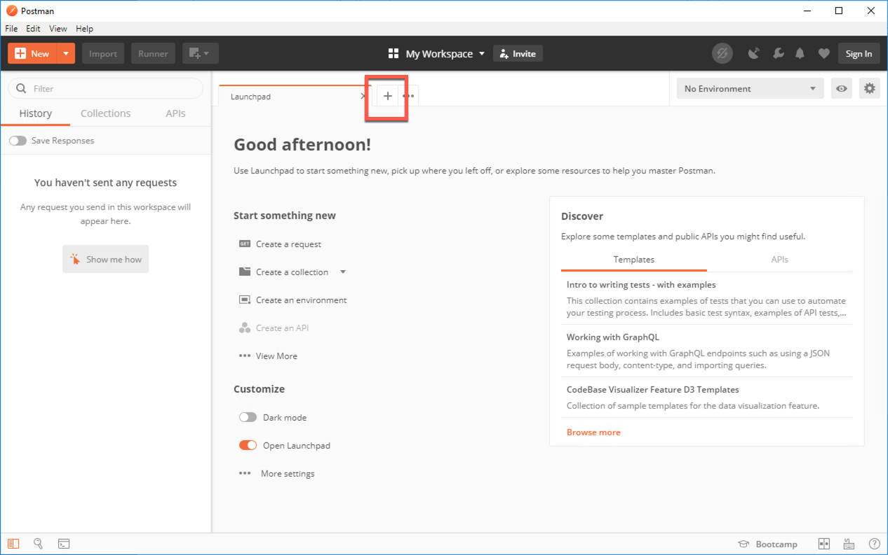
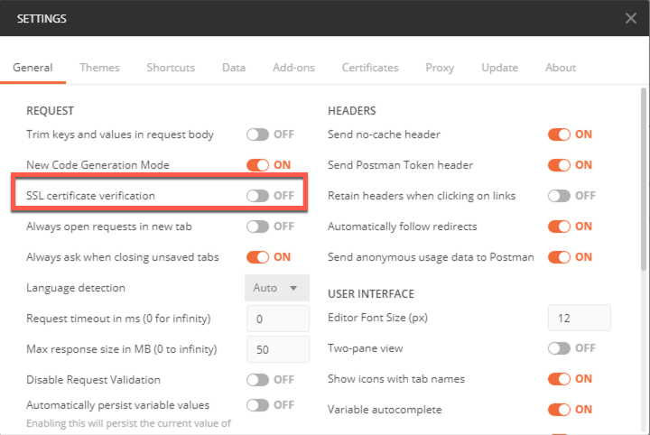
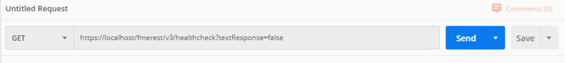
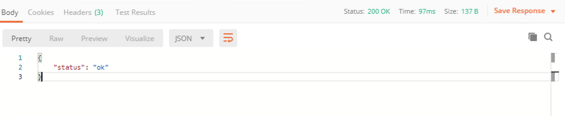
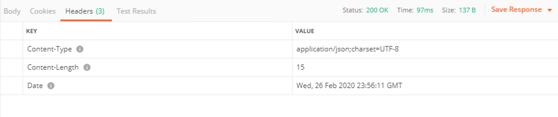

<table style="border-spacing: 0px;border-collapse: collapse;font-family:serif">
<tr>
<td width=25% style="vertical-align:middle;background-color:darkorange;border: 2px solid darkorange">
<i class="fa fa-cogs fa-lg fa-pull-left fa-fw" style="color:white;padding-right: 12px;vertical-align:text-top"></i>
Exercise 2
</td>
<td style="border: 2px solid darkorange;background-color:darkorange;color:white">
Using Postman to Make an HTTP Request
</td>
</tr>

<tr>
<td style="border: 1px solid darkorange; font-weight: bold">Data</td>
<td style="border: 1px solid darkorange">None</td>
</tr>

<tr>
<td style="border: 1px solid darkorange; font-weight: bold">Overall Goal</td>
<td style="border: 1px solid darkorange">Retrieves information from FME Server using the REST API</td>
</tr>

<tr>
<td style="border: 1px solid darkorange; font-weight: bold">Demonstrates</td>
<td style="border: 1px solid darkorange">The healthcheck call from the REST API</td>
</tr>

</table>

This exercise demonstrates how to make a call to FME Server using the REST API. Postman is a REST client tool. REST client tools allow a user to enter in a Request URL and receive messages directly from the server. This exercise demonstrates the healthcheck call which will check if FME Server is up and running properly.   

We are about to make the following call in Postman.

<!--GET Table-->

<table class="tg" style="table-layout: fixed; width: 100%">
  <tr>
    <th class="tg-ej3l">GET</th>
    <th class="tg-ufe5" style="word-wrap: break-word">https://localhost:8443/fmerest/v3/healthcheck?textResponse=false</th>
  </tr>
</table>

This call requires no authorization and should run immediately. Notice
that there is a string query parameter in this call. This call will
automatically return a JSON response; however, you may override this by
setting the text response to true. This will return a text response
instead of JSON.

 **1) Download Postman- If you are not already using a virtual machine**

The first step is to download Postman. Simply click this link
[https://www.getpostman.com/apps](https://www.getpostman.com/apps)
and download the app. It is available on Windows, Linux, and Mac.

 **2) Open Postman**

Welcome to Postman! We are now ready to make our first call to your FME
Server using the URL above. Once you open Postman you should see this page. Click "Skip signing in and take me straight to the app".

 **3) Create a new request**

Click the the plus sign on the top middle of Postman to create a new request.

 **4) Turn off SSL verification**

By default, Postman will attempt to verify SSL certificates. Since, we are using an FME Server that uses a self signed certificate so we will need to turn this setting off.

To turn off the setting, go to File > Settings. Find, SSL certificate verification and switch the setting to OFF.

Click the X in the top right hand corner of the Settings page to exit this dialog.

 **5) Copy the URL into the toolbar**

Copy the URL into the toolbar and hit send! Notice, we are using the GET
HTTP Method for this call. To understand what this method means, please
review the table in [Section 1.2](./FMESERVER_RESTAPI1Overview/1.2.WhatComponentsAreInARequest.md)

<!--GET Table-->

<table class="tg" style="table-layout: fixed; width: 100%">
  <tr>
    <th class="tg-ej3l">GET</th>
    <th class="tg-ufe5" style="word-wrap: break-word">https://localhost:8443/fmerest/v3/healthcheck?textResponse=false</th>
  </tr>
</table>

  *Please note, you will need to replace yourServerHost with localhost if you are working on a training machine*

 **6) Review the response from Postman**

Review your call. This is the response you receive.

Click the Headers section to see a more detailed view of the call.

---

**Important Notes:**

- The response is in JSON. This is found in the header Response Header Content-Type.

- In the top right-hand corner, you should see Status: 200 OK. This indicates it has successfully interacted with the server. This call required no authorization. However, most calls to the server do require authorization. The next step will be to make a call that does require authorization from the server.

---

<!--Exercise Congratulations Section-->

<table style="border-spacing: 0px">
<tr>
<td style="vertical-align:middle;background-color:darkorange;border: 2px solid darkorange">
<i class="fa fa-thumbs-o-up fa-lg fa-pull-left fa-fw" style="color:white;padding-right: 12px;vertical-align:text-top"></i>
CONGRATULATIONS
</td>
</tr>

<tr>
<td style="border: 1px solid darkorange">

By completing this exercise you have learned how to:
 
<ul><li>Set up and use Postman</li>
<li>Create a call in Postman</li>

</li>

</td>
</tr>
</table>
