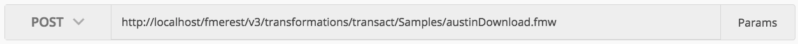
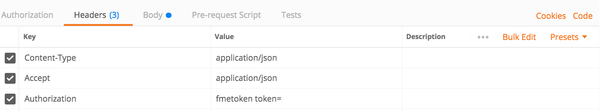
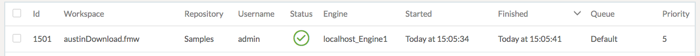
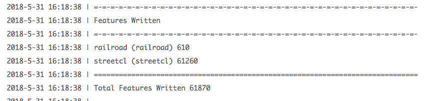

### 4.1 Exercise Running a Synchronous Job With Standard Parameters

<table style="border-spacing: 0px;border-collapse: collapse;font-family:serif">
<tr>
<td width=25% style="vertical-align:middle;background-color:darkorange;border: 2px solid darkorange">
<i class="fa fa-cogs fa-lg fa-pull-left fa-fw" style="color:white;padding-right: 12px;vertical-align:text-top"></i>
Exercise 4
</td>
<td style="border: 2px solid darkorange;background-color:darkorange;color:white">
Running a Synchronous Job With Standard Parameters
</td>
</tr>

<tr>
<td style="border: 1px solid darkorange; font-weight: bold">Data</td>
<td style="border: 1px solid darkorange">None</td>
</tr>

<tr>
<td style="border: 1px solid darkorange; font-weight: bold">Overall Goal</td>
<td style="border: 1px solid darkorange">To run a job synchronously using the FME REST API</td>
</tr>

<tr>
<td style="border: 1px solid darkorange; font-weight: bold">Demonstrates</td>
<td style="border: 1px solid darkorange">How to use the Transact call</td>
</tr>

</table>

This exercise demonstrates the transact call, which is used to run a job synchronously on the FME Server. To find more information on the Transact call visit your FME REST API page and look for the transformations section or visit https://docs.safe.com/fme/html/FME_REST/apidoc/v3/index.html#!/transformations.   

An example of running a job synchronously would be:

    POST http://<yourServerHost>/fmerest/v3/transformations/transact/Samples/austinDownload.fmw

Notice the **transact** this indicates to the Server that you will wait
until the process is complete before receiving a result. In Postman you
will need to set up the headers section and the URL as well. Here is how
you would set up this call in Postman.

<!--Warning Section-->

<table style="border-spacing: 0px">
<tr>
<td style="vertical-align:middle;background-color:darkorange;border: 2px solid darkorange">
<i class="fa fa-exclamation-triangle fa-lg fa-pull-left fa-fw" style="color:white;padding-right: 12px;vertical-align:text-top"></i>
Note
</td>
</tr>

<tr>
<td style="border: 1px solid darkorange">

While synchronous calls are easier to use in a web application compared to asynchronous calls. The application will be stalled until the call is completed. This is a trade-off that should be considered while developing with the FME Server REST API.

</td>
</tr>
</table>

**1) Enter in the URL**

The first step is to add in the URL. Paste the URL, in the top grey area that says "Enter request URL". Then set the drop down section from *GET* to *POST*.

*Image 4.1.1 Transact Call URL in Postman*

**2) Enter in the Headers**

In this call we have a request body, that will be in JSON. This is
displayed in the Content-Type section. Additionally, we are requesting
JSON back which is under Accept = application/JSON. The Authorization is
where you would enter your token.

    Headers:
      Content-Type: application/json
      Accept: application/json
      Authorization: fmetoken token=<yourTOKEN>

To enter in the headers required for this call. Click on the Headers tag as demonstrated below.  

*Image 4.1.2 Transact Call Headers in Postman*

**3) Enter in the Body**

Next, we need to enter the body of the call. *Click on the body section
of the call* and *click on the raw button* and paste in the body provided.

    Body:
    {
      "publishedParameters": [
        {
          "name": "MAXY",
          "value": "42"
        },
        {
          "name": "THEMES",
          "value": [
            "airports",
            "cenart"
          ]
        }
      ]
    }

*Image 4.1.3 Transact Call Body in Postman*

**5) Click Send**

Click Send! Now, wait until the call is returned and you will receive a
message like this.

*Image 4.1.4 Transact Call Response in Postman*

**5) View in the FME Server**

Now that the job has been submitted, you can view it in the FME Server. Go to your FME Server and click on the Jobs tab in the left hand side bar.

*Image 4.1.5 Job Results*

You should be able to see a notice a few things. The job was run by the admin, because the token that was used belonged to the admin.

Also, you can note that the priority of the job was 5. This was set in the body of the call.

**6) Click on the Job**

The jobs page provides a more detailed description of job.

**7) Scroll down to the Jobs Log**

**8) Find the THEMES in the Log**

Simply, hit ctrl + f, to fine THEMES in the log. It should display 'airports cenart'.

So now we know that the job was completed with the requested parameters.

So, now lets update the parameters and try the call again.

**9) Locate the austinDownload Workspace in the FME Server**

On the left hand bar in the FME Server, locate the Repositories tab. Click Samples. Then click the austinDownload.fmw workspace.

**10) Find the Published Parameters for the Workspace**

Scroll down the page until you see the advanced section. Click on the plus sign, then find the published parameters. Here, we have all the parameters we can modify in the workspace. Look at the options, this time we will run the call with the railroad and streetcl options.

**11) Open Up Postman and modify the body**

If you kept Postman open simply click on the body tab again. Now change the THEMES to railroad and streetcl.

*Image 4.1.6 Modified Parameters*

**12) Find the job in your FME Server**

Open your FME Server, then click on the left hand panel of the Server where it says Jobs. Click the latest austinDownload job. Scroll down to find the job log.

Here, you can investigate if the job was successfully completed and what parameters were used. Here, we can see the correct features were written.

*Image 4.1.7 Features Written*

<!--Exercise Congratulations Section-->

<table style="border-spacing: 0px">
<tr>
<td style="vertical-align:middle;background-color:darkorange;border: 2px solid darkorange">
<i class="fa fa-thumbs-o-up fa-lg fa-pull-left fa-fw" style="color:white;padding-right: 12px;vertical-align:text-top"></i>
CONGRATULATIONS
</td>
</tr>

<tr>
<td style="border: 1px solid darkorange">

By completing this exercise you have learned how to:
 
<ul><li>Create a call that runs a job synchronously</li>
<li>Check the Job Log to see if the job was run correctly and with the right parameters</li>
<li>Change the parameters in the call</li>
</li>

</td>
</tr>
</table>
