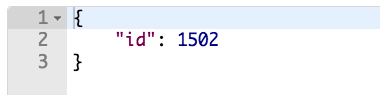
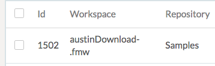
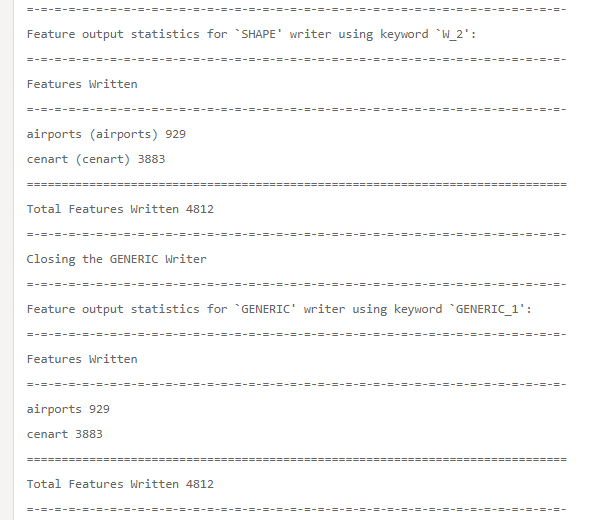

### 4.2 Exercise Running a Job Asynchronously

<table style="border-spacing: 0px;border-collapse: collapse;font-family:serif">
<tr>
<td width=25% style="vertical-align:middle;background-color:darkorange;border: 2px solid darkorange">
<i class="fa fa-cogs fa-lg fa-pull-left fa-fw" style="color:white;padding-right: 12px;vertical-align:text-top"></i>
Exercise 5
</td>
<td style="border: 2px solid darkorange;background-color:darkorange;color:white">
Running a Job Asynchronously
</td>
</tr>

<tr>
<td style="border: 1px solid darkorange; font-weight: bold">Data</td>
<td style="border: 1px solid darkorange">None</td>
</tr>

<tr>
<td style="border: 1px solid darkorange; font-weight: bold">Overall Goal</td>
<td style="border: 1px solid darkorange">To run a job asynchronously using the FME REST API</td>
</tr>

<tr>
<td style="border: 1px solid darkorange; font-weight: bold">Demonstrates</td>
<td style="border: 1px solid darkorange">How to use the submit call</td>
</tr>

</table>

This exercise demonstrates the submit call, which is used to run a job asynchronously on the FME Server. To find more information on the Submit call visit your FME REST API page and look for the transformations section or visit https://docs.safe.com/fme/html/FME_REST/apidoc/v3/index.html#!/transformations.  

If you run a job asynchronously you do not have to wait for the job to
be completed before making the next call. By running the job
asynchronously you will receive an ID back from the FME Server. You may
use this ID to call the FME Server again to get a status update on the
call.

We will run the exact same call but instead of Transact, we will change
the URL to Submit. By, submitting you will submit the job for
processing.

**1) Paste the URL below into Postman**

**Please note that all calls in this section will require
authorization.**

    **POST** http://<yourServerHost>/fmerest/v3/transformations/submit/Samples/austinDownload.fmw

**2) Enter in the Headers**

    Headers:
            Content-Type: application/json
            Accept: application/json
            Authorization: fmetoken token=<yourTOKEN>

To enter in the headers required for this call. Click on the Headers tag as demonstrated below.  

*Image 4.2.1 Submit call headers in Postman*

**3) Enter in the Body**

Next, we need to enter the body of the call. Click on the body section of the call and click on the raw button and paste in the body provided.

        Body:

        {
          "publishedParameters": [
            {
              "name": "MAXY",
              "value": "42"
            },
            {
              "name": "THEMES",
              "value": [
                "airports",
                "cenart"
              ]
            }
          ]
        }

*Image 4.2.2 Submit call body in Postman*

**5) Click Send**

Click Send! to complete the call.

**6) Review the Response**

The response from the call should be:

*Image 4.2.3 Response in Postman*

Please note that you may receive a different number back from the FME
Server. This is okay, it is just the job ID.

**6) Find the Job in your FME Server**

Open your FME Server, then click on the left hand panel of the Server where it says Jobs. Click the Job ID that matches the number you received from the FME Server.

*Image 4.2.4 Job result in the FME Server*

Then, click on the find the Log. If you scroll to almost the bottom of the page, you can see a summary of the features written.

*Image 4.2.5 Features Written*

Here, you can investigate if the job was successfully completed and what parameters were used. Here, we can see the correct features were written.

<!--Exercise Congratulations Section-->

<table style="border-spacing: 0px">
<tr>
<td style="vertical-align:middle;background-color:darkorange;border: 2px solid darkorange">
<i class="fa fa-thumbs-o-up fa-lg fa-pull-left fa-fw" style="color:white;padding-right: 12px;vertical-align:text-top"></i>
CONGRATULATIONS
</td>
</tr>

<tr>
<td style="border: 1px solid darkorange">

By completing this exercise you have learned how to:
 
<ul><li>Create a call that runs a job asynchronously</li>
<li>Check the Job Log to see if the job was run correctly and with the right parameters</li>
</li>

</td>
</tr>
</table>
