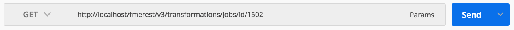
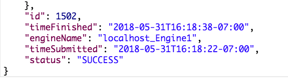

### 4.3 Retrieve job results

<table style="border-spacing: 0px;border-collapse: collapse;font-family:serif">
<tr>
<td width=25% style="vertical-align:middle;background-color:darkorange;border: 2px solid darkorange">
<i class="fa fa-cogs fa-lg fa-pull-left fa-fw" style="color:white;padding-right: 12px;vertical-align:text-top"></i>
Exercise 6
</td>
<td style="border: 2px solid darkorange;background-color:darkorange;color:white">
Retrieve Job Results
</td>
</tr>

<tr>
<td style="border: 1px solid darkorange; font-weight: bold">Data</td>
<td style="border: 1px solid darkorange">None</td>
</tr>

<tr>
<td style="border: 1px solid darkorange; font-weight: bold">Overall Goal</td>
<td style="border: 1px solid darkorange">To use the REST API to receive information about a completed job </td>
</tr>

<tr>
<td style="border: 1px solid darkorange; font-weight: bold">Demonstrates</td>
<td style="border: 1px solid darkorange">How to use the jobs call</td>
</tr>

</table>

After you have submitted the call and received the ID you can check the
job status with this call:

To find the documentation on this call please visit: https://docs.safe.com/fme/html/FME_REST/apidoc/v3/index.html#!/transformations/get_get_13

**Please note that this call will require authorization**

**1) Enter in the below URL into Postman**

To enter in this URL you will need to modify the last number to the job id you received from the response in the last call.

    GET http://<yourSeverHost>/fmerest/v3/transformations/jobs/id/4

*Image 4.3.1 Job URL in Postman*

**2) Enter the following header into Postman**

    Accept: application/json
    Authorization: fmetoken token=

*Image 4.3.2 Job Headers in Postman*

This will return with a response that the job has been completed.

This information will be displayed at the bottom on the response in Postman.

*Image 4.3.3 Response in Postman*

<!--Exercise Congratulations Section-->

<table style="border-spacing: 0px">
<tr>
<td style="vertical-align:middle;background-color:darkorange;border: 2px solid darkorange">
<i class="fa fa-thumbs-o-up fa-lg fa-pull-left fa-fw" style="color:white;padding-right: 12px;vertical-align:text-top"></i>
CONGRATULATIONS
</td>
</tr>

<tr>
<td style="border: 1px solid darkorange">

By completing this exercise you have learned how to:
 
<ul><li>Find the results of a job based off the job id.</li>

</li>

</td>
</tr>
</table>
