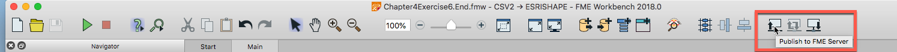
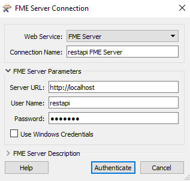
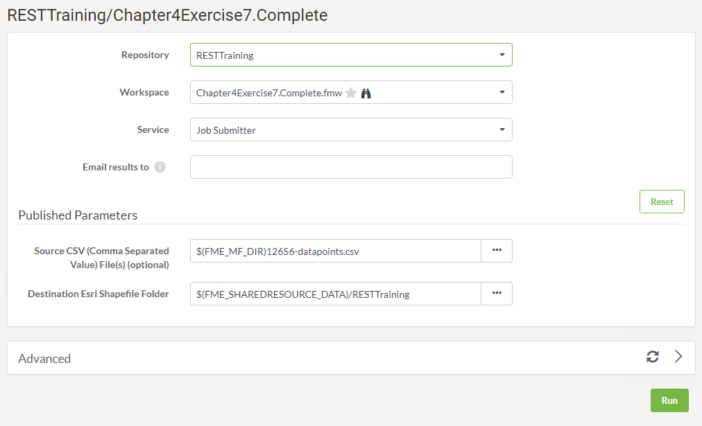
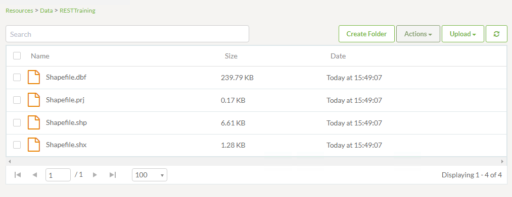
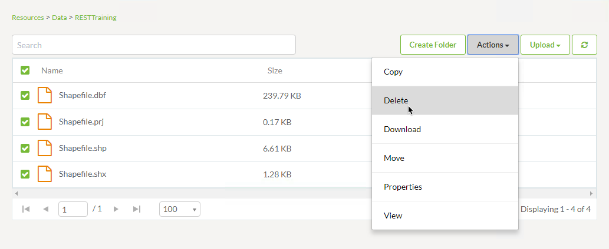
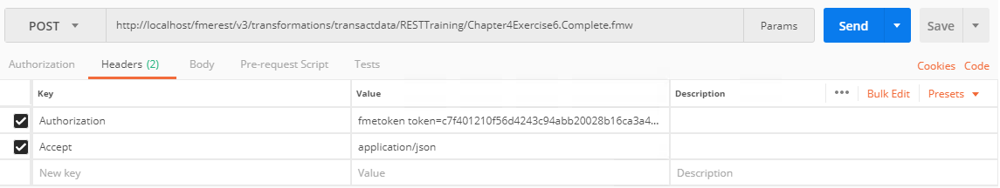
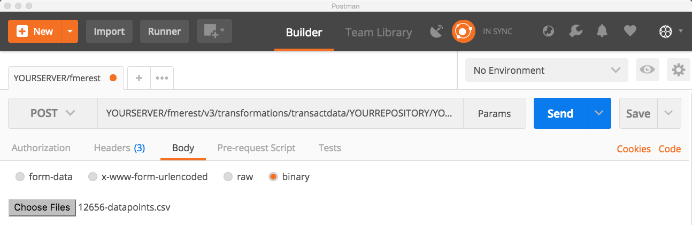

<table style="border-spacing: 0px;border-collapse: collapse;font-family:serif">
<tr>
<td width=25% style="vertical-align:middle;background-color:darkorange;border: 2px solid darkorange">
<i class="fa fa-cogs fa-lg fa-pull-left fa-fw" style="color:white;padding-right: 12px;vertical-align:text-top"></i>
Exercise 7
</td>
<td style="border: 2px solid darkorange;background-color:darkorange;color:white">
</td>
</tr>

<tr>
<td style="border: 1px solid darkorange; font-weight: bold">Data</td>
<td style="border: 1px solid darkorange">C:\FMEData2018\Resources\RESTAPI\Chapter4Exercise7\12656-datapoints.csv</td>
</tr>

<tr>
<td style="border: 1px solid darkorange; font-weight: bold">Overall Goal</td>
<td style="border: 1px solid darkorange">To use a single call to upload data and run a job. </td>
</tr>

<tr>
<td style="border: 1px solid darkorange; font-weight: bold">Demonstrates</td>
<td style="border: 1px solid darkorange">How to use the Transact Data Call</td>
</tr>
<tr>
<td style="border: 1px solid darkorange; font-weight: bold">Starting Workspace</td>
<td style="border: 1px solid darkorange">C:\FMEData2018\Resources\RESTAPI\Chapter4Exercise7\Chapter4Exercise7.Start.fmw</td>
</tr>
<td style="border: 1px solid darkorange; font-weight: bold">Ending Workspace</td>
<td style="border: 1px solid darkorange">C:\FMEData2018\Resources\RESTAPI\Chapter4Exercise7\Chapter4Exercise7.Complete.fmw</td>
</tr>

</table>

The Transact Data call works by uploading data and running a workspace with one call to the server. It will simply run the workspace as it is and write the output to the location specified in the writer. That's good for inserting new data into a database. Once the call is completed the FME Server will return a 200 OK message. This indicates that the call was submitted successfully. However, it will not provide feedback on whether the job was completed successfully on the FME Server. It is recommended to periodically check the server to ensure your jobs are running successfully on the FME Server. Getting the status of jobs can be accomplished through the REST API as well. These calls will be displayed in [Exercise 8](https://safe-software.gitbooks.io/fme-server-rest-api-training-2018/content/FMESERVER_RESTAPI4Workspaces/4.6.Exercise.html).       

Let's start by creating a workspace that is compatible with the Transact Data call.

 **1) Open the Chapter4Exercise7.Start Workspace**

Start FME Workbench and open the Chapter4Exercise7.Start.fmw workspace.

This is a very simple workspace that reads a CSV File and produces a Shapefile.

However, there is one important change that is required for this translation to work in this call. The CSV has to be an optional parameter. This is because the data will be sent in the body of the POST request to the URL and not by setting the path to the source dataset parameter in the workspace. The source dataset parameter will need to be left unset for this to work, so we need to make it optional to prevent the workspace from throwing an error about this.

 **2) Set the Source Dataset Published Parameter to Optional**

This is done by right-clicking on the published parameters and selecting Edit Definition.

Then select the optional setting in the within the parameter settings.

**If you are not using a training machine you may also set the Default Value to navigate your Reader Dataset**

    C:\FMEData2018\Resources\RESTAPI\Chapter4Exercise7\12656-datapoints.csv

 **3) Create a folder in your FME Server for your output**

First, go to your FME Server and log into the restapi account. On the right-hand side of the page locate the "Resources" and click on it. Next, click on Data. Finally, click on Create Folder and entitle it **RESTTraining**

After we create the folder, we can find the path to the folder by checking the folder. Then, go to Actions and select Properties.

*Select the RESTTraining File then select Actions*

*Select Properties*

Copy the System Path.

 **4) Update the Shapefile destination to a Shared Resource File in your FME Server**

Back in the FME Workbench change the Shapefile to a destination within your FME Server.

To do this right click the DestDataset published parameter, then click Edit Value. Then, insert a file path to your shared resources.   

    $(FME_SHAREDRESOURCE_DATA)/RESTTraining

Save the Workspace before publishing.

 **5) Upload the Workspace to the FME Server**

Now, it's time to upload the workspace to your FME Server. This can be done by clicking the Publish to FME Server Button or by going to File > Publish to FME Server.

  Add an FME Server Connection

Go back to your FME Workbench. Then, under connection click, Add Web Connection.

The Server URL should be http:// followed by your  Hostname if you are on an internal network.

Otherwise, you can Google "My Public IP Address," and the first result should be a box with your public IP address. For this to work, it requires your FME Server to be made externally facing. The Server URL should be http:// followed by your IP Address if you are on an external network.

The User Name and Password should both be **restapi**.

Click Authenticate!

 Create a New Repository for Training Exercises

Once you reach the Publish Workspace phase, under Repository click New...

Call your Repository RESTTraining

  Save the Workspace as Chapter4Exercise7.Complete and select the box to upload data files

Click Next.

 Upload using  the Job Submitter Service

Click Publish.

 **6) Run the Workspace in your FME Server**

Now we will go to our FME Server as the restapi user to prove this works.

On the left-hand menu, we will see a Run Workspace tab.

Now select the following options:

- **Repository:** RESTTraining
- **Workspace:** Chapter4Exercise7.Complete.fmw
- **Service:** Job Submitter

Now click Run!

 **7) Check that the Shapefile was successfully produced**

Go to Resources > Data > RESTTraining and ensure a Shapefile was produced.

Delete the Shapefile. This is done by selecting all files and then select Actions and selecting delete. We are deleting the Shapefile because we are going to use the REST API to submit this job again.

 **8) Use Postman to complete the Transact Data Call**

*Please note that this call requires authorization*

 Click the plus button to create a new tab. We'll now use the call to transact data to upload a CSV file and run the workspace through the REST API.

The call is:

<!--Post Table-->

<table class="tg" style="table-layout: fixed; width: 100%">
  <tr>
    <th class="tg-ao4k">POST</th>
    <th class="tg-a080" style="word-wrap: break-word">http://&lt;yourServerHost&#62;/fmerest/v3/transformations/submit/transactdata/RESTTraining/Chapter4Exercise7.Complete.fmw</th>
  </tr>
</table>

**If you saved the workspace to a different Repository you will have to modify the call above**

In Postman set up the call with the following parameters:

- **Authorization:** fmetoken token=&lt;yourToken>

To enter in the token we can user the preset created previously. In the key value type the word token and the preset created will appear.

- **Accept:** application/json

The file to be uploaded will be sent in the body of the call. Click on the body tab and then the binary button.  This will give you an option to upload a file. Select the 12656-datapoints.csv found in the C:/FMEData2018/Resources/RESTAPI/Chapter4/Exercise7. Then run the call by pushing the SEND button.

You should receive a message 200 OK this indicates the call has
completed. Check the Jobs page in FME Server to confirm the job was correctly submitted. Also, check the output location to see if the Shapefile was created.

---

<!--Exercise Congratulations Section-->

<table style="border-spacing: 0px">
<tr>
<td style="vertical-align:middle;background-color:darkorange;border: 2px solid darkorange">
<i class="fa fa-thumbs-o-up fa-lg fa-pull-left fa-fw" style="color:white;padding-right: 12px;vertical-align:text-top"></i>
CONGRATULATIONS
</td>
</tr>

<tr>
<td style="border: 1px solid darkorange">

By completing this exercise you have learned how to:
 
<ul><li>Use the transact data call to upload a file and run a workspace in one call </li>
<li>Modify the parameters of a workspace to be used with transact data </li>
<li> Use a shared resource as the file output location </li>

</li>

</td>
</tr>
</table>
