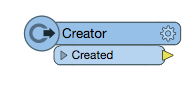
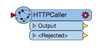
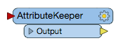

### 4.5 Using REST API Commands in a Workspace

You can use the calls you learned in this tutorial in a workspace
created. With each call you can format a new call within the REST API.
This is an excellent way to work with the REST API without any coding
experience.

There are some transformers you should be aware of before we get
started.

#### Creator

*Image 4.5.1 Creator Transformer*

The Creator is an excellent tool for testing a workspace. It will
trigger the workspace without the need to add data.

#### HTTPCaller

*Image 4.5.2 HTTPCaller Transformer*

The HTTPCaller is used to connect to REST APIs. It separates the call
into categories similarly to Postman. Simply enter in the Request URL,
HTTP Method, Query String Parameters, Header, and Body. The body is
broken down into several parts. You can upload data, or write the body
of the call as we have before.

#### JSONFlattener

*Image 4.5.3 JSONFlattener Transformer*

The JSONFlattener takes the JSON responses from the FME Server and can
break down the components so they can easily be used for future calls to
the server. JSON response can be quite long so it is essential to place the response into attributes that can be used in the workspace.

#### AttributeKeeper

*Image 4.5.4 AttributeKeeper Transformer*

The HTTPCaller will produce attributes that you may use in your calls.
However, you may only wish to keep one. The AttributeKeeper acts as a
filter, it will only keep the attributes you specify.

<table style="border-spacing: 0px">
<tr>
<td style="vertical-align:middle;background-color:darkorange;border: 2px solid darkorange">
<i class="fa fa-quote-left fa-lg fa-pull-left fa-fw" style="color:white;padding-right: 12px;vertical-align:text-top"></i>
Ricky RESTless says...
</td>
</tr>

<tr>
<td style="border: 1px solid darkorange">

All of the FME Server REST API calls can be use in Workbench. This can allow you to create workspaces to run jobs on the FME Server, create repositories, and handle server admin tasks. You may also use other REST APIs in Workbench.

</td>
</tr>
</table>
