### 4.6 Chaining Jobs Together using the REST API in FME Workbench

<table style="border-spacing: 0px;border-collapse: collapse;font-family:serif">
<tr>
<td width=25% style="vertical-align:middle;background-color:darkorange;border: 2px solid darkorChaange">
<i class="fa fa-cogs fa-lg fa-pull-left fa-fw" style="color:white;padding-right: 12px;vertical-align:text-top"></i>
Exercise 8 
</td>
<td style="border: 2px solid darkorange;background-color:darkorange;color:white">
Using REST API Commands in a Workspace Exercise
</td>
</tr>

<tr>
<td style="border: 1px solid darkorange; font-weight: bold">Data</td>
<td style="border: 1px solid darkorange">None</td>
</tr>

<tr>
<td style="border: 1px solid darkorange; font-weight: bold">Overall Goal</td>
<td style="border: 1px solid darkorange"> To use the REST API in a workspace </td>
</tr>

<tr>
<td style="border: 1px solid darkorange; font-weight: bold">Demonstrates</td>
<td style="border: 1px solid darkorange">How to use the HTTP Caller to access the FME Server</td>
</tr>
<tr>
<td style="border: 1px solid darkorange; font-weight: bold">Starting Workspace</td>
<td style="border: 1px solid darkorange">None</td>
</tr>
<td style="border: 1px solid darkorange; font-weight: bold">Ending Workspace</td>
<td style="border: 1px solid darkorange">C:\FMEData2018\Resources\RESTAPI\Chapter6Exercise8.Complete.fmw</td>
</tr>

</table>

A very simple workspace you can create would be one that triggers
multiple workspaces in the FME Server. In this workspace, we are going
to step up a workspace to run asynchronously, wait for a response, if
the response is positive the next workspace will run. So let's begin!

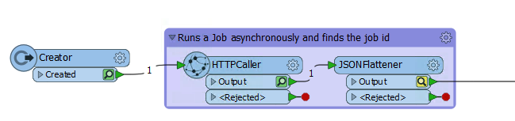

*Image 4.6.1 Create a call to run asynchronously*

**1) Create a new workspace in Workbench**

**2) Add a Creator Transformer to the Page**  
First, add the creator to the page. Keeping the default settings are okay, this will just trigger the workspace to run.

**3) Add an HTTPCaller to the Page**  
Next, add the HTTPCaller. Use the Request URL to write a submit command. You may use the call below or test it out with another workspace.

There are a few different ways to authorization with FME Server in the HTTPCaller:

1 - Use the token in the URL as a query string parameter 
2- Use the token in the authorization header  
3 - Check use authentication and set to basic authentication and enter your username and password  
4 - Check use authentication and set up an FME Server Web Connection

<!--Warning Section-->

<table style="border-spacing: 0px">
<tr>
<td style="vertical-align:middle;background-color:darkorange;border: 2px solid darkorange">
<i class="fa fa-exclamation-triangle fa-lg fa-pull-left fa-fw" style="color:white;padding-right: 12px;vertical-align:text-top"></i>
Note
</td>
</tr>

<tr>
<td style="border: 1px solid darkorange">

In the beginning of the course we discussed the difference between authentication and authorization. This was referring to the response codes sent from the FME Server. There is a difference between an authentication error and authorization error. However, within the HTTP Caller authenticating or authorizing your call can be used interchangeably.  

</td>
</tr>
</table>

**Please note that all calls in this section will require authorization.**

The first sections in the HTTPCaller to fill out is the Request and Headers. The layout in the HTTPCaller is very simple because all the areas to fill are clearly labelled.

Please note this is an example call which can be found here:      

https://docs.safe.com/fme/html/FME_REST/apidoc/v3/index.html#!/transformations/submit_post_22

 First, paste the Request URL in. Then, change the HTTP Method to Post. Update the Headers.

    POST http://<yourServerHost>/fmerest/v3/transformations/submit/Samples/austinDownload.fmw
    Headers:
          Accept: application/json
          Authorization: fmetoken token=<yourToken>

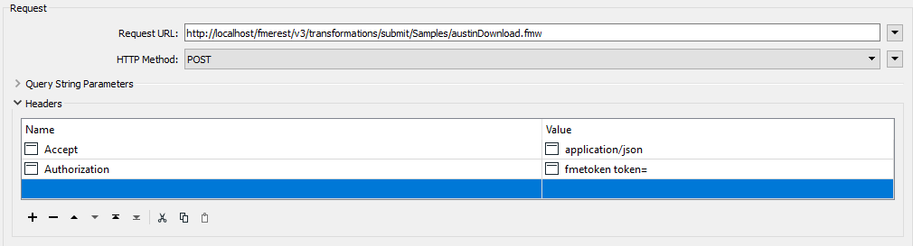

*Image 4.6.2 Header and URL*

When you insert the body section of the call find **Upload Body** and
click on the dropdown menu. Click on open text editor and paste the upload body into the call.

    {
      "publishedParameters": [
        {
          "name": "MAXY",
          "value": "42"
        },
        {
          "name": "THEMES",
          "value": [
            "airports",
            "cenart"
          ]
        }
      ]
    }

 Next, find the **Content Type** section and specify JSON (application/json). The body should look like this:

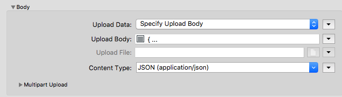

*Image 4.6.3 Upload body*

**4) Check the Output From the HTTPCaller**

Attach loggers to the HTTPCaller and run the workspace with Feature Caching turned on. To do this click Run in the top toolbar and select Run with Feature Caching.

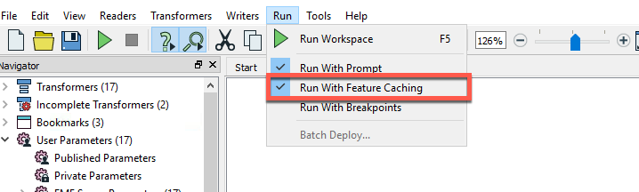

*Image 4.6.4 Run with Feature Caching*  

The logger will write to a text file where your workspace is saved and write to the translation log at the bottom of FME Workbench.   

The log file includes the response body and the response code.

*Image 4.6.5 Log File*

For the response body, we want to expose just the id value but disregard the JSON Formatting. Therefore, we use the JSON Flattener.

Before continuing on to the next step, delete the Logger.

<table style="border-spacing: 0px">
<tr>
<td style="vertical-align:middle;background-color:darkorange;border: 2px solid darkorange">
<i class="fa fa-quote-left fa-lg fa-pull-left fa-fw" style="color:white;padding-right: 12px;vertical-align:text-top"></i>
Ricky RESTless says...
</td>
</tr>

<tr>
<td style="border: 1px solid darkorange">

While the FME Server REST API does not limit the number of calls you can make. Other APIs may set a limit on the number of calls you can make for free. Feature Caching is a super handy tool in this case. You may inspect the output and adjust your workspace without making additional calls to the server.

</td>
</tr>
</table>

**5) Add a JSONFlattener to the Page**

Now you can add the JSONFlattener. The JSONFlattener allows you to
    select a part of the JSON to expose, in our case we should expose
    the id, so we can use it for the next call.

*Image 4.6.5 JSONFlattener parameters*

**6) Select the JSONFlattener and Click Run To This**

We want to review the JSONFlattener and ensure that it is producing an attribute with just the Job ID.

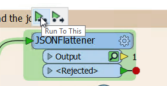

*Image 4.6.6 Run To This*

Once, we run the workspace again, we can select the Data Inspector symbol to review the output.
 
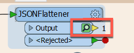

*Image 4.6.7 Click the magnifying glass to review the results*

*Image 4.6.8 Here we can see that the new attribute was successfully created*

*** Get Job Status Overview ***

The goal is this next section is to send a call out to the server to check if the previous job was successful. If the call is successful then we can run a new job. However, this workspace runs so quickly that the FME Server would not have time to process the previous job before the new call is made. So in this section we will be creating a custom transformer that will continually get the job status until the job has been completed.

**7) Add an HTTPCaller**

 We will add a **HTTPCaller.** In the HTTPCaller, click on the drop-down menu next to the Request URL and click open Text Editor. Paste the request and for the id double-click on this icon  from the FME Feature Attributes side panel. Your call should look like this:

    GET http://<yourServerHost>/fmerest/v3/transformations/jobs/id/@Value(id)

Now for the response in the HTTPCaller, we are going to change the Response Body Attribute to job_status. So your HTTPCaller should look like this:

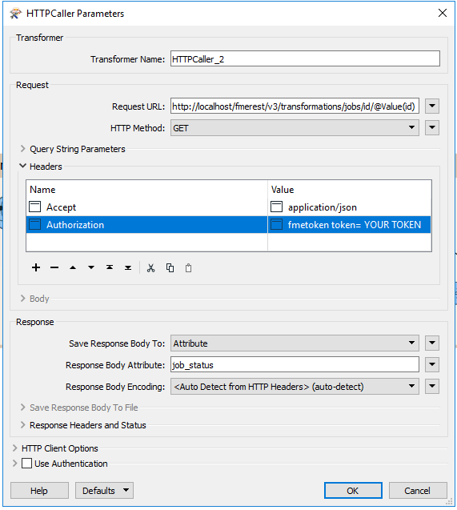

*Image 4.6.8 HTTPCaller parameters*

**8) Check the Output From the HTTPCaller**

Now, right click on the HTTPCaller_2 and select Run to This. From here we can click on the magnifying glass to view the response.

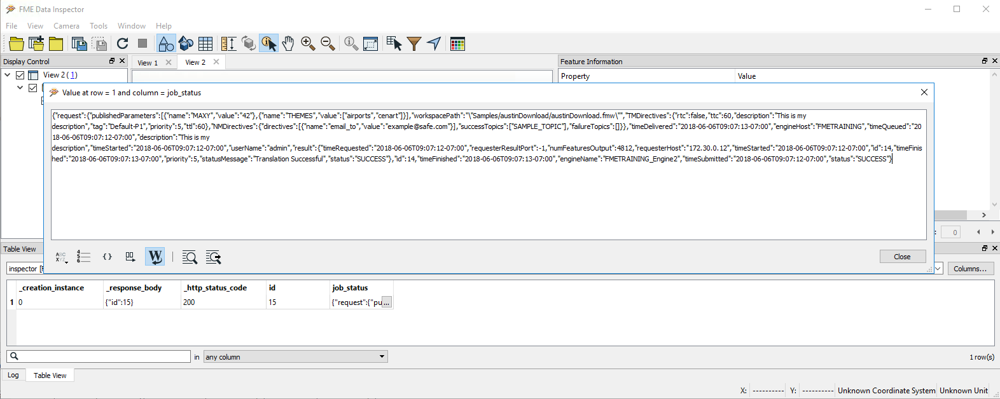

*Image 4.6.9 HTTPCaller output*

As you can see from the above image the response is quite long in its raw form.

However, at the very end we can see the status. Here you should see "status":"PULLED".

So know we need to extract that section of the response to test whether the call was successful. For that we need another JSONFlattener.

**9) Add a JSONFlattener**

 Next, we need another **JSONFlattener** to expose the
status code from the job\_status attribute. So, for the
input parameters under JSON Document, we are going to select
job\_status. Then under attributes to expose write status.

*Image 4.6.10 Second JSONFlattener parameters*

**10) Add a Tester**

-   Now we are going to add a **Tester** to determine if the workspace is pulled or run. If the status is "PULLED" then the job has not been run yet. So for the job to be completed status must not equal PULLED. The tester should be set up like this:

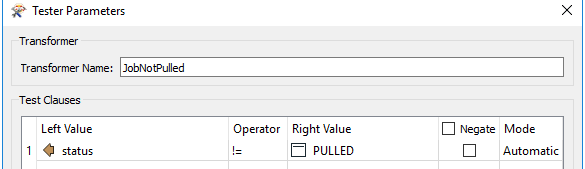

*Image 4.6.11 JobNotPulled parameters*

-   If the status is PULLED then the job has not been run and we need to to run the call again to check the status. To do this we need to make a custom transformer with a looper.

**11) Create a custom transformer**

Select HTTPCaller_2, JSONFlattener_2, and JobNotPulled, right click and select Create Custom Transformer.

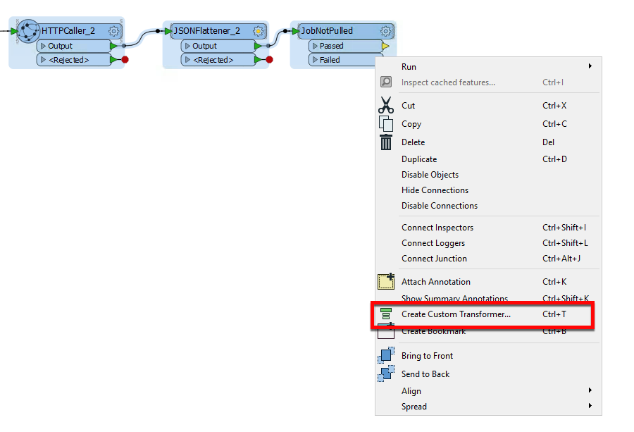

*Image 4.6.12 Custom Transformer*

Enter in the following details:

<ul><li>Name: JobStatusTester </li>
  <li>Category: Web </li>
  <li>Overview: This transformer will continue to check if the job has been passed from the PULLED stage. </li>
  </ul>  

Click OK. The custom transformer should look like this:

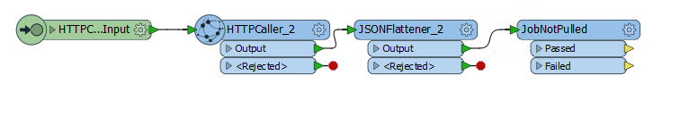

*Image 4.6.13 The Custom Transformer*

**12) Add a Looper Transformer**

Right click on the workspace and select Insert Transformer Loop. You will receive a dialog that says: Select Input to Loop to. The default will say Loop to: HTTPCaller_2_Input.

This means that is will loop the HTTPCaller_2 which will check the job id again. Connect this loop to the JobNotPulled failed output.  

Run the workspace!

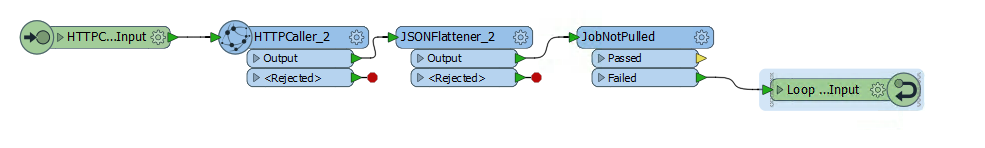

*Image 4.6.14 The Complete Custom Transformer*

Once we have run the workspace we should see something like this:

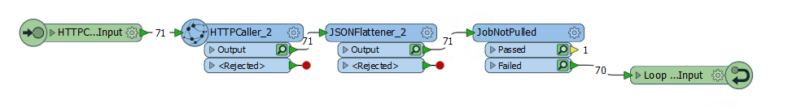

*Image 4.6.15 The Complete Custom Transformer once run*

The custom transformer has to run 70 times before it passes the last tester. However, the total translation is only 3.6 seconds.

**13) Add an Output to the Custom Transformer.**  

Right click and select Insert Transformer Output and attach it to JobNotPulled passed. *Now, we can switch back to the main page.*   

**13) Add a Tester**

-   Now we are going to add a **Tester** to determine if the workspace was successfully run. The tester should be set up like this:

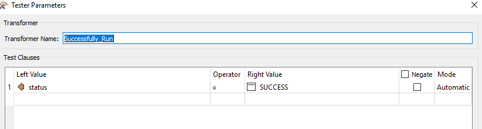

*Image 4.6.15 Tester parameters*

-   If the status is SUCCESS then the job was successfully run on the FME Server and the next workspace will be triggered.

***New Job is Run***

**14) Add another HTTPCaller**

Finally, use a third HTTPCaller to run a new job synchronously.
To do this use the same call that we had previously used, this is the Transact Call.

    POST http://<yourSeverHost>/fmerest/v3/transformations/transact/Samples/austinDownload.fmw

    Headers:
      Content-Type: application/json
      Accept: application/json
      Authorization: fmetoken token= [INSERT TOKEN HERE]  

      Body:
      {
        "publishedParameters": [
          {
            "name": "MAXY",
            "value": "42"
          },
          {
            "name": "THEMES",
            "value": [
              "airports",
              "cenart"
            ]
          }
        ]
      }

*Image 4.6.16 Final HTTP Caller*

While this is not the most practical example because we are running the
same workspace twice but in two different ways, it demonstrates how FME
can be used. It demonstrates the capabilities of running one workspace
and using the response to determine the next action.

The final workspace should look like this:

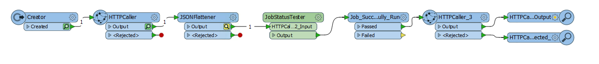
*Image 4.6.17 Final Workspace*

<!--Exercise Congratulations Section-->

<table style="border-spacing: 0px">
<tr>
<td style="vertical-align:middle;background-color:darkorange;border: 2px solid darkorange">
<i class="fa fa-thumbs-o-up fa-lg fa-pull-left fa-fw" style="color:white;padding-right: 12px;vertical-align:text-top"></i>
CONGRATULATIONS
</td>
</tr>

<tr>
<td style="border: 1px solid darkorange">

By completing this exercise you have learned how to:
 
<ul><li>Use the HTTPCaller transformer to use the FME Server REST API in a workspace</li>
<li>Create a custom transformer that continually checks the FME Server to see if a job has been completed</li>
<li>Use the FME Server REST API to run multiple jobs in a row</li>
</li>

</td>
</tr>
</table>
