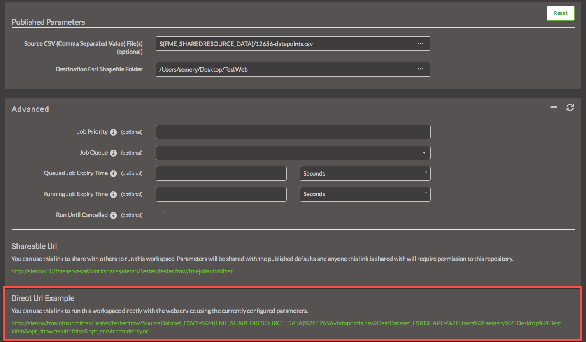

## Chapter 5- Web Services, Direct URLs, and the REST API

A Direct URL looks similar to the REST API Request URL, however it
exists outside of the REST API. To find an example of the Direct URL log
into your server and located a workspace.

Open the advanced tab and scroll down until you find the Direct URL
example:

*Image 5.0.1 Direct URL example*

The authentication process of the Direct URL is different from the REST
API. With the Direct URL you may add a token to the end of the URL like this:

    http://<yourServerHost>/fmejobsubmitter/<yourRepository>/<yourWorkspace>?<yourWorkpaceParameters>/token=<tokenValue>

Alternatively,  the DirectURL will default to the permissions set on the guest user account. If your guest
account has no permissions to run workspaces once you enter the Direct
URL you may be asked to log in. If the guest account has permission, you
may run the Direct URL without logging in.

Once you click the link your job will run and you will receive the
following notification.

*Image 5.0.2 Job success*

Like the REST API, the Direct URL can run a job synchronously and
asynchronously. The job will automatically run synchronously. To run the
job asynchronously enter an email in the section that says Email results
to. By doing this the Direct URL will automatically be updated to run
asynchronously. Once the job has completed an email will be sent.

*Image 5.0.3 Email in direct URLs*

Just like in the REST API there are parameters you may change in the
Direct URL.

The following table was copied from the following manual on the Data
Download Service. For full documentation visit:
[https://docs.safe.com/fme/html/FME\_Server\_Documentation/Content/ReferenceManual/service\_datadownload.htm?Highlight=direct%20url](https://docs.safe.com/fme/html/FME_Server_Documentation/Content/ReferenceManual/service_datadownload.htm?Highlight=direct%20url).

**Direct URL Request** **Parameters**

<table>

<tr>
<th>Name</th>
<th>Value</th>
<th>Description</th>
</tr>

<tr>
<td>opt_responseformat</td>
<td>xml or json

Default: xml
</td>
<td>The language of the response. The text must be in lowercase </td>
</tr>

<tr>
<td>opt_geturl</td>
<td>The URL to a dataset</td>
<td>The URL of the source dataset to be used for transformation</td>
</tr>

<tr>
<td>opt_showresult</td>
<td>true or false</td>
<td>Whether the XML/JSON responses include the FME transformation result. The default value is true if this parameter is not present.
</td>
</tr>

<tr>
<td>opt_servicemode</td>
<td>sync or async or schedule</td>
<td>Toggles between synchronous and asynchronous modes of the service. When jobs are submitted asynchronously (async), the response of submission success or failure is returned immediately. When set to synchronous (sync), the response is not returned until the job completes.

Or, schedules a data download request to run at a specified start time (one-time only). If a schedule is specified, see below for additional parameters.</td>
</tr>

<tr>
<td>opt_requesteremail</td>
<td>Comma separated email addresses</td>
<td>Addresses to which the notification e-mail messages are sent.lete topics, users, roles.</td>
</tr>

</table>

The Direct URL and REST API can be combined together in an application
to utilize the best components of both. An example is in this
demonstration:

[http://demos.fmeserver.com/easytranslator/index.html](http://demos.fmeserver.com/easytranslator/index.html)

*Image 5.0.4 Easy Translator*

Files are uploaded with the REST API, however the job is run using a Direct URL.

This is a section of code for the dataUpload function from the FME REST API JavaScript Library. Please note it is not the full function but should provide some context to how the calls look like in a JavaScript function.  

    dataUpload : function(repository, workspace, files, jsid, callback) {
              var url = buildURL('{{svr}}/fmedataupload/' + repository + '/' + workspace);
              var token = getConfig('token');
              url = url + '?token=' + token;
              ajax(url, callback, 'POST', params);

  The URL is built with the with the call we see in the REST API, then the token is added to the end of the URL. The URL is submitted with the POST method.

  Luckily, this call and almost all of the calls within the FME Server REST API exist within the REST API JavaScript library so the user does not have to write the functions. A user can successfully create an application but simply calling the functions already created.

  The Direct URL used in a JavaScript function would look like this:

    var submitUrl = BuildForm.host + '/fmedatadownload/' + BuildForm.repository + '/' +  BuildForm.workspaceName + '?SourceDataset_GENERIC=' + files;
  			submitUrl = submitUrl + '&SourceFormat=' + sourceFormat;
  			submitUrl = submitUrl + '&DestinationFormat=' + destFormat;
  			submitUrl = submitUrl + '&COORDSYS_Dest=' + outputCoordSys + '&opt_responseformat=json';

Here the Direct URL is built, then the user would click the DirectURL to activate it.   
