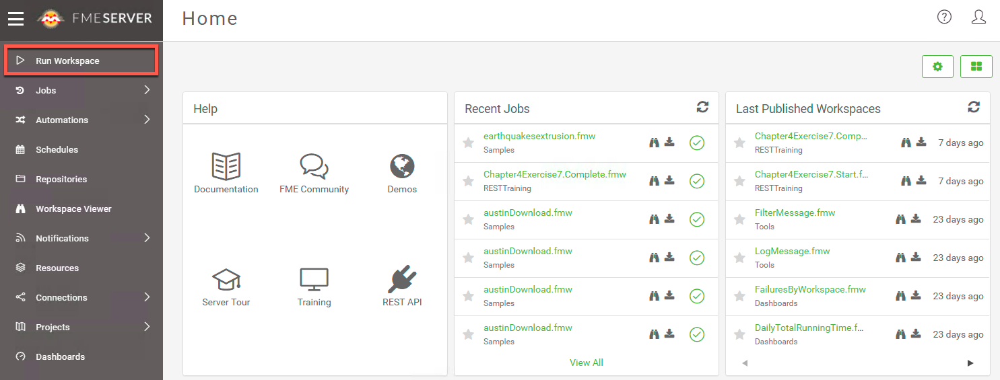
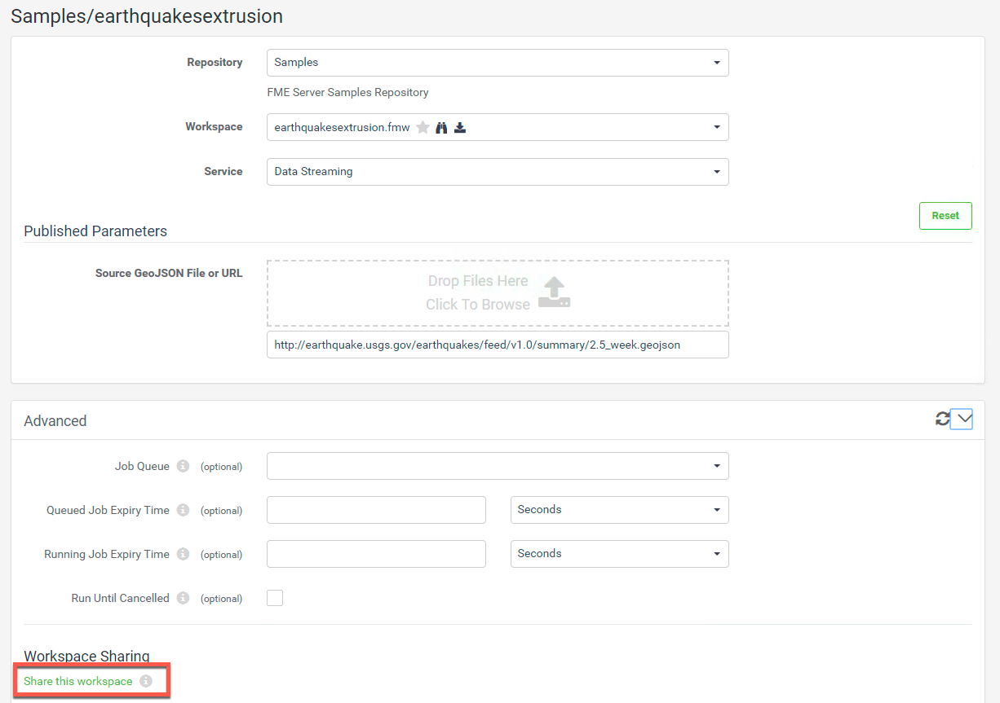

<table style="border-spacing: 0px;border-collapse: collapse;font-family:serif">
<tr>
<td width=25% style="vertical-align:middle;background-color:darkorange;border: 2px solid darkorange">
<i class="fa fa-cogs fa-lg fa-pull-left fa-fw" style="color:white;padding-right: 12px;vertical-align:text-top"></i>
Exercise 10 
</td>
<td style="border: 2px solid darkorange;background-color:darkorange;color:white">
Sharing Workspaces in FME Server
</td>
</tr>

<tr>
<td style="border: 1px solid darkorange; font-weight: bold">Data</td>
<td style="border: 1px solid darkorange">None</td>
</tr>

<tr>
<td style="border: 1px solid darkorange; font-weight: bold">Overall Goal</td>
<td style="border: 1px solid darkorange"> To use and understand Web Service URLs and FME Server Apps </td>
</tr>

<tr>
<td style="border: 1px solid darkorange; font-weight: bold">Demonstrates</td>
<td style="border: 1px solid darkorange"> How to create a Web Service URL and an FME Server App </td>
</tr>

</table>

In the introduction to this chapter we discussed what Web Service URLs and FME Server Apps are. This is will be a quick exercise on how to create Web Service URLs and FME Server Apps in FME Server. FME Server Apps are a quick and way to share a workspace with a user that does not have access to FME Server.

In the second section of the course we will be creating our own apps with a custom interface using the REST API. However, in some cases FME Server Apps include all the functionality needed.

  **1) Go to your FME Server and select Run Workspace**

Log into your FME Server and then select Run Workspace on the left hand menu.

  **2) Set up the Earthquakes Extrusion Workspace**

Fill out the following parameters to set up the workspace.

**Repository:** Samples

**Workspace:** earthquakesextrusion.fmw

**Service:** Data Streaming

Then, open up the Advanced Tab and select Share this workspace under Workspace Sharing.

  **3) Create the token for the Web Service URL**

For authentication we need to create a token that will be used in the URL. This token can only be used to run the workspace and does not have access to other resources within the FME Server. If Additional Permissions are needed you can select them in the Additional Permissions section.

It is okay to accept the default token. Select OK to create the default token.

  **4) Test out the FME Server App**

First, select the FME Server App. This will take you to a page which will run the workspace.

This link can be shared with anyone to run the workspace. Click Run to run the workspace. This will download the kml file created from the workspace.

  **5) Test out the Web Service URL**

Go back to the Share Workspace page. Then, click Web Service URL.

Clicking Web Service URL will not open a new page. Instead it will download the kml file directly. Since, there is no dialogue to set up the parameters the parameters have to be set within the URL itself. The Web Service URL would typically be used in a third party application. We will be demonstrating this in Exercise 17.

---

<!--Exercise Congratulations Section-->

<table style="border-spacing: 0px">
<tr>
<td style="vertical-align:middle;background-color:darkorange;border: 2px solid darkorange">
<i class="fa fa-thumbs-o-up fa-lg fa-pull-left fa-fw" style="color:white;padding-right: 12px;vertical-align:text-top"></i>
CONGRATULATIONS
</td>
</tr>

<tr>
<td style="border: 1px solid darkorange">

By completing this exercise you have learned how to:
 
<ul><li>Create a Web Service URL</li>
<li>Create a FME Server App</li>

</td>
</tr>
</table>
