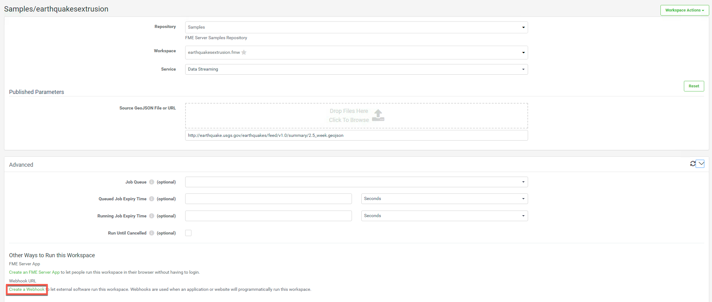
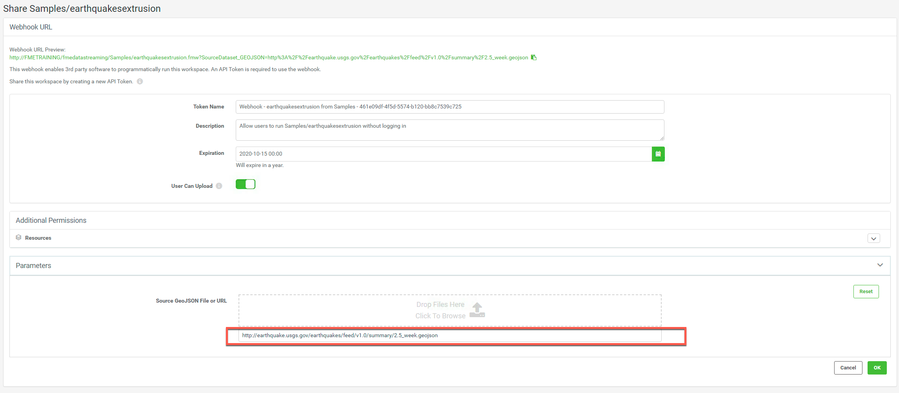
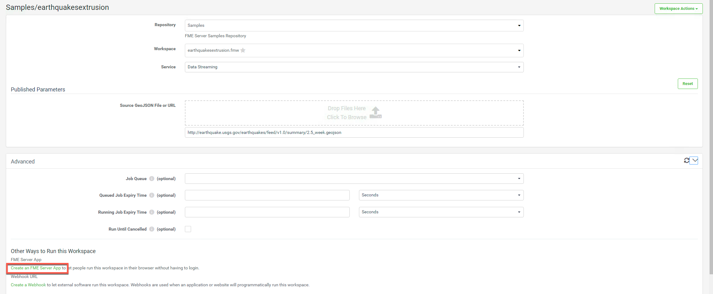
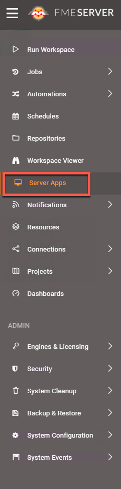
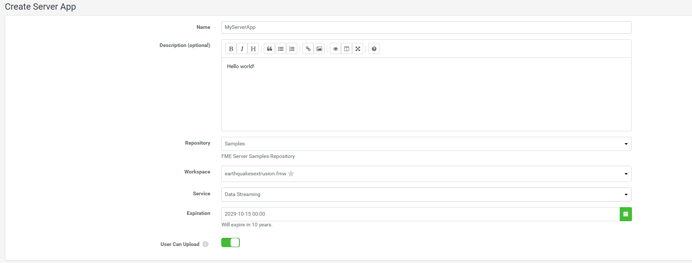
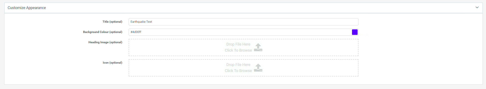
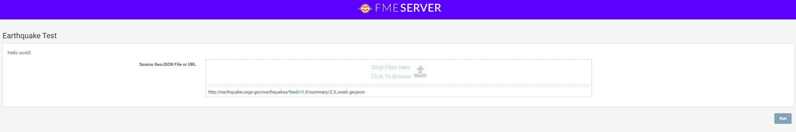

<table style="border-spacing: 0px;border-collapse: collapse;font-family:serif">
<tr>
<td width=25% style="vertical-align:middle;background-color:darkorange;border: 2px solid darkorange">
<i class="fa fa-cogs fa-lg fa-pull-left fa-fw" style="color:white;padding-right: 12px;vertical-align:text-top"></i>
Exercise 10 
</td>
<td style="border: 2px solid darkorange;background-color:darkorange;color:white">
Sharing Workspaces in FME Server
</td>
</tr>

<tr>
<td style="border: 1px solid darkorange; font-weight: bold">Data</td>
<td style="border: 1px solid darkorange">None</td>
</tr>

<tr>
<td style="border: 1px solid darkorange; font-weight: bold">Overall Goal</td>
<td style="border: 1px solid darkorange"> To use and understand Webhook URLs and FME Server Apps </td>
</tr>

<tr>
<td style="border: 1px solid darkorange; font-weight: bold">Demonstrates</td>
<td style="border: 1px solid darkorange"> How to create a Webhook URL and an FME Server App </td>
</tr>

</table>

In the introduction to this chapter we discussed what Webhook URLs and FME Server Apps are. This is a quick exercise on how to create Webhook URLs and FME Server Apps in FME Server. FME Server Apps are a quick and easy way to share a workspace with a user that does not have access to FME Server.

In the second section of the course we will be creating our own apps with a custom interface using the REST API. However, in some cases FME Server Apps include all the functionality needed.

  **1) Go to your FME Server and select Run Workspace**

Log into your FME Server and then select Run Workspace on the left hand menu.

  **2) Set up the Earthquakes Extrusion Workspace**

Fill out the following parameters to set up the workspace.

**Repository:** Samples

**Workspace:** earthquakesextrusion.fmw

**Service:** Data Streaming

Then, open up the Advanced Tab and select Create a Webhook under Other Ways to Run this Workspace.

  **3) Enter in the Source GeoJSON URL in the Parameters**

When creating a Webhook URL the default published parameter is removed. To fix this expand the Parameters dialogue and paste this link link in:

    http://earthquake.usgs.gov/earthquakes/feed/v1.0/summary/2.5_week.geojson

This will automatically update the Webhook URL preview.

  **4) Test out the Webhook URL**

Under Authorization with Query String, click the copy icon to copy the Webhook URL and paste it into a new browser tab.

Opening the Webhook URL will download the output from the workspace (in this case a kml file) directly. Since, there is no dialogue to set up the parameters, they have to be set within the URL itself. The Webhook URL would typically be used by a third party application. We will be demonstrating this in [Exercise 19. ](./FMESERVER_RESTAPI9CustomApplications/9.4.ExerciseMap.md)

 **5) Open FME Server Apps Page**
  There are two ways to access the page to create an FME Server App. One is from within the Advanced section of the Run Workspace page.

  

The other way is by clicking on Server Apps from the menu on the left-hand side of the FME Server interface.

  

Open the page by clicking on Server Apps from the FME Server interface.

  **6) Create an FME Server App**
  Click Create to open the configuration page for building your FME Server App.

Give it a Name like MyServerApp and optionally add a Description.

Next, select the Samples Repository and earthquakesextrusion.fmw as the workspace to run. For Service, select Data Streaming and leave the Expiration at its default value.

  

  **7) Customize the App**
 Below the main app settings, there are sections for customizing the parameters that will be shown and the appearance of the app. Leave the Parameters as they are and under Customize Appearance, set the Title and Background Colour for your app.

Click OK to create the app.

  **8) Test out the FME Server App**
 A URL for your App will have been generated. Click on the URL (or copy and paste it into a new browser window) to open a page that will let you run the workspace.

This link can be shared with anyone to run the workspace. Click Run to run the workspace. This will download the kml file created by the workspace.

<!--Exercise Congratulations Section-->

<table style="border-spacing: 0px">
<tr>
<td style="vertical-align:middle;background-color:darkorange;border: 2px solid darkorange">
<i class="fa fa-thumbs-o-up fa-lg fa-pull-left fa-fw" style="color:white;padding-right: 12px;vertical-align:text-top"></i>
CONGRATULATIONS
</td>
</tr>

<tr>
<td style="border: 1px solid darkorange">

By completing this exercise you have learned how to:
 
<ul><li>Create a Webhook URL</li>
<li>Create an FME Server App</li>

</td>
</tr>
</table>
