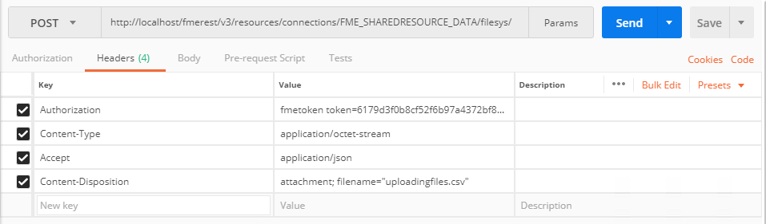
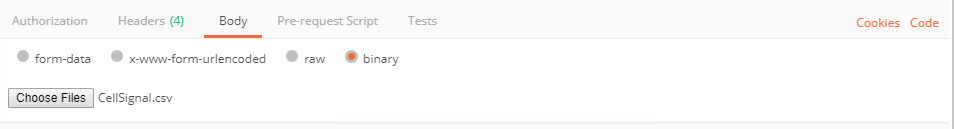
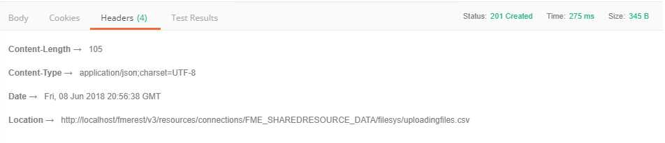
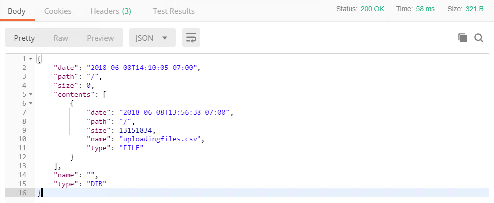
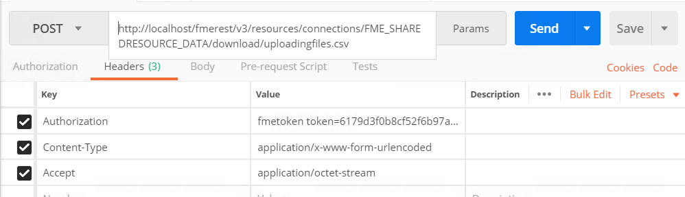

<table style="border-spacing: 0px;border-collapse: collapse;font-family:serif">
<tr>
<td width=25% style="vertical-align:middle;background-color:darkorange;border: 2px solid darkorange">
<i class="fa fa-cogs fa-lg fa-pull-left fa-fw" style="color:white;padding-right: 12px;vertical-align:text-top"></i>
Exercise 10 
</td>
<td style="border: 2px solid darkorange;background-color:darkorange;color:white">
 Working with Resources
</td>
</tr>

<tr>
<td style="border: 1px solid darkorange; font-weight: bold">Data</td>
<td style="border: 1px solid darkorange">C:\FMEData2018\Data\CellSignals\CellSignal.csv
</td>
</tr>

<tr>
<td style="border: 1px solid darkorange; font-weight: bold">Overall Goal</td>
<td style="border: 1px solid darkorange"> To demonstrate how to upload a file and download a file using the REST API. </td>
</tr>

<tr>
<td style="border: 1px solid darkorange; font-weight: bold">Demonstrates</td>
<td style="border: 1px solid darkorange"> The calls for managing resources </td>
</tr>

</table>

Through the REST API, you will have access to the Resources available in
the FME Server. You can list files, upload files, and delete files all
using the REST API. This is helpful in a web application if you would
like to direct data to a certain area in the FME Server.

---

<table style="border-spacing: 0px">
<tr>
<td style="vertical-align:middle;background-color:darkorange;border: 2px solid darkorange">
<i class="fa fa-quote-left fa-lg fa-pull-left fa-fw" style="color:white;padding-right: 12px;vertical-align:text-top"></i>
Ricky RESTless says...
</td>
</tr>

<tr>
<td style="border: 1px solid darkorange">

Most file management can be handled through the REST API. This means in a web application can have users upload files to the server, run a translation, and then return a file to the user. These calls are also in the FME JavaScript API and will be used later in the course.

</td>
</tr>
</table>

---

#### Uploading a File

This call will upload a file to the data folder in your resources
folder. The filename is specified in the Content-Disposition parameter.
If you wanted to specify a directory in the data folder simply write the
folder name after filesys. Uploading a file could be useful in a web application if it is requesting data from a user and inputing that data into a workspace.

 **1) Enter the following URL and Headers into Postman**

In Postman click the plus symbol to open a new tab.

<!--Post Table-->

<table class="tg" style="table-layout: fixed; width: 100%">
  <tr>
    <th class="tg-ao4k">POST</th>
    <th class="tg-a080" style="word-wrap: break-word">http://&lt;yourServerHost&#62;/fmerest/v3/resources/connections/FME_SHAREDRESOURCE_DATA/filesys/</th>
  </tr>
</table>

**Headers:**

- **Content-Type:** application/octet-stream

- **Accept:** application/json

- **Content-Disposition:** attachment; filename= "uploadingfiles.csv"

- **Authorization:** fmetoken token= &lt;yourServerHost>

 **2) Upload a File in Postman**
 

To upload a file in Postman. Switch to the Body tab. Select binary. The press Choose Files and navigate to

    C:\FMEData2018\Data\CellSignals\CellSignal.csv

Click Send! Then, review the response

---

Optional Query String Parameters

Query string parameters are added at the end of the URL. If you wished to include these it would the URL would look like this:

    http://<yourServerHost>/fmerest/v3/resources/connections/FME_SHAREDRESOURCE_DATA/filesys?createDirectories=true&overwrite=false

<table>

<tr>
<th>Parameter</th>
<th>Value</th>
<th>Description</th>

</tr>

<tr>
<td>createDirectories</td>
<td> True | **false** </td>
<td>Create directories in the path if they do not exist</td>

<tr>
<td>overwrite</td>
<td>True | **false**</td>
<td> Overwrite the file if it already exists </td>

</tr>

</table>

---

#### Listing Files

This call will list the files in a resource. Listing files in a resource could be used in either a workspace or a web application. A possible use case could be creating a workspace to list all files in a resource and create an excel spreadsheet that is organized by the date uploaded.

 **3) Enter in the Following URL and Headers in Postman**

<!--GET Table-->

<table class="tg" style="table-layout: fixed; width: 100%">
  <tr>
    <th class="tg-ej3l">GET</th>
    <th class="tg-ufe5" style="word-wrap: break-word">http://&lt;yourServerHost&#62;/fmerest/v3/resources/connections/FME_SHAREDRESOURCE_DATA/filesys/</th>
  </tr>
</table>

**Headers:**

- **Accept:** application/json

- **Authorization:** fmetoken token=&lt;yourToken>

 **4) View the Response in Postman**

---

#### Downloading a File

The downloading file call is particularly useful in a web application. This can be used to return file to a user. This call can also be used in a workspace to download text files.

This call downloads a file from a resource connection either as an
inline resource or as an attachment. The 'disposition' parameter is
only relevant for some REST clients. In particular, Internet Explorer
behaves poorly without an attachment disposition header. This web page
will only display the response body instead of downloading the file, so
REST clients should inspect the Content-Disposition header and handle
the download.

This call will look into the Resources/Data directory to find uploadingfiles.csv.

 **5) Enter in the Following URL and Headers in Postman**

<!--Post Table-->

<table class="tg" style="table-layout: fixed; width: 100%">
  <tr>
    <th class="tg-ao4k">POST</th>
    <th class="tg-a080" style="word-wrap: break-word">http://&lt;yourServerHost&#62;/fmerest/v3/resources/connections/FME_SHAREDRESOURCE_DATA/download/uploadingfiles.csv</th>
  </tr>
</table>

**Headers:**

- **Accept:** application/octet-stream

- **Authorization:** fmetoken token=&lt;yourToken&#62;

- **Content-Type:** application/x-www-form-urlendcoded

 **6) Enter in the body of the call**

To enter in the body of the call. Click the body tab, check raw and then paste the contents below.

    accept=contents&disposition=inline

 Hit Send! Then, review the response in Postman

**Parameters:**

<table>

<tr>
<th>Parameter</th>
<th>Value</th>
<th>Description</th>

</tr>

<tr>
<td>disposition</td>
<td> inline/attachment </td>
<td>Inline will display how to retrieve the resource using the 'Content-Disposition' header. This parameter is only relevant for some REST clients (primarily web browsers). If no disposition is selected, then a header is not set.</td>

<tr>
<td>Path</td>
<td></td>
<td> Path, relative to the resource connection (for example, uploading.csv) </td>

<tr>
<td>Resource</td>
<td></td>
<td>Name of a resource connection. Can contain only alphanumeric characters. (for example, FME_SHAREDRESOURCE_DATA) </td>

</tr>

</table>

---

<!--Exercise Congratulations Section-->

<table style="border-spacing: 0px">
<tr>
<td style="vertical-align:middle;background-color:darkorange;border: 2px solid darkorange">
<i class="fa fa-thumbs-o-up fa-lg fa-pull-left fa-fw" style="color:white;padding-right: 12px;vertical-align:text-top"></i>
CONGRATULATIONS
</td>
</tr>

<tr>
<td style="border: 1px solid darkorange">

By completing this exercise you have learned how to:
 
<ul><li>Upload a file using the REST API</li>
<li>List files using the REST API</li>
<li>Download files using the REST API</li>

</td>
</tr>
</table>
