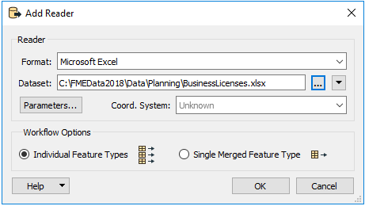
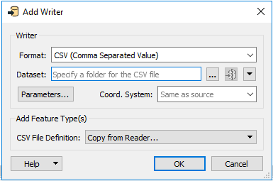
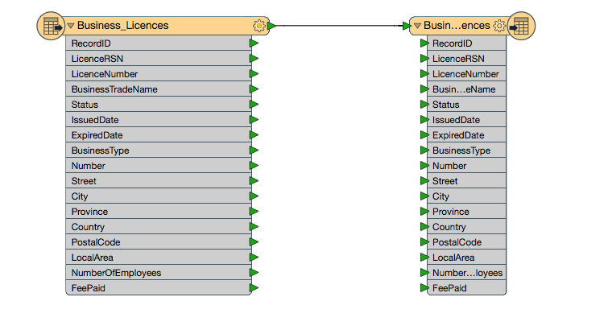
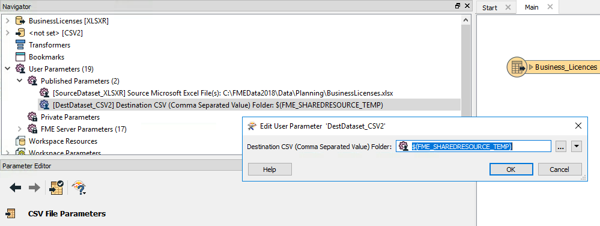
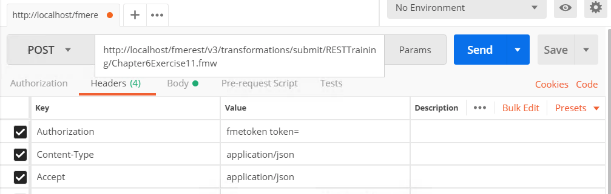
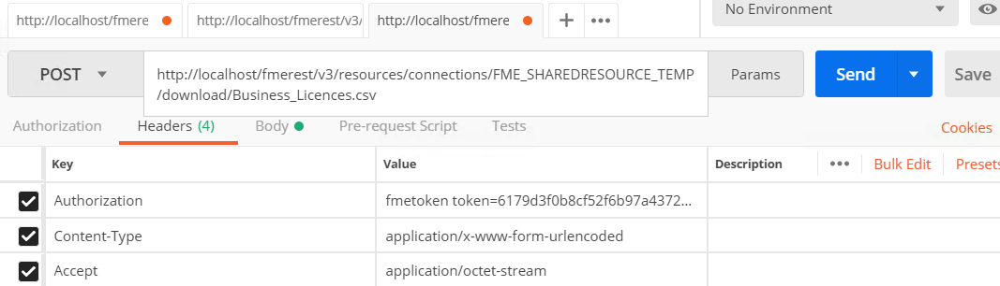
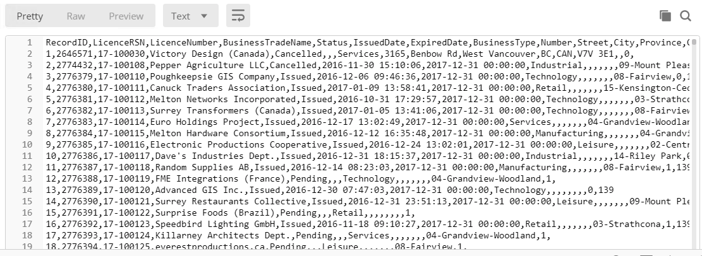

<table style="border-spacing: 0px;border-collapse: collapse;font-family:serif">
<tr>
<td width=25% style="vertical-align:middle;background-color:darkorange;border: 2px solid darkorange">
<i class="fa fa-cogs fa-lg fa-pull-left fa-fw" style="color:white;padding-right: 12px;vertical-align:text-top"></i>
Exercise 11 
</td>
<td style="border: 2px solid darkorange;background-color:darkorange;color:white">
 Using a Shared Resource as a Workspace Output Location
</td>
</tr>

<tr>
<td style="border: 1px solid darkorange; font-weight: bold">Data</td>
<td style="border: 1px solid darkorange">C:\FMEData2018\Data\Planning\BusinessLicenses.xlsx</td>
</tr>

<tr>
<td style="border: 1px solid darkorange; font-weight: bold">Overall Goal</td>
<td style="border: 1px solid darkorange"> To demonstrate how to upload a file and download a file using the REST API. </td>
</tr>

<tr>
<td style="border: 1px solid darkorange; font-weight: bold">Demonstrates</td>
<td style="border: 1px solid darkorange"> The calls for managing resources </td>
</tr>
<tr>
<td style="border: 1px solid darkorange; font-weight: bold">Workspace</td>
<td style="border: 1px solid darkorange"> C:\FMEData2018\Resources\RESTAPI\Chapter6Exercise11 </td>
</tr>

</table>

---

<table style="border-spacing: 0px">
<tr>
<td style="vertical-align:middle;background-color:darkorange;border: 2px solid darkorange">
<i class="fa fa-quote-left fa-lg fa-pull-left fa-fw" style="color:white;padding-right: 12px;vertical-align:text-top"></i>
Ricky RESTless says...
</td>
</tr>

<tr>
<td style="border: 1px solid darkorange">

This next exercise demonstrates a typical workflow if you were to create a web application that were to run a translation and download a file that is created from the translation. First, you would upload a workspace to your FME Server using Workbench. Then, the user would be instructed to upload a file, this should go to a Shared Resource folder within the FME Server. After the user uploads a file, the application would run the workspace which would produce a file to a shared resource location. Then, the user would be able to download the file.

</td>
</tr>
</table>

---

If you wish to retrieve the result dataset from a workspace through the
REST API, the best method is to write it to a shared resource location
that is accessible to the client. In this example we will make a
workspace, then run a call while changing the output to the Temporary
Repository. We will use a very basic workspace to test this out.

#### Create the Workspace

 **1)  Open FME Workbench and start a blank workspace.**

 **2) Add a Microsoft Excel reader, with the BusinessLicenses File.**

There are many ways to add a Reader to a workspace. We can add the Reader by clicking on the canvas and typing Excel.

Once we have selected the Excel Reader, we click the ... button to navigate to the Dataset.

The Dataset is located here:
 C:\FMEData2018\Data\Planning\BusinessLicenses.xlsx

 **3) Then add CSV writer to the workspace.**

Next, we can add the CSV Writer. The CSV Writer can be added in the same way. Click the canvas and start to type CSV. Select the CSV writer.

Accepting the default parameters is okay.

Then, connect the Excel file to the CSV file.

 **4) Set the Destination Folder.**

The next step is to identify the Published parameter of the destination dataset. Published Parameters are located in the Navigator panel of FME Workbench. It should be called DestDataset_CSV2. Under this parameter, set the destination to be, $(FME_SHAREDRESOURCE_TEMP)

When using calls through the REST API it is important to have the file being written to an area that your FME Server has access to. The temporary folder is a great place to write files to for testing because the files will be deleted.

 **5) Set the Source Dataset**

We will upload the data using the API later. For now change the source dataset folder to:

    $(FME_SHAREDRESOURCE_DATA)/SharedResourceTest/BusinessLicenses.xlsx

The source dataset also has to be in a location that the FME Server has access to. We are specifying a folder here that will be created through the REST API.

 **6) Set the Source Dataset to a Private Parameter**

The next step is to set the Source Dataset to a private parameter. This can be accomplished by going to the navigator panel and then right-clicking on the parameter. Then select "Convert to Private Parameter."

Converting Public Parameters to Private Parameters ensures that the call is easy to use. Since, the source of the dataset will not change it is a best practice to set it to a convert it to a private parameter.

 **7) Publish to FME Server**

*If you have not set up the Server Connection the instructions can be found [here](https://safe-software.gitbooks.io/fme-server-rest-api-training-2018/content/FMESERVER_RESTAPI4Workspaces/4.4.TransactData.html)*

Click the publish to FME Server button.

 Select the FME Server Connection created previously. Click Next.

Set the Repository name to RESTTraining. Click Next.

Select the Job Submitter Service and publish the Workspace

---

#### Upload the Data Using the Resources call

 **8) Enter the following URL and Headers into Postman**

    POST http://<yourServerHost>/fmerest/v3/resources/connections/FME_SHAREDRESOURCE_DATA/filesys/SharedResourceTest?createDirectories=true
    Content-Type: application/octect-stream
    Accept: application/json
    Content-Disposition: attachment; filename= "BusinessLicenses.xlsx"
    Authorization: fmetoken token= [INSERT TOKEN HERE]

 **9) Add the Body of the call in Postman**

 First, click on the body tab in Postman. Then, select Binary and click Choose Files.
 
Find
C:\FMEData2018\Data\Planning\BusinessLicenses.xlsx as the file to upload!

 **10) Click Send! Then, review the response**

  

---

#### Run the Job

 **11) Enter the following URL and Headers into Postman**

**Request**

    POST
    http://<yourServerHost>/fmerest/v3/transformations/submit/RESTTraining/Chapter6Exercise11.fmw
    Accept: application/json
    Content-Type: application/json
    Authorization: fmetoken token= <yourToken>

 **12) Add the Body of the call in Postman**

 First, click on the body tab in Postman. Then, click the raw button. Then, paste the following information.

    {
    "publishedParameters": [
    {
      "name": "DestDataset_CSV2",
      "value": "$(FME_SHAREDRESOURCE_TEMP)"
    }
    ]
    }

  

 **13) Review the Response from the FME Server**

    {

    "id": 29

    }

Please Note. The job ID that is returned by the Server will be different based on how many jobs the FME Server has completed.

---

#### Test the Job was Successful

 **14) Enter the Following call into Postman. Then, Click Send!**

This call will run asynchronously so in return you will receive an id.
To check that your call has been completed, use this call.

***Replace 29 with the ID you received from the last call***

    GET http://localhost/fmerest/v3/transformations/jobs/id/29
    Accept: application/json
    Authorization: fmetoken token= YOUR TOKEN

 **15) Review the Response to ensure the job was completed successfully**

---

#### Download the Resulting File

 **16) Enter in the Request URL and Headers into Postman**

Then you can download the file using the call below.

     POST http://<yourServerHost>/fmerest/v3/resources/connections/FME_SHAREDRESOURCE_TEMP/download/Business_Licences.csv

    Accept: application/octet-stream
    Authorization: fmetoken token=<yourToken>
    Content-Type: application/x-www-form-urlendcoded

  

 **17) Enter in the Body in Postman**

Click the body tab in Postman. Then select raw. Then, paste the following information. Click Send!

    accept=contents&disposition=inline

 **18) Review the Response in Postman!**

While Postman can process the call, the CSV file cannot be downloaded. If you wanted to download a copy of the file you can do so through FME JavaScript API. We will walk through this process later in the course.

---

<!--Exercise Congratulations Section-->

<table style="border-spacing: 0px">
<tr>
<td style="vertical-align:middle;background-color:darkorange;border: 2px solid darkorange">
<i class="fa fa-thumbs-o-up fa-lg fa-pull-left fa-fw" style="color:white;padding-right: 12px;vertical-align:text-top"></i>
CONGRATULATIONS
</td>
</tr>

<tr>
<td style="border: 1px solid darkorange">

By completing this exercise you have learned how to:
 
<ul><li>Create a workspace compatible with the Submit call</li>
<li>Upload a file to a shared resource using the REST API</li>
<li>Run a submit call and test if it was successful</li>
<li>Download files using the REST API</li>

</td>
</tr>
</table>
