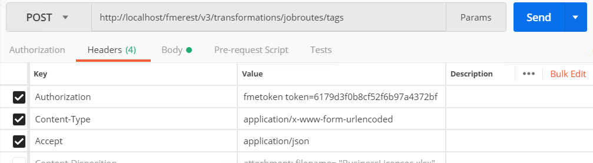
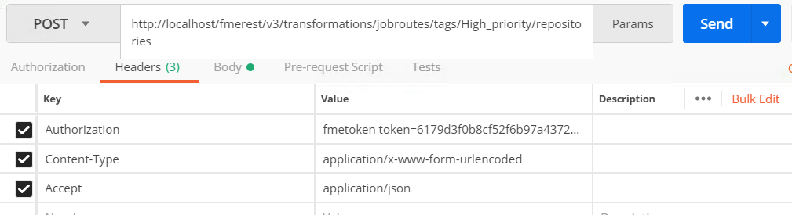
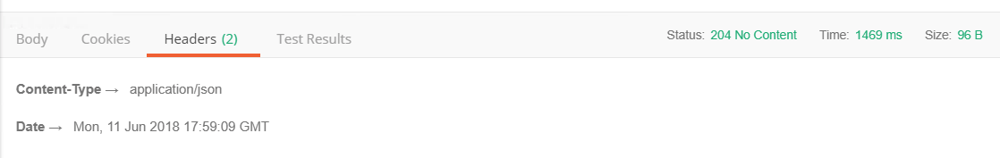
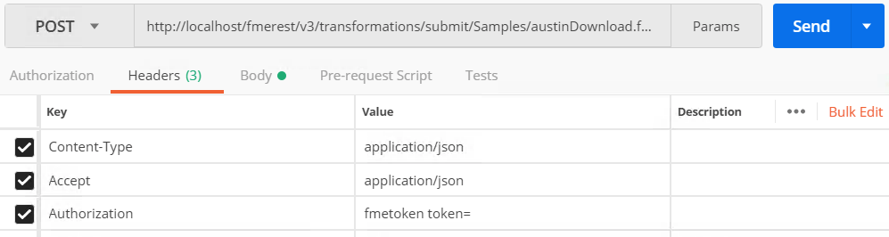
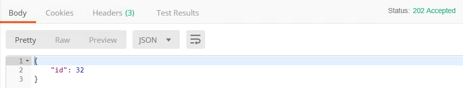
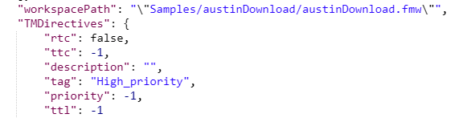

### 7.1 Creating a Job Queue

<table style="border-spacing: 0px;border-collapse: collapse;font-family:serif">
<tr>
<td width=25% style="vertical-align:middle;background-color:darkorange;border: 2px solid darkorange">
<i class="fa fa-cogs fa-lg fa-pull-left fa-fw" style="color:white;padding-right: 12px;vertical-align:text-top"></i>
Exercise 12 
</td>
<td style="border: 2px solid darkorange;background-color:darkorange;color:white">
 Creating a Job Queue
</td>
</tr>

<tr>
<td style="border: 1px solid darkorange; font-weight: bold">Data</td>
<td style="border: 1px solid darkorange">None</td>
</tr>

<tr>
<td style="border: 1px solid darkorange; font-weight: bold">Overall Goal</td>
<td style="border: 1px solid darkorange"> To demonstrate how the FME REST API can be used to manage job queues in FME Server   </td>
</tr>

<tr>
<td style="border: 1px solid darkorange; font-weight: bold">Demonstrates</td>
<td style="border: 1px solid darkorange"> How to create a queue </td>
</tr>
<tr>
<td style="border: 1px solid darkorange; font-weight: bold">Workspace</td>
<td style="border: 1px solid darkorange"> austinDownload.fmw. Stored in the Samples Repository  </td>
</tr>

</table>

<!--New Section-->

<table style="border-spacing: 0px">
<tr>
<td style="vertical-align:middle;background-color:darkorange;border: 2px solid darkorange">
<i class="fa fa-bolt fa-lg fa-pull-left fa-fw" style="color:white;padding-right: 12px;vertical-align:text-top"></i>
NEW
</td>
</tr>

<tr>
<td style="border: 1px solid darkorange">

Previously, job management was configured through engine tags. This has been deprecated and now we use job queues. However, the REST API endpoints are the same but manage queues now.

</td>
</tr>
</table>

#### Create a Job Queue

The following call allows you to create a new queue for a job. The follow
tag created will be called High_Priority. Any jobs with this tag will
be sent to FMETRAINING_Engine1. You may a tag to multiple engines.

**1) Enter the following URL and Headers into Postman**

**Request**

    POST http://<yourServerHost>/fmerest/v3/transformations/jobroutes/tags

    Content-Type: application/x-www-form-urlencoded
    Accept: application/json
    Authorization: fmetoken token= [INSERT TOKEN HERE]

  

  *Image 7.1.1 Job Route URL and Header*

**2) Switch to the Body tab. Click raw and paste the following information**

    engines=FMETRAINING_Engine1&name=High_priority&priority=1

  

  *Image 7.1.2 Job Route Body*

____________________________
** Additional Parameters**

Below are some additional parameters you may use for future calls.

<table>

<tr>
<th>Parameter</th>
<th>Description</th>

</tr>

<tr>
<td>description</td>
<td>Description of the tag</td>

<tr>
<td>engines</td>
<td>Engine assignment for the tag
</td>

<tr>
<td>name</td>
<td>Required- Unique name of the tag to create</td>

<tr>
<td>repositories</td>
<td>Repository assignments for the tag</td>

<tr>
<td>priority</td>
<td>Priority for the tag. Priority values must be integers between 1 and 10.</td>

</tr>

</table>

**3) Click Send and Review the Response from the FME Server.**

     201- Success. The queue was created.

*Image 7.1.3 Job Route Response*

#### Assigning an Engine to the Job Queue

**4) Enter the Following URL and Headers into Postman**

    POST http://<yourServerHost>/fmerest/v3/transformations/jobroutes/tags/High_priority/engines

    Content-Type: application/x-www-form-urlencoded
    Accept: application/json
    Authorization: fmetoken token= <yourToken>

**5) Switch to the Body tab. Click raw and paste the following information:**

    engines=FMETRAINING_Engine1

**7) Click Send and Review the Response from the FME Server.**

#### Assigning a Repository to the Job Queue

In the next stage of this exercise we are taking the job queue we just created and assigning it to a repository. This ensures that every time a job in the repository is run it is assigned to this queue.

**8) Enter the Following URL and Headers into Postman**

    POST http://<yourServerHost>/fmerest/v3/transformations/jobroutes/tags/High_priority/repositories

    Content-Type: application/x-www-form-urlencoded
    Accept: application/json
    Authorization: fmetoken token= <yourToken>

*Image 7.1.4 The Headers and URL to Assign a Repository a Job Routing Tag*

**9) Switch to the Body tab. Click raw and paste the following information:**

    repositories=RESTTraining

*Image 7.1.5 The Body of a call to Assign the RESTTraining Repository to the High_Priority queue*

_______________________

**Additional Parameters**

Below are some additional parameters you may use for future calls.

<table>

<tr>
<th>Parameter</th>
<th>Description</th>

</tr>

<tr>
<td>repositories</td>
<td>Repository assignments for the queue</td>

<tr>
<td>tag</td>
<td>Name of the job queue
</td>

</tr>

</table>

________________

**10) Click Send and Review the Response from the FME Server.**

    204- Success. The assigned repositories were assigned.

  

  *Image 7.1.6 Response from the FME Server*

**11) Check the FME Server to see if the Repository was successfully assigned.**

Go to your FME Server and Click Repositories.

*Image 7.1.7 Queue Assigned*

#### Submit a Job and Include the Tag in the Request

When you submit a job. You may specify the queue in the request, under the
TMDirectives. The TMDirectives specify how the job should be run by the
server. Below is the full list of parameters.

**Please note that the priority has been deprecated and queues will be honored instead**

    TMDirectives {

    rtc (boolean, optional): Runs a job until it is explicitly canceled. The job will run again regardless of whether the job completed successfully, failed, or the server crashed or was shut down.,

    ttc (integer, optional): Time (in seconds) elapsed for a running job before it's canceled. The minimum value is 1 second, values less than 1 second are ignored.,

    ttl (integer, optional): Time to live in the job queue (in seconds),
    description (string, optional): Description of the request,

    priority (integer, optional): The priority of the job. Priority values must be integers between 1 and 200. If a request's priority value is less than 1, greater than 200, or is not specified, then FME Server sets it to 100.,

    tag (string, optional): The job routing tag for the request
    }

Below is an example of what the TMDirectives can look like:

    "TMDirectives": {
        "rtc": false,
        "ttc": 60,
        "description": "This is my description",
        "tag": "linux",
        "ttl": 60
      },

Now, we are going to use a Submit call and alter the parameters to include the job queue (also called a tag in the REST API) previously created.

**12) Enter the Following URL and Headers into Postman**

    POST http://<yourServerHost>/fmerest/v3/transformations/submit/Samples/austinDownload.fmw

    Content-Type: application/json
    Accept: application/json
    Authorization: fmetoken token= [INSERT TOKEN HERE]

*Image 7.1.8 Submit Call URL and Header*

**13) Switch to the Body tab. Click raw and paste the following information**

    {
      "publishedParameters": [
        {
          "name": "MAXY",
          "value": "42"
        },
        {
          "name": "THEMES",
          "value": [
            "airports",
            "cenart"
          ]
        }
      ],
      "TMDirectives": {
        "tag": "High_priority"

      }
    }

*Image 7.1.9 Submit Response*

**14) Click Send and Review the Response from the FME Server.**

    {

    "id": 33

    }

Please Note. The job ID that is returned by the Server will be different based on how many jobs the FME Server has completed.

Now we can check the job to see if the job ran successfully under the High\_priority tag.

*Image 7.1.10 Submit Response*

**15) Enter the Following URL and Headers into Postman**

***Replace 33 with the ID you received from the last call***

    GET http://<yourServerHost>/fmerest/v3/transformations/jobs/id/33

    Accept: application/json
    Authorization: fmetoken token= <yourToken>

**16) Click Send and Review the Response from the FME Server.**

In the response, you can find the Engine that the call was submitted to and the parameters of the call.

*Image 7.1.11 Response*

As you can see here, the job was submitted under the High_priority tag. However, the priority demonstrated was still -1. The tag will override this priority so it was still submitted with a priority of 9, it is just not displayed in the FME Server.
