<table style="border-spacing: 0px;border-collapse: collapse;font-family:serif">
<tr>
<td width=25% style="vertical-align:middle;background-color:darkorange;border: 2px solid darkorange">
<i class="fa fa-cogs fa-lg fa-pull-left fa-fw" style="color:white;padding-right: 12px;vertical-align:text-top"></i>
Exercise 13 
</td>
<td style="border: 2px solid darkorange;background-color:darkorange;color:white">
 Create a Workspace to Retrieve Job History Results
</td>
</tr>

<tr>
<td style="border: 1px solid darkorange; font-weight: bold">Data</td>
<td style="border: 1px solid darkorange">None</td>
</tr>

<tr>
<td style="border: 1px solid darkorange; font-weight: bold">Overall Goal</td>
<td style="border: 1px solid darkorange"> To Create a Workspace that can retrieve the last 1000 jobs and display it in an HTML. </td>
</tr>

<tr>
<td style="border: 1px solid darkorange; font-weight: bold">Demonstrates</td>
<td style="border: 1px solid darkorange"> How to use the Get Jobs call in a workspace </td>
</tr>
<tr>
<td style="border: 1px solid darkorange; font-weight: bold">Workspace</td>
<td style="border: 1px solid darkorange"> C:\FMEData2018\Resources\RESTAPI\Chapter7Exercise13.Complete</td>
</tr>

</table>

For this exercise, we are going to create a workspace that retrieves the
job history from your FME Server and creates an HTML file with the
results. The first workspace we will create retrieves the latest 1000
jobs from the FME Server. Then the results are formatted into a table
with the results and beneath this, there will be a chart with the number
of results by date.

#### Use the HTTPCaller to Get Jobs and then Format the Attributes

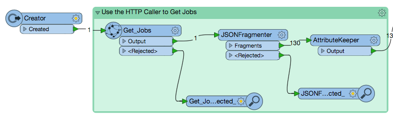

 **1) Add a Creator**

In a blank FME Workspace add a Creator transformer. It is okay to accept the default parameters.

 **2) Add the HTTPCaller**

Add the HTTPCaller and set the parameters as listed below:

**Request URL:** http://&lt;yourServerHost&#62;/fmerest/v3/transformations/jobs/completed
**HTTP Method:** GET

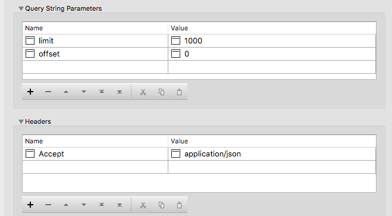

Check the box next to Use Authentication. Then select Basic as the Authentication mode and use the Admin/Admin username and password. Alternatly, you can also set the Authentication Method to Web Connection and then use the FME Server connection that was created in a previous exercise. 

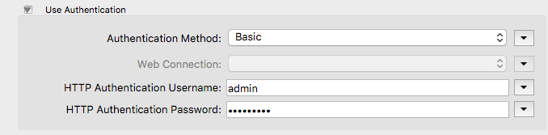

 **3) Attach an Inspector**

Attach an Inspector to the HTTPCaller. Then run the workspace. Once the workspace has run the FME Data Inspector will appear.

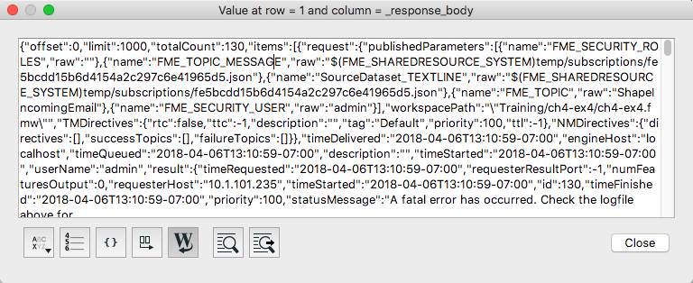

We need to parse the response to get the information we want into attributes we can use. For this exercise, we are going to keep the id, timeSubmitted, and status. In the JSON returned from the FME Server. Find the id, timeSubmitted, and status.  

 **4) Delete the Inspector**

Now, that we know the attributes that we would like to keep and understand where they are stored in the JSON returned from the FME Server we can delete the Inspector. Select the Inspector and hit the delete button on the keyboard.  

 **5) Add a JSONFragmenter**

We are going to use the JSONFragmenter to parse the needed attributes into the needed attributes.

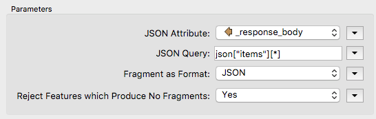

The JSON Attribute is the response body which is produced from the previous call. If you wish to completed a similar in this FME Workspace observe where the attributes are stored in the JSON.

JSON queries should start with json and then the category where the attributes are stored. This may take some trial and error at first.  

For the JSON Query, we want to find all the responses in the items category therefore, we use this statement json\["items"\]\[\*\]

Next, we need to set up the Flattening Parameters in the JSONFragmenter.

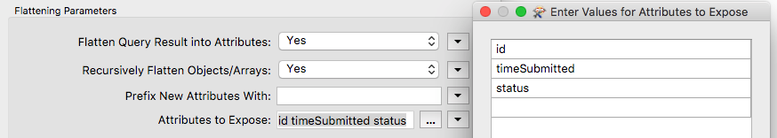

Here, we enter the attributes we would like to keep from the query. You should keep the id, timeSubmitted, and status.

 **6) Add an Attribute Keeper**

Next, add the AttributeKeeper. Under parameters and Attributes to Keep: write timeSubmitted, id, status.

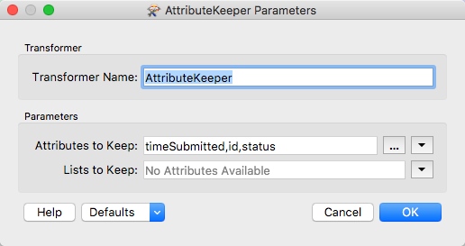

---

#### Format Dates

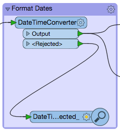

 **7) Add the DateTimeConverter**

Use the DateTimeConverter to format the dates into the %Y-%m-%d format. The datetime format that is returned from the FME Server can be difficult to read. By modifying the Output Format we can make our chart more visually appealing.

The parameters should be filled in as below:

**Datetime Attributes:** timeSubmitted
 
**Input Format:** Auto detect FME and ISO formats
 
**Output Format:** %Y-%m-%d
 
**Repair Overflow:** No

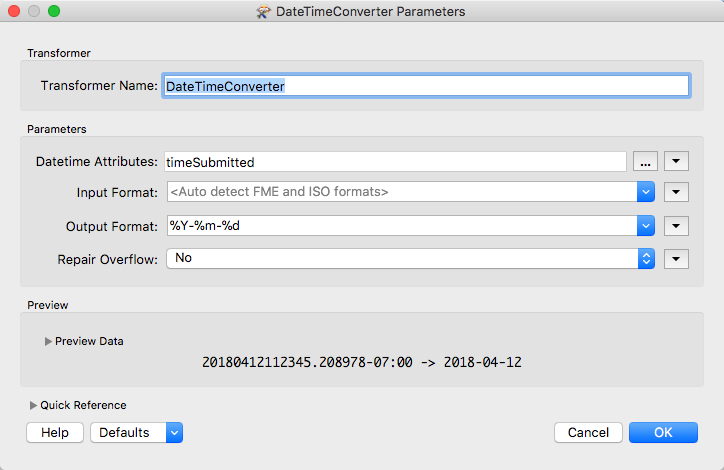

---

#### Create a Table with the Job History Results

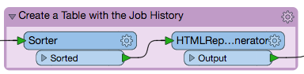

If we compiled a table with the result currently, it would create a table however, it would not have an order so we use the Sorter transformer.

 **8) Add the Sorter transformer**

The Sorter transformer will be connected to the DateTimeConverter. Under the Sort By section list the following parameters:

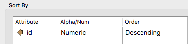

 **9) Add the HTMLReportGenerator**

In the HTML Report Generator, we can add custom HTML or a table with information gained from the FMEServer.  

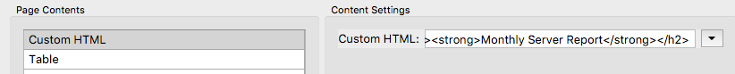

 **10) Add Custom HTML to the HTMLReportGenerator**

First, we want to add Custom HTML to specify the header on our HTML file.

    <h2><strong>Monthly Server Report</strong></h2>

If you had an introduction or any formatting, you could place it here as well.

 **11) Add a table to the HTMLReportGenerator**

Next, under page contents, add a Table. Specify the column contents and headings the table will use.

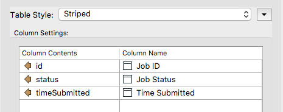

To view the table before it is created, click the Preview in Browser button.

---

#### Create a Bar Chart with Jobs by Date

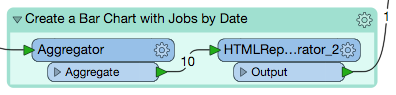

 **12) Add the Aggregator transformer**

Add the Aggregator transformer and attach it to the DateTimeConverter.

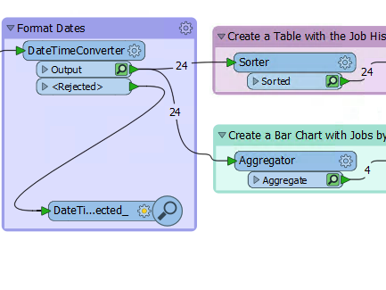

We need to aggregate all jobs by date to create the bar chart so we need the Aggregator.

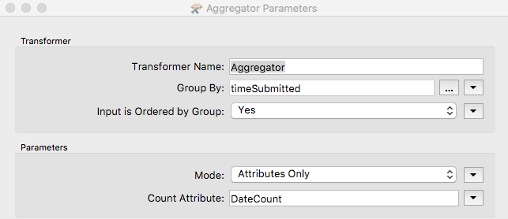

Here, we are grouping the results by timeSubmitted which is the date the attributes were submitted. Then under Count Attribute, we create a new Attribute named DateCount.

 **13) Attach the HTMLReportGenerator**

Next, we attach another HTMLReportGenerator. The parameters are set up below:

---

#### Format the Layout and Write to HTML

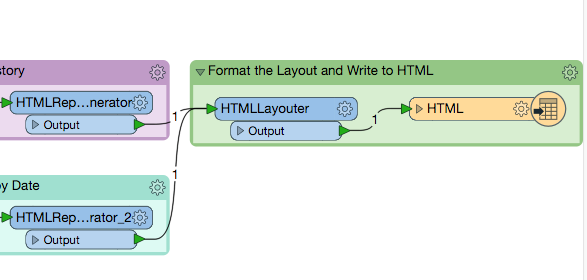

 **14) Add the HTMLLayouter**

Attach both the HTMLReportGenerators to the HTMLLayouter.

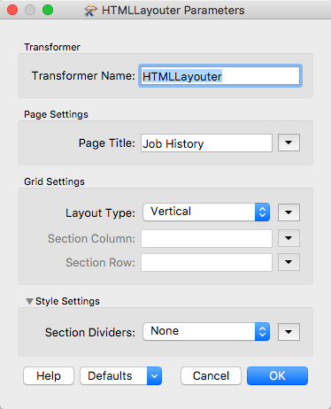

 **15) Add an HTML Writer**

Finally, add an HTML Writer.

 **16) View the results!**

Run the workspace and view the results.

---

<!--Exercise Congratulations Section-->

<table style="border-spacing: 0px">
<tr>
<td style="vertical-align:middle;background-color:darkorange;border: 2px solid darkorange">
<i class="fa fa-thumbs-o-up fa-lg fa-pull-left fa-fw" style="color:white;padding-right: 12px;vertical-align:text-top"></i>
CONGRATULATIONS
</td>
</tr>

<tr>
<td style="border: 1px solid darkorange">

By completing this exercise you have learned how to:
 
<ul><li>Use a workspace to call the FME Server REST API to retrieve jobs</li>
<li>Review the response from the FME Server </li>
<li>Use the HTMLReportGenerator to create a report of the results </li>

</td>
</tr>
</table>
