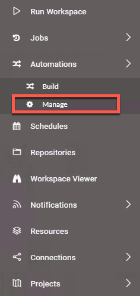
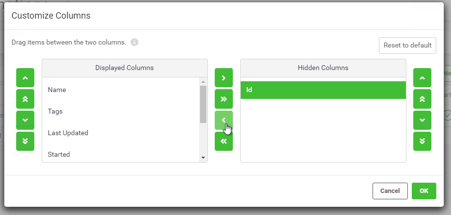
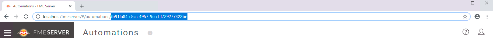
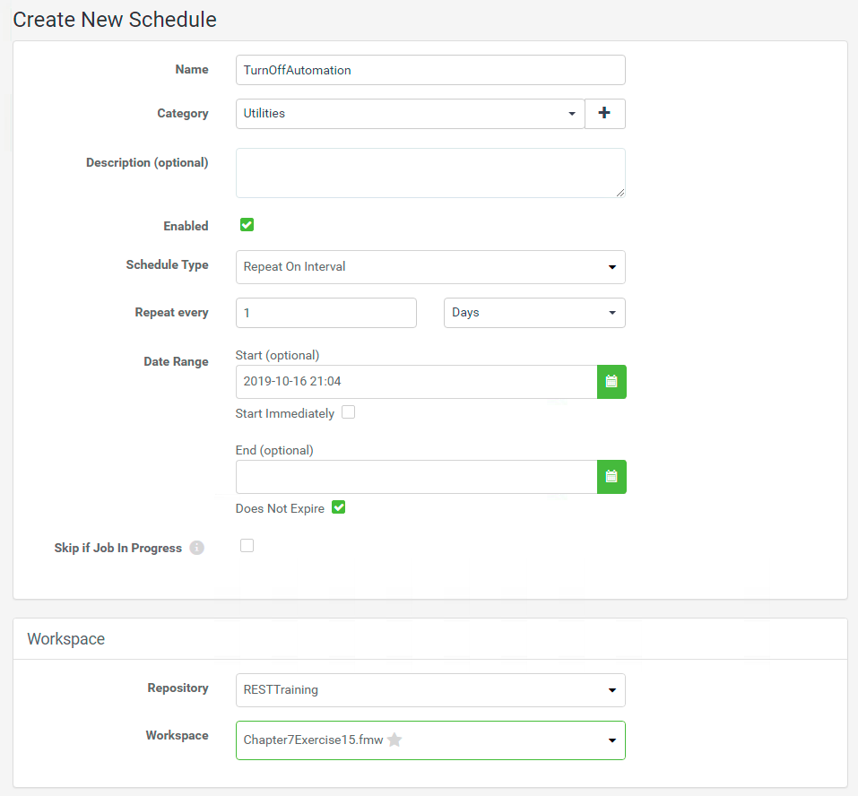
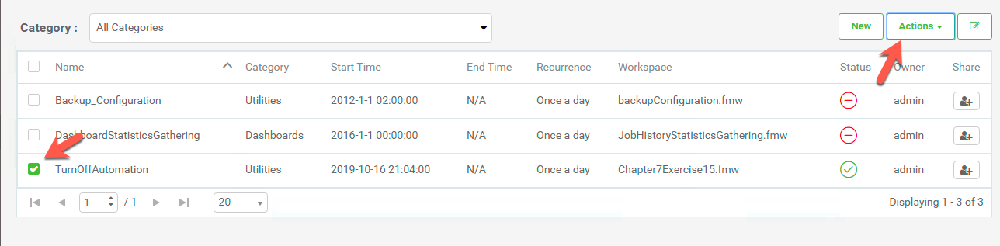
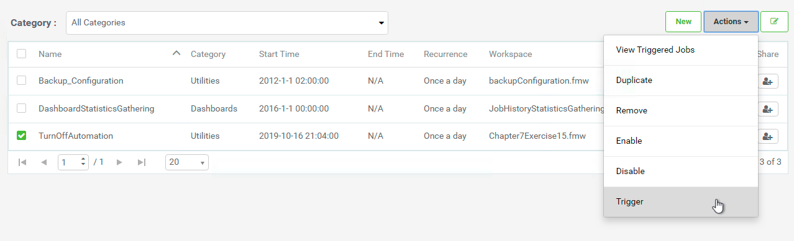

<table style="border-spacing: 0px;border-collapse: collapse;font-family:serif">
<tr>
<td width=25% style="vertical-align:middle;background-color:darkorange;border: 2px solid darkorange">
<i class="fa fa-cogs fa-lg fa-pull-left fa-fw" style="color:white;padding-right: 12px;vertical-align:text-top"></i>
Exercise 15
</td>
<td style="border: 2px solid darkorange;background-color:darkorange;color:white">
 Scheduling Automations with the FME Server REST API
</td>
</tr>

<tr>
<td style="border: 1px solid darkorange; font-weight: bold">Data</td>
<td style="border: 1px solid darkorange">None</td>
</tr>

<tr>
<td style="border: 1px solid darkorange; font-weight: bold">Overall Goal</td>
<td style="border: 1px solid darkorange"> To use the FME Server REST API to disable and enable an automation </td>
</tr>

<tr>
<td style="border: 1px solid darkorange; font-weight: bold">Demonstrates</td>
<td style="border: 1px solid darkorange"> How to use the automations calls in the FME Server REST API to schedule an automation </td>
</tr>
<tr>
<td style="border: 1px solid darkorange; font-weight: bold">Project</td>
<td style="border: 1px solid darkorange"> C:\FMEData2019\Resources\RESTAPI\Chapter7Exercise15.Complete</td>
</tr>

</table>
 
<table style="border-spacing: 0px">
<tr>
<td style="vertical-align:middle;background-color:darkorange;border: 2px solid darkorange">
<i class="fa fa-bolt fa-lg fa-pull-left fa-fw" style="color:white;padding-right: 12px;vertical-align:text-top"></i>
NEW
</td>
</tr>

<tr>
<td style="border: 1px solid darkorange">

Automations are new to FME 2019.0! Automations are a way to automate data-driven workflows using FME Server. This includes notifications, but also scheduled tasks and system events. System Events are notifications about administrative actions that take place on the Server. This course will not go into much detail on creating automations. Automations can be enabled or disabled via the REST API. For more information on Automations please read the Safe blog on <a href="https://www.safe.com/blog/2019/02/fme-server-automations-evangelist185/">Automations</a> and the FME Community Tutorial <a href="https://knowledge.safe.com/articles/87453/getting-started-with-automations.html">Getting Started with Automations.</a>

</td>
</tr>
</table>

 
Automations allow a user to set up workflows in response to events. These events can be internal, such as a file being created in FME Server, or an email being sent to FME Server. These events can also be external, such as a file created in Dropbox or an Amazon S3 bucket. An example automation would be a file arriving in a directory accessible by FME Server, this would trigger a workspace to run, and could send off an email once the workspace has completed successfully.
 

However, you may not want all automations to be enabled at all times. You could potentially have different automations active depending on the time of day. For instance, let's say you have automation that is enabled during the day time. This automation runs a workspace that is located in a repository that only has access to one engine due to a job queue. However, at night when FME Server is less busy, you may want to run the same workspace in a repository that has access to all engines. You could create two automations (one for the day and the other for the night) and using the REST API you could create a workspace to enable or disable them. This workspace could be run on a schedule to turn on or off your automations.

This exercise will go through the process of creating a workspace to disable an automation and setting that up on a schedule.

 **1) Log into FME Server**

Log into FME Server using the admin account.

**Username:** admin

**Password:** admin

 **2) Go to the Projects page on FME Server**

An FME Server Project contains components of FME Server that can be shared with other users. The project that we are importing contains an Automation, a Workspace, and a Resource folder.

<!--Tip Section-->

<table style="border-spacing: 0px">
<tr>
<td style="vertical-align:middle;background-color:darkorange;border: 2px solid darkorange">
<i class="fa fa-info-circle fa-lg fa-pull-left fa-fw" style="color:white;padding-right: 12px;vertical-align:text-top"></i>
TIP
</td>
</tr>

<tr>
<td style="border: 1px solid darkorange">

This project can be found in the FME Community Tutorial-
<a href="https://knowledge.safe.com/articles/91589/run-a-workspace-when-data-arrives-in-a-directory.html">Run a Workspace When Data Arrives in a Directory.</a> If you would like to create this automation for yourself, you can follow the tutorial.

</a>

</td>
</tr>
</table>

To import the project go to the left hand panel of your FME Server and select Projects.   

 **3) Import a new Project into FME Server**

Select Import to import a new project into your FME Server. Click the Upload File button. Then, navigate to:

    C:\FMEData2019\Resources\RESTAPI\Chapter7Exercise15

Select the fsproject file. Then, click Import to import the project.

 **4) Select the Automation Imported**

To get to the Automations page look at the left hand panel of FME Server. Select Automations and then, click Manage.

Select the Directory Watch Exercise to view the automation.

 **5) Explore the Automation**

Currently, the automation is running so you cannot edit it. However, you can select the various icons to see what they are doing.

Select the Directory Watch icon to view its details. The Directory watch is waiting for a file to be imported to FME Server in the DirWatch Tutorial folder (this folder was created when the project was imported). It is watching for files created and will poll the folder every minute.

Next, click the Filter icon. In the Filter Details, it will filter out the file path and look for files with only the .shp extension.

Next, click on the shpCopier.fmw icon. This workspace copies shapefiles to a new location. The source shapefile is found through the filepath. The output will be sent to a folder called Output Copies which was created when the project was imported.

 **6) Expose the Automation ID**

The REST Call requires the Automation Id but by default it is hidden in the FME Server UI. To find the Id go to the Automations Manage page. In the top right hand corner of the page click Customize Columns.

This will open the Customize Columns page. Find the Hidden Columns section and select Id and the arrow pointing to the left. This will move it over to the Displayed Columns.

Then, select OK.

This will expose the Id which is used in the REST Call.

If you wish to copy the Id, click on the Automation again and it will be exposed in the Automation URL.

Copy the Id and paste it into Notepad.

 **7) Open FME Desktop**

Open FME Desktop and select New to create a new workspace.

 **8) Add a Creator to the Workbench**

Add a Creator to the Workbench by selecting the Canvas and typing Creator.

 **9) Add an HTTPCaller to the Workbench**  

Add an HTTPCaller to the Workbench and attach it to the Creator.

The automation will be turned off with the following call. If in the Upload Body the value=false, this will disable the automation. If value=true this will enable the automation.

Fill out the following parameters:

<table class="tg">
  <tr>
    <th class="tg-h8nb">PUT</th>
    <th class="tg-lto5">http://&lt;yourServerHost&#62;/fmerest/v3/automations/workflows/&lt;yourAutomationId&#62;/enabled</th>
  </tr>
</table>

*Copy and paste your automation Id in the URL where it says &lt;yourAutomationId&#62;*

**Headers**
<table>
<tr>
<td style="border: 1px solid black; font-weight: bold">Name</td>
<td style="border: 1px solid black; font-weight: bold">Value</td>
</tr>

<tr>
<td style="border: 1px solid black">Accept</td>
<td style="border: 1px solid black">application/json</td>
</tr>

</table>

**Upload Body:** value=false

**Content Type:** URL Encoded (application/x-www-form-urlencoded)

**Use Authentication:** Checked

**Authentication Method:** Basic

**HTTP Authentication Username:** admin

**HTTP Authentication Password:** admin

Select OK.

 **10) Publish to FME Server**

*If you have not set up the Server Connection the instructions can be found [here](https://s3.amazonaws.com/gitbook/Server-REST-API-2019/FMESERVER_RESTAPI4Workspaces/4.4.TransactData.html)*

First, click the publish to FME Server button. Then, select the FME Server Connection created previously and click Next. Now, set the Repository name to RESTTraining. Set the Workspace name to Chapter7Exercise15.fmw and click Next. Finally, select the Job Submitter Service and publish the Workspace.

 **11) Go to the Schedules page in FME Server**

Go back to FME Server and find the Schedules in the left hand panel. Click New to create a New Schedule.

 **12) Create a New Schedule**

**Name:** TurnOffAutomation

**Category:** Utilities

**Enabled:** Checked

**Schedule Type:** Repeat on Interval

**Repeat Every:** 1 Days

**Start:** Select the current day in a few hours

**Repository:** RESTTraining

**Workspace** Chapter7Exercise15.fmw

Click OK.

 **13) Trigger TurnOffAutomation**

Select TurnOffAutomation and select Trigger. Even though the Schedule is not set to run until a few hours in the future. Selecting Trigger will trigger the Automation to run outside of the Scheduled time. This is a great feature for testing purposes.

To find the Trigger action. Click the Actions dropdown and then select Trigger.

 **14) Check the Automation**

Now, go back to the automation Directory Watch Exercise. In a few moments when the job has completed, refresh the page and the automation should be disabled.  

You could repeat these steps and have another workspace to enable the same automation in the morning.

 

---
<!--Exercise Congratulations Section-->

<table style="border-spacing: 0px">
<tr>
<td style="vertical-align:middle;background-color:darkorange;border: 2px solid darkorange">
<i class="fa fa-thumbs-o-up fa-lg fa-pull-left fa-fw" style="color:white;padding-right: 12px;vertical-align:text-top"></i>
CONGRATULATIONS
</td>
</tr>

<tr>
<td style="border: 1px solid darkorange">

By completing this exercise you have learned how to:
 
<ul><li>Use a workspace to call the FME Server REST API to disable an automation</li>
<li>Import a project into FME Server </li>
<li>Find the automation Id </li>
<li>Set up a schedule to run a workspace </li>

</td>
</tr>
</table>
