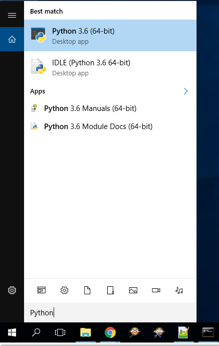
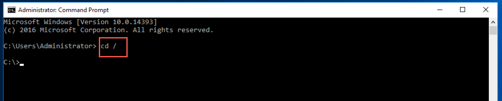
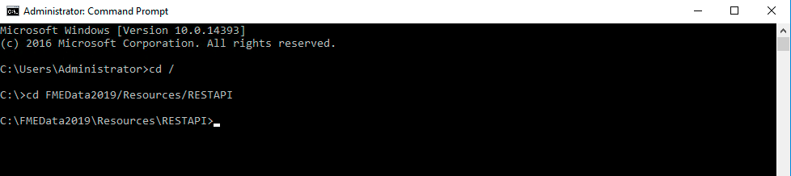
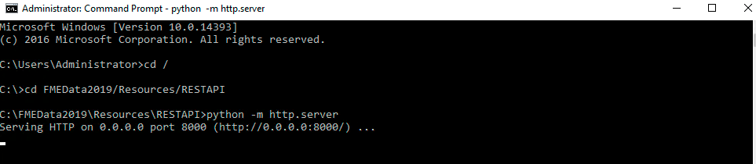
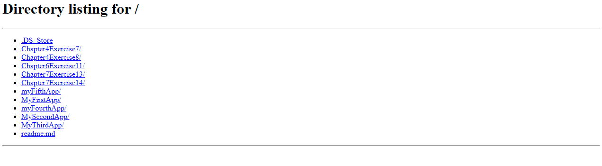
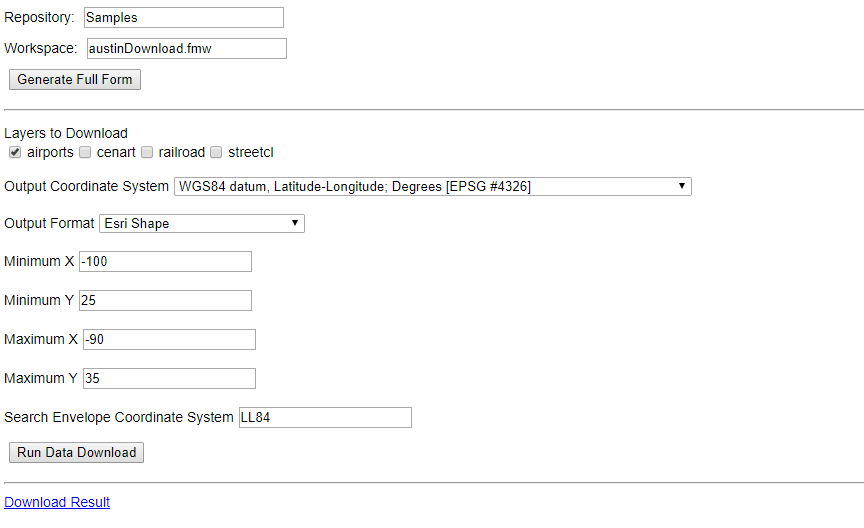

<table style="border-spacing: 0px;border-collapse: collapse;font-family:serif">
<tr>
<td width=25% style="vertical-align:middle;background-color:darkorange;border: 2px solid darkorange">
<i class="fa fa-cogs fa-lg fa-pull-left fa-fw" style="color:white;padding-right: 12px;vertical-align:text-top"></i>
Exercise 16
</td>
<td style="border: 2px solid darkorange;background-color:darkorange;color:white">
 Setting Up the Web Directory 
</td>
</tr>

<tr>
<td style="border: 1px solid darkorange; font-weight: bold">Data</td>
<td style="border: 1px solid darkorange">None</td>
</tr>

<tr>
<td style="border: 1px solid darkorange; font-weight: bold">Overall Goal</td>
<td style="border: 1px solid darkorange"> To properly configure a desktop to host web applications locally </td>
</tr>

<tr>
<td style="border: 1px solid darkorange; font-weight: bold">Demonstrates</td>
<td style="border: 1px solid darkorange">How to use Python to properly set up a local server </td>
</tr>

</table>

When testing web pages, we need to create a simple local HTTP server to access its functionality. This simple server will be closed once the computer is shut down. These are the specific instructions if you are using a training computer. The http server is a command in Python 3.x. Additionally, you may wish to navigate to a different directory based on where your training data is stored.

**Optional Step**

If you are not using a training computer you may have to download [Python](https://www.python.org/). To check if you have Python installed on your computer use the search function and search for Python.

If Python3.x is installed on your computer proceed to Step 1.

 **1) Open the Command Prompt**

On the training computer the Command Prompt can be found by clicking the Start Menu, then finding the Most used category.

 **2) In the command prompt type:**

        cd /

This directs you to the C drive.  

 **3) In the command prompt type:**

      cd FMEData2019/Resources/RESTAPI

 **4) In the command prompt type:**

    python -m http.server

This is the command to start the server which will be hosted locally.

 **5) Open up a browser and type in: [http://localhost:8000/](http://localhost:8000/)**

 **6) Navigate to My First App**

Select myFirstApp. Then, select myFirstApp.html. This is a fully functioning web application that we will be creating in the next exercise.

---

<!--Exercise Congratulations Section-->

<table style="border-spacing: 0px">
<tr>
<td style="vertical-align:middle;background-color:darkorange;border: 2px solid darkorange">
<i class="fa fa-thumbs-o-up fa-lg fa-pull-left fa-fw" style="color:white;padding-right: 12px;vertical-align:text-top"></i>
CONGRATULATIONS
</td>
</tr>

<tr>
<td style="border: 1px solid darkorange">

By completing this exercise you have learned how to:
 
<ul><li>Use Python to create a simple server</li>
</ul>

</td>
</tr>
</table>
