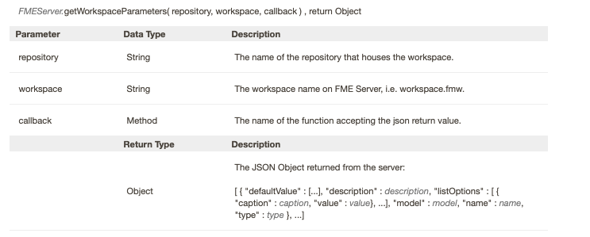
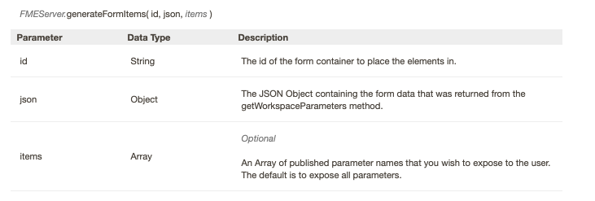

### 9.1 Creating a Dynamically Populated Form

FME Server has a JavaScript API that allows a user to access their
FME Server when developing a web application. In this exercise, you will
create a basic form, in which you will select a workspace to run. Once
you hit enter, the form will appear with the parameters populated. Once
you hit return, there will be a link to download the requested file.

This application will use the following FME Server JavaScript API functions:

**1) getWorkspaceParameters**

This function is used to find all published parameters in the workspace.

**2) generateFormItems**

This function can take the published parameters found in getWorkspaceParameters and creates a form with the published parameters.  

**3) runDataDownload**

This function takes all of the input from the parameters collected by the form and runs a workspace with the parameters set up the user. This function will return a JSON Object. This JSON object contains a URL with a link so the user can download the requested data.  
