<table style="border-spacing: 0px;border-collapse: collapse;font-family:serif">
<tr>
<td width=25% style="vertical-align:middle;background-color:darkorange;border: 2px solid darkorange">
<i class="fa fa-cogs fa-lg fa-pull-left fa-fw" style="color:white;padding-right: 12px;vertical-align:text-top"></i>
<span style="color:white;font-size:x-large;font-weight: bold">Exercise 11</span>
</td>
<td style="border: 2pxJavaScriptkorange;background-color:darkorange;color:white">
<span style="color:white;font-size:x-large;font-weight: bold"> Dynamically Generate a Form Using the REST API </span>
</td>
</tr>

<tr>
<td style="border: 1px solid darkorange; font-weight: bold">Data</td>
<td style="border: 1px solid darkorange">None</td>
</tr>

<tr>
<td style="border: 1px solid darkorange; font-weight: bold">Overall Goal</td>
<td style="border: 1px solid darkorange"> To display the capabilities of the FME Server JavaScript API. This exercise allows you to dynamically generate a form based on the parameters in a  workspace and have a user fill in the parameters and run the workspace.  </td>
</tr>

<tr>
<td style="border: 1px solid darkorange; font-weight: bold">Demonstrates</td>
<td style="border: 1px solid darkorange"> How to use getWorkspaceParameters, generateFormItems, and runDataDownload functions. </td>
</tr>


</table>

In this next exercise, we will dynamically create a form from a workspace that the end user will select. Once, the user has selected a workspace, a form will be generated with the user parameters from the workspace. The user can then select the parameters they'd like to use and run the workspace. Once, the workspace has run a link will appear on the page with a download link for the user. This code could be used if you wanted to create an application for clients to access data without going through the FME Server UI.


<br>**1) Open the myFirstAppStart.html**

Find the code snippet below and click Edit in JSFiddle. The file contains an almost complete web application but is missing some key information. Follow the steps below to get this app up and running. In the HTML document, any information that requires updating is indicated by // (the HTML comment symbol) or &lt;!----> (the JavaScript comment symbol).

<script async src="//jsfiddle.net/siennaemery/c5n9g70r/18/embed/html,js,result/"></script>

<br>**2) Add the FME Server JavaScript API Link**

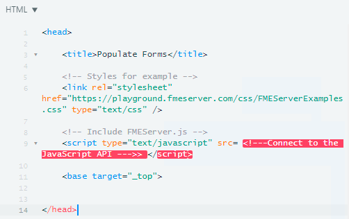

Please note that the screenshots for this course were taken in light mode. If you would like to enable light mode, go to the top right corner of the JSFiddle. Find Settings and disable Dark theme.

In the HTML section of the page, we link to the external stylesheet and  
the FME Server JavaScript API.

On line 9 delete the comment ```<!---Connect to the JavaScript API ---> ```

and paste ```"https://api.fmeserver.com/js/v1.2/FMEServer.js" ```


The link to the [FME Server JavaScript API](https://api.fmeserver.com/js/v1.2/FMEServer.js) must be included in all applications that use the FME Server JavaScript API. It's a great resource to use if you would like to learn more about the FME Server JavaScript API because it lists all the available functions.  

<script async src="//jsfiddle.net/siennaemery/4L7pem2w/12/embed/html,js,result/"></script>

In steps 3 and 4, we will build the body of the HTML. We need to create a form that will display the initial information needed to locate the workspace.

<br>**3) Update the Example Form**

Scroll down to line 19 and find the exampleForm.
<br>
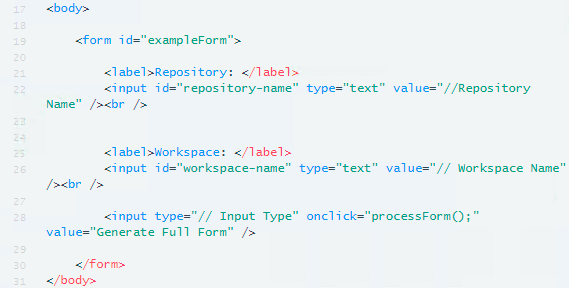


The form is indicated by the tag &lt;form&#62;. We have set the id of the form to "exampleForm". If we needed the JavaScript to act upon the form we would refer to it by the id.


In the form, we will create a label and an input. The label is entitled Repository: which will appear on the page. Then as with the form, we need to give the input an id so it can be called upon later. The input type is text. **We need to edit the value on line 22 to be "Samples".**

We will repeat the same input process for the workspace. **The value should be updated to "austinDownload.fmw" on line 26.**


In the next line of code before the end of the form we need to create an input type for the next section of code. Underneath the two labels we would like to display a button.


**Delete "// Input Type" and then replace it with "button" on line 28.**


Having this button will activate the "processForm();" function. The button will have the value or label of Generate Full Form.

<script async src="//jsfiddle.net/siennaemery/n36dzLav/13/embed/html,js,result/"></script>

<br>**4) Update the Form Id**

After the first form has been activated, we are going to use this blank form to hold the parameters dynamically generated by the following JavaScript.

**Locate line 33, and replace "//Form id" with "output-form".**

<script async src="//jsfiddle.net/siennaemery/6x2adzm9/8/embed/html,js,result/"></script>


If we click Run and look at the Results pane now, it would display a form. However, the form would not be functional. We can create a website using HTML code, however the website will not be able to do much without any JavaScript. JavaScript is needed to have a functional and interactive website.


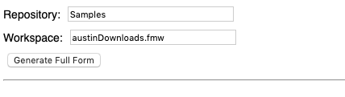


<br>**5) Update the FME Server URL and Token**

Switch to the JavaScript tab. On lines 4 and 5 we initialize the Server.

If your FME Server is externally facing you can use your Server hostname in this section.  The FME training machines are externally facing so will be ok for this exercise. If your web server (for the web applications) and FME Server are within the same domain or same machine you can use the internal IP address or hostname to access FME Server.

However, please note that Google Maps and Esri functionality will not be available if FME Server is not accessible externally.

If you are not using a training machine and do not know your IP address, this will be the first result returned if you Google "my IP address".


Use this information to **update the server and token section to your own. If you are on a training machine please use https://localhost:8443**

In [Chapter 1](https://s3.amazonaws.com/gitbook/Server-REST-API-2019/FMESERVER_RESTAPI1Overview/1.5.UserCreation.html) we created a token with the correct permissions for all exercises in the course. However, if we were hosting these exercises publicly, it would be recommended to create a token for each application and limit the permissions of the token as much as possible.

<script async src="//jsfiddle.net/siennaemery/e038pan6/6/embed/js,html,result/"></script>

<br>**6) Update the processForm function**

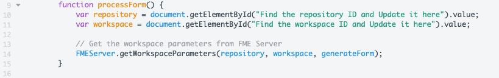

Next, we can view the processForm function this is located on line number 9. This function uses the FME Server JavaScript API to get the Workspace Parameters using the repository and workspace values entered by the user. We use the function getWorkspaceParameters to get the workspace parameters created in the call.


This function requires three parameters, the repository, workspace, and callback.

The repository and workspace will be entered by the user. To get the values entered by the user we need to create a variable and get the element by the id we gave it earlier.


We need to **change "Find the repository ID and update it here" to "repository-name".**

We also need to **update "Find the workspace ID and Update it here" to "workspace-name".**

<script async src="//jsfiddle.net/siennaemery/bqx8m61c/9/embed/js,html,result/"></script>

<br>**7) Modify the generateForm function to produce a form**

Go to the generateForm function, this is located on line 17. The next function is the callback function. A callback function is specified in the previous function. It takes the json returned from FME Server and uses it.

In our case, we have the processForm function and which gets the workspace parameters. With this information we can use the generateFormItems function to create a form for the user to fill in and submit.  

Currently, the generateFormItems parameters are empty so we will need to fill them in.

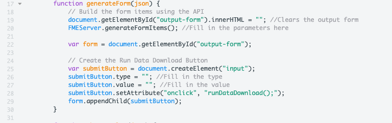

The first part of the code will clear the output form if it previously had a value. Then, the generateFormItems function is called but currently there are no parameters in the function so it will not work.

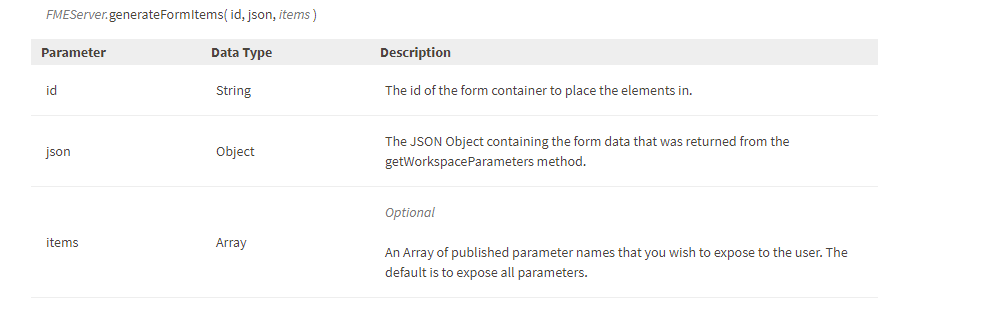

The id is the form container to put the elements into. In our case this is the blank form called "output-form". The json is the object containing the form data and in this case, ours is just json.

On line 20 find FMEServer.generateFormItems(); and update it to:

```JavaScript
FMEServer.generateFormItems("output-form", json);
```

The correct parameters should look like this.

<iframe width="100%" height="300" src="//jsfiddle.net/siennaemery/8s3uz5L2/6/embedded/js,html,result/" allowfullscreen="allowfullscreen" allowpaymentrequest frameborder="0"></iframe>


<br>**8) Modify the generateForm function to create a new button**

In the next section of the code we are creating a button (beginning on line 24). This button will be used to activate the next function to send the job to FME Server.

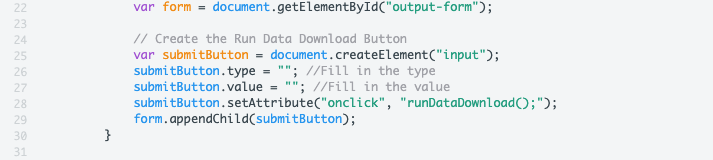

In the first line of code in this section we are creating a variable with the output form in it. Then, we are creating another variable and creating an input element.

Next, we need to specify what the input will be. In our case, it should be a button. Line 26 should now read:

    submitButton.type = "button"; // Fill in the type

Next, we can specify what the value should be the value of the button is what text is displayed on the button. This should be descriptive of what the user should do. Line 27 should now read:

    submitButton.value = "Run Data Download"; // Fill in the value

<iframe width="100%" height="300" src="//jsfiddle.net/siennaemery/r7zdk1sg/10/embedded/js,html,result/" allowfullscreen="allowfullscreen" allowpaymentrequest frameborder="0"></iframe>


<br>**9) Review the runDataDownload function**

We are now going to skip the showResults function for now and go to RunDataDownload beginning on line 44.

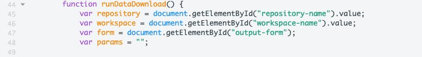

In the beginning of the function we are creating variables for the repository, workspace, and form. We are also creating a variable for the params. This is currently a string with nothing inside.

The next part of the function is a loop. The purpose of the loop is it find all the parameters set by the user and to format them in a way that FME will use in the runDataDownload Function.

Any workspace specific parameter values must be written as a string with this format:
name1=value1&name2=value2 etc\...

We are going to examine the for loop (line 50). In the next step

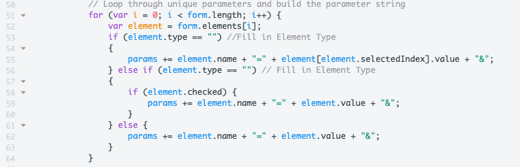

In the beginning of the for loop, we are specifying that the loop will begin at the first form element and continue until the form is completed. The variable element is created with the form elements used in the output form.

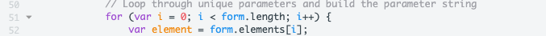

Now save the file.

<br>**10) Find the element types used in the output form**

Next, we have to fill in the various element types in the form. The element type is the type of form element used, this can include a drop down list, check list or a text box. To find what elements exist within our form Run. Then, go to the Results panel in the bottom right hand corner of the screen.


Once at the page right click and select inspect.


This will open up the Google Chrome Developer Tools and allow us to investigate the components on the page.

Next, click the Generate Full Form button on the page.


Once we have selected that button we can then start inspecting components on the page.

We are going to go through the form and right click on the elements on the form and inspect them.

In the Layers to Download form click one of the boxes and select inspect.


Once, we inspect on element on the page. It will highlight in the element in the developer tools. Here, we should see the input type is checkbox.

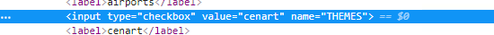

Next, inspect the drop down menu beside Output Coordinate System.


Here, we can see the element type is select.

Finally, inspect the text box next to Minimum X.


Here, we can see the element type is input.

<br>**11) Update the runDataDownload function**

Go to line 88 and review the for loop.


In line 91 we see the first if statement. This statement should say, if the element type is equal to select. Then add the element name and the selected value to the params variable. At the end of the params variable we are adding an ampersand or & so we can add another parameter.

```JavaScript
if (element.type == "select")//Fill in Element Type
      {
        params += element.name + "=" + element[element.selectedIndex].value + "&";
      }
```

The element type should be select.

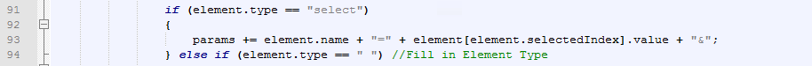

Next, we need to fill in the element.type in the else if statement.

```JavaScript
else if (element.type == "checkbox") //Fill in Element Type
		{
      if (element.checked) {
          params += element.name + "=" + element.value + "&";
          }
        } else
```

If the element is checked it is added to the params string. The element.type should equal checkbox.

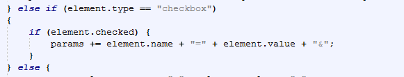

The last part of this loop is for every other element type. This should be the input box we inspected in the previous step.


After the parameters have been compiled, there will be an additional ampersand  
\(&\) at the end of the string. This is removed by the following  
statement,


Finally, we can use the runDataDownload function.

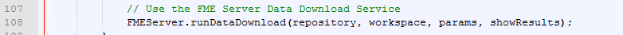


The final parameter in this function is the callback we named showResults. A callback is a function that needs another function to occur first before it can be used. In this case, we need the runDataDownload function to happen before showResults, the information created from runDataDownload will be passed to showResults. showResults is the function where the download will be displayed.

<br>**12) Review the JSON produced by the runDataDownload function**

Next, we need to find the function above the runDataDownload function. This is showResults function and should be found on line 70.

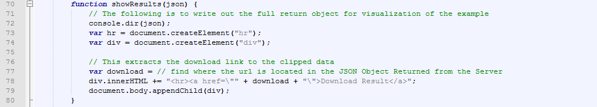

The first line of the function uses console.dir which is a built in method that will print the JSON object to the console. We will use this to find what was produced from the last function.

Save the file. Then, go to http://localhost:8000/MyFirstApp/myFirstAppStart.html

Click on GenerateFullForm. Then, click the Run Data Download button.

The Download Result URL will not work because we will fill in the URL after. We are going to find the JSON produced by the last function to find where the URL is stored.

To find the JSON, right click on the page and select Inspect. Then, in the developer tools find the Console tab.

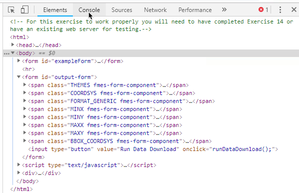

In the Console, we can see the JSON and the structure of the response returned. The URL is nested json, then the serviceResponse.


<br>**13) Update the showResults function with the URL location**

In the showResults function, on line 77 there is an empty variable for the download link.


In the previous step we found where the download link is stored. This will be entered into the variable. The download variable should be equal to json.serviceResponse.url.

```JavaScript
var download = json.serviceResponse.url;
```


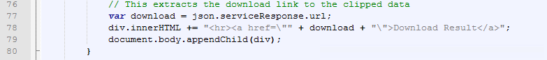


<br>**14) Test the final product**

Test the app again, and it should be completed!

If you missed a step, the full code can be found in the FMEData2019 folder under myFirstApp.html

The results should look like this:

First, we will receive a page where you can enter in the workspace and repository of the job we would like to run:

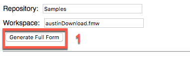


Then, we can enter in the parameters of the job we would like to complete.

Select cenart and streetcl and click Run Data Download.


After this, you will receive a link to download the resulting files. Please be patient because this may require a minute to complete depending on FME Server.


---

<!--Exercise Congratulations Section-->

<table style="border-spacing: 0px">
<tr>
<td style="vertical-align:middle;background-color:darkorange;border: 2px solid darkorange">
<i class="fa fa-thumbs-o-up fa-lg fa-pull-left fa-fw" style="color:white;padding-right: 12px;vertical-align:text-top"></i>
<span style="color:white;font-size:x-large;font-weight: bold;font-family:serif">CONGRATULATIONS</span>
</td>
</tr>

<tr>
<td style="border: 1px solid darkorange">
<span style="font-family:serif; font-style:italic; font-size:larger">
By completing this exercise you have learned how to:
<br>
<ul><li>Use the FME REST API JavaScript library to create an application</li>
<li>Use the getWorkspaceParameters, generateFormItems, and runDataDownload functions </li>


</span>
</td>
</tr>
</table>
