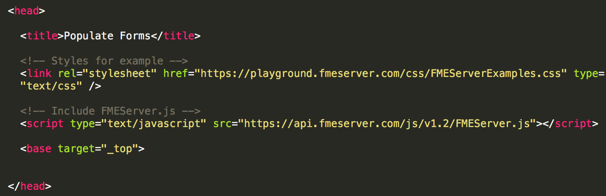
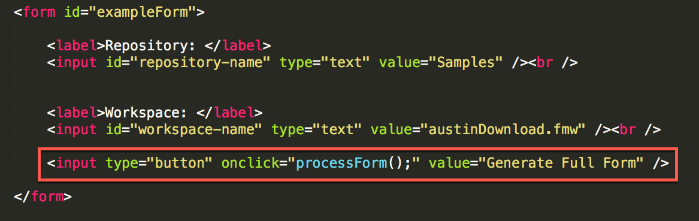
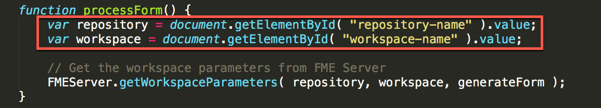
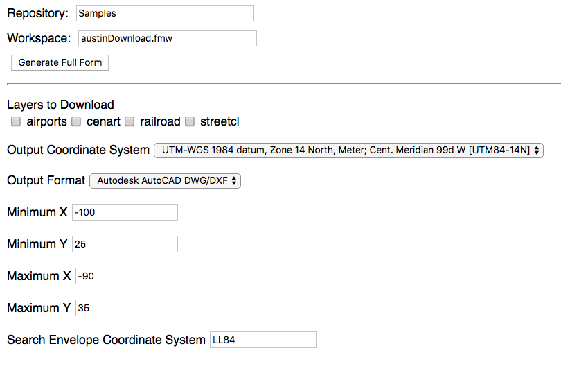
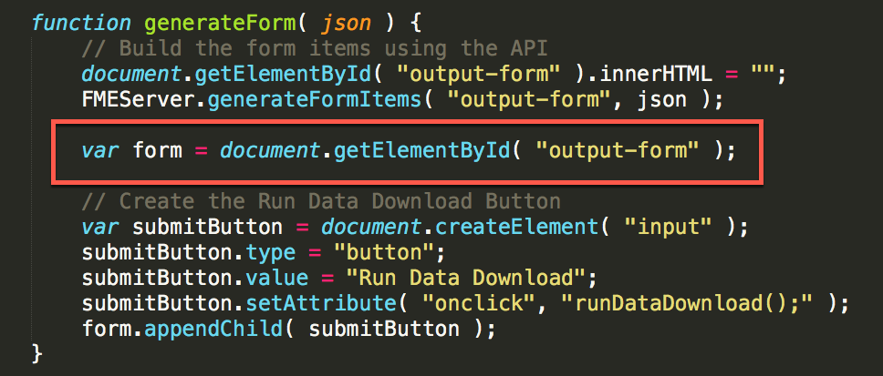
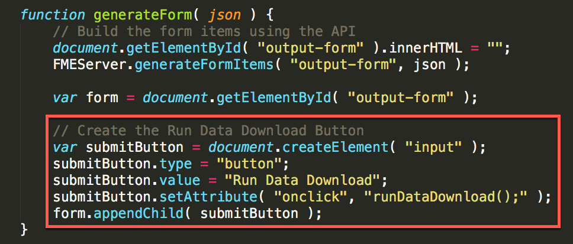

<table style="border-spacing: 0px;border-collapse: collapse;font-family:serif">
<tr>
<td width=25% style="vertical-align:middle;background-color:darkorange;border: 2px solid darkorange">
<i class="fa fa-cogs fa-lg fa-pull-left fa-fw" style="color:white;padding-right: 12px;vertical-align:text-top"></i>
<span style="color:white;font-size:x-large;font-weight: bold">Exercise 15</span>
</td>
<td style="border: 2pxJavaScriptkorange;background-color:darkorange;color:white">
<span style="color:white;font-size:x-large;font-weight: bold"> Dynamically Generate a Form Using the REST API </span>
</td>
</tr>

<tr>
<td style="border: 1px solid darkorange; font-weight: bold">Data</td>
<td style="border: 1px solid darkorange">None</td>
</tr>

<tr>
<td style="border: 1px solid darkorange; font-weight: bold">Overall Goal</td>
<td style="border: 1px solid darkorange"> To display the capabilities of the FME Server JavaScript API. This exercise allows you to dynamically generate a form based on the parameters in a  workspace and have a user fill in the parameters and run the workspace.  </td>
</tr>

<tr>
<td style="border: 1px solid darkorange; font-weight: bold">Demonstrates</td>
<td style="border: 1px solid darkorange"> How to use getWorkspaceParameters, generateFormItems, and runDataDownload functions. </td>
</tr>

<tr>
<td style="border: 1px solid darkorange; font-weight: bold">Completed HTML </td>
<td style="border: 1px solid darkorange">C:\FMEData2018\Resources\RESTAPI\myFirstApp\myFirstApp.html  </td>
</tr>

</table>

In this next exercise we will create a form that automatically updates parameters based on what the user has selected. This could be used if you wanted to create an application for clients to access data without going through the FME Server.

<!--Warning Section-->

<table style="border-spacing: 0px">
<tr>
<td style="vertical-align:middle;background-color:darkorange;border: 2px solid darkorange">
<i class="fa fa-exclamation-triangle fa-lg fa-pull-left fa-fw" style="color:white;padding-right: 12px;vertical-align:text-top"></i>
<span style="color:white;font-size:x-large;font-weight: bold;font-family:serif">WARNING</span>
</td>
</tr>

<tr>
<td style="border: 1px solid darkorange">
<span style="font-family:serif; font-style:italic; font-size:larger">
For this exercise to work properly you will need to have completed <a href="https://safe-software.gitbooks.io/fme-server-rest-api-training-2018/content/FMESERVER_RESTAPI8Session2/8.3.Exercise.SettingUp.html">Exercise 14</a> or have an existing web server for testing.
</span>
</td>
</tr>
</table>

#### Create the Form

<br>**1) Open Notepad++ (or another text editor)**

Go to the start menu and open up Notepad++. Then, 

<br>**2) Save a blank file as myFirstApp.html**

Navigate to the C:/FMEData2018/Resources/RESTAPI and save the file as myFirstApp.html.

<br>**3) Copy and Paste the following code:**

```javascript
<head>

    <title>Populate Forms</title>

    <!-- Styles for example -->
    <link rel="stylesheet" href="https://playground.fmeserver.com/css/FMEServerExamples.css" type="text/css" />

    <!-- Include FMEServer.js -->
    <script type="text/JavaScript" src="https://api.fmeserver.com/js/v1.2/FMEServer.js"></script>

    <base target="_top">


</head>
```


<br>


_The Head Section of the HTML_

In the head section of the page, we link to the external stylesheet and  
the FME Server JavaScript API.

Next, we will build the body of the HTML. We need to create a form that  
will display the initial information needed to find the workspace.

<br>**4) In the body section paste:**

```javascript
<body>
    <form id="exampleForm">
        <label>Repository: </label>
        <input id="repository-name" type="text" value="Samples"/><br />
        <label>Workspace: </label>
        <input id="workspace-name" type="text" value="austinDownload.fmw" /> <br />
        <input type="button" onclick="processForm();" value="Generate Full Form" />
    </form>
</body>
```
<br>


These two areas indicate that we have created a form that is referred to as "exampleForm." If we needed the JavaScript to act upon the form this  
is how we will refer to it by the id.


In the form, we create a label and an input. The label is entitled  
Repository: which will appear on the page. Then we need to give the input an id so it can be called upon later. The input type is text, the name is repository, and the default value will be Samples.

We repeat the same input process for the workspace.




<br>**5) Paste this code inside the body section**

Now, we need an area to put the new form after it has been created. So we have to create a blank form that will be modified by the JavaScript. This will be inserted **inside the body** after the first form.

```javascript
<hr />

<form id="output-form"></form>
```

In this section, we will create the button which will be processed to  
create the form with the parameters.

<br>**6) Test the code!**

Currently, our code should look like this!
```javascript
<head>

  <title>Populate Forms</title>

  <!-- Styles for example -->
  <link rel="stylesheet" href="https://playground.fmeserver.com/css/FMEServerExamples.css" type="text/css" />

  <!-- Include FMEServer.js -->
  <script type="text/javascript" src="https://api.fmeserver.com/js/v1.2/FMEServer.js"></script>

  <base target="_top">

</head>

<body>

  <form id="exampleForm">

      <label>Repository: </label>
      <input id="repository-name" type="text" value="Samples" /><br />


      <label>Workspace: </label>
      <input id="workspace-name" type="text" value="austinDownload.fmw" /><br />

      <input type="button" onclick="processForm();" value="Generate Full Form" />

  </form>

  <hr />
  <form id="output-form"></form>
</body>

```

Before we continue, we should test out the page. You can test your page by clicking on the HTML file. You should see this.


---

#### Add the JavaScript to Populate the Form

Currently, we have a page with no functionality. So let's add in some  
JavaScript.

<br>**7) Add the JavaScript tags to the code**

Within the body, we can add the script tag. This indicates that the next section is in JavaScript. **All the JavaScript will be within these  
tags.**

```javascript
  <script type="text/JavaScript">

  </script>
```

<br>**8) Add the following code within the JavaScript tags**

First, we have to connect to the FME Server to retrieve the information  
for the repository and the workspace.

```javascript

window.onload = function() {
	FMEServer.init({
	server : "http://52.xx.xx.xxx",
	token : "568c604bc1f235bbe137c514e7c61a8436043070"
	});
};


```


<br>**9) Look up your public IP address**

If your FME Server has been set up to be accessible externally, you can use those details in the FME Server URLs. These training machines should be externally facing so you can use them.
If your web server (for the web applications) and FME Server are within the same domain or same machine you can use the internal IP address or hostname to access FME Server.

However, please note that Google Maps and Esri functionality will not be available if the FME Server is not accessible externally.

Google "my IP address." The first result should be a display from Google with your public IP address.

<br>**10) Update the server and token to yours**

The next step is to update the server and token section to your own. If you wish to locate your token again. Go to this link:

    http://<yourServerHost>/fmetoken/

<br>**11) Insert the code below**

Next, we can insert the function processForm. This is activated when the  
user clicks on the Generate Full Form button.

```javascript
// The process form function that gets the repository and the workspace
function processForm() {
	var repository = document.getElementById( "repository-name" ).value;
	var workspace = document.getElementById( "workspace-name" ).value;

	// Get the workspace parameters from FME Server
	FMEServer.getWorkspaceParameters( repository, workspace, generateForm );
}


```




In this section, we are creating variables from the inputs we received  
from the previous form.


Then we use the function FMEServer.getWorkspaceParameters to get the  
workspace parameters created in the call.


<br>**12) Paste this section below the ProcessForm function.**

```JavaScript
function generateForm( json ) {

	// Build the form items using the API
	document.getElementById( "output-form" ).innerHTML = "";
	FMEServer.generateFormItems( "output-form", json );

}
```

This function has the following parameters:


The id is the "output-form" which is the id of a blank form created.

<br>**13) Test the Script**

Currently, the script should look like this:

```JavaScript
<head>

    <title>Populate Forms</title>

    <!-- Styles for example -->
    <link rel="stylesheet" href="https://playground.fmeserver.com/css/FMEServerExamples.css" type="text/css" />

    <!-- Include FMEServer.js -->
    <script type="text/JavaScript" src="https://api.fmeserver.com/js/v1.2/FMEServer.js"></script>

    <base target="_top">


</head>

<body>

    <form id="exampleForm">
        <label>Repository: </label>
        <input id="repository-name" type="text" value="Samples" /><br />
        <label>Workspace: </label>
        <input id="workspace-name" type="text" value="austinDownload.fmw" /> <br />
        <input type="button" onclick="processForm();" value="Generate Full Form" />
    </form>
    <hr />

    <form id="output-form"></form>
    <script type="text/JavaScript">

        window.onload = function() {
                FMEServer.init({
                    server : "http://52.xx.xx.xxx",
                    token : "568c604bc1f235bbe137c514e7c61a8436043070"
                });
            };
         // The process form function that gets the repository and the workspace
                function processForm() {
                var repository = document.getElementById( "repository-name" ).value;
                var workspace = document.getElementById( "workspace-name" ).value;

                // Get the workspace parameters from FME Server
                FMEServer.getWorkspaceParameters( repository, workspace, generateForm );
            }
         function generateForm( json ) {

                // Build the form items using the API
                document.getElementById( "output-form" ).innerHTML = "";
                FMEServer.generateFormItems( "output-form", json );
            }


          </script>


</body>
```

Time to test the script. Once you click, generate full form the output  
produced should be:



---


#### Add the Javascript to Run the Data Download

<br>**14) Add the following code to the generateForm function**

The next step is to add the script needed to process the form.

To do this we need to add in the following code in the ***generate form*** function:

```javascript

var form = document.getElementById( "output-form" );
// Create the Run Data Download Button
var submitButton = document.createElement( "input" );
submitButton.type = "button";
submitButton.value = "Run Data Download";
submitButton.setAttribute( "onclick", "runDataDownload();" );
form.appendChild( submitButton );

```




In this section, we are creating a variable from the existing blank output form.




<br>**15) Add the following code**

In this section we are creating a button that once clicked will run the Data Download.
```JavaScript
function showResults(json)
{
// The following is to write out the full return object
// for visualization of the example
var hr = document.createElement("hr");
var div = document.createElement("div");

// This extracts the download link to the clipped data
var download = json.serviceResponse.url;
div.innerHTML += " <hr > < a href = \"" + download + "\">Download Result</a>";
document.body.appendChild(div);
}

function runDataDownload()
{
var repository = document.getElementById("repository-name").value;
var workspace = document.getElementById("workspace-name").value;
var form = document.getElementById("output-form");
var params = "";

// Loop through unique parameters and build the parameter string
for (var i = 0; i < form.length; i++)
{
    var element = form.elements[i];
    if (element.type == "select")
    {
        params += element.name + "=" + element[element.selectedIndex].value + " &";
    }
    else if (element.type == "checkbox")
    {
        if (element.checked)
        {
            params += element.name + "=" + element.value + " &";
        }
    }
    else
    {
        params += element.name + "=" + element.value + " &";
    }
}
// Remove trailing & from string
params=params.substr( 0, params.length - 1 );
// Use the FME Server Data Download Service
FMEServer.runDataDownload( repository, workspace, params, showResults );
}
```
The next two functions read the parameters and run the data download.


In this section, we are getting the variables that have been collected from the first form. We are also creating a blank variable for that will hold the parameters.


In this section, we are looping through the parameters to find their name and value. We are doing this because the parameters have to be written  
in this format for this function to work.

```
Any workspace specific parameter values must be written as a string with this format:
name1=value1&name2=value2 etc\...
```

After the parameters have been compiled, there will be an additional ampersand  
\(&\) at the end of the string. This is removed by the following  
statement,


Finally, we can use the runDataDownload function.


The final parameter in this function is the callback we named showResults. A callback is a function that needs another function to occur first before it can be used. In this case, we need the runDataDownload function to happen before showResults, the information created from runDataDownload will be passed to showResults. showResults is the function where the download will be displayed.


<br>**16) Test the final product**

Test the app again, and it should be completed!

If you missed a step, the full code can be found in the FMEData2018 under myFirstApp.HTML

The results should look like this:

First, we will receive a page where you can enter in the workspace and repository of the job we would like to run:


Then, we can enter in the parameters of the job we would like to complete.

Select cenart and streetcl and click Run Data Download.


After this, you will receive a link to download the resulting files. Please be patient because this may require a minute to complete depending on the server.


---

<!--Exercise Congratulations Section-->

<table style="border-spacing: 0px">
<tr>
<td style="vertical-align:middle;background-color:darkorange;border: 2px solid darkorange">
<i class="fa fa-thumbs-o-up fa-lg fa-pull-left fa-fw" style="color:white;padding-right: 12px;vertical-align:text-top"></i>
<span style="color:white;font-size:x-large;font-weight: bold;font-family:serif">CONGRATULATIONS</span>
</td>
</tr>

<tr>
<td style="border: 1px solid darkorange">
<span style="font-family:serif; font-style:italic; font-size:larger">
By completing this exercise you have learned how to:
<br>
<ul><li>Use the FME REST API JavaScript library to create an application</li>
<li>Use the getWorkspaceParameters, generateFormItems, and runDataDownload functions </li>


</span>
</td>
</tr>
</table>
