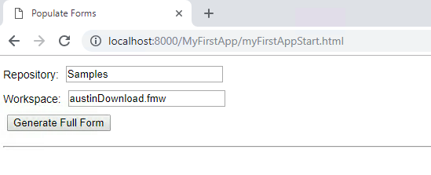
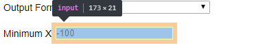
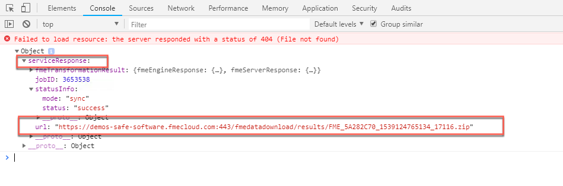

<table style="border-spacing: 0px;border-collapse: collapse;font-family:serif">
<tr>
<td width=25% style="vertical-align:middle;background-color:darkorange;border: 2px solid darkorange">
<i class="fa fa-cogs fa-lg fa-pull-left fa-fw" style="color:white;padding-right: 12px;vertical-align:text-top"></i>
<span style="color:white;font-size:x-large;font-weight: bold">Exercise 15</span>
</td>
<td style="border: 2px solid darkorange;background-color:darkorange;color:white">
<span style="color:white;font-size:x-large;font-weight: bold"> Dynamically Generate a Form Using the REST API </span>
</td>
</tr>

<tr>
<td style="border: 1px solid darkorange; font-weight: bold">Data</td>
<td style="border: 1px solid darkorange">None</td>
</tr>

<tr>
<td style="border: 1px solid darkorange; font-weight: bold">Overall Goal</td>
<td style="border: 1px solid darkorange"> To display the capabilities of the FME Server JavaScript API. This exercise allows you to dynamically generate a form based on the parameters in a  workspace and have a user fill in the parameters and run the workspace.  </td>
</tr>

<tr>
<td style="border: 1px solid darkorange; font-weight: bold">Demonstrates</td>
<td style="border: 1px solid darkorange"> How to use getWorkspaceParameters, generateFormItems, and runDataDownload functions. </td>
</tr>

<!--

<tr>
<td style="border: 1px solid darkorange; font-weight: bold">Starting HTML </td>
<td style="border: 1px solid darkorange">C:\FMEData2018\Resources\RESTAPI\myFirstApp\myFirstAppStart.html  </td>
</tr>

<tr>
<td style="border: 1px solid darkorange; font-weight: bold">Completed HTML </td>
<td style="border: 1px solid darkorange">C:\FMEData2018\Resources\RESTAPI\myFirstApp\myFirstApp.html  </td>
</tr>

<tr>
<td style="border: 1px solid darkorange; font-weight: bold">JSFiddle Begin</td>
<td style="border: 1px solid darkorange"><a href="https://jsfiddle.net/SamAtSafe/0kwt1fyd/2/">JSFiddle</a></td>
</tr>

<tr>
<td style="border: 1px solid darkorange; font-weight: bold">JSFiddle Complete</td>
<td style="border: 1px solid darkorange"><a href="https://jsfiddle.net/SamAtSafe/0kwt1fyd/2/">JSFiddle</a></td>
</tr>

-->

</table>

In this next exercise, we will dynamically create a form from a workspace that the end user will select. Once, the user has selected a workspace a form will be generated with the user parameters from the workspace. The user can then select the parameters they'd like to use and run the workspace. Once, the workspace has run a link will appear on the page with a download link for the user. This code could be used if you wanted to create an application for clients to access data without going through the FME Server UI.

<!--Warning Section-->

<table style="border-spacing: 0px">
<tr>
<td style="vertical-align:middle;background-color:darkorange;border: 2px solid darkorange">
<i class="fa fa-exclamation-triangle fa-lg fa-pull-left fa-fw" style="color:white;padding-right: 12px;vertical-align:text-top"></i>
<span style="color:white;font-size:x-large;font-weight: bold;font-family:serif">WARNING</span>
</td>
</tr>

<tr>
<td style="border: 1px solid darkorange">
<span style="font-family:serif; font-style:italic; font-size:larger">
For this exercise to work properly you will need to have completed <a href="https://safe-software.gitbooks.io/fme-server-rest-api-training-2018/content/FMESERVER_RESTAPI8Session2/8.3.Exercise.SettingUp.html">Exercise 14</a> or have an existing web server for testing.
</span>
</td>
</tr>
</table>

<iframe width="100%" height="300" src="//jsfiddle.net/SamAtSafe/qxj8etdr/7/embedded/" allowfullscreen="allowfullscreen" allowpaymentrequest frameborder="0"></iframe>

<br>**1) Open the myFirstAppStart.html**

The JSFiddle above contains an almost complete web application but is missing some key information. You can view the JavaScript, HTML, and CSS making up the application. Follow the steps below to get this app up and running. Open the [jsfiddle](https://jsfiddle.net/SamAtSafe/qxj8etdr/7/) and make your edits. In the HTML document, any information that requires updating is indicated by //.

<br>**2) Add the FME Server JavaScript API Link**

In the `head` section of the page, we link to
the FME Server JavaScript API:

```html
<head>
    <title>Populate Forms</title>
    <!-- Include FMEServer.js -->
    <script type="text/javascript" src="// Enter FME Server JS URL here">
    </script>
    <base target="_top">
</head>
```

On line 11 delete the comment ```"// Enter FME Server JS URL here"```

and paste ```"https://api.fmeserver.com/js/v1.2/FMEServer.js"```:

```html
<head>
    <title>Populate Forms</title>
    <!-- Include FMEServer.js -->
    <script type="text/javascript" src="https://api.fmeserver.com/js/v1.2/FMEServer.js">
    </script>
    <base target="_top">
</head>
```

The link to the JavaScript API must be included in all applications that use the JavaScript API. It's also a great resource to use if you would like to learn more about the JavaScript API because it lists all the available functions.

Next, we will build the body of the HTML. We need to create a form that will display the initial information needed to locate the workspace.

<br>**3) Update the Example Form**

Scroll down to line 21 and find the `exampleForm`.
<br>

```html
<form id="exampleForm">
  <label>Repository: </label>
  <input id="repository-name" type="text" value="//Repository Name" /><br />
  <label>Workspace: </label>
  <input id="workspace-name" type="text" value="// Workspace Name" /><br />
  <input type="// Input Type" onclick="processForm();" value="Generate Full Form" />
</form>
```

The form is indicated by the tag `<form>`. We have set the id of the form to `exampleForm`. If we needed the JavaScript to act upon the form we would refer to it by the id:

```html
<form id="exampleForm">
```

In the form, we will create a label and an input. The label is entitled "Repository: ", which will appear on the page. Then as with the form, we need to give the input an id so it can be called upon later. The input type is text. **We need to edit the value to be "Samples":**

Change this:

```html
<label>Repository: </label>
<input id="repository-name" type="text" value="//Repository Name" /><br />
```

To this:

```html
<label>Repository: </label>
<input id="repository-name" type="text" value="Samples" /><br />
```

We will repeat the same input process for the workspace. **The value should be updated to "austinDownload.fmw":**

Change this:

```html
<label>Workspace: </label>
<input id="workspace-name" type="text" value="// Workspace Name" /><br />
```

To this:

```html
<label>Workspace: </label>
<input id="workspace-name" type="text" value="austinDownload.fmw" /><br />
```

In the next line of code before the end of the form we need to create an input type for the next section of code. Underneath the two labels we would like to display a button.

Change this:

```html
<input type="// Input Type" onclick="processForm();" value="Generate Full Form" />
```

To this:

```html
<input type="button" onclick="processForm();" value="Generate Full Form" />
```

Having this button will activate the `processForm()` function. The button will have the value of "Generate Full Form."

<br>**4) Update the Form Id**

After the first form has been activated, we are going to use this blank form to hold the parameters dynamically generated by the following JavaScript.

**Locate line 36 and 37, and replace "// Form id" with "output-form":**

```html
<hr />
<form id="// Form id"></form>
```

The form id should now read "output-form".

```html
<hr />
<form id="output-form"></form>
```

If you look at the Result now, it displays a form. However, the form is not  functional. We can create a website using HTML code, however the website will not be able to do much without any JavaScript. JavaScript is needed to have a functional and interactive website.



<br>**5) Update the FME Server URL and Token**

Go to the start of the of the JavaScript script **(line 39).**

```js
window.onload = function() {
  FMEServer.init({
  	// Update with your Server hostname
    // On FME training machines this is http://fmetraining:
    server: "https://demos-safe-software.fmecloud.com",
    //Update with your Server fmetoken
    token: "568c604bc1f235bbe137c514e7c61a8436043070"
  });
};
```

If your FME Server is externally facing you can use your Server hostname in this section.  The FME training machines are also externally facing so will be ok for this exercise. If your web server (for the web applications) and FME Server are within the same domain or same machine you can use the internal IP address or hostname to access FME Server.

However, please note that Google Maps and Esri functionality will not be available if the FME Server is not accessible externally.

If you are not using a training machine and do not know your IP address, this will be the first result returned if you Google "my IP address".


Use this information to **update the server and token section to your own.** If you wish to locate your token. Go to this link:

`http://<yourServerHost>/fmetoken/`

If you have created a restapi user earlier in the course, please use this token.

<br>**6) Update the processForm function**

```js
function processForm() {
  var repository = document.getElementById("Find the repository ID and Update it here").value;
  var workspace = document.getElementById("Find the workspace ID and Update it here").value;

  // Get the workspace parameters from FME Server
  FMEServer.getWorkspaceParameters(repository, workspace, generateForm);
}
```

Next, we can view the processForm function this is located on line number 47. This function uses the FME Server JavaScript API to get the Workspace Parameters using the repository and workspace values entered by the user. We use the function getWorkspaceParameters to get the workspace parameters created in the call.


This function requires three parameters, the repository, workspace, and callback.

The repository and workspace will be entered by the user. To get the values entered by the user we need to create a variable:

```js
var repository = document.getElementById("Find the repository ID and Update it here").value;
```

and get the element by the id we gave it earlier:

```html
<input id="repository-name" type="text" value="Samples" /><br />
```

We need to **change "Find the repository ID and update it here" to "repository-name".**

We also need to **update "Find the workspace ID and Update it here" to "workspace-name".**

```js
function processForm() {
  var repository = document.getElementById("repository-name").value;
  var workspace = document.getElementById("workspace-name").value;

  // Get the workspace parameters from FME Server
  FMEServer.getWorkspaceParameters(repository, workspace, generateForm);
}
```

<br>**7) Modify the generateForm function to produce a form**

Go to the generateForm function, this is located on line 55. The next function is the callback function. A callback function is specified in the previous function. It takes the json returned from the FME Server and uses it.

In our case we have the processForm function and which gets the workspace parameters. With this information we can use the generateFormItems function to create a form for the user to fill in and submit.

Currently, the generateFormItems parameters are empty so we will need to fill them in.

```js
function generateForm(json) {
  // Build the form items using the API
  //Clears the output form
  document.getElementById("output-form").innerHTML = "";
  //Fill in the parameters here
  FMEServer.generateFormItems();

  …
}
```

The first part of the code will clear the output form if there is anything in their previously. Then the `generateFormItems()` function is called but currently there are no parameters in the function so it will not work.


The id is the form container to put the elements into. In our case this is the blank form called `output-form`. The json is the object containing the form data and in this case ours is just json.

The new line should read:

```js
FMEServer.generateFormItems("output-form", json);
```

The correct parameters should look like this.

```js
// Build the form items using the API
document.getElementById("output-form").innerHTML = "";
FMEServer.generateFormItems("output-form", json);
```

<br>**8) Modify the generateForm function to Create a New Button**

In the next section of the code we are creating a button. This button will be used to activate the next function to send the job to the FME Server.

```js
var form = document.getElementById("output-form");

// Create the Run Data Download Button
var submitButton = document.createElement("input");
submitButton.type = ""; //Fill in the type
submitButton.value = ""; //Fill in the value
submitButton.setAttribute("onclick", "runDataDownload();");
form.appendChild(submitButton);
```

In the first line of code in this section we are creating a variable with the output form in it. Then, we are creating another variable and creating an input element.

Next, we need to specify what the input will be. In our case it should be a button. **Line 64** should now read:

```js
submitButton.type = "button"; // Fill in the type
```

Next, we can specify what the value should be the value of the button is what text is displayed on the button. This should be descriptive of what the user should do. **Line 6**5 should now read:

```js
submitButton.value = "Run Data Download"; // Fill in the value
```

<br>**9) Review the runDataDownload function**

We are now going to skip the showResults function for now and go to RunDataDownload beginning on **line 82**.

In the beginning of the function we are creating variables for the repository, workspace, and form. We are also creating a variable for the parameters. This is currently a string with nothing inside.

```js
function runDataDownload() {
  var repository = document.getElementById("repository-name").value;
  var workspace = document.getElementById("workspace-name").value;
  var form = document.getElementById("output-form");
  var params = "";

  …

}
```

The next part of the function is a loop. The purpose of the loop is it find all the parameters set by the user and to format them in a way that FME will use in the runDataDownload Function.

```js
// Loop through unique parameters and build the parameter string
for (var i = 0; i < form.length; i++) {
  var element = form.elements[i];
  if (element.type == "") { // Fill in Element Type
    params += element.name + "=" + element[element.selectedIndex].value + "&";
  } else if (element.type == "") { // Fill in Element Type
    if (element.checked) {
      params += element.name + "=" + element.value + "&";
    }
  } else {
    params += element.name + "=" + element.value + "&";
  }
}
```

Any workspace specific parameter values must be written as a string with this format:
`name1=value1&name2=value2` etc.

In the beginning of the for loop, we are specifying that the loop will begin at the first form element and continue until the form is completed. The variable element is created with the form elements used in the output form.

```js
// Loop through unique parameters and build the parameter string
for (var i = 0; i < form.length; i++) {
  var element = form.elements[i];

  …

}
```

Now save your fiddle.

<br>**10) Find the element types used in the Output Form**

Next, we have to fill in the various element types in the form. The element type is the type of form element used, this can include a drop down list, check list or a text box. To find what elements exist within our form go to http://localhost:8000/MyFirstApp/myFirstAppStart.html

Please note this will only work if you have completed Exercise 14.

Once at the page right click and select inspect.


This will open up the Google Chrome Developer Tools and allow us to investigate the components on the page.

Next, click the Generate Full Form button on the page.


Once we have selected that button we can then start inspecting components on the page.

We are going to go through the form and right click on the elements on the form and inspect them.

In the Layers to Download form click one of the boxes and select inspect.


Once, we inspect on element on the page. It will highlight in the element in the developer tools. Here, we should see the input type is checkbox.


Next, inspect the drop down menu beside Output Coordinate System.


Here, we can see the element type is select.

Finally, inspect the text box next to Minimum X.



Here, we can see the element type is input.

<br>**11) Update the runDataDownload function**

Go to **line 88** and review the for loop.

```js
// Loop through unique parameters and build the parameter string
for (var i = 0; i < form.length; i++) {
  var element = form.elements[i];
  if (element.type == "") { // Fill in Element Type
    params += element.name + "=" + element[element.selectedIndex].value + "&";
  } else if (element.type == "") { // Fill in Element Type
    if (element.checked) {
      params += element.name + "=" + element.value + "&";
    }
  } else {
    params += element.name + "=" + element.value + "&";
  }
}
```

On line 91 we see the first if statement. This statement should say, if the element type is equal to select, then add the element name and the selected value to the params variable. At the end of the params variable we are adding an ampersand or & so we can add another parameter.

Change this:

```js
if (element.type == "") { // Fill in Element Type
```

To this:

```js
if (element.type == "select") { // Fill in Element Type
```

Next, we need to fill in the element.type in the else if statement **on line X**.

Change this:

```js
} else if (element.type == "") { // Fill in Element Type
```

To this:

```js
} else if (element.type == "checkbox") {
```

If the element is checked it is added to the params string.

The last part of this loop is for every other element type. This should be the input box we inspected in the previous step.

```js
} else {
  params += element.name + "=" + element.value + "&";
}
```

After the parameters have been retreived, there will be an additional ampersand
\(&\) at the end of the string. This is removed by the following
statement,

```js
// Remove trailing & from string
params = params.substr(0, params.length - 1);
```

Finally, we can use the runDataDownload function.

```js
// Use the FME Server Data Download Service
  FMEServer.runDataDownload(repository, workspace, params, showResults);
```

The final parameter in this function is the callback we named `showResults`. A **callback** is a function that needs another function to occur first before it can be used. In this case, we need the `runDataDownload` function to happen before `showResults`, the information created from `runDataDownload` will be passed to `showResults`. `showResults` is the function where the download will be displayed.

<br>**12) Review the JSON produced by the `runDataDownload` function**

Next, we need to find the function above the `runDataDownload` function. This is showResults function and should be found on **line 70**.

```js
function showResults(json) {
  // The following is to write out the full return object for visualization of the example
  console.dir(json);
  var hr = document.createElement("hr");
  var div = document.createElement("div");

  // This extracts the download link to the clipped data
  // Find where the url is located in the JSON Object Returned from the Server
  var download = ""
  div.innerHTML += "<hr><a href=\"" + download + "\">Download Result</a>";
  document.body.appendChild(div);
}
```

The first line of the function uses console.dir which is a built in method that will print the JSON object to the console. We will use this to find what was produced from the last function.

Save the file. Then, go to http://localhost:8000/MyFirstApp/myFirstAppStart.html

Click on GenerateFullForm. Then, click the Run Data Download button.

The Download Result URL will not work because we will fill in the URL after. We are going to find the JSON produced by the last function to find where the URL is stored.

To find the JSON, right click on the page and select inspect. Then, in the developer tools find the Console tab.


In the Console, we can see the JSON and the structure of the response returned. The URL is nested json, then the serviceResponse.



<br>**13) Update the showResults function with the URL location**

In the `showResults` function, on **line 77** there is an empty variable for the download link.

```js
function showResults(json) {
  // The following is to write out the full return object
  // for visualization of the example
  console.dir(json);
  var hr = document.createElement("hr");
  var div = document.createElement("div");

  // This extracts the download link to the clipped data
  // Find where the url is located in the JSON Object Returned from the Server
  var download = ""
  div.innerHTML += "<hr><a href=\"" + download + "\">Download Result</a>";
  document.body.appendChild(div);
}
```

In the previous step we found where the download link is stored. This will be entered into the variable. The download variable should be equal to `json.serviceResponse.url`.

```JavaScript
var download = json.serviceResponse.url;
```

<br>**14) Test the final product**

Test the app again by clicking Run and using the Results pane. It should be working now, allowing you to download a ZIP file of the requested data. You might have to scroll down to see the `Download Result` link.

If you missed a step, the full code can be found in the fiddle below.

The results should look like this:

First, we will receive a page where you can enter in the workspace and repository of the job we would like to run:


Then, we can enter in the parameters of the job we would like to complete.

Select cenart and streetcl and click Run Data Download.


After this, you will receive a link to download the resulting files. Please be patient because this may require a minute to complete depending on the server.


---

**Completed exercise**

<iframe width="100%" height="300" src="//jsfiddle.net/SamAtSafe/8ca15b9r/embedded/" allowfullscreen="allowfullscreen" allowpaymentrequest frameborder="0"></iframe>

<!--Exercise Congratulations Section-->

<table style="border-spacing: 0px">
<tr>
<td style="vertical-align:middle;background-color:darkorange;border: 2px solid darkorange">
<i class="fa fa-thumbs-o-up fa-lg fa-pull-left fa-fw" style="color:white;padding-right: 12px;vertical-align:text-top"></i>
<span style="color:white;font-size:x-large;font-weight: bold;font-family:serif">CONGRATULATIONS</span>
</td>
</tr>

<tr>
<td style="border: 1px solid darkorange">
<span style="font-family:serif; font-style:italic; font-size:larger">
By completing this exercise you have learned how to:
<br>
<ul><li>Use the FME REST API JavaScript library to create an application</li>
<li>Use the getWorkspaceParameters, generateFormItems, and runDataDownload functions </li>


</span>
</td>
</tr>
</table>
