<table style="border-spacing: 0px;border-collapse: collapse;font-family:serif">
<tr>
<td width=25% style="vertical-align:middle;background-color:darkorange;border: 2px solid darkorange">
<i class="fa fa-cogs fa-lg fa-pull-left fa-fw" style="color:white;padding-right: 12px;vertical-align:text-top"></i>
<span style="color:white;font-size:x-large;font-weight: bold">Exercise 16</span>
</td>
<td style="border: 2px solid darkorange;background-color:darkorange;color:white">
<span style="color:white;font-size:x-large;font-weight: bold"> Data Visualization using Esri Maps </span>
</td>
</tr>

<tr>
<td style="border: 1px solid darkorange; font-weight: bold">Data</td>
<td style="border: 1px solid darkorange">None</td>
</tr>

<tr>
<td style="border: 1px solid darkorange; font-weight: bold">Overall Goal</td>
<td style="border: 1px solid darkorange"> To demonstrate how to integrate a workspace into a Web Application and allow a user to set the parameters in the workspace based on their selection on a map.  </td>
</tr>

<tr>
<td style="border: 1px solid darkorange; font-weight: bold">Demonstrates</td>
<td style="border: 1px solid darkorange"> Esri Maps Integration, the DriveBC API, Data Streaming, and Data Visualization. </td>
</tr>

<tr>
<td style="border: 1px solid darkorange; font-weight: bold">Completed HTML </td>
<td style="border: 1px solid darkorange">C:\FMEData2018\Resources\RESTAPI\mySecondApp\www\index.html  </td>
</tr>

<tr>
<td style="border: 1px solid darkorange; font-weight: bold">Completed JavaScript </td>
<td style="border: 1px solid darkorange">C:\FMEData2018\Resources\RESTAPI\mySecondApp\www\arcgismap.js  </td>
</tr>

<tr>
<td style="border: 1px solid darkorange; font-weight: bold">Completed Workspace </td>
<td style="border: 1px solid darkorange">C:\FMEData2018\Resources\RESTAPI\mySecondApp\fme\webapp.bcroads.fmw  </td>
</tr>

</table>

In this exercise, we will be creating a map that allows a user to select an area. This selection will be sent to a workspace. In the workspace the selected area will clip current accidents. The user will be sent a link with a Google Map with accidents in the selected area. This exercise is meant to demonstrate how to use other APIs in a workspace, how to bring in coordinates selected from a user into a workspace, and how to stream back data to the user.

<!--Warning Section-->

<table style="border-spacing: 0px">
<tr>
<td style="vertical-align:middle;background-color:darkorange;border: 2px solid darkorange">
<i class="fa fa-exclamation-triangle fa-lg fa-pull-left fa-fw" style="color:white;padding-right: 12px;vertical-align:text-top"></i>
<span style="color:white;font-size:x-large;font-weight: bold;font-family:serif">WARNING</span>
</td>
</tr>

<tr>
<td style="border: 1px solid darkorange">
<span style="font-family:serif; font-style:italic; font-size:larger">
For this exercise to work properly you will need to have completed <a href="https://safe-software.gitbooks.io/fme-server-rest-api-training-2018/content/FMESERVER_RESTAPI8Session2/8.3.Exercise.SettingUp.html">Exercise 14</a> or have an existing web server for testing.
</span>
</td>
</tr>
</table>

#### Set Up the HTML File

This application is split into a few different documents. Many websites store their JavaScript, CSS, and HTML pages separately to promote a cleaner workflow.

<br>**1) Create the index.html document**

Using Notepad++ or another text editor create an HTML file and save it as index.html. Save this file in the mySecondApp folder located here: C:\FMEData2018\Resources\RESTAPI\mySecondApp.

<br>**2) Copy and paste the head section of the HTML file in**

Copy and paste the following code into the index.html file:

```JavaScript
<html>

<head>
    <title>ArcGIS Maps Example from FME Server Developer Playground</title>
    <!-- Styles for example -->
    <link rel="stylesheet" href="https://playground.fmeserver.com/css/FMEServerExamples.css" type="text/css" />
    <!-- Include FMEServer.js -->
    <script type="text/javascript" src="https://api.fmeserver.com/js/v1.2/FMEServer.js"></script>
    <!-- The following are Required for ArcGIS Maps -->
    <link rel="stylesheet" href="https://js.arcgis.com/3.8/js/esri/css/esri.css" />
    <script type="text/javascript" src="https://js.arcgis.com/3.8/"></script>
    <!-- Connects to our JavaScript file -->
    <script type="text/javascript" src="arcgismap.js"></script>
</head>
<!--PLACE FUTURE CODE HERE-->

</html>
```

This head section looks very similar to one in the previous exercise. The difference is that the there are a few additional lines of code:

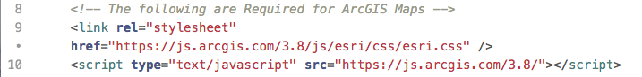

First, we need the code to link to the Esri CSS to our code. The Esri CSS adds the styling components to the map. Then the JavaScript links to a JavaScript library made by Esri.

We also added this line of code:


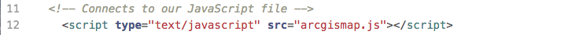

<br> We will be writing a JavaScript file to make our HTML dynamic. It is a best practice to separate your JavaScript from the HTML to ensure that each file is as clean and easy to follow as possible.

<br>**3) Copy and paste the body into index file**

Next, we paste the body into the index.html file. This section belongs after the place future code here comment:

```JavaScript
<!-- PLACE FUTURE CODE HERE-->

<body>
    <h4>This example clips an area selected by the user to BC Traffic Data.</h4>
    <form id="exampleForm">
        <label><b>Step 1</b> - Draw the Polygon: </label>
        <input id="draw" type="button" value="Draw" />
        <input id="reset" type="button" value="Reset" /><br />
        <div id="mapDiv"></div>
        <label><b>Step 2</b> - Submit the Request to FME Server: </label>
        <input type="button" onclick="processClip();" value="Clip Data To Area" />
    </form>
</body>
```

First, we have a very simple heading to explain the purpose of the application. Then we create a form, with buttons to activate different functions in the in the JavaScript.

<br>**4) Review the components of the index.html file**

Go to your web directory and navigate to where you created the file. Right-click, on the page and select Inspect. You should see this:


The left side has the what the page looks like, and the right side has the HTML file.

As you hover your cursor over the page, it will select different elements on the page and highlight where they exist. It will also display any errors we may have. We currently have errors because we don't have the code required to initialize the map.

To make this page effective, we need code to:

  - Initialize the map
  - Draw the Polygon
  - Reset the Polygon
  - Submit the request to the FME Server

We can now start the JavaScript to create these functions!

<br>**5) Create a new JavaScript file**

Now, we can make a new JavaScript file, title it arcgismap.js and save it in the same folder as index.html.

<br>**6) Add the code to initialize the map**

Paste the following code into the JavaScript file we just created. Make sure to change your server and token.

``` JavaScript
var map, toolbar, clippingGeometry;

   window.onload = function()
   {
       require([
           "esri/map", "esri/toolbars/draw",
           "esri/graphic", "esri/geometry/webMercatorUtils",
           "esri/symbols/SimpleLineSymbol", "esri/symbols/SimpleFillSymbol",
           "dojo/_base/Color", "dojo/dom", "dojo/on", "dojo/domReady!"
       ], function(
           Map, Draw,
           Graphic, webMercatorUtils,
           SimpleLineSymbol, SimpleFillSymbol,
           Color, dom, on
       )
       {
           map = new Map("mapDiv",
           {
               basemap: "streets",
               center: [-123.114166, 49.27],
               zoom: 7,
               minZoom: 4,
               smartNavigation: false
           });

           map.on("load", function()
           {
               toolbar = new Draw(map);

               dojo.connect(toolbar, "onDrawEnd", addToMap);

               on(dom.byId("draw"), "click", drawPolygon);
               on(dom.byId("reset"), "click", drawReset);
           });

           function addToMap(geometry)
           {
               var symbol = new SimpleFillSymbol(
                   SimpleFillSymbol.STYLE_SOLID,
                   new SimpleLineSymbol(
                       SimpleLineSymbol.STYLE_DASHDOT,
                       new Color([255, 0, 0]), 2
                   ),
                   new Color([255, 255, 0, 0.25])
               );
               geometry = webMercatorUtils.webMercatorToGeographic(geometry);
               var graphic = new Graphic(geometry, symbol);
               map.graphics.clear();
               map.graphics.add(graphic);
               toolbar.deactivate(Draw.POLYGON);
               clippingGeometry = geometry.rings[0];
           }

           function drawPolygon()
           {
               drawReset();
               toolbar.activate(esri.toolbars.Draw.POLYGON);
           }

           function drawReset()
           {
               toolbar.deactivate(esri.toolbars.Draw.POLYGON);
               map.graphics.clear();
           }
       });
       FMEServer.init(
       {
           server: "https://demos-safe-software.fmecloud.com", //Update to your FME Server hostname - on FME training machines this is http://fmetraining
           token: "568c604bc1f235bbe137c514e7c61a8436043070" //Update to your fmetoken
       });
   };
```
<br>

**7) Refresh the index.html page and test it out**

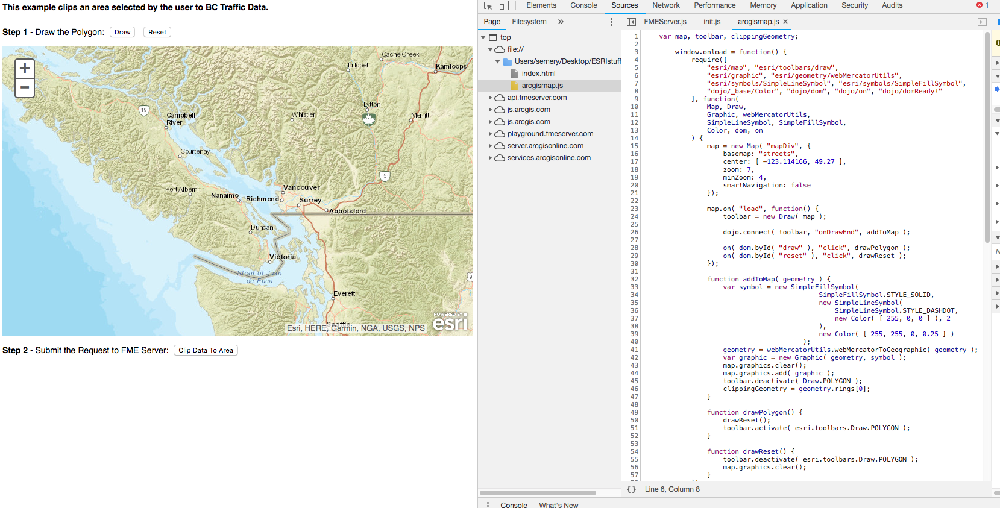

This code uses the Esri JavaScript API to display a map on the page and activate the drawing and reset functions. If you were to use this code in another application most of it can stay the same. However, you may wish to update the map settings displayed below:

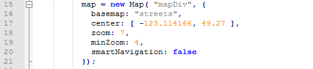


Here, you may adjust the center of the map (where the map is located), the zoom, and the minimum zoom.

Or you may change the variable that stores the geometry specified by the user.


Here we are stating the first geometry ring will be under clippingGeometry.
If you wish we could display the coordinates to the user with this line of code:

```JavaScript
    alert(JSON.stringify(clippingGeometry));
```


<br>**8) Add the following functions to the JavaScript file.**

Below the first function we inserted, we need to insert two more. These functions run the Data Download Service and show the results of the what was returned by the FME Server.

```JavaScript

function showResults(json)
{
    // The following is to write out the full return object
    // for visualization of the example
    var hr = document.createElement("hr");
    var div = document.createElement("div");

    // This extracts the download link to the clipped data
    var download = json.serviceResponse.url;


    div.innerHTML += "<hr><a href=\"" + download + "\">Download Result</a>";
    document.body.appendChild(hr);
    document.body.appendChild(div);
}

function processClip()
{
    var repository = "RESTTraining";
    var workspace = "webapp.bcroads.fmw";

    // Process the clippingGeometry into a WKT Polygon string
    var geometry = "POLYGON((";

    for (var i = 0; i < clippingGeometry.length; i++)
    {
        var lat = clippingGeometry[i][1];
        var lng = clippingGeometry[i][0];
        geometry += lng + " " + lat + ",";
    }

    // Remove trailing , from string
    geometry = geometry.substr(0, geometry.length - 1);
    geometry += "))";

    var params = "GEOM=" + geometry;

    // Use the FME Server Data Download Service
    FMEServer.runDataDownload(repository, workspace, params, showResults);
}
```

First, we have not uploaded the workspace to our server, so this will not currently work but let's discuss how we could recreate these functions. Our goal with the processClip function is to use the runDataDownload function. The [ArcGIS Maps Integration](https://playground.fmeserver.com/javascript/data-delivery/arcgis-maps-integration/) documentation can be found on the FME Server Playground.


To use this function, we need the following variables:

- Repository
- Workspace
- Parameters
- Callback

To use this function, we would have to include this in our code:

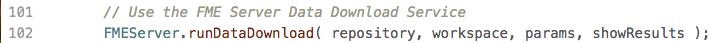

Then we can start specifying the variables, the first and easiest are the repository and workspace.

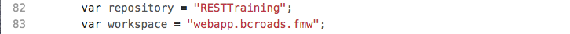

Next, we can create the parameter variable. With the workspace, we will be creating we need to know all the parameters in advanced to be able to use this call. Therefore, if you were using this call in a real situation, it is best to create the workspace first. However, the only parameter in the workspace is GEOM, which will accept Well Known Text (WKT) from our application.

Well Known Text is a format that creates a string that looks like this:

    POLYGON((-123.31968482260129 49.05758039932133,-123.64927466635129 50.269944861577876,-119.33714087728879 50.34712582770931))

In JavaScript we can add bits of strings together to create the full parameter for example we can create a function:

```JavaScript
    a="app";
    b="le";
    apple= a+b;
```
apple will then equal the string "apple."

This can also be done with these statements:
```JavaScript
    a= "The REST API is ";
    a += "fun";
```
a will then equal "The REST API is fun".

We are going to use this method to create the parameter string needed for this call to run.

First, we start with the declaring that the input will be a Polygon.

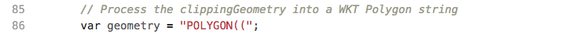

Now, we need to input the coordinates of that were selected by the user. Earlier in the program, we specified that the clippingGeometry would contain the geometry selected by the user.

We need a function to sort through all the data in the clippingGeometry variable. For this, we will use a for loop. This loop will end when there is no more data left.

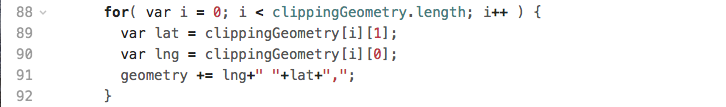

It's important to note that the index of elements in an array in JavaScript start from 0 instead of 1. The lng, we are assigning the first coordinate read, and then the lat is in the second position. Then the geometry string is added to by this statement:


This will leave us with the following statement:

 

 To complete the geometry string we need to remove the trailing comma and close the parentheses.

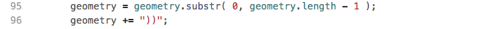

We have now created the statement for the parameters.

Each parameter you create will have a name associated with it. In our case, our parameter name will be GEOM.

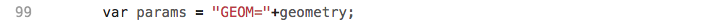

Now finally, we have completed the parameters required to run the DataDownload function. We just need a function to accept the json that the DataDownload function produces, so we use the showResults function.

Using the documentation again we can review what the JSON will look like from the FME Server:


To find the download link we use the following statement:

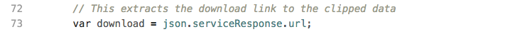

This is stating where the URL download link is, it is within the JSON, in the serviceResponse, and under URL. You can find this yourself here:  


Now that we have the URL, we can display the URL in a link here:         

    div.innerHTML += "<hr><a href=\""+download+"\">Download Result</a>";

We now have an application that will accept coordinates selected by a user then use the DataDownload service to return features in that area. Now we can create a workspace to use.  

#### Create a Workspace


<br>**9) Open a blank workspace in FME Workbench and add a Creator Transformer to the workspace**

<br>**10) Add the GeometryReplacer**

The first step is to get the user input from the web application. If you look at this section of the code, you can see that we are setting that the code is accepting a well-known text string from the user input and placing it in a parameter called GEOM.


    var params = "GEOM=" + wktString;


So, to bring this information into the workspace, we will use the
GeometryReplacer. In the GeometryReplacer fill the parameters out below:

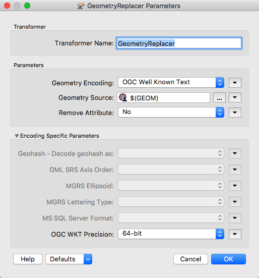


The Geometry Encoding will be set to OGC Well Known Text. This is what is returned from user selecting points on the map. The
Geometry Source is a user parameter which will be created. On the geometry
source click on the dropdown list, find the user parameter, then click
on Create User Parameter.

The dialog that opens allows us to create a new parameter. Create one using the following parameters:

**Name:** GEOM

**Published:** Yes

**Optional:** No

**Prompt:** Area of Interest

**Default Value:** POLYGON((-123.31968482260129 49.05758039932133,-123.64927466635129 50.269944861577876,-119.33714087728879 50.34712582770931))


<br>**11) Add the CoordinateSystemSetter**

At this point in the workspace, we have the coordinates into the system, and it has been converted to geometric features. However, there is no
way for FME to know what the coordinate system is. So we are going
to set it to LL84. Connect the CoordinateSystemSetter to the Output port of the GeometryReplacer.


<br>**12) Add the HTTPCaller**

Add a HTTPCaller to the canvas and attach it to the Creator.

In this section we are using the Drive BC API. The Drive BC API retrieves up to date traffic information and will relay it to your map. If you wish to find the more information visit the [Drive BC API website](https://catalogue.data.gov.bc.ca/dataset/open511-drivebc-api).

Next, we need to add the HTTPCaller to contact the Drive BC API. The Drive BC API is open to
the public, so no authorization or authentication is needed. Under
Request URL put:


    http://api.open511.gov.bc.ca/events?format=json&status=ACTIVE


The HTTP Method is GET

The HTTPCaller Parameters should look like this:


<br>**13) Run with Feature Caching**

Now, we are going to test the workspace. This will ensure that the workspace is connecting to the DriveBC API. This will also let us examine what is being returned by the API.

First, save the workspace as, webapp.bcroads.fmw in the mySecondApp folder. To use feature caching click on Run in the toolbar. Then click run with feature caching.

Then, select the play button to run.

Click, on the magnifying glass on the HTTPCaller to examine the output from the REST API. The JSON returned by the API is stored within the response_body.


Within the response_body you should see should be structured in a similar way to what's below.

```
  {
    "events": [
        {
            "jurisdiction_url": "http://api.open511.gov.bc.ca/jurisdiction",
            "url": "http://api.open511.gov.bc.ca/events/drivebc.ca/DBC-1301",
            "id": "drivebc.ca/DBC-1301",
            "headline": "CONSTRUCTION",
            "status": "ACTIVE",
            "created": "2018-09-04T13:18:13-07:00",
            "updated": "2018-09-04T13:18:13-07:00",
            "description": "Highway 1, westbound. Paving operations planned between Exit 146 and Exit 135: Highway 9 for 11.0 km (Chilliwack). Starting today at 9:00 PM PDT until tomorrow at about 6:30 AM PDT. 28 km west of Hope between Herrling Island and Hwy 9. Last updated today at 1:18 PM PDT. (DBC-1301)",
            "+ivr_message": "Highway 1, westbound. Paving operations planned between Exit 146 and Exit 135: Highway 9 for 11.0 km (Chilliwack). Starting Tuesday, September 4 at 9:00 PM until tomorrow at about 6:30 AM. Last updated Tuesday, September 4 at 1:18 PM.",
            "schedule": {
    "intervals": [
        "2018-09-05T04:00/2018-09-05T13:30"
    ]
},
            "event_type": "CONSTRUCTION",
            "event_subtypes": [
                "ROAD_MAINTENANCE"
            ],
            "severity": "MINOR",
            "geography": {
                "type": "LineString",
                "coordinates": [                    
                    [
                        -121.760359,
                        49.181117
                    ],  
```


<br>**14) Add JSONFragmenter**

On the canvas add a JSONFragmenter and attach it to the HTTPCaller.

The response body will be returned as a long section of JSON. We need to break this down and expose the attributes needed. This JSONFragmenter will be used to expose the attributes listed under "events" as in the above code.

Under Source fill in the parameters:

**Input Source:** JSON Attribute

**JSON Attribute:** response_body

Next move onto the Parameters section.

All the important
information is stored in the category of events to gain access to it
under the JSON Query write:


    json["events"][*]

**Fragment as Format:** JSON

**Reject Features which Produce No Fragments:** Yes


Now we can flatten the JSON to produce the attributes needed for the
table.

*In the Attributes to Expose Section write the following attributes: status, headline,
description, created, and updated.*

The Flattening Parameters should look like this:

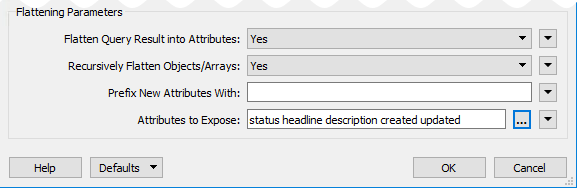


<br>**15) Add another JSONFragmenter**

Add another JSONFragmenter to the canvas and attach it to the previous JSONFragmenter. Now, we need to expose the Geography component to create features.

Fill in the following parameters:

**Source**

Input Source: JSON Attribute

JSON Attribute: response_body

**Parameters**

JSON Query: json["geography"]

Fragment as Format: JSON

Reject Features which Produce No Fragments: Yes

**Flattening Parameters**

Flatten Query Result into Attributes: No


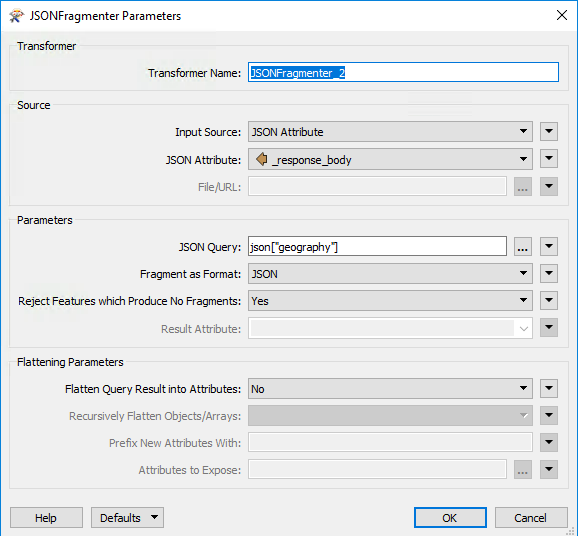


<br>**16) Add a GeometryReplacer**

Add a GeometeryReplacer and attach it to the second JSONFragmenter.

The GeometeryReplacer is an amazing transformer. It can read the JSON
from the Response Body and will automatically create the geometry
associated with it.

Fill in the following parameters:

**Geometry Encoding:** GeoJSON

**Geometry Source:** response_body

**Remove Attribute:** Yes


<br>**17) Add the CoordinateSystemSetter**

Add a CoordinateSystemSetter and attach it to the GeometryReplacer.

Now, we need to set the coordinate system used. The coordinate system is
referenced in URL returned by the call. So we can set it to LL-WGS84.

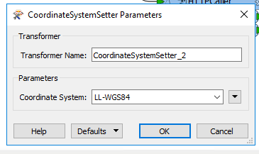

Currently, the workspace should look like this:


<br>**18) Add the Clipper Transformer**

Add a Clipper Transformer to the canvas and accept the current defaults.  

Now we are going to use the clipper transformer to clip the area selected area. The clipper is the area selected by the user, and the clippee is the geometry from the BC Drive API.

The workspace should look like this:

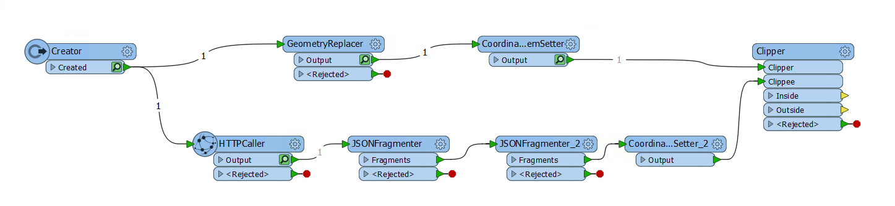

<br>**19) Run with Feature Caching**

Now, we are going to test the workspace. This will ensure that the workspace is working and clip the correct area.

Select the play button to run.

Click, on the magnifying glass on the Inside port on the clipper to view the area selected.

This will open the FME Data Inspector.

The FME Data Inspector will display the points and lines created. To display the background map go to the top menu bar. Find Tools, select FME Options. This will open the FME Options window.

Background Format should be changed from None to Stamen Maps. Then, select Parameters...

Select, the terrain map list. Select OK. Then, in the FME Options window select OK. This will activate the background map.

All the results should be in BC. After exploring the features returned close the Data Inspector. Then, return to FME Workbench.

<br>**20) Add the NoFeaturesTester**

Start typing NoFeaturesTester in FME Workbench and select the custom transformer. The NoFeaturesTester should be attached the Inside port of the Clipper. This transformer will test if there was an output or not. If there is no input, this means all the features were outside or rejected.


<br>**20) Add the DateTimeConverter**

Add a DateTimeConverter and attach it to the OUTPUT port of the NoFeaturesTester. The DateTimeConverter is used to update the time and date, so it is more readable for the user.

Fill in the following parameters:

**Datetime Attributes:** updated created

**Input Format:** Auto detect FME and ISO formats

**Output Format:** %Y:%m:%d %H:%M:%S

**Repair Overflow:** No


<br>**21) Add the HTMLReportGenerator**

Add the HTMLReportGenerator and attach it to the DateTimeConverter. Now, we are ready to create a webpage with the following information. We need three sections, a title, a map, and a table.

Under Page Settings find the Page Title box. The Page Title should be Drive BC API.

Then, create the title. Under Page Contents select Custom HTML. Under Content Settings copy and paste the following:


    <h1> Drive BC Road and Weather Conditions </h1>


Next, we will add a Map Component. The Page Contents should be Map(Google). Then, the Content Settings should be set up as follows:

**Label Attribute:** description

**Layer Color:** 255,55,5

**API Key:**  &lt;< blank >&#62;

For now, we are not going to fill in the API key. As this is for development purposes this is okay. If you want to use this in a production setting you would require an API key.

If you wish to obtain an API key, visit this website, [Google API Key](https://developers.google.com/maps/documentation/javascript/get-api-key#quick-guide-to-getting-a-key)


Next, create a table with the status, created, updated, description, and headline columns.


<br>**22) Add another HTMLReportGenerator**

Add another HTMLReportGenerator and attach it to the NOINPUT port of the NoFeaturesTester.

In the Page Title box write:

Drive BC API

Under Page Contents select the Header. Then, under Content Settings write:

There are no incidents in the area you selected.  

<br>**23) Add the HTML Writer**

Finally, add in the HTML writer to write to a file of your choice.
Attach the HTML writer to both HTMLReportGenerators.

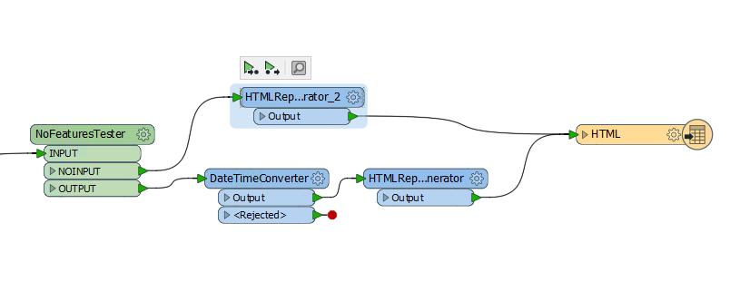


The full workspace should look like this:


<br>**24) Save and Run the Workspace**

Now, we can save and run the workspace to ensure that everything is working properly. Since, we do not have the API key in place we will receive a message that says that this is for development purposes only. If we added the key, we would have a much more sophisticated page. 


<br>**25) Upload the Workspace to your Server.**

Publish the workspace to FME Server. Upload under to the RESTTraining repository and save the workspace as webapp.bcroads.fmw. Register the workspace with the Data Download service.


---

#### Test the Application

Step 1. Draw the Area (double-click to close the polygon)


Step 2. Select Clip Data to Area


Step 3. Download the DataDownload


Step 4. Review the File


---

<!--Exercise Congratulations Section-->

<table style="border-spacing: 0px">
<tr>
<td style="vertical-align:middle;background-color:darkorange;border: 2px solid darkorange">
<i class="fa fa-thumbs-o-up fa-lg fa-pull-left fa-fw" style="color:white;padding-right: 12px;vertical-align:text-top"></i>
<span style="color:white;font-size:x-large;font-weight: bold;font-family:serif">CONGRATULATIONS</span>
</td>
</tr>

<tr>
<td style="border: 1px solid darkorange">
<span style="font-family:serif; font-style:italic; font-size:larger">
By completing this exercise you have learned how to:
<br>
<ul><li>Use ArcGIS maps to send coordinates to your workspace</li>
<li>Use coordinates from an online resource in your workspace</li>
<li>Use the DataDownload function in the FME Server JavaScript API</li>
<li>Use an external API in a workspace</li>

</li>

</span>
</td>
</tr>
</table>
