<table style="border-spacing: 0px;border-collapse: collapse;font-family:serif">
<tr>
<td width=25% style="vertical-align:middle;background-color:darkorange;border: 2px solid darkorange">
<i class="fa fa-cogs fa-lg fa-pull-left fa-fw" style="color:white;padding-right: 12px;vertical-align:text-top"></i>
<span style="color:white;font-size:x-large;font-weight: bold">Exercise 12</span>
</td>
<td style="border: 2px solid darkorange;background-color:darkorange;color:white">
<span style="color:white;font-size:x-large;font-weight: bold"> Data Visualization using Esri Maps </span>
</td>
</tr>

<tr>
<td style="border: 1px solid darkorange; font-weight: bold">Data</td>
<td style="border: 1px solid darkorange">None</td>
</tr>

<tr>
<td style="border: 1px solid darkorange; font-weight: bold">Overall Goal</td>
<td style="border: 1px solid darkorange"> To demonstrate how to integrate a workspace into a Web Application and allow a user to set the parameters in the workspace based on their selection on a map.  </td>
</tr>

<tr>
<td style="border: 1px solid darkorange; font-weight: bold">Demonstrates</td>
<td style="border: 1px solid darkorange"> Esri Maps Integration, the DriveBC API, Data Streaming, and Data Visualization. </td>
</tr>

<tr>
<td style="border: 1px solid darkorange; font-weight: bold">Completed Workspace </td>
<td style="border: 1px solid darkorange">C:\FMEData2019\Resources\RESTAPI\mySecondApp\Completed\webapp.bcroads.fmw  </td>
</tr>

</table>

<br>

In this exercise, we will be creating a website with a map that allows a user to select an area. This selection will be sent to a workspace. The workspace contains an HTTPCaller which connects to the DriveBC API. The DriveBC API has current data on any traffic incidents that may have occurred. In the workspace, the selected area will clip current accidents. The user will be sent a link with a Google Map with accidents in the selected area. This exercise is meant to demonstrate how to use other APIs in a workspace, how to integrate coordinates selected from a user into a workspace, and how to stream back data to the user.

<br>


#### Set Up the HTML File

<br>**1) Open the file**

Open up the JSFiddle file below by selecting Edit in JSFiddle.

<script async src="//jsfiddle.net/siennaemery/c8sxk4eo/8/embed/html,js,result/"></script>

<br>**2) Modify the head section in the HTML file**

 Review the head section of the code (lines 1-10). This head section looks very similar to one in the previous exercise. The difference is that there are a few additional lines of code:

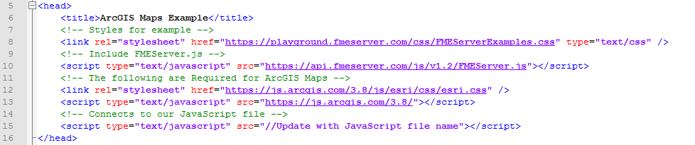

<br>

The section of code below (lines 7-9) connects to the Esri CSS. The Esri CSS adds the styling components to the map. Then, the JavaScript links to a JavaScript library made by Esri.

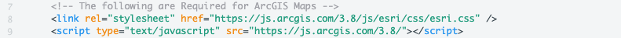

<br>

<br>**3) Review the body of the HTML section**


Review the body of the code beginning on line 12.

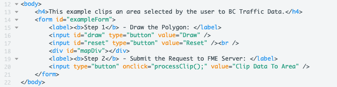

First, we have a very simple heading to explain the purpose of the application (line 13). The &lt;h4&#62; tag indicates that the sentence is a heading (specifically heading 4 which should be smaller than heading 2 or 3).


 Then, we create a form (line 14-21), with buttons to activate different functions in the JavaScript. The draw button will allow the user to draw on the map. The reset button will reset the users drawing. The third button will use the coordinates selected from the user's drawing and clip the data to the selected area.


<br>**4) Review the results pane**

Select Run and view the results.

Right-click, on the page and select Inspect. We should see this:


Inspecting the page will open up the developer tools which are seen on the right.

As we hover the cursor over the page, it will select different elements on the page and highlight where they exist. It will also display any errors we may have. We currently have errors because we don't have the code required to initialize the map.

To make this page effective, we need code to:

  - Initialize the map
  - Draw the Polygon
  - Reset the Polygon
  - Submit the request to FME Server

We can now modify the JavaScript to make these functions functional!

<br>**5) Open the JavaScript panel**


Now, we can go to the JavaScript panel.  

<br>**6) Modify the code to initialize the map**

On line 3, the window.onload function begins, most of this code is from the ArcGIS API for JavaScript. In this course, we won't be covering the ArcGIS API for JavaScript in much detail. To learn more about using the ArcGIS API for JavaScript visit the [ArcGIS API for JavaScript Page.](https://developers.arcgis.com/javascript/)

Review the first 14 lines of code of the document. The first line of code creates the variables for the map, toolbar and clipping geometry. On line 3, we have a function that will be activated when the window loads.

In the ArcGIS API there are many functions, objects, and classes stored in modules. These modules have to be called to use the functions listed. On lines 5-8 the modules are loaded. On lines 10-13 the code references the classes stored in the modules.

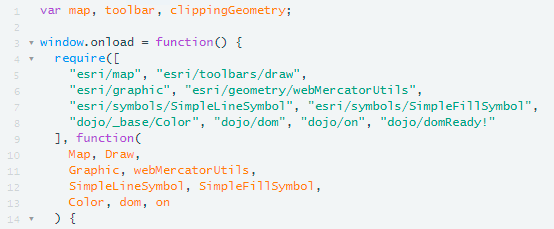

On line 15 we are using the map variable (created on line 1) to create the map object we see on screen. We are going to set four parameters on the map, these include the the basemap type, the coordinates to center the map, the default zoom level, and the minimum zoom.

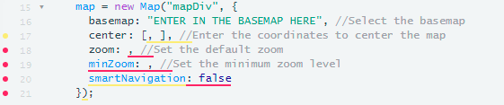

On line 16, we are going to select the streets basemap. If you'd like to view all the possible basemaps visit [Esri Basemaps.](https://developers.arcgis.com/javascript/3/jsapi/esri.basemaps-amd.html)

```JavaScript
basemap: "streets", // Select the basemap
```

On line 17, we are going to select the center of the map using the coordinates. We are going to center the map around Vancouver, BC.

```JavaScript
center: [-123.114166, 49.27], // Long and lat.
```

On line 18, we are going to set the default zoom to 7. Then, on line 19 we are going to set the minimum zoom to 4.

```JavaScript
zoom: 7,
minZoom: 4,
```

<iframe width="100%" height="300" src="//jsfiddle.net/siennaemery/nbLcgxp3/9/embedded/js,html,result/" allowfullscreen="allowfullscreen" allowpaymentrequest frameborder="0"></iframe>

The addToMap(geometry) function (line 32), is from the ArcGIS API JavaScript. This function creates symbols that are added to the map when a user draws an area to clip. As the user selects areas on the basemap, the function will record the coordinates of the areas selected.

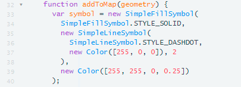

 From line 33-40, we are specifying the appearance of a symbol that will be added when a user selects an area to clip.

 On line 41, we are specifying which coordinate system to record the geometry in. In our case this will be Web Mercator.

 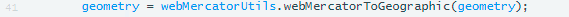

 From line 41-46, we are creating a graphic. A graphic is comprised of the geometry and symbol we specified on the previous lines. We then declare the clippingGeometry is the variable which will store the geometry.

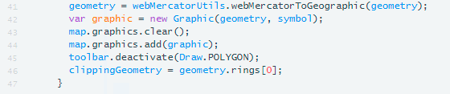

From line 49-56 we have two functions. These functions are activated when a user selects the draw or reset buttons.  

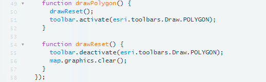


<br>**7) Run the script again to test it out**

Click Run to reload the page.


This code uses the ArcGIS JavaScript API to display a map on the page and activate the drawing and reset functions. Currently, the user can draw a bounding box on the map but this box is not used in any other functions.   

<br>**8) Update the FMEServer Init function to include your Server hostname and token**

Find the FMEServer.init (line 60-64). Use your FME Server hostname and token to **update the server and token section to your own.** If you are on an FME training machine the URL should be https://localhost:8443


<br>**9) Uncomment the processClip Function**

The processClip function (line 82-106), takes the coordinates selected by the user and formats them in a way that can be used as a published parameter.

**Delete ```/*``` at the start of line 82 and ```*/``` on line 106.**

We have not uploaded the workspace to FME Server so this will not currently work but let's discuss how we could recreate these functions. Our goal with the processClip function is to set the proper parameters so we can later use the runDataDownload function.

This code can be found in the [ArcGIS Maps Integration](https://playground.fmeserver.com/javascript/data-delivery/arcgis-maps-integration/) on the FME Server Playground.

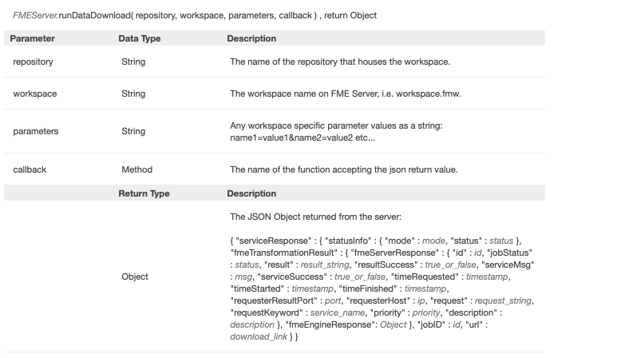

To use this the DataDownload function, we need the following variables:

- Repository
- Workspace
- Parameters
- Callback

This function is located at the end of our code (line 104).

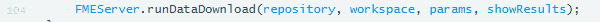

However, to be able to use this function we first need to specify the variables. We are going to begin by specifying the repository and the workspace. This is easier than the previous exercise because we can hard code this in.

The repository and workspace have to specified on lines 84 and 85 respectively. We will upload this workspace later on in the exercise. However, these values should match the actual repository and workspace values to ensure this exercise works.

**We need to update var repository = "" to var repository = "RESTTraining"**

**We need to change var workspace = "" to var workspace = "webapp.bc.roads.fmw"**

```JavaScript
var repository = "RESTTraining"; //Enter repository name
var workspace = "webapp.bc.roads.fmw"; //Enter the workspace name

```

<iframe width="100%" height="300" src="//jsfiddle.net/siennaemery/gykL6vor/11/embedded/js,html,result/" allowfullscreen="allowfullscreen" allowpaymentrequest frameborder="0"></iframe>

Next, we can create the parameter variable. With the workspace (created later in the exercise), we need to know all the parameters in advance to be able to use this call.

Therefore, if you were using this call in a real situation, it is best to create the workspace first. However, the only parameter in the workspace is GEOM, which will accept Well Known Text (WKT) from our application.

Well Known Text is a format that creates a string that looks like this:

    POLYGON((-123.31968482260129 49.05758039932133,-123.64927466635129 50.269944861577876,-119.33714087728879 50.34712582770931))

In JavaScript we can add bits of strings together to create the full parameter for example we can create a function:

```JavaScript
    a="app";
    b="le";
    apple= a+b;
```
apple will then equal the string "apple."

This can also be done with these statements:
```JavaScript
    a= "The REST API is ";
    a += "fun";
```
a will then equal "The REST API is fun".

We are going to use this method to create the parameter string needed for this call to run.

First, we start with the declaring that the input will be a polygon.

```JavaScript
// Process the clippingGeometry into a WKT Polygon string
var geometry = "POLYGON((";
```

Now, we need to input the coordinates of that were selected by the user. Earlier in the program, we specified that the clippingGeometry would contain the geometry selected by the user.

We need a function to sort through all the data in the clippingGeometry variable. For this, we will use a for loop. This loop will end when there is no more data left.


```JavaScript
for (var i = 0; i < clippingGeometry.length; i++) {
  var lat = clippingGeometry[i][1];
  var lng = clippingGeometry[i][0];
  geometry += lng + " " + lat + ",";
}
```

It's important to note that the index of elements in an array in JavaScript start from 0 instead of 1. The lng, we are assigning the first coordinate read, and then the lat is in the second position. Then the geometry string is added to by this statement:

```JavaScript
  geometry += lng + " " + lat + ",";

```

This will leave us with the following statement:


 To complete the geometry string we need to remove the trailing comma and close the parentheses.

 ```JavaScript
 // Remove trailing , from string
 geometry = geometry.substr(0, geometry.length - 1);
 geometry += "))";
 ```

We have now created the statement for the parameters.

Each parameter you create will have a name associated with it. In our case, our parameter name will be GEOM.

```JavaScript
 var params = "GEOM=" + geometry;
```

Now finally, we have completed the parameters required to run the DataDownload function. We just need a function to accept the json that the DataDownload function produces, so we use the showResults function.


<br> **10) Uncomment the showResults Function**

Find the showResults function (line 66-81). **Delete ```/*``` at the start of line 66 and ```*/``` on line 81.**

<iframe width="100%" height="300" src="//jsfiddle.net/siennaemery/25h3ruaj/2/embedded/js,html,result/" allowfullscreen="allowfullscreen" allowpaymentrequest frameborder="0"></iframe>

On lines 70-71 the code is creating a new div and a new divider.

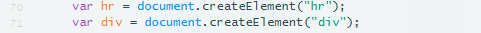


Next, in the function we will need to find the URL returned by the Server. This URL links directly to a file the user can download. In the previous exercise we used the console to find the location of the URL. However, this information is also in the FME Server JavaScript API.

Using the [documentation](https://playground.fmeserver.com/javascript/javascript-library/server-documentation/), we can review what the JSON will look like from FME Server:


To find the download link we use the following statement:

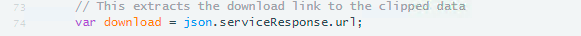

This is stating where the URL download link is, it is within the JSON, in the serviceResponse, and under URL. You can find this yourself here:  


Now, that we have the URL, we can display the URL in a link on line 76.


We now have an application that will accept coordinates selected by a user then use the DataDownload service to return features in that area. Now we can create a workspace to use.  

Click save to save the file. This is the last time we will have to edit it.

#### Create a Workspace


<br>**11) Open a blank workspace and add a Creator Transformer**

 Open up a blank workspace in FME Workbench and add a Creator Transformer to the canvas.

<br>**12) Add the GeometryReplacer Transformer**

Add a GeometryReplacer Transformer to the canvas and attach it to the Creator Transformer.

First, we need to get the user input from the web application. If you look at this section of the code, you can see that we are setting that the code is accepting a well-known text string from the user input and placing it in a parameter called GEOM.


    var params = "GEOM=" + wktString;


So, to bring this information into the workspace, we will use the
GeometryReplacer. In the GeometryReplacer fill the parameters out described below.

The Geometry Encoding will be set to OGC Well Known Text. This is what is returned from user selecting points on the map. The
Geometry Source is a user parameter which will be created. On the Geometry
Source click on the dropdown list, find the user parameter, then click
on Create User Parameter.

The dialog that opens allows us to create a new parameter. Create one using the following parameters:

**Name:** GEOM

**Published:** Yes

**Optional:** No

**Prompt:** Area of Interest

**Default Value:** POLYGON((-123.31968482260129 49.05758039932133,-123.64927466635129 50.269944861577876,-119.33714087728879 50.34712582770931))


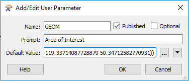

Select OK to exit the menu.

After, the user parameter has been created. Set the Remove Attribute to No. Then, set the OGC WKT Precision to 64-bit.

The final set up should look like this.

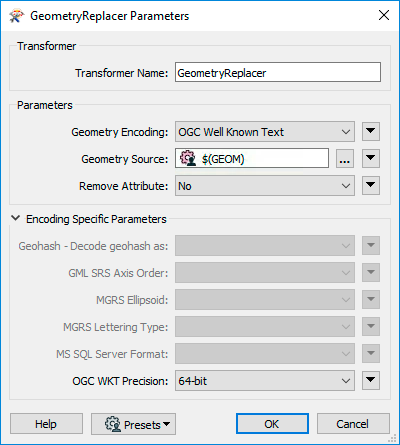


<br>**13) Add the CoordinateSystemSetter Transformer**

At this point in the workspace, we have the coordinates into the system, and it has been converted to geometric features. However, there is no
way for FME to know what the coordinate system is. So we are going
to set it to LL84. Connect the CoordinateSystemSetter to the Output port of the GeometryReplacer.


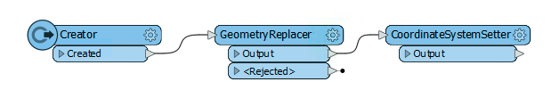


<br>**14) Add the HTTPCaller**

Add a HTTPCaller to the canvas and attach it to the Creator.

In this section we are using the Drive BC API. The Drive BC API retrieves up to date traffic information and will relay it to your map. If you wish to find more information visit the [Drive BC API website](https://catalogue.data.gov.bc.ca/dataset/open511-drivebc-api).

Next, we need to add the HTTPCaller to contact the Drive BC API. The Drive BC API is open to
the public, so no authorization or authentication is needed. Change the HTTP Method to Get and update the Request URL to the one below.

<!--GET Table-->
<style type="text/css">
.tg  {border-collapse:collapse;border-spacing:0;}
.tg td{font-family:Arial, sans-serif;font-size:14px;padding:10px 5px;border-style:solid;border-width:1px;overflow:hidden;word-break:normal;border-color:black;}
.tg th{font-family:Arial, sans-serif;font-size:14px;font-weight:normal;padding:10px 5px;border-style:solid;border-width:1px;overflow:hidden;word-break:normal;border-color:black;}
.tg .tg-ej3l{background-color:#66ccff;vertical-align:top}
.tg .tg-ufe5{background-color:#66ccff;vertical-align:top}
</style>
<table class="tg" style="table-layout: fixed; width: 100%">
  <tr>
    <th class="tg-ej3l">GET</th>
    <th class="tg-ufe5" style="word-wrap: break-word">http://api.open511.gov.bc.ca/events?format=json&status=ACTIVE
    </th>
  </tr>
</table>


The HTTPCaller Parameters should look like this:

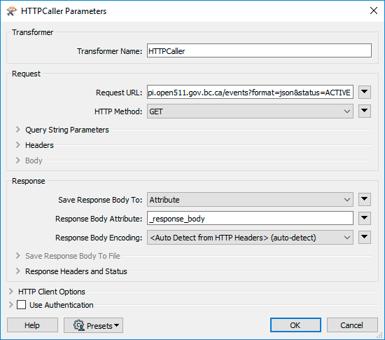

<br>**15) Run with Feature Caching**

Now, we are going to test the workspace. This will ensure that the workspace is connecting to the DriveBC API. This will also let us examine what is being returned by the API.

First, save the workspace as, webapp.bc.roads.fmw in the mySecondApp folder. Click the drop-down arrow next to the Run button and ensure that Enable Feature Caching is turned on. Then click the Run button to run the translation with Feature Caching.

Then, select the play button to run.

Click, on the magnifying glass on the HTTPCaller to examine the output from the REST API.

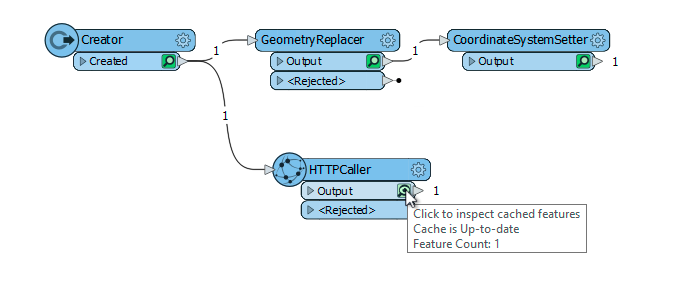

After selecting the magnifying glass. This will open up the Visual Preview panel. The JSON returned by the API is stored within the response_body. To view it, click the ellipsis (...).  Within the response_body you should see should be structured in a similar way to what's below.

```
  {
    "events": [
        {
            "jurisdiction_url": "http://api.open511.gov.bc.ca/jurisdiction",
            "url": "http://api.open511.gov.bc.ca/events/drivebc.ca/DBC-1301",
            "id": "drivebc.ca/DBC-1301",
            "headline": "CONSTRUCTION",
            "status": "ACTIVE",
            "created": "2018-09-04T13:18:13-07:00",
            "updated": "2018-09-04T13:18:13-07:00",
            "description": "Highway 1, westbound. Paving operations planned between Exit 146 and Exit 135: Highway 9 for 11.0 km (Chilliwack). Starting today at 9:00 PM PDT until tomorrow at about 6:30 AM PDT. 28 km west of Hope between Herrling Island and Hwy 9. Last updated today at 1:18 PM PDT. (DBC-1301)",
            "+ivr_message": "Highway 1, westbound. Paving operations planned between Exit 146 and Exit 135: Highway 9 for 11.0 km (Chilliwack). Starting Tuesday, September 4 at 9:00 PM until tomorrow at about 6:30 AM. Last updated Tuesday, September 4 at 1:18 PM.",
            "schedule": {
    "intervals": [
        "2018-09-05T04:00/2018-09-05T13:30"
    ]
},
            "event_type": "CONSTRUCTION",
            "event_subtypes": [
                "ROAD_MAINTENANCE"
            ],
            "severity": "MINOR",
            "geography": {
                "type": "LineString",
                "coordinates": [                    
                    [
                        -121.760359,
                        49.181117
                    ],  
```


<br>**16) Add JSONFragmenter Transformer**

On the canvas add a JSONFragmenter and attach it to the HTTPCaller.

The response body will be returned as a long section of JSON. We need to break this down and expose the attributes needed. This JSONFragmenter will be used to expose the attributes listed under "events" as in the above code.

Under Source fill in the parameters:

**Input Source:** JSON Attribute

**JSON Attribute:** response_body

Next move onto the Parameters section.

All the important
information is stored in the category of events to gain access to it
under the JSON Query write:


    json["events"][*]

**Fragment as Format:** JSON

**Reject Features which Produce No Fragments:** Yes


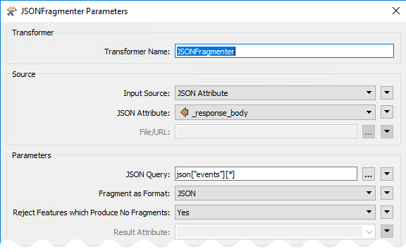


Now, we can flatten the JSON to produce the attributes needed for the table. Set Flatten Query Result in Attributes to Yes.

In the Attributes to Expose Section click on the ... and write the following attributes: status, headline,
description, created, and updated.


The Flattening Parameters should look like this:

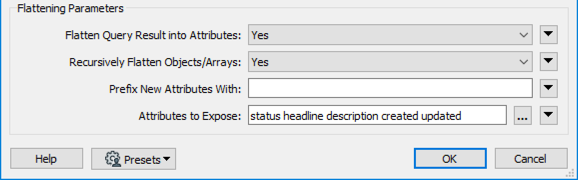


<br>**17) Add another JSONFragmenter Transformer**

Add another JSONFragmenter to the canvas and attach it to the previous JSONFragmenter. Now, we need to expose the Geography component to create features.

Fill in the following parameters:

**Input Source:** JSON Attribute

**JSON Attribute:** response_body

Next, move onto the Parameters section.

**JSON Query:** json["geography"]

**Fragment as Format:** JSON

**Reject Features which Produce No Fragments:** Yes

Finally, more onto the Flattening Parameters.

**Flatten Query Result into Attributes:** No


<br>**18) Add a GeometryReplacer Transformer**

Add a GeometeryReplacer and attach it to the second JSONFragmenter.

The GeometeryReplacer is an amazing transformer. It can read the JSON
from the Response Body and will automatically create the geometry
associated with it.

Fill in the following parameters:

**Geometry Encoding:** GeoJSON

**Geometry Source:** response_body

**Remove Attribute:** Yes

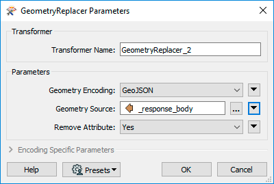


<br>**19) Add the CoordinateSystemSetter**

Add a CoordinateSystemSetter and attach it to the GeometryReplacer.

Now, we need to set the coordinate system used. The coordinate system is
referenced in URL returned by the call. So we can set it to LL-WGS84.


Currently, the workspace should look like this:


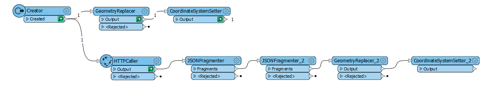


<br>**20) Add the Clipper transformer**

Add a Clipper Transformer to the canvas and accept the current defaults.  

Now, we are going to use the Clipper transformer to clip the area selected area. The Clipper is the area selected by the user, and the Clippee is the geometry from the BC Drive API.

The workspace should look like this:

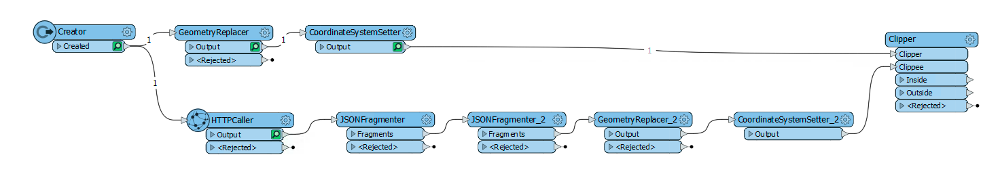

<br>**21) Run with Feature Caching**

Now, we are going to test the workspace. This will ensure that the workspace is working and clip the correct area.

Select the play button to run. Then, click on the magnifying glass on the Inside port on the Clipper to view the area selected. This will open the Visual Preview panel.

Visual Preview will display the points and lines created. By default the Graphics section will not display the background map. To display the background map, right click on the display area. Select, Background Map, and then select Switch to new background map(...).

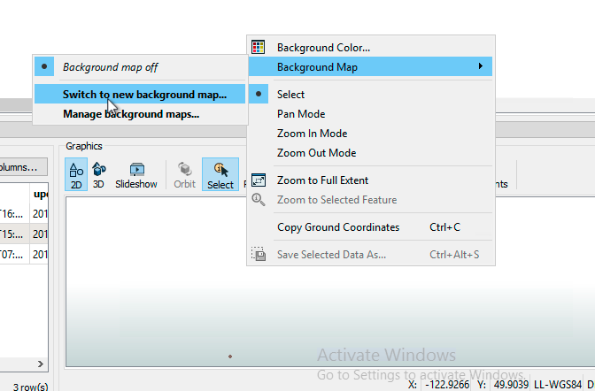

Select the ellipsis(...) by the Map List. Then, select terrain and click OK. Finally, click Save to exit out of the Add Background Map dialog.  

All the results should be in BC.

<br>**22) Add the NoFeaturesTester Transformer**

Start typing NoFeaturesTester on the canvas and select the FME Hub Transformer. The NoFeaturesTester should be attached the Inside port of the Clipper. This transformer will test if there was an output or not. If there is no input, this means all the features were outside or rejected.


<br>**23) Add the DateTimeConverter Transformer**

Add a DateTimeConverter and attach it to the OUTPUT port of the NoFeaturesTester. The DateTimeConverter is used to update the time and date, so it is more readable for the user.

Fill in the following parameters:

**Datetime Attributes:** updated created

**Input Format:** Auto detect FME and ISO formats

**Output Format:** %Y:%m:%d %H:%M:%S (Exif datetime)

**Repair Overflow:** No

**Passthrough nulls, empties, or missing:** No

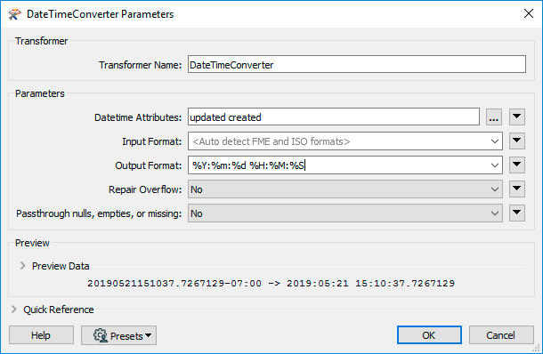

Select OK to exit.


<br>**24) Add the HTMLReportGenerator**

Add the HTMLReportGenerator and attach it to the DateTimeConverter. Now, we are ready to create a webpage with the following information. We need three sections, a title, a map, and a table.

Under Page Settings find the Page Title box. The Page Title should be Drive BC API.

Then, create the title. Under Page Contents select Custom HTML. Under Content Settings copy and paste the following:


    <h1> Drive BC Road and Weather Conditions </h1>


Next, we will add a Map Component. The Page Contents should be Map(Esri Leaflet). Then, the Content Settings should be set up as follows:

**Label Attribute:** description

**Layer Color:** 252,31,28

**Basemap:**  Street

**Feature Layer URL(s):** &lt;leave blank>


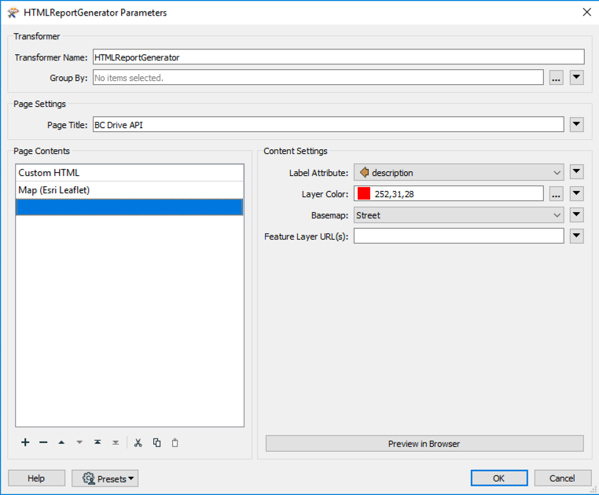


Next, create a table with the status, created, updated, description, and headline columns.

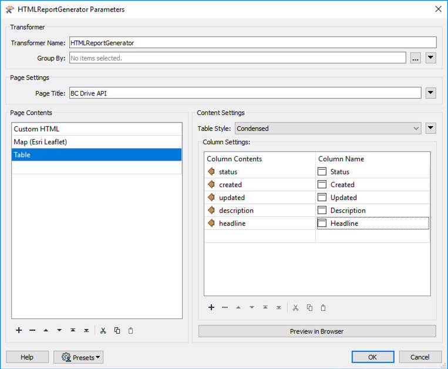


<br>**25) Add another HTMLReportGenerator**

Add another HTMLReportGenerator and attach it to the NOINPUT port of the NoFeaturesTester.

In the Page Title box write:

Drive BC API

Under Page Contents select the Header. Then, under Content Settings find Text and write:

There are no incidents in the area you selected.  

<br>**26) Add the HTML Writer**

Finally, add in the HTML writer to write to a file of your choice.
Attach the HTML writer to both HTMLReportGenerators.

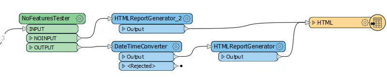


The full workspace should look like this:

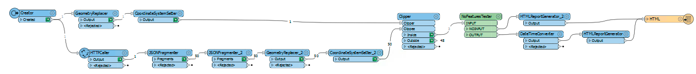

<br>**27) Save and Run the Workspace**

Now, we can save and run the workspace to ensure that everything is working properly. Open the HTML file in a web browser to view the results.

The output file location should be:

    C:\FMEData2019\Output\Training\drivebcapi.html

*This API works with live data, therefore, your results will vary from the screenshot.*

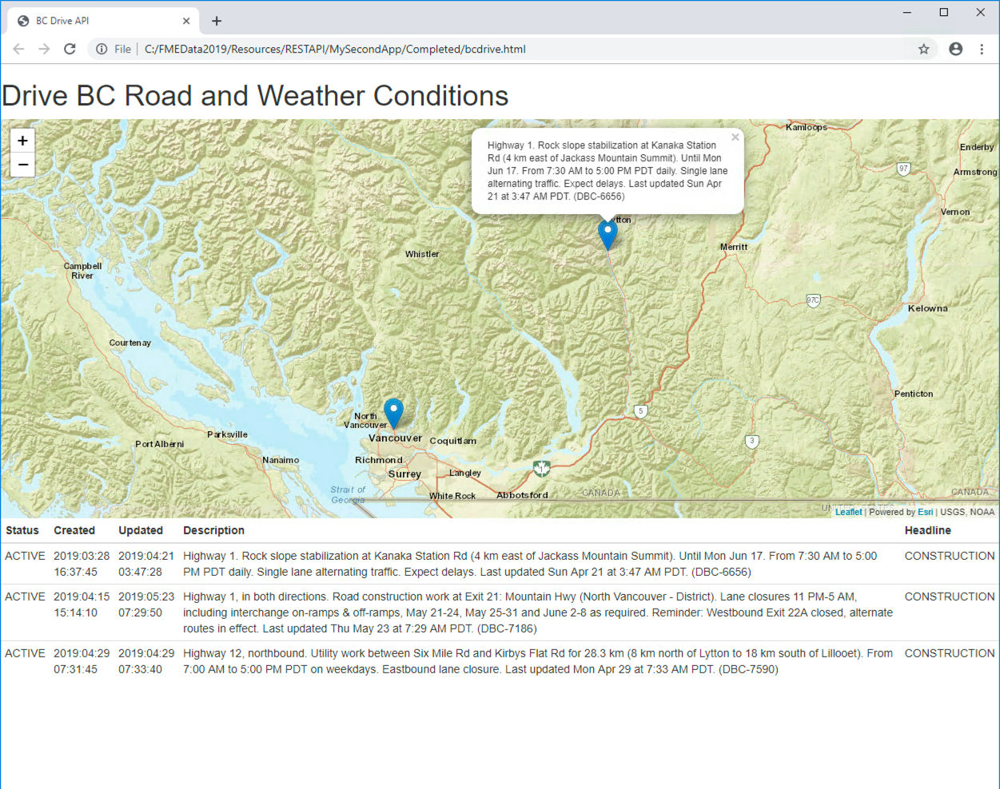

<br>**28) Upload the Workspace to your Server.**

Now, it's time to upload the workspace to your FME Server. This can be done by clicking the Publish to FME Server Button or by selecting File > Publish to FME Server from the menubar.

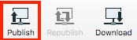

If you do not have the web connection created in the first half of the course follow the steps below:

In the dialog that opens enter the parameters provided by your training instructor. In most cases the parameters will be as follows:

- **Connection Name:** restapi FME Server
- **FME Server URL:** http://localhost
- **Username:** admin
- **Password:** admin

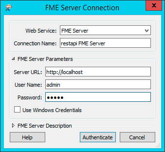

Click Authenticate to confirm the connection and return to the previous dialog. Make sure the newly defined connection is selected and click Next to continue.

For this exercise, we’ll create a new repository by clicking the New button. When prompted enter the name RESTTraining.

Save the workspace as webapp.bc.roads.fmw. Click Next to continue the wizard.

In the final screen of the wizard we can register the workspace for use with various services.

Select the Data Download service.

Finally, click Publish to complete publishing the workspace.

<br>**29) Update the tokens permission**

If you have just created the RESTTraining repository then, you will have to modify the permissions of your token to include permissions to the RESTTraining repository and add the services to the existing token.

Log into FME Server. Click on the User Icon and select Manage Tokens.


Click on the token we created earlier in the course. This should be called Rest API Training Course.


Then, find the Repositories tab and find the RESTTraining repository. From here, we can select the Download, Read, and Run permissions.


Finally, go to Services. Expand the menu to find the specific Services. Since, we are running a Data Download Service we will have to give the token permissions to access more Services. We will need access to Data Download, Data Streaming, Data Upload, and Job Submitter.

 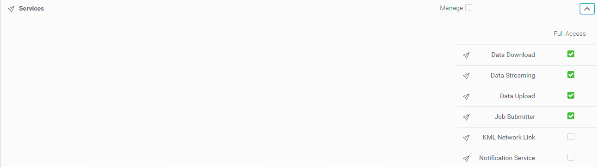

Then click OK! This will automatically enable the token to run a workspace in the RESTTraining repository.

<br>**Test the Application**

Open up the web application by going to this URL http://localhost:8000/MySecondApp/www/

Once, in the application draw the Area (double-click to close the polygon). Then, select Clip Data to Area.


Then, click Download Result to get the HTML file produced.


Finally, open the HTML file and review it.

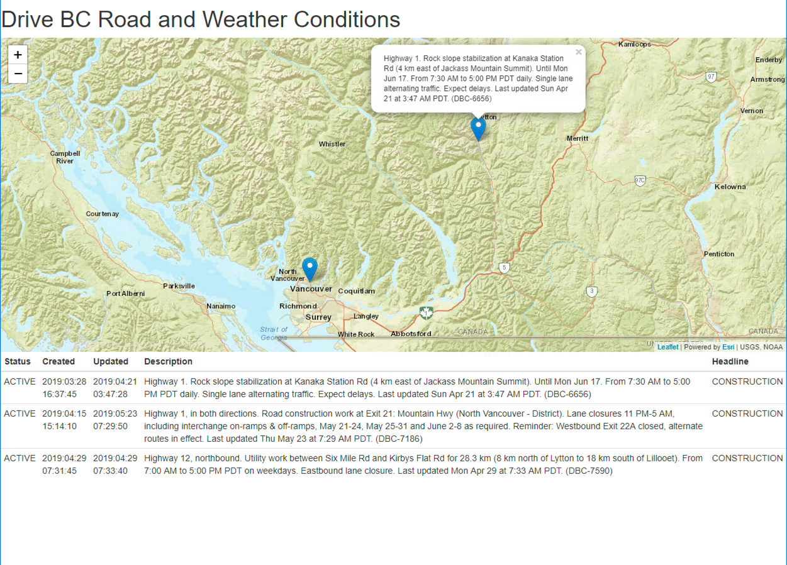

---

<!--Exercise Congratulations Section-->

<table style="border-spacing: 0px">
<tr>
<td style="vertical-align:middle;background-color:darkorange;border: 2px solid darkorange">
<i class="fa fa-thumbs-o-up fa-lg fa-pull-left fa-fw" style="color:white;padding-right: 12px;vertical-align:text-top"></i>
<span style="color:white;font-size:x-large;font-weight: bold;font-family:serif">CONGRATULATIONS</span>
</td>
</tr>

<tr>
<td style="border: 1px solid darkorange">
<span style="font-family:serif; font-style:italic; font-size:larger">
By completing this exercise you have learned how to:
<br>
<ul><li>Use ArcGIS maps to send coordinates to your workspace</li>
<li>Use coordinates from an online resource in your workspace</li>
<li>Use the DataDownload function in the FME Server JavaScript API</li>
<li>Use an external API in a workspace</li>

</li>

</span>
</td>
</tr>
</table>
