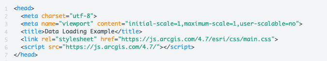
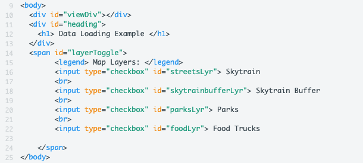
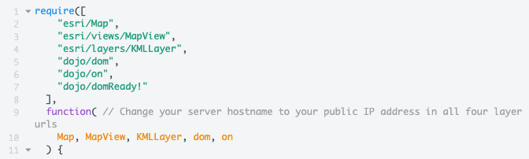
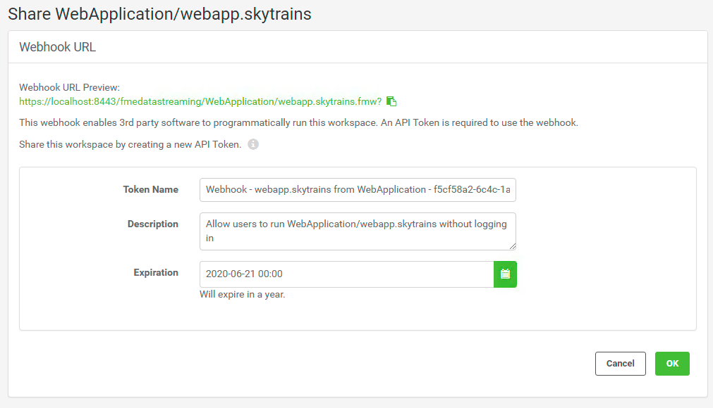
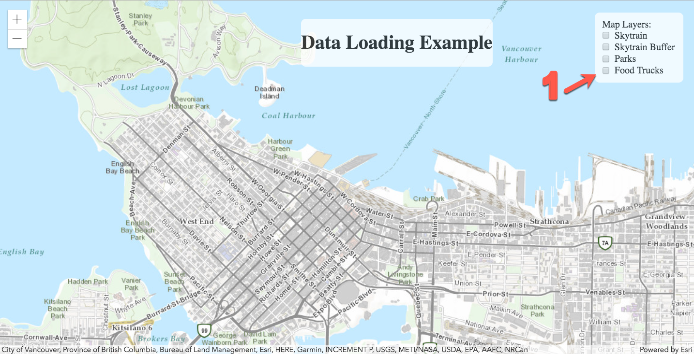
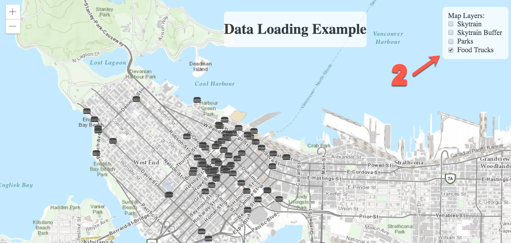

<table style="border-spacing: 0px;border-collapse: collapse;font-family:serif">
<tr>
<td width=25% style="vertical-align:middle;background-color:darkorange;border: 2px solid darkorange">
<i class="fa fa-cogs fa-lg fa-pull-left fa-fw" style="color:white;padding-right: 12px;vertical-align:text-top"></i>
<span style="color:white;font-size:x-large;font-weight: bold">Exercise 13</span>
</td>
<td style="border: 2px solid darkorange;background-color:darkorange;color:white">
<span style="color:white;font-size:x-large;font-weight: bold">Data Visualization </span>
</td>
</tr>

<tr>
<td style="border: 1px solid darkorange; font-weight: bold">Data</td>
<td style="border: 1px solid darkorange">None</td>
</tr>

<tr>
<td style="border: 1px solid darkorange; font-weight: bold">Overall Goal</td>
<td style="border: 1px solid darkorange">To use the Esri JavaScript and the Power of FME to create and easy to use and interesting map with live data. </td>
</tr>

<tr>
<td style="border: 1px solid darkorange; font-weight: bold">Demonstrates</td>
<td style="border: 1px solid darkorange">How to use Esri JavaScript, Data Streaming Webhook, and online resources in a workspace. </td>
</tr>

<tr>
<td style="border: 1px solid darkorange; font-weight: bold"> Projects </td>
<td style="border: 1px solid darkorange"> C:\FMEData2019\Resources\RESTAPI\myThirdApp\WebApplication.fsproject <br>
C:\FMEData2019\Resources\RESTAPI\myThirdApp\BestPracticeAnalysis.fsproject</td>
</tr>
</table>

<br>

This exercise was made to demonstrate how to stream KML Layers produced from workspaces to an online map. When a user selects a layer, a workspace is activated to produce the KML Layer. However, by default Esri will cache the results of the KML Layer for 30 minutes. Esri caches layers to enhance the performance. However, if your data needs to be refreshed on a shorter interval this code will have to be modified.  

<br>


<br>**1) Open the JS Fiddle**

Open the JS Fidlle page below by clicking Edit in JS Fiddle.
<iframe width="100%" height="300" src="//jsfiddle.net/siennaemery/y8vgtz4c/6/embedded/" allowfullscreen="allowfullscreen" allowpaymentrequest frameborder="0"></iframe>
<br>

<br>**2) Review lines 1-7 in the HTML**

This is the code needed to access the ArcGIS JavaScript that we will be using to host the KML Layers streamed to the application through FME Server.



Notice, in this application there is no connection to the FME Server JavaScript API. The ArcGIS JavaScript API will be used to create the map the objects and turn the layers on and off.

The layers are created from workspaces hosted on FME Server. We are using a Web Service URL to activate the layers.


<br>**3) Review the Body of the HTML**

The body of the HTML (lines 9 - 25), holds the map div (viewDiv), a heading, and the map layers.



The above code creates a title and checkbox list on the web page. These checkboxes will represent the layers of the map. Once a checkbox is activated; this will trigger a function to enable the data streaming.

<br>**4) Review the CSS**

<table style="border-spacing: 0px">
<tr>
<td style="vertical-align:middle;background-color:darkorange;border: 2px solid darkorange">
<i class="fa fa-info-circle fa-lg fa-pull-left fa-fw" style="color:white;padding-right: 12px;vertical-align:text-top"></i>
<span style="color:white;font-size:x-large;font-weight: bold;font-family:serif">TIP</span>
</td>
</tr>

<tr>
<td style="border: 1px solid darkorange">
<span style="font-family:serif; font-style:italic; font-size:larger">
*The following CSS is sourced from <a href="https://developers.arcgis.com/javascript/latest/sample-code/intro-layers/index.html">ArcGIS Introduction to Layers</a>*
</span>
</td>
</tr>
</table>

The styling components found in the CSS panel, describe how each HTML element is displayed on the screen.


<br>For the heading, we are giving it a z-index of 99 to ensure that it is placed in front of the map (line 4). It has a white background (line 5) and has an absolute position on the screen (line 2). Which means as the screen size changes the heading will remain in the same place.

The viewDiv which contains the map is given a height and width of 100% (line 19-20). The map will be displayed on the entire screen regardless of the screen size.

The layer toggle which contains the layers available will be formatted similarly to the heading. It will be placed on top of the map and has a white background.


<br>**5) Navigate to the Projects in your FME Server**

Open FME Server by visiting https://localhost:8443/fmeserver. Sign into the account as the admin. The username will be admin and the password will be admin as well. Next, look on the left-hand panel and click Projects.

<br>**6) Import the Project Folders**

Click the Import button.


The next step is to upload the Project Folder that contains the repository and workspaces needed for this web application.

Go to the File Explorer window. Navigate, to the FMEData2019 folder, click Resources, select REST API, then myThirdApp.

In this folder, there are two .fsproject files. The WebApplication project contains the workspaces and the repository needed for the web application.

Additionally, upload the BestPracticeAnalysis.fsproject file. This project folder contains additional images for use with the KMLStyler. This allows the user to have more symbolization options when creating KML.

Drag and drop the WebApplication.fsproject, then select Import. This will Import the WebApplication project into your FME Server. Then repeat the same process to upload the BestPracticeAnalysis.fsproject file.


<br>**7) Review the require and the function section**

In the ArcGIS API there are many functions, objects, and classes stored in modules. These modules have to be called to use the functions listed. On lines 1-7 the modules are loaded. On line 10 the code references the classes and stored in the modules.




<br>**8) Add webhooks for each new KMLLayer Created**

<!--Warning Section-->

<table style="border-spacing: 0px">
<tr>
<td style="vertical-align:middle;background-color:darkorange;border: 2px solid darkorange">
<i class="fa fa-exclamation-triangle fa-lg fa-pull-left fa-fw" style="color:white;padding-right: 12px;vertical-align:text-top"></i>
<span style="color:white;font-size:x-large;font-weight: bold;font-family:serif">WARNING</span>
</td>
</tr>

<tr>
<td style="border: 1px solid darkorange">
<span style="font-family:serif; font-size:larger">
For this training session we have created the webhooks for you. Instead of creating them manually please insert "http://fme.ly/transportation" on line 14. "http://fme.ly/skytrainbuffer" on line 20. "http://fme.ly/vanparks" on line 25 and "http://fme.ly/foodtruck" on line 30. Now skip to step 10.
</span>
</td>
</tr>
</table>


Line 13-33 contains the layers of the map. Here, we are creating a new KMLLayer, this will create a layer from the Web Service URL from the server. For each layer, an id is required. Additionally, the visibility should be initially set to false.

**Now, we need to access our FME Server and find the webhooks for each layer.**

Log into your FME Server as the admin. On the left hand side of the screen find the Repositories tab. Select repositories and then select the WebApplication repository. Find webapp.skytrains.fmw, go to the Advanced dropdown menu.

Find Other Ways to Run this Workspace. Select, Create a Webhook. Click OK to create a new token. Each time you create a new Web Service URL through the FME Server interface it will create a new token. Click OK to accept the token created.

**Copy the Web Service URL Example.**




Paste the Webhook with the Authorization with Query String into the URLs section of the transporationLyr (line 14).

```
var transportationLyr = new KMLLayer({
          url: "https://localhost:8443/fmedatastreaming/WebApplication/webapp.skytrains.fmw?&token=<youtoken>", // Skytrain Layer
          id: "skytrainlayer",
          visible: false
        });
```


Go to Run Workspace. Select, the WebApplication Respository and the Workspace webapp.skytrainbuffer.fmw. Go to the Advanced section and click Create a Webhook. Click OK to accept the token. Then, copy the Webhook with the token into line 20.

```
var skytrainbufferLyr = new KMLLayer({
          url: "https://localhost:8443/fmedatastreaming/WebApplication/webapp.skytrainbuffer.fmw?token=<yourtoken>", // Skytrain Buffer Layer
          id: "skytrainbufferlayer",
          visible: false
        });
```

Go to Run Workspace. Select, the WebApplication Respository and the Workspace webapp.parks.fmw. Go to the Advanced section and click Create a Webhook. Under Resources, ensure Data is checked. Under Parameters select the source MapInfo Tab File. The source MapInfo Tab File should be located here: $(FME_SHAREDRESOURCE_DATA)/WebApplication/Parks/Parks.tab

Click OK to accept the token. Then, copy the Webhook with the token into line 25.


```
var parksLyr = new KMLLayer({
          url: "https://localhost:8443/fmedatastreaming/WebApplication/webapp.parks.fmw?SourceDataset_MITAB=%24(FME_SHAREDRESOURCE_DATA)%2FWebApplication%2FParks%2FParks.tab&token=<youtoken>", // Parks Layer
          id: "parkslayer",
          visible: false
        });
```
Go to Run Workspace. Select, the WebApplication Respository and the Workspace webapp.foodTrucks.fmw. Go to the Advanced section and click Create a Webhook. Click OK to accept the token. Then, copy the Webhook into line 30.

```
var foodLyr = new KMLLayer({
         url: "https://localhost:8443/fmedatastreaming/WebApplication/webapp.foodTrucks.fmw?DestDataset_OGCKML=%24(FME_SHAREDRESOURCE_DATA)%2FSienna%2FOutput%2FfoodTrucks.kml&token=<youtoken>", // Food Truck Layer
         id: "foodlayer",
         visible: false
       });
```

Now, all of the Webhooks are in place. However, the URL with FMETRAINING will not work. We need to replace FMETRAINING to your Public IP Address.

<br>**9) Update localhost to your Public IP Address in the Webhooks**

Now, we are going to find our Public IP Address by visiting [whatismyip.com.](https://www.whatismyip.com/what-is-my-public-ip-address/)

Next, we are going to copy the URL listed as the Public IP Address.

Now, we can modify the Webhooks we previously inserted in the last step. Find all instances of localhost and replace them with the IP Address. These should be located on line 14, 20, 25, and 30.


<script async src="//jsfiddle.net/siennaemery/wby1fto4/7/embed/"></script>


<br>**10) Update the basemap used in the map**

The code to initialize the basemap (lines 40-42) needs to be updated with the basemap name.

On line 41, add "topo" after basemap:

```JavaScript
var map = new Map({
         basemap: "topo"
       });
```  
<script async src="//jsfiddle.net/siennaemery/bcjexm4s/5/embed/"></script>

<br>**11) Add the Layers to map.add**

Currently, there are no layers in the map.add function (lines 47-50). We need to update the map.add to include the layer variables we assigned previously.

```JavaScript
/*****************************************************************
 * Add the layers to the map
 *****************************************************************/
map.add(transportationLyr);
map.add(skytrainbufferLyr);
map.add(parksLyr);
map.add(foodLyr);

```

<script async src="//jsfiddle.net/siennaemery/us0q7h3y/3/embed/"></script>

<br>**12) Update the center of the map and the zoom level**

Next, in the code (line 58-63) we can modify the code to adjust the center and zoom level. In the square brackets on the center variable (line 61) insert the coordinates -123.10, 49.268. The zoom level (line 62) should be set to 14.

```JavaScript
/*****************************************************************
 * Creates the view for the basemap, adjusts the center and the zoom level.
 *****************************************************************/
var view = new MapView(
{
    container: "viewDiv",
    map: map,
    center: [-123.10, 49.268],
    zoom: 14
});
```

<script async src="//jsfiddle.net/siennaemery/5vj0h2pd/1/embed/"></script>

<br>**13) Review the code to create the toggle variables**

In the next section of code (lines 70-73). Variables for the toggles are created using dom.byId, this will get the layer objects created previously.

```JavaScript
/*****************************************************************
 * Variables are created for the Toggles, these
 * toggles are attached to the ids assigned to the checkboxes
 *****************************************************************/
var streetsLyrToggle = dom.byId("streetsLyr");
var skytrainbufferLyrToggle = dom.byId("skytrainbufferLyr");
var parksLyrToggle = dom.byId("parksLyr");
var foodLyrToggle = dom.byId("foodLyr");
```

<br>**14) Add the Code to toggle the visibility of the food layer**

The next section of code (line 81-91), changes the visibility of the layer based on if the toggle is checked. The code for the foodLyrToggle has been omitted.

On line 91 write foodLyr.visible = foodLyrToggle.checked;


```JavaScript
/*****************************************************************
 * The following code manipulates the visibility of the layer.
 * When the layer is checked then the layer becomes visible.
 *******************************************************************/
on(streetsLyrToggle, "change", function()
{
    transportationLyr.visible = streetsLyrToggle.checked;
});
on(skytrainbufferLyrToggle, "change", function()
{
    skytrainbufferLyr.visible = skytrainbufferLyrToggle.checked;
});
on(parksLyrToggle, "change", function()
{
    parksLyr.visible = parksLyrToggle.checked;
});
on(foodLyrToggle, "change", function()
{
    foodLyr.visible = foodLyrToggle.checked;
});

```

<script async src="//jsfiddle.net/siennaemery/boe92zkt/3/embed/"></script>

<br>**16) Test the Page!**

Click run to test out the page.

When you test out the page, you should be able to select and de-select different layers. Each layer runs a workspace on your FME Server.






---


<!--Exercise Congratulations Section-->

<table style="border-spacing: 0px">
<tr>
<td style="vertical-align:middle;background-color:darkorange;border: 2px solid darkorange">
<i class="fa fa-thumbs-o-up fa-lg fa-pull-left fa-fw" style="color:white;padding-right: 12px;vertical-align:text-top"></i>
<span style="color:white;font-size:x-large;font-weight: bold;font-family:serif">CONGRATULATIONS</span>
</td>
</tr>

<tr>
<td style="border: 1px solid darkorange">
<span style="font-family:serif; font-style:italic; font-size:larger">
By completing this exercise you have learned how to:
<br>
<ul><li>Use the Esri JavaScript API to create a web application</li>
<li>Use a workspace to generate a KMLLayer </li>
<li>Use Webhooks to generate layers on a map </li>


</span>
</td>
</tr>
</table>
