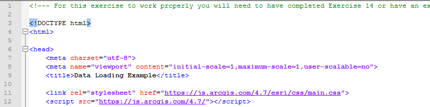
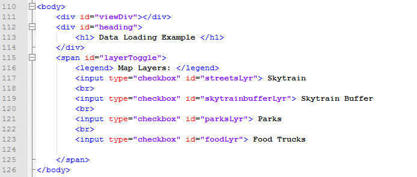
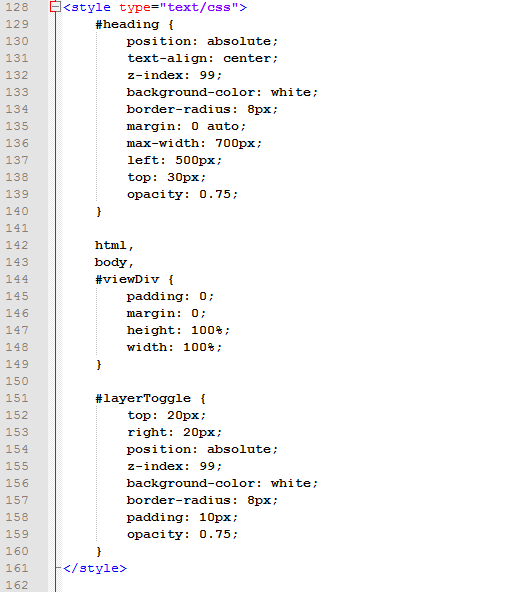
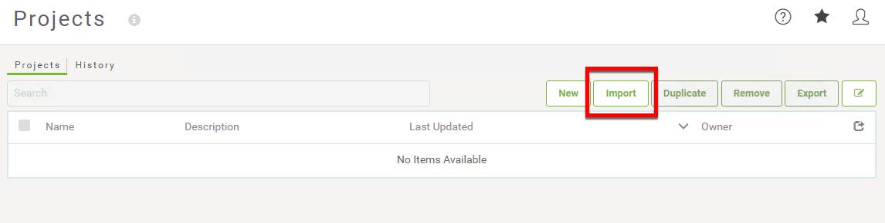
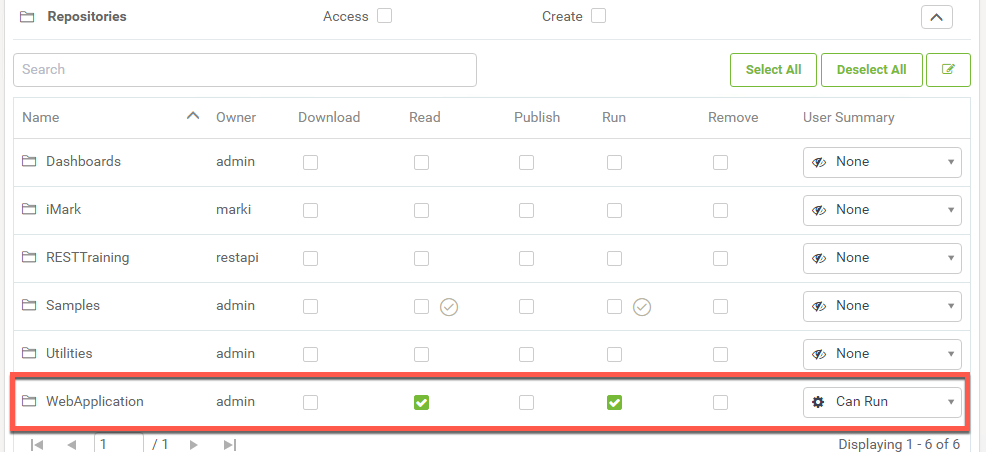
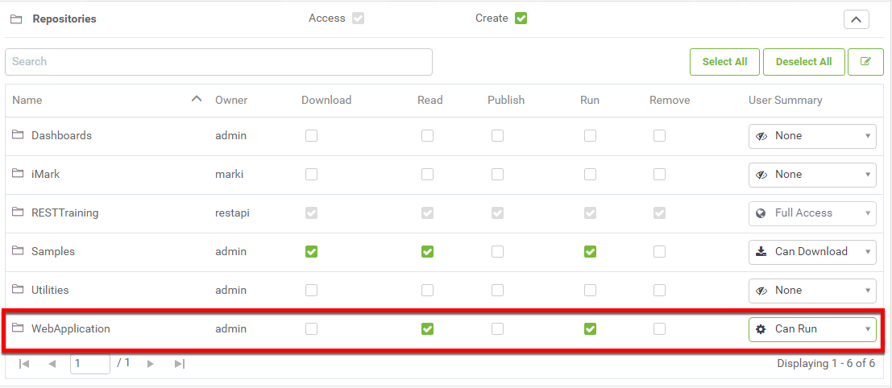
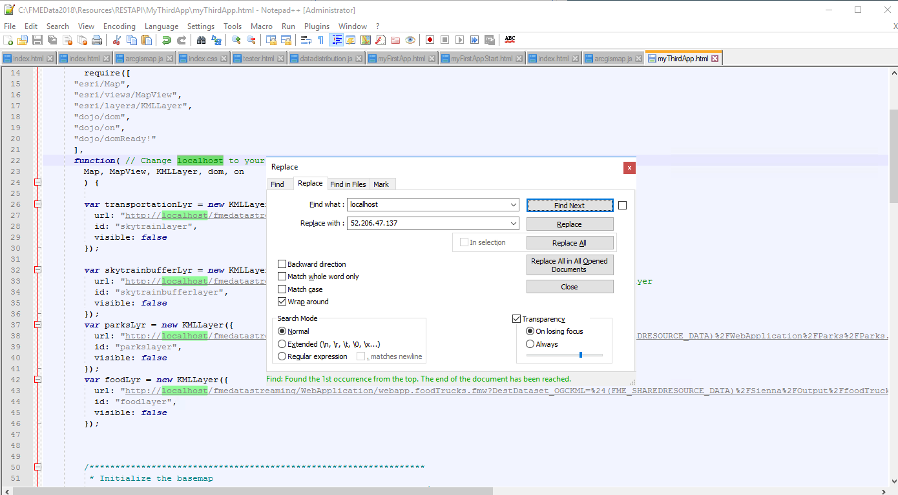

<table style="border-spacing: 0px;border-collapse: collapse;font-family:serif">
<tr>
<td width=25% style="vertical-align:middle;background-color:darkorange;border: 2px solid darkorange">
<i class="fa fa-cogs fa-lg fa-pull-left fa-fw" style="color:white;padding-right: 12px;vertical-align:text-top"></i>
<span style="color:white;font-size:x-large;font-weight: bold">Exercise 17</span>
</td>
<td style="border: 2px solid darkorange;background-color:darkorange;color:white">
<span style="color:white;font-size:x-large;font-weight: bold">Data Visualization </span>
</td>
</tr>

<tr>
<td style="border: 1px solid darkorange; font-weight: bold">Data</td>
<td style="border: 1px solid darkorange">None</td>
</tr>

<tr>
<td style="border: 1px solid darkorange; font-weight: bold">Overall Goal</td>
<td style="border: 1px solid darkorange">To use the Esri JavaScript and the Power of FME to create and easy to use and interesting map with live data. </td>
</tr>

<tr>
<td style="border: 1px solid darkorange; font-weight: bold">Demonstrates</td>
<td style="border: 1px solid darkorange">How to use Esri JavaScript, Data Streaming Direct URLs, and online resources in a workspace. </td>
</tr>

<tr>
<td style="border: 1px solid darkorange; font-weight: bold">Starting HTML </td>
<td style="border: 1px solid darkorange">C:\FMEData2018\Resources\RESTAPI\myThirdApp\myThirdApp.html  </td>
</tr>

<tr>
<td style="border: 1px solid darkorange; font-weight: bold">Completed HTML </td>
<td style="border: 1px solid darkorange">C:\FMEData2018\Resources\RESTAPI\myThirdApp\myThirdAppComplete.html  </td>
</tr>

<tr>
<td style="border: 1px solid darkorange; font-weight: bold"> Projects </td>
<td style="border: 1px solid darkorange"> C:\FMEData2018\Resources\RESTAPI\myThirdApp\WebApplication.fsproject <br>
C:\FMEData2018\Resources\RESTAPI\myThirdApp\BestPracticeAnalysis.fsproject</td>
</tr>


</table>
<br>

This exercise was made to demonstrate how to stream KML Layers produced from workspaces to an online map. When a user selects a layer, a workspace is activated to produce the KML Layer. However, by default Esri will cache the results of the KML Layer for 30 minutes. Esri caches layers to enhance the performance. However, if your data needs to be refreshed on a shorter interval this code will have to be modified.  

<br>

<!--Warning Section-->

<table style="border-spacing: 0px">
<tr>
<td style="vertical-align:middle;background-color:darkorange;border: 2px solid darkorange">
<i class="fa fa-exclamation-triangle fa-lg fa-pull-left fa-fw" style="color:white;padding-right: 12px;vertical-align:text-top"></i>
<span style="color:white;font-size:x-large;font-weight: bold;font-family:serif">WARNING</span>
</td>
</tr>

<tr>
<td style="border: 1px solid darkorange">
<span style="font-family:serif; font-style:italic; font-size:larger">
For this exercise to work properly you will need to have completed <a href="https://safe-software.gitbooks.io/fme-server-rest-api-training-2018/content/FMESERVER_RESTAPI8Session2/8.3.Exercise.SettingUp.html">Exercise 14</a> or have an existing web server for testing.
</span>
</td>
</tr>
</table>

<br>**1) Open the myThirdApp.html file**

Go to C:/FMEData2018/Resources/RESTAPI. Then, right click on the myThirdApp.html and select Edit with Notepad++.

<br>**2) Review lines 1-12 in the code**

This is the code needed to access the ESRI JavaScript that we will be using to host the KML Layers streamed to the application through FME Server.



Notice, in this application there is no connection to the FME Server JavaScript API. The ArcGIS JavaScript API will be used to create the map the objects and turn the layers on and off.

The layers are created from workspaces hosted on the FME Server. We are using a Direct URL to activate the layers.


<br>**3) Review the Body of the HTML**

The body of the HTML (lines 110 - 126), holds the map div (viewDiv), a heading, and the map layers.



The above code creates a title and checkbox list on the web page. These checkboxes will represent the layers of the map. Once a checkbox is activated; this will trigger a function to enable the data streaming.

<br>**4) Review the CSS**

<table style="border-spacing: 0px">
<tr>
<td style="vertical-align:middle;background-color:darkorange;border: 2px solid darkorange">
<i class="fa fa-info-circle fa-lg fa-pull-left fa-fw" style="color:white;padding-right: 12px;vertical-align:text-top"></i>
<span style="color:white;font-size:x-large;font-weight: bold;font-family:serif">TIP</span>
</td>
</tr>

<tr>
<td style="border: 1px solid darkorange">
<span style="font-family:serif; font-style:italic; font-size:larger">
*The following CSS is sourced from <a href="https://developers.arcgis.com/javascript/latest/sample-code/intro-layers/index.html">ArcGIS Introduction to Layers</a>*
</span>
</td>
</tr>
</table>

The styling components (lines 128-161), describe how each HTML element is displayed on the screen.



<br>For the heading, we are giving it a z-index of 99 to ensure that it is placed in front of the map (line 132). It has a white background (line 133) and has an absolute position on the screen (line 130). Which means as the screen size changes the heading will remain in the same place.

The viewDiv which contains the map is given a height and width of 100% (line 147-148). The map will be displayed on the entire screen regardless of the screen size.

The layer toggle which contains the layers available will be formatted similarly to the heading. It will be placed on top of the map and has a white background.


<br>**5) Navigate to the Projects in your FME Server**

Open the FME Server by visiting localhost/fmeserver. Sign into the account as the admin. The username will be admin and the password will be admin as well. Next, look on the left-hand panel and click Projects.

<br>**6) Import the Project Folders**

Click the Import button.




The next step is to upload the Project Folder that contains the repository and workspaces needed for this web application.

Go to the File Explorer window. Navigate, to the FMEData2018 folder, click Resources, select REST API, then myThirdApp.

In this folder, there are two .fsproject files. The WebApplication project contains the workspaces and the repository needed for the web application.

Additionally, upload the BestPracticeAnalysis.fsproject file. This project folder contains additional images for use with the KMLStyler. This allows the user to have more symbolization options when creating KML.

Drag and drop the WebApplication.fsproject, then select Import. This will Import the WebApplication project into your FME Server. Then repeat the same process to upload the BestPracticeAnalysis.fsproject file.

<br>**7) Give the Guest Account Access to the WebApplication repository**

To give the repository guest permissions, you will have to access your FME Server. First, look on the left-hand panel
of your FME Server. Find Security and then look for Users.


Once on the Users page **click guest.**

Scroll down to the permissions and expand the repositories tab. Then
check the read and run permissions. Then click OK found in the bottom right of the page.



<br>**8) Give the restapi Account Access to the WebApplication repository (if you created this user earlier in the course)**

The restapi user was created in [exercise 1](https://safe-software.gitbooks.io/fme-server-rest-api-training-2018/FMESERVER_RESTAPI1Overview/1.5.UserCreation.html) of the course to reduce any security risks associated with the using the admin token.

On the same Users page **click restapi.**

Scroll down to the permissions and expand the repositories tab. Then, check the read and run permissions. Even if the restapi account imported the Project. It isn't guaranteed that the user will automatically be granted access to the files.




<br>**9) Review the require and the function section**

In the ArcGIS API there are many functions, objects, and classes stored in modules. These modules have to be called to use the functions listed. On lines 14-20 the modules are loaded. On lines 22-23 the code references the classes and stored in the modules.


<br>**10) Add Direct URLs for each new KMLLayer Created**


Line 26-47 contains the layers of the map. Here, we are creating a new KMLLayer, this will create a layer from the direct URL from the server. For each layer, an id is required. Additionally, the visibility should be initially set to false.

**Now, we need to access our FME Server and find the Direct URLs for each layer.**

Log into your FME Server as the admin. On the left hand side of the screen find the Repositories tab. Select repositories and then select the WebApplication repository. Find webapp.skytrains.fmw, go to the Advanced dropdown menu.

**Copy the Direct URL Example.**


**Paste the Direct URL into the URLs section of the transporationLyr (line 28).**

```
var transportationLyr = new KMLLayer({
          url: "http://52.206.47.137/fmedatastreaming/WebApplication/webapp.skytrains.fmw?", // Skytrain Layer
          id: "skytrainlayer",
          visible: false
        });
```

Repeat this process for the other empty URLs.

**Find the webapp.skytrainbuffer.fmw in the WebApplication repository. Then, copy the Direct URL from the Advanced menu and paste it into the skytrainbufferLyr URL (line 33).**

```
var skytrainbufferLyr = new KMLLayer({
          url: "http://localhost/fmedatastreaming/WebApplication/webapp.skytrainbuffer.fmw?", // Skytrain Buffer Layer
          id: "skytrainbufferlayer",
          visible: false
        });
```

**Find the webapp.parks.fmw in the WebApplication repository. Then, copy the Direct URL from the Advanced menu and paste it into the parksLyr URL (line 38).**

```
var parksLyr = new KMLLayer({
          url: "http://localhost/fmedatastreaming/WebApplication/webapp.parks.fmw?SourceDataset_MITAB=%24(FME_SHAREDRESOURCE_DATA)%2FWebApplication%2FParks%2FParks.tab", // Parks Layer
          id: "parkslayer",
          visible: false
        });
```
**Find the webapp.foodTrucks.fmw in the WebApplication repository. Then, copy the Direct URL from the Advanced menu and paste it into the foodLyr URL (line 43).**

```
var foodLyr = new KMLLayer({
         url: "http://localhost/fmedatastreaming/WebApplication/webapp.foodTrucks.fmw?DestDataset_OGCKML=%24(FME_SHAREDRESOURCE_DATA)%2FSienna%2FOutput%2FfoodTrucks.kml", // Food Truck Layer
         id: "foodlayer",
         visible: false
       });
```

Now, all of the URLs are in place. However, the URL with localhost will not work. We need to replace localhost to your Public IP Address.

<br>**11) Update localhost to your Public IP Address in the URLs**

Now, we are going to find our Public IP Address by visiting [whatismyip.com.](https://www.whatismyip.com/what-is-my-public-ip-address/)

Next, we are going to copy the URL listed as the Public IP Address.

Now, we can modify the URLs we previously inserted in the last step. In Notepad ++, use the command Ctrl + H to open the Replace menu.

In the Replace menu, under Find what: write localhost, under Replace with paste the IP Address found previously.



Find and replace all of the localhost instances with your Public IP Address.


<br>**12) Update the basemap used in the map**

The code to initialize the basemap (lines 50-55) needs to be updated with the basemap name.


On line 54, add "topo" after basemap:

```JavaScript
var map = new Map({
         basemap: "topo"
       });
```  


<br>**13) Add the Layers to map.add**

Currently, there are no layers in the map.add function (lines 60-63). We need to update the map.add to include the layer variables we assigned previously.

```JavaScript
/*****************************************************************
 * Add the layers to the map
 *****************************************************************/
map.add(transportationLyr);
map.add(skytrainbufferLyr);
map.add(parksLyr);
map.add(foodLyr);

```

<br>**14) Update the center of the map and the zoom level**

Next, in the code (line 67-76) we can modify the code to adjust the center and zoom level. In the square brackets on the center variable (line 74) insert the coordinates -123.10, 49.268. The zoom level (line 75) should be set to 14.

```JavaScript
/*****************************************************************
 * Creates the view for the basemap, adjusts the center and the zoom level.
 *****************************************************************/
var view = new MapView(
{
    container: "viewDiv",
    map: map,
    center: [-123.10, 49.268],
    zoom: 14
});
```
<br>**15) Review the code to create the toggle variables**

In the next section of code (lines 78-86). Variables for the toggles are created using dom.byId, this will get the layer objects created previously.

```JavaScript
/*****************************************************************
 * Variables are created for the Toggles, these
 * toggles are attached to the ids assigned to the checkboxes
 *****************************************************************/
var streetsLyrToggle = dom.byId("streetsLyr");
var skytrainbufferLyrToggle = dom.byId("skytrainbufferLyr");
var parksLyrToggle = dom.byId("parksLyr");
var foodLyrToggle = dom.byId("foodLyr");
```

<br>**16) Add the Code to toggle the visibility of the food layer**

The next section of code (line 90-107), changes the visibility of the layer based on if the toggle is checked. The code for the foodLyrToggle has been omitted.

On line 105 write foodLyr.visible = foodLyrToggle.checked;


```JavaScript
/*****************************************************************
 * The following code manipulates the visibility of the layer.
 * When the layer is checked then the layer becomes visible.
 *******************************************************************/
on(streetsLyrToggle, "change", function()
{
    transportationLyr.visible = streetsLyrToggle.checked;
});
on(skytrainbufferLyrToggle, "change", function()
{
    skytrainbufferLyr.visible = skytrainbufferLyrToggle.checked;
});
on(parksLyrToggle, "change", function()
{
    parksLyr.visible = parksLyrToggle.checked;
});
on(foodLyrToggle, "change", function()
{
    foodLyr.visible = foodLyrToggle.checked;
});

```
<br>**17) Test the Page!**

When you test out the page, you should be able to select and de-select different layers. Each layer runs a workspace on your FME Server.


---


<!--Exercise Congratulations Section-->

<table style="border-spacing: 0px">
<tr>
<td style="vertical-align:middle;background-color:darkorange;border: 2px solid darkorange">
<i class="fa fa-thumbs-o-up fa-lg fa-pull-left fa-fw" style="color:white;padding-right: 12px;vertical-align:text-top"></i>
<span style="color:white;font-size:x-large;font-weight: bold;font-family:serif">CONGRATULATIONS</span>
</td>
</tr>

<tr>
<td style="border: 1px solid darkorange">
<span style="font-family:serif; font-style:italic; font-size:larger">
By completing this exercise you have learned how to:
<br>
<ul><li>Use the Esri JavaScript API to create a web application</li>
<li>Use a workspace to generate a KMLLayer </li>
<li>Use directURLs to generate layers on a map </li>


</span>
</td>
</tr>
</table>
