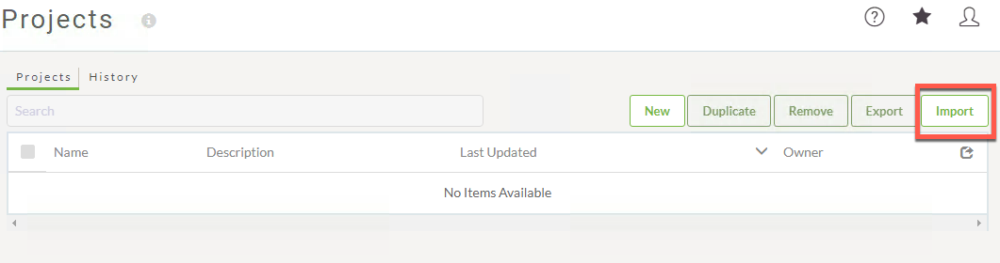
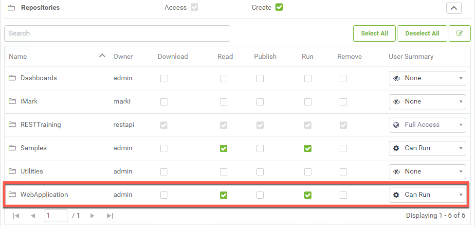
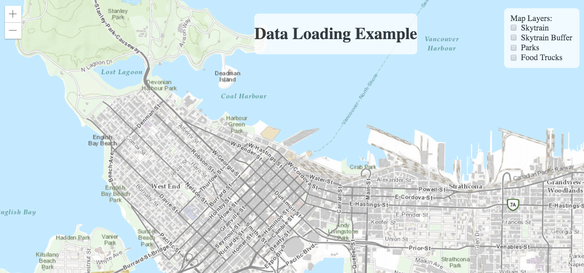

<table style="border-spacing: 0px;border-collapse: collapse;font-family:serif">
<tr>
<td width=25% style="vertical-align:middle;background-color:darkorange;border: 2px solid darkorange">
<i class="fa fa-cogs fa-lg fa-pull-left fa-fw" style="color:white;padding-right: 12px;vertical-align:text-top"></i>
Exercise 17
</td>
<td style="border: 2px solid darkorange;background-color:darkorange;color:white">
Data Visualization 
</td>
</tr>

<tr>
<td style="border: 1px solid darkorange; font-weight: bold">Data</td>
<td style="border: 1px solid darkorange">None</td>
</tr>

<tr>
<td style="border: 1px solid darkorange; font-weight: bold">Overall Goal</td>
<td style="border: 1px solid darkorange">To use the Esri JavaScript and the Power of FME to create and easy to use and interesting map with live data. </td>
</tr>

<tr>
<td style="border: 1px solid darkorange; font-weight: bold">Demonstrates</td>
<td style="border: 1px solid darkorange">How to use Esri JavaScript, Data Streaming Direct URLs, and online resources in a workspace. </td>
</tr>

<tr>
<td style="border: 1px solid darkorange; font-weight: bold">Completed HTML </td>
<td style="border: 1px solid darkorange">C:\FMEData2018\Resources\RESTAPI\myThirdApp\myThirdApp.html  </td>
</tr>

<tr>
<td style="border: 1px solid darkorange; font-weight: bold"> Project </td>
<td style="border: 1px solid darkorange"> C:\FMEData2018\Resources\RESTAPI\myThirdApp\WebApplication.fsproject </td>
</tr>

</table>

This exercise was made to demonstrate how to stream KML Layers produced from workspaces to an online map. This method can be used for data that is consistently updated as every time the layer is activated the workspace will run and produce a new KML.

<!--Warning Section-->

<table style="border-spacing: 0px">
<tr>
<td style="vertical-align:middle;background-color:darkorange;border: 2px solid darkorange">
<i class="fa fa-exclamation-triangle fa-lg fa-pull-left fa-fw" style="color:white;padding-right: 12px;vertical-align:text-top"></i>
WARNING
</td>
</tr>

<tr>
<td style="border: 1px solid darkorange">

For this exercise to work properly you will need to have completed <a href="https://safe-software.gitbooks.io/fme-server-rest-api-training-2018/content/FMESERVER_RESTAPI8Session2/8.3.Exercise.SettingUp.html">Exercise 14</a> or have an existing web server for testing.

</td>
</tr>
</table>

 **1) Create a new file in a Text Editor**

Create a new file in a text editor, and save it as myThirdApp.html. Save it in the REST API folder located here: FMEData2018/Resources/RESTAPI.

 **2) Paste the following head code into your new file**

    <head>
      <meta charset="utf-8">
      <meta name="viewport" content="initial-scale=1,maximum-scale=1,user-scalable=no">
      <title>Data Loading Example</title>

      <link rel="stylesheet" href="https://js.arcgis.com/4.7/esri/css/main.css">
      
    <head>

This is the code needed to access the ESRI JavaScript that we will be using to host the KML Layers streamed to the application through FME Server.

 **3) Paste the Following Body into the HTML Page**

    <body>
       

       
 <h1> Data Loading Example </h1> 

       
         <legend> Map Layers: </legend>
         <input type="checkbox" id="streetsLyr"> Skytrain
          
         <input type="checkbox" id="skytrainbufferLyr"> Skytrain Buffer
          
         <input type="checkbox" id="parksLyr"> Parks
          
         <input type="checkbox" id="foodLyr"> Food Trucks

       
     </body>

The above code creates a title and checkbox list on the web page. These checkboxes will represent the layers of the map. Once a checkbox is activated; this will trigger a function to enable the data streaming.

 **4) Below the body tag paste the following Styling Components in**

<table style="border-spacing: 0px">
<tr>
<td style="vertical-align:middle;background-color:darkorange;border: 2px solid darkorange">
<i class="fa fa-info-circle fa-lg fa-pull-left fa-fw" style="color:white;padding-right: 12px;vertical-align:text-top"></i>
TIP
</td>
</tr>

<tr>
<td style="border: 1px solid darkorange">

*The following CSS is sourced from <a href="https://developers.arcgis.com/javascript/latest/sample-code/intro-layers/index.html">ArcGIS Introduction to Layers</a>*

</td>
</tr>
</table>

      

 **5) Navigate to the Projects in your FME Server**

Open the FME Server by visiting localhost/fmeserver. Next, look on the left-hand panel and click Projects.

 **6) Import the Project Folders**

Click the Import button.

The next step is to upload the Project Folder that contains the repository and workspaces needed for this web application.

Go to the File Explorer window. Navigate the FMEData2018 folder, click Resources, select REST API, then myThirdApp.

In this folder, there are two .fsproject files. The WebApplication project contains the workspaces and the repository needed for the web application.

Additionally, upload the BestPracticeAnalysis.fsproject file. This project folder contains additional images for use with the KMLStyler. This allows the user to have more symbolization options when creating KML.

Drag and Drop both files into the drag and drop area. Then click Import.

 **7) Give the Guest Account Access to the WebApplication repository**

To give the repository guest permissions, you will have to access your FME Server. First, look on the left-hand panel
of your FME Server. Find Security and then look for Users.

Once on the Users page **click guest.**

Scroll down to the permissions and expand the repositories tab. Then
check the read and run permissions.

 **8) Give the restapi Account Access to the WebApplication repository (if you created this user earlier in the course)**

The restapi user was created in [exercise 1](https://safe-software.gitbooks.io/fme-server-rest-api-training-2018/FMESERVER_RESTAPI1Overview/1.5.UserCreation.html) of the course to reduce any security risks associated with the using the admin token.

On the same Users page **click restapi.**

Scroll down to the permissions and expand the repositories tab. Then, check the read and run permissions. Even if the restapi account imported the Project. It isn't guaranteed that the user will automatically be granted access to the files.

 **9) Add the following code above the CSS but within the body**

        
This section of imports the ESRI components needed for this Web Application to work. The rest of the code will need to exist within the ALL Future Code Placed here brackets.

 **10) Add the following code after the ALL Future code placed here comment**

 

**Update the IP addresses to your own**

    var transportationLyr = new KMLLayer({
      url: "http://52.55.238.186/fmedatastreaming/WebApplication/webapp.skytrains.fmw?SourceDataset_ESRISHAPE=ftp%3A%2F%2Fwebftp.vancouver.ca%2FOpenData%2Fshape%2Fshape_rapid_transit.zip", // Skytrain Layer
      id: "skytrainlayer",
      visible: false
    });

    var skytrainbufferLyr = new KMLLayer({
      url: "http://52.55.238.186/fmedatastreaming/WebApplication/webapp.skytrainbuffer.fmw?", // Skytrain Buffer Layer
      id: "skytrainbufferlayer",
      visible: false
    });
    var parksLyr = new KMLLayer({
      url: "http://52.55.238.186/fmedatastreaming/WebApplication/webapp.parks.fmw?SourceDataset_ESRISHAPE=ftp%3A%2F%2Fwebftp.vancouver.ca%2FOpenData%2Fshape%2Fpark_polygons_shp.zip&DestDataset_OGCKML=C%3A%5CUsers%5CAdministrator%5CDocuments%5CFME%5CWorkspaces%5Coutput.kml", // Parks Layer
      id: "parkslayer",
      visible: false
    });
    var foodLyr = new KMLLayer({
      url: "http://52.55.238.186/fmedatastreaming/WebApplication/webapp.foodTrucks.fmw?DestDataset_OGCKML=%24(FME_SHAREDRESOURCE_DATA)%2FSienna%2FOutput%2FfoodTrucks.kml", // Food Truck Layer
      id: "foodlayer",
      visible: false
    });

**Ensure to update the Direct URLs with your Public IP Address**

This code is for the layers of the map. Here, we are using the ESRI function KMLLayer, this will create a layer from the direct URL from the server. For each layer, an id is required. Additionally, the visibility should be initially set to false.

 **11) Add the following code to initialize the basemap**

      /*****************************************************************
              * Initialize the basemap
      *****************************************************************/
              var map = new Map({
               basemap: "topo"
             });
 **12) Add the code to add the layers to the map**

      /*****************************************************************
               * Add the layers to the map
      *****************************************************************/
               map.add(transportationLyr);
               map.add(skytrainbufferLyr);
               map.add(parksLyr);
               map.add(foodLyr);

 **13) Add the code to adjust the view of the basemap**

      /*****************************************************************
        * Creates the view for the basemap, adjusts the center and the zoom level.
        *****************************************************************/
               var view = new MapView({
                container: "viewDiv",
                map: map,
                center: [-123.10, 49.268],
                zoom: 14
              });
 **14) Add the Code to create the toggle variables**

      /*****************************************************************
        * Variables are created for the Toggles, these
        * toggles are attached to the ids assigned to the checkboxes
        *****************************************************************/

               var streetsLyrToggle = dom.byId("streetsLyr");
               var skytrainbufferLyrToggle = dom.byId("skytrainbufferLyr");
               var parksLyrToggle = dom.byId("parksLyr");
               var foodLyrToggle = dom.byId("foodLyr");

 **15) Add the Code to toggle the visibility of layers**

      /*****************************************************************
      * The following code manipulates the visibility of the layer.
      * When the layer is checked then the layer becomes visible.
      *******************************************************************/
              on(streetsLyrToggle, "change", function() {
               transportationLyr.visible = streetsLyrToggle.checked;
             });
              on(skytrainbufferLyrToggle, "change", function() {
               skytrainbufferLyr.visible = skytrainbufferLyrToggle.checked;
             });
              on(parksLyrToggle, "change", function() {
               parksLyr.visible = parksLyrToggle.checked;
             });
              on(foodLyrToggle, "change", function() {
               foodLyr.visible = foodLyrToggle.checked;
             })
 **16) Test the Page!**

When you test out the page, you should be able to select and de-select different layers. Each layer runs a workspace on your FME Server.

---

<!--Exercise Congratulations Section-->

<table style="border-spacing: 0px">
<tr>
<td style="vertical-align:middle;background-color:darkorange;border: 2px solid darkorange">
<i class="fa fa-thumbs-o-up fa-lg fa-pull-left fa-fw" style="color:white;padding-right: 12px;vertical-align:text-top"></i>
CONGRATULATIONS
</td>
</tr>

<tr>
<td style="border: 1px solid darkorange">

By completing this exercise you have learned how to:
 
<ul><li>Use the Esri JavaScript API to create a web application</li>
<li>Use a workspace to generate a KMLLayer </li>
<li>Use directURLs to generate layers on a map </li>

</td>
</tr>
</table>
