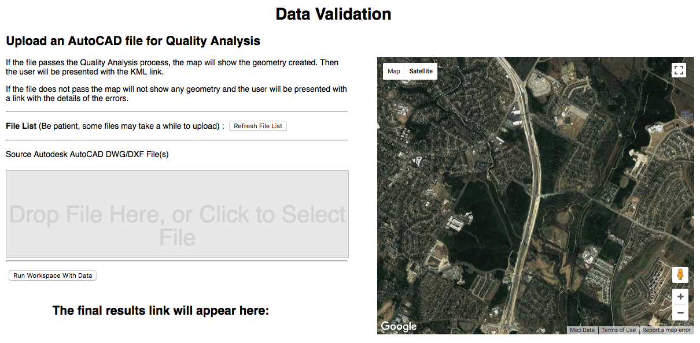

Data Uploads and Downloads
-------------------------------------

 
This exercise builds a Web Application that can accept a file to upload. Then, the application will run the file through a workspace to validate the file. If the file passes it will stream directly to the map in the application and a KML file will be downloaded. If the file does not pass, then no map will appear and an HTML file will be downloaded with the results.  
