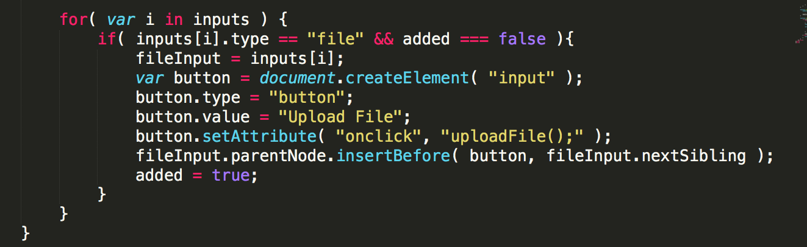
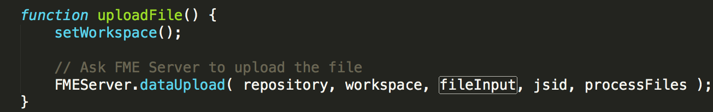
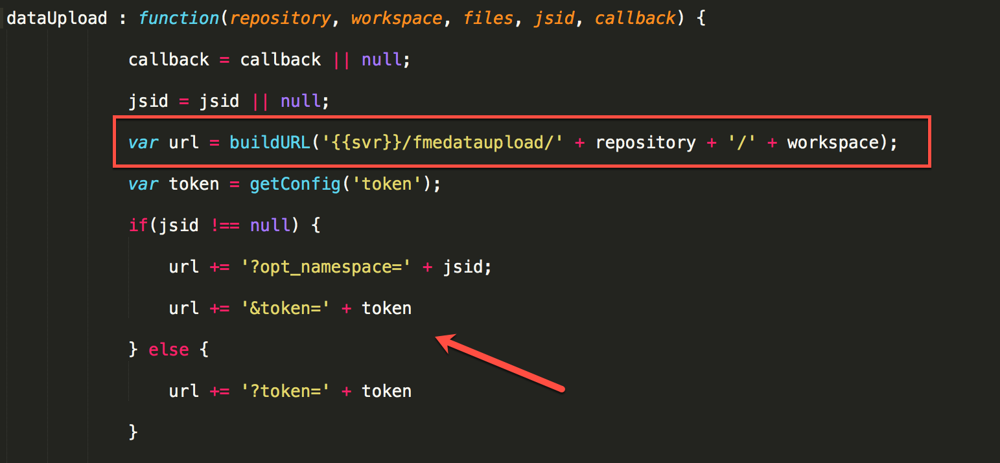
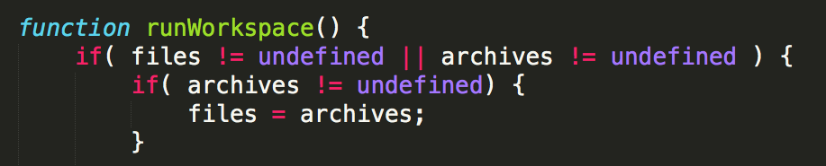
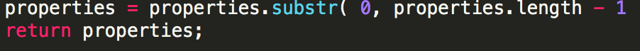
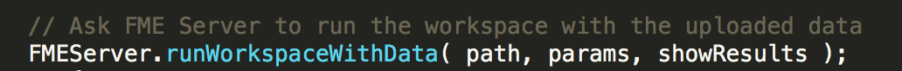
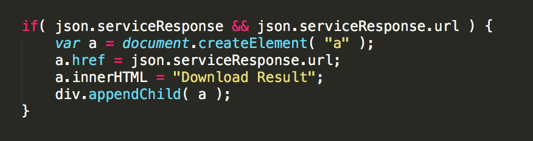
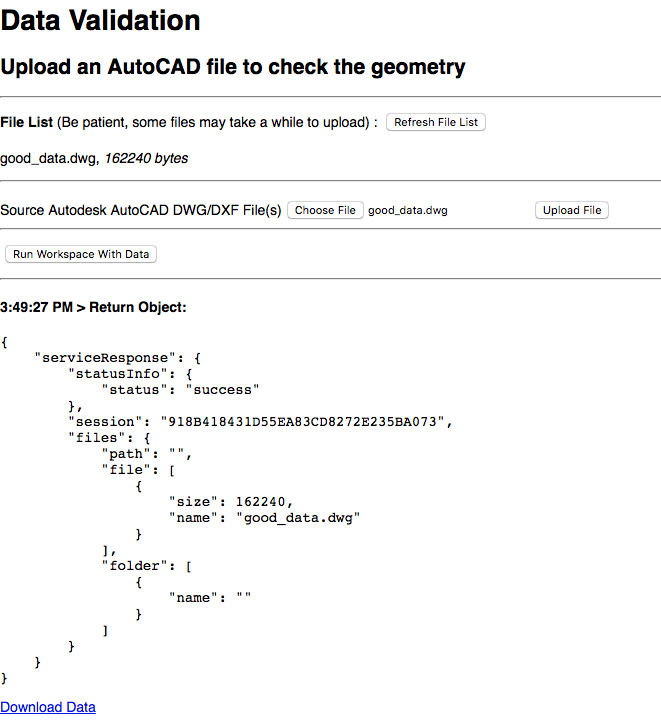

<table style="border-spacing: 0px;border-collapse: collapse;font-family:serif">
<tr>
<td width=25% style="vertical-align:middle;background-color:darkorange;border: 2px solid darkorange">
<i class="fa fa-cogs fa-lg fa-pull-left fa-fw" style="color:white;padding-right: 12px;vertical-align:text-top"></i>
Exercise 18
</td>
<td style="border: 2px solid darkorange;background-color:darkorange;color:white">
 Data Upload and Validation 
</td>
</tr>

<tr>
<td style="border: 1px solid darkorange; font-weight: bold">Data</td>
<td style="border: 1px solid darkorange">None</td>
</tr>

<tr>
<td style="border: 1px solid darkorange; font-weight: bold">Overall Goal</td>
<td style="border: 1px solid darkorange"> To display how to use the FME Server JavaScript API to upload files to the FME Server and run them through a workspace.  </td>
</tr>

<tr>
<td style="border: 1px solid darkorange; font-weight: bold">Demonstrates</td>
<td style="border: 1px solid darkorange"> How to use the getSession, generateOptions, dataUpload functions in a web application. </td>
</tr>

<tr>
<td style="border: 1px solid darkorange; font-weight: bold">Completed HTML </td>
<td style="border: 1px solid darkorange">C:\FMEData2018\Resources\RESTAPI\myFourthApp\myFourthApp.html  </td>
</tr>

<tr>
<td style="border: 1px solid darkorange; font-weight: bold"> Completed workspaces </td>
<td style="border: 1px solid darkorange"> C:\FMEData2018\Resources\RESTAPI\myFourthApp\webapp.kml.fmw
C:\FMEData2018\Resources\RESTAPI\myFourthApp\webapp.downloadresults.fmw
</td>
</tr>

</table>

**1) Create a new HTML document and paste in this content:**

    <!-- Upload Files In Session Example from FME Server Developer Playground -->
    <!doctype html>
    <html>
    <head>
      <meta charset="UTF-8">
    	<title>Upload Files In Session Example from FME Server Developer Playground</title>
    	<!-- Styles for example -->
    	<link rel="stylesheet" href="https://playground.fmeserver.com/css/FMEServerExamples.css" type="text/css" />
    	<!-- Include FMEServer.js -->
    	
    </head>
    <body>
    	<form id="exampleForm">
    		<label>Repository: </label>
    		<input id="repository-name" type="text" name="repository" value="Samples" /> 
    		<label>Workspace: </label>
    		<input id="workspace-name" type="text" name="workspace" value="easyTranslator.fmw" />
    	</form>
    	

    	<label><b>File List </b>(Be patient, some files may take a while to upload) : </label>
    	<input id="refresh" type="button" onclick="getFiles();" value="Refresh File List" />
    	

    	

    	<form id="options"></form>
    	

    	<input type="button" onclick="runWorkspace();" value="Run Workspace With Data" />
      

    	

    </body>
    </html>

The above code contains the head section which links to a stylesheet and
the JavaScript API.

**2) Save a blank file as myFourthApp.html**

Navigate to the C:/FMEData2018/Resources/RESTAPI and save the file as myFourthApp.html.

####  Initialize the Server and Set Variables

**3) Paste the following JavaScript into the file within the body tag.**

    

This section of the code gives an overview of the steps taken to get
information about the workspace before it is run. First, we connect to
the server. Then we set the workspace based on the users input, we
generate a session id or JSID, and then we generate the parameters for
the workspace.

If you are using your own FME Server and are having issues with connecting your server,
ensure that your server URL is in the format
http://yourserver. Issues can occur
if you have a trailing statement like http://YOURSERVER/fmeserver.

**4) Add the setWorkspace function within in the script tags**

The first function called is the setWorkspace function, which can now be
added to our application.

    function setWorkspace() {
    	    repository = document.getElementById( "repository-name").value.trim();
            workspace = document.getElementById("workspace-name").value.trim();
    	}

This section gets the information that the user input in the form to
create variables for the repository and workspace.

Next, we call a function in the JavaScript 1.2 Library, **getSession**.
This function requires the repository, workspace, and a callback to run.
We need the getSession function to generate a random number from the
server. This keeps the session unique and prevents multiple users from
overwriting the same files. This random number is referred to as the
JSID in the other functions. Then JSID is set as the namespace in the
data upload function. If namespace specified, uploads are placed in a
folder named <value>. If not specified, uploads are placed in a folder
named after the name of the uploading
http://docs.safe.com/fme/2018.1/html/FME_Server_Documentation/Content/ReferenceManual/service_dataupload.htm.

*12.1.0 Get Session Function*

**5) Add the generateOptions function**

Next, we use the **generateOptions function** insert this below the last
function.

    function generateOptions() {
    			setWorkspace();

    			// Get the workspace parameters from FME Server
    			FMEServer.getWorkspaceParameters( repository, workspace, buildOptions );
    		}

This function uses the setWorkspace function to set the variables. Then
it calls getWorkspaceParameters which gets workspaces and puts the incoming
JSON into the buildOptions callback.

Next, we use the callback from the getSession call to create the new
function setVars.

**6) Add the setVars function**

    function setVars( json ) {
    			if( json.serviceResponse.files ) {
    				jsid = json.serviceResponse.session;
    				path = json.serviceResponse.files.folder[0].path;
    			} else {
    				showResults( json );
    			}
    		}

This function finds the session from the response which will be a string
and will be set in the JSID variable. The path is the location of the
file to the server.

**7) Add the buildOptions function**

We need a function to act once the Server has the Workspace Parameters.
This will produce a form that the users can use to enter their
information. So we use the **buildOptions function** which is the
callback from the generateOptions function.

    function buildOptions( json ) {
        // Use the API to build the form items
        FMEServer.generateFormItems( "options", json );

        // Attach the upload button to the form file input
        var inputs = document.getElementById( "options" ).getElementsByTagName( "input" );
        var added = false;

        for( var i in inputs ) {
          if( inputs[i].type == "file" && added === false ){
            fileInput = inputs[i];
            var button = document.createElement( "input" );
            button.type = "button";
            button.value = "Upload File";
            button.setAttribute( "onclick", "uploadFile();" );
            fileInput.parentNode.insertBefore( button, fileInput.nextSibling );
            added = true;
          }
        }
      }

*12.1.1 Build Options function*

First, we generate the form items using the API. There are three
parameters that can be used with this function. The first is a string
that you can put the form elements in. The second is the json object
containing the form data. This was generated in the generateOptions
function. Finally, there is an additional optional parameter, called
items, this lists the attributes you'd like expose. Items should be in
an array format, and by default all of them are exposed.

*12.1.2 Input and added Variables*

This section attaches the upload button to the form file input.

*12.1.3 Upload file button created*

This section checks the input types and if an input is equal to file and
is not already added, it creates a button and input for the file. The
variable fileInput is set to the file. This function also this button is
linked to the FME Server function, uploadFile which will upload a file.

#### Add the JavaScript for the File Upload

**8) Add the uploadFile function**

    function uploadFile() {
    			setWorkspace();

    			// Ask FME Server to upload the file
    			FMEServer.dataUpload( repository, workspace, fileInput, jsid, processFiles );
    		}

*12.1.4. Upload File Function*

The **dataUpload** function documentation can be found here:
http://docs.safe.com/fme/2018.1/html/FME_Server_Documentation/Content/ReferenceManual/service_dataupload.htm.

This function requires the repository, workspace, fileInput (which we
obtained from the buildOptions function, and the JSID (which we obtained
from the getSession function). The proccessFiles parameter is the
callback for this function.

If you look at the function in the JavaScript Library, found here:
http://api.fmeserver.com/js/v1.2/FMEServer.js.

*12.1.5. Upload File Function*

This is what the function looks like in the JavaScript library. It
builds the url based on the JSID which was randomly generated in the
getSession call. In the screen capture above the URL begins with the
repository and workspace, which is represented by the box. Then the URL
is added to using the JSID and token variable, which is represented by
the arrow.

#### Add the JavaScript for the Data Download

Once the user clicks the "Refresh File List" button, the next function
(getFiles) will be activated.

**9) Add the getFiles function**

    function getFiles() {
    			// Ask FME Server for the list of uploaded files
    			FMEServer.getDataUploads( repository, workspace, jsid, processFiles );
    		}

This function is similar to to the structure of the previous call. It
just checks the server using the JSID to see what files have been
uploaded.

**10) Add the proccessFiles function**
Next, we can use the function **proccessFiles** which is the callback
for the getFiles and uploadFiles function.

      function processFiles( json ) {
        var list = document.getElementById( "fileList" );
        if( json.serviceResponse != undefined ) {
          list.innerHTML = "";
          files = json.serviceResponse.files.file;
          for( var file in files ){
            list.innerHTML += "
"+files[file].name+", <em>"+files[file].size+" bytes</em>
";
          }
          archives = json.serviceResponse.files.archive;
          for( var archive in archives ){
            list.innerHTML += "
"+archives[archive].name+", <em>"+archives[archive].size+" bytes</em>
";
          }
          showResults( json );
        } else {
          // Required for proper list refresh on IE9 below and older browsers
          setTimeout("getFiles();", 2000);
        }
      }

This function takes the server responses from the previous functions and
sends it to the show results function. showResults displays what file
was loaded and the file size.

Once the user, has entered their parameters they can click the Run
Workspace with Data function.

This activates the runWorkspace function.

**11) Add the runWorkspace function**

      function runWorkspace() {
          if( files != undefined || archives != undefined ) {
            if( archives != undefined) {
              files = archives;
            }
            setWorkspace();

            var params = {
              filename : fileInput.name,
              files : files,
              params : processParams()
            }
            // Ask FME Server to run the workspace with the uploaded data
            FMEServer.runWorkspaceWithData( path, params, showResults );
          } else {
            alert( "No Files Uploaded.  Please upload a file." );
          }
        }

*12.1.6. Run Workspace*

runWorkspace checks if the files are present currently or in the
archives. If the files are in the achieved variable they are set to the
files variable.

*12.1.7. Set Workspace*

From here the set workspace function is called which is already in your
application.

*12.1.8. Params Variable*

Next in the function, it sets up the parameters to run the workspace,
the filenames and files are input. However, the params require a new
function called processParams.

**12) Add the processParams function**
This can be inserted above the runWorkspace function.

    function processParams() {
        var inputs = document.getElementById( "options" ).getElementsByTagName( "input" );
        var selects = document.getElementById( "options" ).getElementsByTagName( "select" );
        var options = [];
        var properties = "";

        // Convert HTML NodeList types to regular array types
        inputs = Array.prototype.slice.call( inputs );
        selects = Array.prototype.slice.call( selects );

        // Merge the regular arrays
        options = inputs.concat( selects );

        for( var opt in options ) {
          var option = options[opt];
          if( option.value && option.name != fileInput.name && option.type != "button" ) {
            properties += option.name+"=";
            if( option.type == "select" ) {
              properties += option[ option.selectedIndex ].value;
            } else {
              properties += option.value;
            }
            properties += "&";
          }
        }
        properties = properties.substr( 0, properties.length - 1 );
        return properties;
      }

The first section of the function sets the variables for the inputs,
selects, options, and properties. Inputs and selects are turned into
arrays and the arrays are merged together into the options array. After
this we have a for loop.

*12.1.9. Process Options*

This for loop scans the options. Then it formats the options so they are
in the proper notation for the params variable. The first if statement,
checks to see if the option name and value do not equal the file input
name. This indicates that the option is not the file. Then, it checks
that the option type is not a button. If this is true the parameter is
an input box and the properties and the option name are added in the
proper format. If the option type is a select, then the selected option
value is added in the proper notation.

12.1.10 *Return Properties*

Then, in the properties the trailing, ampersand (&), is removed. After
this function is run to properly set up the properties then we return to
the runWorkspace function.

*12.1.11 Run Workspace function*

**13) Add the showResults function**

This function builds the call with the path and parameters and put the
information in the showResults function.

    function showResults( json ) {
        // The following is to write out the return object
        // for visualization of the example
        var div = document.createElement( "div" );
        div.innerHTML = "
<h4>"+new Date().toLocaleTimeString()+" &gt; Return Object:</h4>";
        if( json.serviceResponse && json.serviceResponse.url ) {
          var a = document.createElement( "a" );
          a.href = json.serviceResponse.url;
          a.innerHTML = "Download Result";
          div.appendChild( a );
        }
        var pre = document.createElement( "pre" );
        pre.innerHTML = JSON.stringify(json, undefined, 4);
        div.appendChild( pre );
        var results = document.getElementById( "results" )
        results.insertBefore( div, results.firstChild );
      }

This function creates a new div and presents the result to the user.

*12.1.12 Download Result*

If there is a serviceResponse and URL we know it contains the download
link. So the function will create a button that links to the URL for the
data download.

*12.1.13 Results are printed*

If not, then the program will still print out the JSON to the user under
the heading results.

**14) Run the Program!**

*12.1.14a Upload the file you would like to translate*

*12.1.14b Fill in the input and output coordinate systems. Then run the workspace*

*12.1.14c Review the new file*

### Customize for Data Validation

**Include link to workspace**

In this example you are given a workspace and two tester files to work
with and create a data validation app. In the project file we recently uploaded to the FME Server, it included an additional workspace for this exercise. We are now going to customize the web page for data validation.

**15) Change the Repository and Workspace**
-   Change the Repository and Workspace in your server

<form id="exampleForm">

<label>Repository: </label>
<input id="repository-name" type="text" name="repository" value=”WebApplication"> 
<label>Workspace: </label>
  <input id="workspace-name" type="text" name="workspace" value="webapp.kml.fmw" >
</form>

 

**16) Select the good_data.dwg file**

Click Choose File, then navigate  to C:/Resources/RESTAPI/Data/good_data

Upload the file by clicking Upload File.

**17) Click Run Workspace With Data**

You'll notice a few things we will have to fix to get this app to work properly:

- Eliminate the input boxes for the repository and workspace- this
    information can be hardcoded in.
-   Change the wording to make the file more descriptive.

-   Stream the HTML back to the page, have a data download link for the new file.

### Hard Code the Workspace

**18) Delete the following section**

    <form id="exampleForm">
    		<label>Repository: </label>
    		<input id="repository-name" type="text" name="repository" value="Samples" /> 
    		<label>Workspace: </label>
    		<input id="workspace-name" type="text" name="workspace" value="easyTranslator.fmw" />
    	</form>
    	

**19) Change the setWorkspace function**

    function setWorkspace() {
    			repository = "WebApplication";
    			workspace = "webapp.kml.fmw";

    		}

**20) Save and Test!**

The current application looks like this:

*12.1.14 Web Application*

**21) Add the proper headings and descriptors**

Let's add some HTML to make the app more informative.

Add this code in the HTML above the File List Section:

    <h1> Data Validation </h1>
    <h2> Upload an AutoCAD file for Quality Analysis </h2>

**Have a Data Streaming Link with the Results**

**22) Delete the processParams function.**

This function is no longer needed since there is only one workspace with
one parameter so there is no need to include it.

**23) In the processFiles function add a line of code:**

    function processFiles( json ) {

    			var list = document.getElementById( "fileList" );

    			if( json.serviceResponse != undefined ) {

    				list.innerHTML = "";

    				files = json.serviceResponse.files.file;

    				for( var file in files ){

    					list.innerHTML += "
"+files[file].name+", <em>"+files[file].size+" bytes</em>
";

    					filename=files[file].name; //<--Add this

    				}

This adds the variable filename which will be used in our data streaming
call.

**24) Comment out the following code:**

Next, we need to comment out or delete the following code in the
runWorkspace function.

    function runWorkspace() {
    			if( files != undefined || archives != undefined ) {
    				if( archives != undefined) {
    					files = archives;
    				}

    				setWorkspace();

    				//var params = {
    				//	filename : fileInput.name,
    				//	files : files,
    				//	params : processParams()
    			    //	}
    		//FMEServer.runWorkspaceWithData( path, params, showResults );

    			} else {
    				alert( "No Files Uploaded.  Please upload a file." );
    			}

    		}
**25) Paste the following code :**

Now we can add the code to the runWorkspace function to add the data
streaming component. This belongs directly under setWorkspace();

         resultUrl= server + '/fmedatastreaming/' + repository + '/' + workspace + '?SourceDataset_ACAD=%24(FME_SHAREDRESOURCE_SYSTEM)%2Ftemp%2Fupload%2F' + repository + '%2F' + workspace + '%2F' +  jsid + '%2F' + filename;

So how this works because the URL created features, the repository and
workspace imported from the setWorkspace function. Then the parameters
so the upload is used. The uploaded file will be stored in the shared
resource folder under system.

This is an example of a file path to an uploaded file.

*12.1.15 The File Path*

If a file is uploaded it will always fall under the Resources \> System
\> temp \> upload folder.

Then it will be stored in folders with the name of the repository and
workspace used. Finally, a folder is created for each session under the
JSID. Then, finally the filename is needed for the url.

**26) Paste the following code in the setWorkspace function:**

      function setWorkspace() {
         repository = "WebApplication";
         workspace = "webapp.kml.fmw";
         server = "http://localhost";// <---- Add this
       }

**27) Add the following code into the runWorkspace function**

Then add the following code to the runWorkspace function directly under the resultUrl.

    var finalResults = document.getElementById( "finalResults" )
          finalResults.innerHTML += ('<a href="' + resultUrl + '">' + 'Display Result </a>')
            document.body.appendChild( finalResults );    

**28) Then test the code!**

*12.1.16 Web Application with the Workspace Hard Coded.*

**The current code should look like this:**

      <!-- Upload Files In Session Example from FME Server Developer Playground -->
      <!doctype html>
      <html>
      <head>
        <meta charset="UTF-8">
          <title>Upload Files In Session Example from FME Server Developer Playground</title>
          <!-- Styles for example -->
          <link rel="stylesheet" href="https://playground.fmeserver.com/css/FMEServerExamples.css" type="text/css" />
          <!-- Include FMEServer.js -->
          
      </head>
      <body>
      	<h1> Data Validation </h1>
      <h2> Upload an AutoCAD file for Quality Analysis </h2>

          <label><b>File List </b>(Be patient, some files may take a while to upload) : </label>
          <input id="refresh" type="button" onclick="getFiles();" value="Refresh File List" />
          

          

          <form id="options"></form>
          

          <input type="button" onclick="runWorkspace();" value="Run Workspace With Data" />
          

      	

      	

      </body>
      </html>

### Add a Map for Data Streaming

This workspace creates creates an HTML file if the data is not valid to make the user aware where the issues exist. However, if the data is valid it will be returned as an KML which can be used to stream back website.

**29) Add the following Google Maps API information**

To the head section add:

      <!-- The following are Required for Google Maps Integration -->
      	

**30) Add the following style components**
After this add the following styling components to the document (they
should still be in the header):

        

**31) Delete the current HTML (but not the JavaScript) and paste in the
following:**

        

        
 <h1> Data Validation </h1> 

          

        <h2> Upload an AutoCAD file for Quality Analysis </h2>
          
 This web page will accept a file uploaded by a user. Then using the FME Server the data will be used in a validation workspace.
         
        If the file passes the validation and the user clicks  "Display Results on Map" then the geometry will appear in all blue.
         
        If the file passes the validation and the user clicks  "Download Results" then a download link will appear. The download link will contain an HTML
        file that says "All data has passed the validation tests."
         
          If the file fails the validation and the user clicks  "Display Results on Map" then the geometry will appear in all blue and the errors will appear in red.
         
        If the file fails the validation and the user clicks  "Download Results" then a download link will appear. The download link will contain an HTML
        file with a full report on what components did not pass the tests.
        

        <label><b>File List </b>(Be patient, some files may take a while to upload) : </label>
        <input id="refresh" type="button" onclick="getFiles();" value="Refresh File List" />
        

        

        <form id="options"></form>
        

        <input type="button" onclick="streamResults();" value="Display Results on Map" />
        <input type="button" onclick="downloadWorkspace();" value="Download Results" />
        <input type="button" onclick="newSession();" value="Reset Session" />

        <!-- End of text div -->
        

        

        
 

        

        

        <h2> The final results link will appear here: </h2> 
        

        <!-- End of finalResults -->
        

        <!-- End of allWeb -->
        

**32) Add the following JavaScript Code**

    
          <!-- The following are Required for Google Maps Integration -->
          	
    	  

    </head>
    <body>

    	      

            
 <h1> Data Validation </h1> 

              

            <h2> Upload an AutoCAD file for Quality Analysis </h2>
            
 This web page will accept a file uploaded by a user. Then using the FME Server the data will be used in a validation workspace.
             
            If the file passes the validation and the user clicks  "Display Results on Map" then the geometry will appear in all blue.
             
            If the file passes the validation and the user clicks  "Download Results" then a download link will appear. The download link will contain an HTML
            file that says "All data has passed the validation tests."
             
              If the file fails the validation and the user clicks  "Display Results on Map" then the geometry will appear in all blue and the errors will appear in red.
             
            If the file fails the validation and the user clicks  "Download Results" then a download link will appear. The download link will contain an HTML
            file with a full report on what components did not pass the tests.
            

            <label><b>File List </b>(Be patient, some files may take a while to upload) : </label>
            <input id="refresh" type="button" onclick="getFiles();" value="Refresh File List" />
            

            

            <form id="options"></form>
            

            <input type="button" onclick="streamResults();" value="Display Results on Map" />
            <input type="button" onclick="downloadWorkspace();" value="Download Results" />
            <input type="button" onclick="newSession();" value="Reset Session" />

            <!-- End of text div -->
            

            

            
 

            

            

            <h2> The final results link will appear here: </h2> 
            

            <!-- End of finalResults -->
            

            <!-- End of allWeb -->
            

    	

    </body>
    </html>

At this point the App will allow you to upload a file and view  it on a Google Maps display or get the results as an HTML that can easily be opened and viewed. Then if the user wanted to upload a new file that user would have to reset the session via the Reset Session button.

*12.1.17a Test the script*

**40) The Final Review.**

Together, we have turned a basic application for easy translation into a more complex application for quality control.  

<!--Exercise Congratulations Section-->

<table style="border-spacing: 0px">
<tr>
<td style="vertical-align:middle;background-color:darkorange;border: 2px solid darkorange">
<i class="fa fa-thumbs-o-up fa-lg fa-pull-left fa-fw" style="color:white;padding-right: 12px;vertical-align:text-top"></i>
CONGRATULATIONS
</td>
</tr>

<tr>
<td style="border: 1px solid darkorange">

By completing this exercise you have learned how to:
 
<ul><li>Use an FME workspace to create a data validation app</li>
<li> Upload a file using the FME Server JavaScript API</li>
<li>Use the getSession and generateOptions functions </li>

</td>
</tr>
</table>
