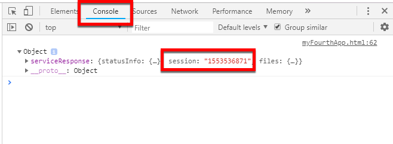
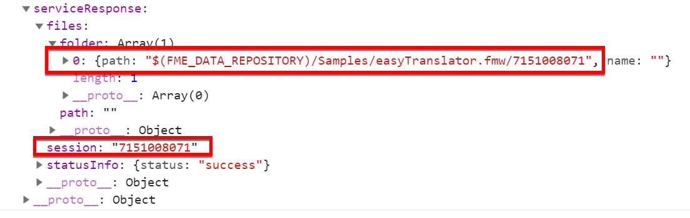
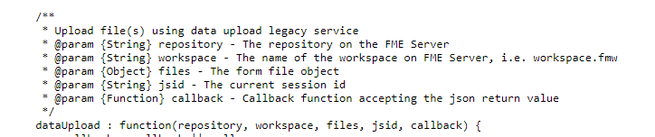
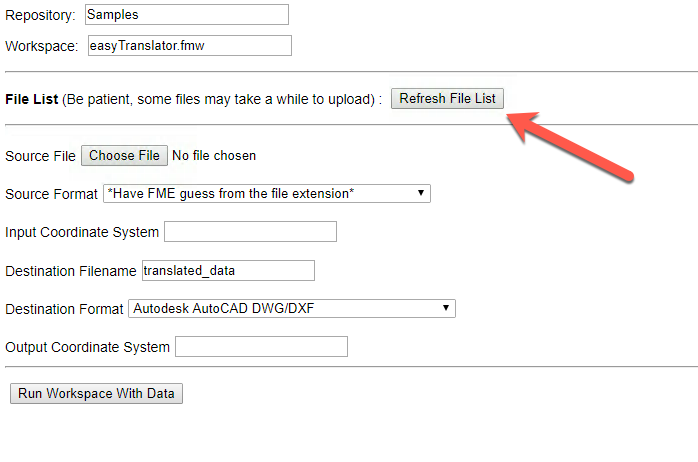
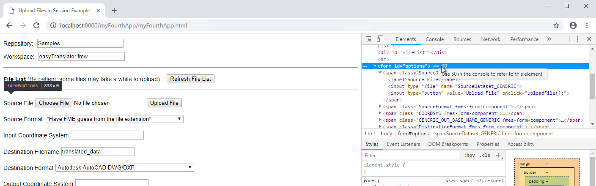
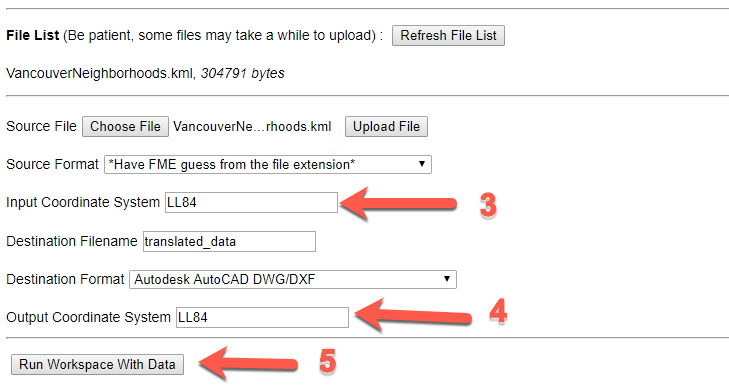
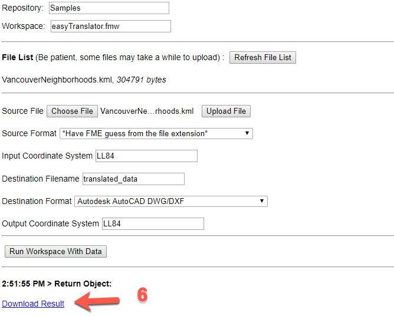

<table style="border-spacing: 0px;border-collapse: collapse;font-family:serif">
<tr>
<td width=25% style="vertical-align:middle;background-color:darkorange;border: 2px solid darkorange">
<i class="fa fa-cogs fa-lg fa-pull-left fa-fw" style="color:white;padding-right: 12px;vertical-align:text-top"></i>
<span style="color:white;font-size:x-large;font-weight: bold">Exercise 20</span>
</td>
<td style="border: 2px solid darkorange;background-color:darkorange;color:white">
<span style="color:white;font-size:x-large;font-weight: bold"> Data Upload and Translation </span>
</td>
</tr>

<tr>
<td style="border: 1px solid darkorange; font-weight: bold">Data</td>
<td style="border: 1px solid darkorange">None</td>
</tr>

<tr>
<td style="border: 1px solid darkorange; font-weight: bold">Overall Goal</td>
<td style="border: 1px solid darkorange"> To display how to use the FME Server JavaScript API to upload files to FME Server and run them through a workspace.  </td>
</tr>

<tr>
<td style="border: 1px solid darkorange; font-weight: bold">Demonstrates</td>
<td style="border: 1px solid darkorange"> How to use the getSession, generateOptions, dataUpload functions in a web application. </td>
</tr>

</table>

This application is meant to demonstrate the data upload function and to explain how it works in FME Server.


<br>**1) Open the JS Fiddle**

Find the code snippet below and click Edit in JSFiddle.

<iframe width="100%" height="300" src="//jsfiddle.net/siennaemery/ej2v6kmd/7/embedded/js,html,result/" allowfullscreen="allowfullscreen" allowpaymentrequest frameborder="0"></iframe>

<br>**2) Review the head section**

In the head section in the HTML tab (lines 1-8). Here, like the past exercises, there are connections to the FME Server Example CSS and the FME Server JavaScript.  

---

####  Set up the Form within the Body

<br>**3) Add a value to the example form**

In this exercise we are creating an interface where a user can choose a workspace that requires data to be uploaded.

To complete this, first the user must choose which workspace they would like to select. Here, we are going to provide a sample value for the user. In our case, this will be the Easy Translator found in the Samples repository.

Find the example form (line 11-16) in the HTML panel. On line 13, under value replace "// Fill in the value" with "Samples". On line 15, under value replace "// Fill in the value " with "easyTranslator.fmw".  

The new text should appear as below.

<iframe width="100%" height="300" src="//jsfiddle.net/siennaemery/5uL6o0t3/13/embedded/html,js,result/" allowfullscreen="allowfullscreen" allowpaymentrequest frameborder="0"></iframe>


 <br>**4) Modify the File List Section**

 Next, in the body section (line 10-27), we have an area to display the files uploaded to FME Server. In this exercise, we are uploading files to FME Server. It is important to note what files have been uploaded. Currently, the FME Server REST API can only handle one file at a time. So, it is best to ensure that only one file has been uploaded.

On line 19, we need to specify the input type for the input. The type should be "button".

```JavaScript
  <label><b>File List </b>(Be patient, some files may take a while to upload) : </label>
  <input id="refresh" type="button" onclick="getFiles();" value="Refresh File List" />
  <div id="fileList"></div>
```
This will create a button to refresh the file list on FME Server. Once, the button is clicked, it activates the getFiles(); function which we will be creating in a later step. After the button we have an empty div which will contain a list of the files uploaded to FME Server.

<iframe width="100%" height="300" src="//jsfiddle.net/siennaemery/n243avhb/6/embedded/html,js,result/" allowfullscreen="allowfullscreen" allowpaymentrequest frameborder="0"></iframe>

<br>**5) Review lines 24 - 28**

On line 22 of the file, we have an empty form with the id of options. This is blank currently, however we will use the buildOptions function later in the exercise to populate the form with workspace parameters.

On line 24, there is a button which the user will press to run the workspace with the data uploaded to FME Server.

On lines 25 and 26 we have two empty divs where the results will appear.   


<br>**6) Add your FME Server Credentials to FMEServer.init**

Switch to the JavaScript tab in the JS Fiddle.

When the window is loaded, there are a few functions that are initiated. Before any of these functions can begin we have to enter our FME Server URL and our token (line 5 and 6). If you are using a training machine you may use https://localhost:8443.  

If you are using your own FME Server and are having issues with connecting your server, ensure that your server URL is in the format
http://yourserver. Issues can occur if you have a trailing statement like http://YOURSERVER/fmeserver.

```JavaScript
<script type = "text/javascript">
var jsid, path, fileInput, files, archives, repository, workspace;

window.onload = function()
{
    FMEServer.init(
    {
        server: "<YOURSERVER>",
        token: "<YOURTOKEN>"
    });

    // Initialize variables
    setWorkspace();

    // Generate a JSID  for the session
    FMEServer.getSession(repository, workspace, setVars);

    // Get options for the workspace
    generateOptions();
};


```
This section of the code gives an overview of the steps taken to get
information about the workspace before it is run. First, we connect to
the server. Then we set the workspace based on the user's input, we
generate a session id or JSID, and then we generate the parameters for
the workspace.

<iframe width="100%" height="300" src="//jsfiddle.net/siennaemery/3s9bnyat/8/embedded/js,html,result/" allowfullscreen="allowfullscreen" allowpaymentrequest frameborder="0"></iframe>


<br>**7) Add the repository and workspace ID to the Set Workspace function**

The first function called is the setWorkspace function. This section gets the information that the user input in the form to
create variables for the repository and workspace.

On line 20 replace //Add repository ID with repository-name. On line 21 replace //Add workspace ID with workspace-name.

```JavaScript
function setWorkspace()
{
  repository = document.getElementById("repository-name").value.trim();
  workspace = document.getElementById("workspace-name").value.trim();
}
```

<iframe width="100%" height="300" src="//jsfiddle.net/siennaemery/m2g7wyj8/3/embedded/js,html,result/" allowfullscreen="allowfullscreen" allowpaymentrequest frameborder="0"></iframe>

<br>**8) Review the getSession function**

Next, we call a function in the JavaScript 1.2 Library, **getSession** (line 13).
This function requires the repository, workspace, and a callback to run.
We need the getSession function to generate a random number from the
server. This keeps the session unique and prevents multiple users from
overwriting the same files. This random number is referred to as the
JSID in the other functions. Then JSID is set as the namespace in the
data upload function. If namespace specified, uploads are placed in a
folder named after the random number generated by FME Server. If not specified, uploads are placed in a folder named after the name of the uploading user. For more information please review the
[Data Upload Documentation](http://docs.safe.com/fme/html/FME_Server_Documentation/Content/ReferenceManual/service_dataupload.htm).


<br>**9) Go to the webpage to review the session ID**

Next, we can see the session ID that was created from the getSession and test that it is refreshing properly. In the setVars function which is the callback from the getSession function, there is console.log (line 32). This will log the JSON that was returned from FME Server. This JSON will contain a number for the session. If we refresh this page the number should change. This number is used to create a folder in the Server with the Data Uploaded.

Click run. Then, right click on the results page, click on Inspect. This will open the developer tools dialog.

In the developer tools dialog, click Console, then open the Object drop down menu. Here, we should see a Session ID.

  

Then, if we hit run again to refresh the page this number should be updated.

Once, the page has been refreshed, we can see what else has been returned from FME Server. Find path by expanding serviceResponse. Then, click the folder tab to find the path. This path is where the file uploaded to FME Server will go to when using this application.



<br>**10) Modify the setVars function**

The setVars function (line 31-39) finds the session from the response which will be a string
and will be set in the JSID variable. The path is the location of the
file to the server. In the last step we found the session from the Console. It was located inside the serviceResponse, under session.

Therefore modify line 34 to read: jsid = json.serviceResponse.session;


```JavaScript
function setVars(json){
    console.log(json);
    if (json.serviceResponse.files)
    {
        jsid = json.serviceResponse.session;
        path = json.serviceResponse.files.folder[0].path;
    }
    else
    {
        showResults(json);
    }
}
```

<iframe width="100%" height="300" src="//jsfiddle.net/siennaemery/8ge6vr7h/3/embedded/js,html,result/" allowfullscreen="allowfullscreen" allowpaymentrequest frameborder="0"></iframe>

<br>**11) Review the generateOptions function**

generateOptions (line 24-29) is the third function that is activated as soon as the window loads. This function uses the setWorkspace function to set the variables. The generateOptions function finds all the parameters in a workspace and sends them to a callback function. In our case, the callback function will be called buildOptions.


<br>**12) Modify the buildOptions function**

The buildOptions function uses generateFormItems (line 43) to create a form with the parameters seen in the previous exercises.

However, now the parameters are more complex because we need add a button for the file input.

On line 46-47, we begin by getting all of the inputs created in generateFormItems. Then, setting added equal to false. This is indicating that the button has not been created yet.

On line 49 we start a for loop to loop through the inputs to check if there is a file input.

On line 50 we need to make a modification to the code. We would like to add the button if, we have a file and the button has not been added already.

Change inputs[i].type == "// Write a file type here" to read inputs[i].type == "file"

On line 52 we need to modify the code to specify what element we would like to add. In our case we would like to add an input element.

Change var button = document.createElement("//Write the element type here "); to var button = document.createElement("input");

The rest of the loop specifies that we are creating a button with a value of "Upload File". Once the button is clicked it will initiate the upload file function. The button is added and therefore the added value is set to true. This will prevent another button from being generated.

```JavaScript
function buildOptions(json)
{
    // Use the API to build the form items
    FMEServer.generateFormItems("options", json);

    // Attach the upload button to the form file input
    var inputs = document.getElementById("options").getElementsByTagName("input");
    var added = false;

    for (var i in inputs)
    {
        if (inputs[i].type == "file" && added === false)
        {
            fileInput = inputs[i];
            var button = document.createElement("input");
            button.type = "button";
            button.value = "Upload File";
            button.setAttribute("onclick", "uploadFile();");
            fileInput.parentNode.insertBefore(button, fileInput.nextSibling);
            added = true;
        }
    }
}
```
<iframe width="100%" height="300" src="//jsfiddle.net/siennaemery/2fx1wrzp/4/embedded/js,html,result/" allowfullscreen="allowfullscreen" allowpaymentrequest frameborder="0"></iframe>

<br>**13) Modify the uploadFile Function**

Next, we have the uploadFile function (lines 62-67). This function will upload the file selected to FME Server. We need to modify the dataUpload function to include the right parameters.

To find the function in the documentation visit the [FME Server JavaScript API.](https://api.fmeserver.com/js/v1.2/FMEServer.js) This page was linked at the beginning of our HTML.

Once you are on the FME Server JavaScript API page. Use Ctrl + F to find the dataUpload function.  



This function requires the repository, workspace, fileInput (which we
obtained from the buildOptions function, and the JSID (which we obtained
from the getSession function). The proccessFiles parameter is the
callback for this function. Enter in these values on line 66.

```JavaScript
function uploadFile()
{
    setWorkspace();

    // Ask FME Server to upload the file
    FMEServer.dataUpload(repository, workspace, fileInput, jsid, processFiles);
}
```


The **dataUpload** function documentation can be found [here.](http://docs.safe.com/fme/html/FME_Server_Documentation/Content/ReferenceManual/service_dataupload.htm)

<iframe width="100%" height="300" src="//jsfiddle.net/siennaemery/wL94hydv/2/embedded/js,html,result/" allowfullscreen="allowfullscreen" allowpaymentrequest frameborder="0"></iframe>


<br>**14) Review the getFiles function**

Once the user clicks the "Refresh File List" button, the next function
(getFiles) will be activated. This function is located on lines 69-72.

This activates the FME Server JavaScript function
getDataUploads.



This function is similar to to the structure of the previous call. It
just checks the server using the JSID to see what files have been
uploaded.

The callback for this function is processFiles.


<br>**15) Modify the proccessFiles function**

Next, we can use the function **proccessFiles** which is the callback
for the getFiles and uploadFiles function.

The processFiles function displays the file name and size in the fileList div.

On line 75, we need to get the div fileList so we can modify the code to say:

var list = document.getElementById("fileList");

```JavaScript
function processFiles(json)
{
    var list = document.getElementById("fileList");
    if (json.serviceResponse != undefined)
    {
        list.innerHTML = "";
        files = json.serviceResponse.files.file;
        for (var file in files)
        {
            list.innerHTML += "<p>" + files[file].name + ", <em>" + files[file].size + " bytes</em></p>";
        }
        archives = json.serviceResponse.files.archive;
        for (var archive in archives)
        {
            list.innerHTML += "<p>" + archives[archive].name + ", <em>" + archives[archive].size + " bytes</em></p>";
        }
        showResults(json);
    }
    else
    {
        // Required for proper list refresh on IE9 below and older browsers
        setTimeout("getFiles();", 2000);
    }
}
```
This function takes the server responses from the previous functions and
sends it to the show results function. showResults displays what file
was loaded and the file size.

Once the user, has entered their parameters they can click the Run
Workspace with Data function.

This activates the runWorkspace function.

<iframe width="100%" height="300" src="//jsfiddle.net/siennaemery/6n9j0skh/4/embedded/js,html,result/" allowfullscreen="allowfullscreen" allowpaymentrequest frameborder="0"></iframe>

<br>**16) Review the runWorkspace function**

```JavaScript
function runWorkspace()
{
    if (files != undefined || archives != undefined)
    {
        if (archives != undefined)
        {
            files = archives;
        }
        setWorkspace();

        var params = {
            filename: fileInput.name,
            files: files,
            params: processParams()
        }
        // Ask FME Server to run the workspace with the uploaded data
        FMEServer.runWorkspaceWithData(path, params, showResults);
    }
    else
    {
        alert("No Files Uploaded.  Please upload a file.");
    }
}
```

runWorkspace (line 122-139) checks if the files are present currently or in the
archives. If the files are in the achieved variable, they are set to the
files variable.

From here the set workspace function is called which is already in our
application.

Next, in the function, it sets up the parameters to run the workspace,
the filenames and files are input. However, the params require a new
function called processParams, which we will be editing in the next step.

Finally, we use the runWorkspaceWithData function to run the workspace. The path was set in the setVars function. The params are from the process params function found in the next function. Then, the callback function is in showResults.

<br>**17) Modify the processParams function**
<br>The processParams function (lines 93-120) gets the parameters from the options form and then sets the variables in a format FME Server will understand.

First, we need to get the selects and inputs from the form created from the generateFormItems functions.

To do this we need to modify the processParams function on lines 94 and 95.

Here, we need to first get the options form where the parameters are held.

Change line 94 and 95 to say:

```JavaScript
var inputs = document.getElementById("options").getElementsByTagName("");
var selects = document.getElementById("options").getElementsByTagName("");
```
If we needed to find where the parameters are kept we need to Inspect the page and find the form id="options".



Next, we need to get the inputs and selects from the options form. We are going to use getElementsByTagName and writing select and input in the quotations. The output results should look like this.

```JavaScript
var inputs = document.getElementById("options").getElementsByTagName("input");
var selects = document.getElementById("options").getElementsByTagName("select");
```

The full function will look like this:


```JavaScript

function processParams()
{
    var inputs = document.getElementById("options").getElementsByTagName("input");
    var selects = document.getElementById("options").getElementsByTagName("select");
    var options = [];
    var properties = "";

    // Convert HTML NodeList types to regular array types
    inputs = Array.prototype.slice.call(inputs);
    selects = Array.prototype.slice.call(selects);

    // Merge the regular arrays
    options = inputs.concat(selects);

    for (var opt in options)
    {
        var option = options[opt];
        if (option.value && option.name != fileInput.name && option.type != "button")
        {
            properties += option.name + "=";
            if (option.type == "select")
            {
                properties += option[option.selectedIndex].value;
            }
            else
            {
                properties += option.value;
            }
            properties += "&";
        }
    }
    properties = properties.substr(0, properties.length - 1);
    return properties;
}
```

The first section of the function sets the variables for the inputs,
selects, options, and properties. Inputs and selects are turned into
arrays, and the arrays are merged together into the options array. After
this, we have a for loop.

This for loop scans the options. Then it formats the options, so they are
in the proper notation for the params variable. The first if statement,
checks to see if the option name and value do not equal the file input
name. This indicates that the option is not the file. Then, it checks
that the option type is not a button. If this is true, the parameter is
an input box, and the properties and the option name are added in the
proper format. If the option type is select, then the selected option
value is added in the proper notation.

Then, in the properties the trailing, ampersand (&), is removed. After
this function is run to properly set up the parameters. These parameters can now be used in the runWorkspace function.


<br>**18) Review the showResults function**

The showResults  (line 141-157) builds the call with the path and parameters and then puts the information in the showResults function.


This function creates a new div and presents the result to the user.

```JavaScript

if (json.serviceResponse && json.serviceResponse.url) {
    var a = document.createElement("a");
    a.href = json.serviceResponse.url;
    a.innerHTML = "Download Result";
    div.appendChild(a);
  }
```


If there is a serviceResponse and URL, we know it contains the download
link. So the function will create a button that links to the URL for the
data download.

```JavaScript
var pre = document.createElement("pre");
 pre.innerHTML = JSON.stringify(json, undefined, 4);
 div.appendChild(pre);
 var results = document.getElementById("results")
 results.insertBefore(div, results.firstChild);


```


If not, then the program will still print out the JSON to the user under
the heading results.

Save the JSFiddle.

<iframe width="100%" height="300" src="//jsfiddle.net/siennaemery/6n9j0skh/5/embedded/js,html,result/" allowfullscreen="allowfullscreen" allowpaymentrequest frameborder="0"></iframe>

<br>**19) Run the web application!**

Click Run!

First, the Choose File button.

Select the KML located here:

C:\FMEData2019\Data\Boundaries\VancouverNeighborhoods.kml

Then, select Upload File.


Under **Input Coordinate System**: write LL84

Under **Output Coordinate System**: write LL84

Then, select Run Workspace with Data.



<br> After Run Workspace with Data has been select we can click the Download Result function.



<!--Exercise Congratulations Section-->

<table style="border-spacing: 0px">
<tr>
<td style="vertical-align:middle;background-color:darkorange;border: 2px solid darkorange">
<i class="fa fa-thumbs-o-up fa-lg fa-pull-left fa-fw" style="color:white;padding-right: 12px;vertical-align:text-top"></i>
<span style="color:white;font-size:x-large;font-weight: bold;font-family:serif">CONGRATULATIONS</span>
</td>
</tr>

<tr>
<td style="border: 1px solid darkorange">
<span style="font-family:serif; font-style:italic; font-size:larger">
By completing this exercise you have learned how to:
<br>
<ul><li>Create an application to translate data</li>
<li> Upload a file using the FME Server JavaScript API</li>
<li>Use the getSession and generateOptions functions </li>


</span>
</td>
</tr>
</table>
