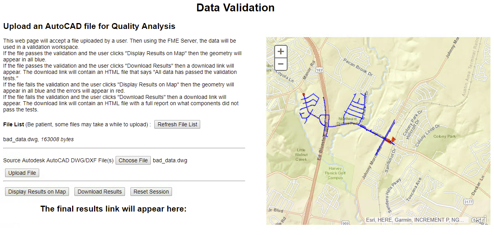

<table style="border-spacing: 0px;border-collapse: collapse;font-family:serif">
<tr>
<td width=25% style="vertical-align:middle;background-color:darkorange;border: 2px solid darkorange">
<i class="fa fa-cogs fa-lg fa-pull-left fa-fw" style="color:white;padding-right: 12px;vertical-align:text-top"></i>
<span style="color:white;font-size:x-large;font-weight: bold">Exercise 19</span>
</td>
<td style="border: 2px solid darkorange;background-color:darkorange;color:white">
<span style="color:white;font-size:x-large;font-weight: bold"> Data Upload and Validation </span>
</td>
</tr>

<tr>
<td style="border: 1px solid darkorange; font-weight: bold">Data</td>
<td style="border: 1px solid darkorange">None</td>
</tr>

<tr>
<td style="border: 1px solid darkorange; font-weight: bold">Overall Goal</td>
<td style="border: 1px solid darkorange"> To display how to use the FME Server JavaScript API to upload files to the FME Server and run them through a workspace.  </td>
</tr>

<tr>
<td style="border: 1px solid darkorange; font-weight: bold">Demonstrates</td>
<td style="border: 1px solid darkorange"> How to create a data validation application with a data streaming component. </td>
</tr>

<tr>
<td style="border: 1px solid darkorange; font-weight: bold">Starting HTML </td>
<td style="border: 1px solid darkorange">C:\FMEData2018\Resources\RESTAPI\myFifthApp\myFifthAppBegin.html  </td>
</tr>

<tr>
<td style="border: 1px solid darkorange; font-weight: bold">Completed HTML </td>
<td style="border: 1px solid darkorange">C:\FMEData2018\Resources\RESTAPI\myFifthApp\myFifthAppCompleted.html  </td>
</tr>

<tr>
<td style="border: 1px solid darkorange; font-weight: bold"> Completed workspaces </td>
<td style="border: 1px solid darkorange"> C:\FMEData2018\Resources\RESTAPI\myFifthApp\webapp.kml.fmw
C:\FMEData2018\Resources\RESTAPI\myFifthApp\webapp.downloadresults.fmw
</td>
</tr>


</table>

This exercise begins from the last exercise and displays how you can modify these exercises to create an application specific to your needs. In this example, you are given a workspace and two tester files to work with and create a data validation app. In the project file we recently uploaded to the FME Server, it included an additional workspace for this exercise. We are now going to customize the web page for data validation.


<!--Warning Section-->

<table style="border-spacing: 0px">
<tr>
<td style="vertical-align:middle;background-color:darkorange;border: 2px solid darkorange">
<i class="fa fa-exclamation-triangle fa-lg fa-pull-left fa-fw" style="color:white;padding-right: 12px;vertical-align:text-top"></i>
<span style="color:white;font-size:x-large;font-weight: bold;font-family:serif">WARNING</span>
</td>
</tr>

<tr>
<td style="border: 1px solid darkorange">
<span style="font-family:serif; font-style:italic; font-size:larger">
This exercise uses completed workspaces imported from the project folder that was uploaded to the FME Server during Exercise 17. If you did not do this, you may upload the workspaces located in the myFifthApp folder. Then, ensure the the guest account has access to the repository. Additionally, please complete Exercise 14 before completing this.
</span>
</td>
</tr>
</table>


### Customize for Data Validation

<br>**1) Open the myFifthAppBegin.html and save it as index.html**

Navigate to the myFifthApp folder that is stored in the FMEData2018 folder located on the C Drive. Then, find the myFifthAppBegin.html and rename is index.html. Change the server and token to your own.

<br>**2) Change the Repository and Workspace**
-   Change the Repository and Workspace in your server

```JavaScript
<form id="exampleForm">
    <label>Repository: </label>
    <input id="repository-name" type="text" name="repository" value="WebApplication" /><br />
    <label>Workspace: </label>
    <input id="workspace-name" type="text" name="workspace" value="webapp.kml.fmw" />
</form>

```


<br>

<br>**3) Select the good_data.dwg file**

Click Choose File, then navigate  to C:/FMEData2018/Resources/RESTAPI/myFifthApp/Data/good_data.dwg

Upload the file by clicking Upload File.

<br>**4) Click Run Workspace With Data**


You'll notice a few things we will have to fix to get this app to work properly:

- Eliminate the input boxes for the repository and workspace- this information can be hardcoded in.
- Change the wording to make the file more descriptive.

- Stream the HTML back to the page, have a data download link for the new file.

---

### Hard Code the Workspace

<br>**4) Delete the following section**

```JavaScript
    <form id="exampleForm">
            <label>Repository: </label>
            <input id="repository-name" type="text" name="repository" value="Samples" /><br />
            <label>Workspace: </label>
            <input id="workspace-name" type="text" name="workspace" value="easyTranslator.fmw" />
        </form>
        <hr />
```

<br>**5) Change the setWorkspace function**

```JavaScript
function setWorkspace()
{
    repository = "WebApplication";
    workspace = "webapp.kml.fmw";

}
```
<br>**6) Save and Test!**

The current application looks like this:


<br>**7) Add the proper headings and descriptors**

Let's add some HTML to make the app more informative.


Add this code in the HTML above the File List Section:

```JavaScript
    <h1> Data Validation </h1>
    <h2> Upload an AutoCAD file for Quality Analysis </h2>
```

**Have a Data Streaming Link with the Results**

<br>**8) Delete the processParams function.**

This function is no longer needed since there is only one workspace with
one parameter so there is no need to include it.

<br>**9) In the processFiles function add a line of code:**

```JavaScript
function processFiles(json)
{

    var list = document.getElementById("fileList");

    if (json.serviceResponse != undefined)
    {

        list.innerHTML = "";

        files = json.serviceResponse.files.file;

        for (var file in files)
        {

            list.innerHTML += "<p>" + files[file].name + ", <em>" + files[file].size + " bytes</em></p>";

            filename = files[file].name; //<--Add this

        }

```

This adds the variable filename which will be used in our data streaming
call.

<br>**10) Comment out the following code:**

Next, we need to comment out or delete the following code in the
runWorkspace function.

```JavaScript
function runWorkspace()
{
    if (files != undefined || archives != undefined)
    {
        if (archives != undefined)
        {
            files = archives;
        }

        setWorkspace();


        //var params = {
        //    filename : fileInput.name,
        //    files : files,
        //    params : processParams()
        //    }
        //FMEServer.runWorkspaceWithData( path, params, showResults );

    }
    else
    {
        alert("No Files Uploaded.  Please upload a file.");
    }

}
```

<br>**11) Paste the following code :**

Now we can add the code to the runWorkspace function to add the data
streaming component. This belongs directly under setWorkspace();

```JavaScript

        resultUrl = server + '/fmedatastreaming/' + repository + '/' + workspace + '?SourceDataset_ACAD=%24(FME_SHAREDRESOURCE_SYSTEM)%2Ftemp%2Fupload%2F' + repository + '%2F' + workspace + '%2F' + jsid + '%2F' + filename;
```

So how this works because the URL created features, the repository, and
workspace imported from the setWorkspace function. Then the parameters
so the upload is used. The uploaded file will be stored in the shared
resource folder under system.

This is an example of a file path to an uploaded file.


If a file is uploaded it will always fall under the Resources \> System
\> temp \> upload folder.

Then it will be stored in folders with the name of the repository and
workspace used. Finally, a folder is created for each session under the
JSID. Then, finally, the filename is needed for the URL.

<br>**12) Paste the following code in the setWorkspace function:**

```JavaScript
function setWorkspace()
{
    repository = "WebApplication";
    workspace = "webapp.kml.fmw";
    server = "http://xx.xxx.xxx"; // <---- Add this
}
```
<br>**13) Add the following code into the runWorkspace function**

Then add the following code to the runWorkspace function directly under the resultUrl.

```JavaScript
var finalResults = document.getElementById("finalResults");
finalResults.innerHTML += ('<a href="' + resultUrl + '">' + 'Display Result </a>');
document.body.appendChild(finalResults);  
```

<br>**14) Then test the code!**


<br>**The current code should look like this:**

```JavaScript
<!doctype html>
<html>

<head>
    <meta charset="UTF-8">
    <title>Upload Files In Session Example from FME Server Developer Playground</title>
    <!-- Styles for example -->
    <link rel="stylesheet" href="https://playground.fmeserver.com/css/FMEServerExamples.css" type="text/css" />
    <!-- Include FMEServer.js -->
    <script type="text/javascript" src="https://api.fmeserver.com/js/v1.2/FMEServer.js"></script>
</head>

<body>
    <h1> Data Validation </h1>
    <h2> Upload an AutoCAD file for Quality Analysis </h2>

    <label><b>File List </b>(Be patient, some files may take a while to upload) : </label>
    <input id="refresh" type="button" onclick="getFiles();" value="Refresh File List" />
    <div id="fileList"></div>
    <hr />
    <form id="options"></form>
    <hr />
    <input type="button" onclick="runWorkspace();" value="Run Workspace With Data" />
    <div id="results"></div>
    <div id="finalResults"></div>

    <script type="text/javascript">
        var jsid, path, fileInput, files, archives, repository, workspace;

        window.onload = function()
        {
            FMEServer.init(
            {
                server: "http://localhost",
                token: "<yourToken>"
            });

            // Initialize variables
            setWorkspace();

            // Generate a JSID  for the session
            FMEServer.getSession(repository, workspace, setVars);

            // Get options for the workspace
            generateOptions();
        };

        function setWorkspace()
        {
            repository = "WebApplication";
            workspace = "webapp.kml.fmw";
            server = "http://localhost";
        }

        function generateOptions()
        {
            setWorkspace();

            // Get the workspace parameters from FME Server
            FMEServer.getWorkspaceParameters(repository, workspace, buildOptions);
        }

        function setVars(json)
        {
            if (json.serviceResponse.files)
            {
                jsid = json.serviceResponse.session;
                path = json.serviceResponse.files.folder[0].path;
            }
            else
            {
                showResults(json);
            }
        }

        function buildOptions(json)
        {
            // Use the API to build the form items
            FMEServer.generateFormItems("options", json);

            // Attach the upload button to the form file input
            var inputs = document.getElementById("options").getElementsByTagName("input");
            var added = false;

            for (var i in inputs)
            {
                if (inputs[i].type == "file" && added === false)
                {
                    fileInput = inputs[i];
                    var button = document.createElement("input");
                    button.type = "button";
                    button.value = "Upload File";
                    button.setAttribute("onclick", "uploadFile();");
                    fileInput.parentNode.insertBefore(button, fileInput.nextSibling);
                    added = true;
                }
            }
        }

        function uploadFile()
        {
            setWorkspace();

            // Ask FME Server to upload the file
            FMEServer.dataUpload(repository, workspace, fileInput, jsid, processFiles);
        }

        function getFiles()
        {
            // Ask FME Server for the list of uploaded files
            FMEServer.getDataUploads(repository, workspace, jsid, processFiles);
        }

        function processFiles(json)
        {
            var list = document.getElementById("fileList");
            if (json.serviceResponse != undefined)
            {
                list.innerHTML = "";
                files = json.serviceResponse.files.file;
                for (var file in files)
                {
                    list.innerHTML += "<p>" + files[file].name + ", <em>" + files[file].size + " bytes</em></p>";
                    filename = files[file].name;
                }
                archives = json.serviceResponse.files.archive;
                for (var archive in archives)
                {
                    list.innerHTML += "<p>" + archives[archive].name + ", <em>" + archives[archive].size + " bytes</em></p>";
                }
                showResults(json);
            }
            else
            {
                // Required for proper list refresh on IE9 below and older browsers
                setTimeout("getFiles();", 2000);
            }
        }

        function runWorkspace()
        {
            if (files != undefined || archives != undefined)
            {
                if (archives != undefined)
                {
                    files = archives;
                }
                setWorkspace();
                resultUrl = server + '/fmedatastreaming/' + repository + '/' + workspace + '?SourceDataset_ACAD=%24(FME_SHAREDRESOURCE_SYSTEM)%2Ftemp%2Fupload%2F' + repository + '%2F' + workspace + '%2F' + jsid + '%2F' + filename;
                var finalResults = document.getElementById("finalResults")
                finalResults.innerHTML += ('<a href="' + resultUrl + '">' + 'Display Result </a>')
                document.body.appendChild(finalResults);

            }
            else
            {
                alert("No Files Uploaded.  Please upload a file.");
            }
        }

        function showResults(json)
        {
            // The following is to write out the return object
            // for visualization of the example
            var div = document.createElement("div");
            div.innerHTML = "<hr /><h4>" + new Date().toLocaleTimeString() + " &gt; Return Object:</h4>";
            if (json.serviceResponse && json.serviceResponse.url)
            {
                var a = document.createElement("a");
                a.href = json.serviceResponse.url;
                a.innerHTML = "Download Result";
                div.appendChild(a);
            }
            var pre = document.createElement("pre");
            pre.innerHTML = JSON.stringify(json, undefined, 4);
            div.appendChild(pre);
            var results = document.getElementById("results")
            results.insertBefore(div, results.firstChild);
        }
    </script>


</body>

```
---

### Add a Map for Data Streaming

This workspace creates an HTML file if the data is not valid to make the user aware of where the issues exist. However, if the data is valid, it will be returned as a KML which can be used to stream back website.

<br>**15) Add the following ArcGIS Maps API information**

To the head section add:

```JavaScript
<!-- The following are Required for ArcGIS Maps Integration -->
<link rel="stylesheet" href="https://js.arcgis.com/3.8/js/esri/css/esri.css" />
<script type="text/javascript" src="https://js.arcgis.com/3.8/"></script>
```

<br>**16) Add the following style components**
<br> Add the following styling components to the document (they
should still be in the header):

```CSS
<style>
body {
    font-family: Helvetica, Arial, sans-serif;
    font-size: 14px;
}

input,
select,
textarea {
    margin: 5px;
    vertical-align: middle;
}

input[type=text] {
    width: 200px;
}

textarea {
    min-width: 300px;
    min-height: 150px;
}

label {
    display: inline;
    vertical-align: middle;
}

hr {
    clear: both;
    margin: 10px 0px;
}

#h1 {
    margin: 0 auto;
    width: 250px;
}

#mapDiv {
    width: 45%;
    height: 480px;
    position: absolute;
    right: 10px;
    top: 100px;
    z-index: 10002;
}

#results {
    width: 100%;
    height: 480px;
    position: absolute;
    z-index: 10002;
    top: 700px;
}

#text {
    width: 50%;
    height: 400px;
    margin: 10px 0px;
    position: relative;
    z-index: 10002;
}

#allWeb {
    margin: 10px 10px 10px 10px;
}

#loadingImg {
    display: none;
    position: absolute;
    left: 50%;
    top: 50%;
    z-index: 10002;
}

#finalResults {
    width: 50%;
    height: 100px;
    position: relative;
    z-index: 10002;
    top: 50px;
    left: 10px;
}

#resultsText {
    margin: 0 auto;
    width: 450px;
}

.topic {
    padding: 5px;
    margin: 2px;
    border: 1px solid #EEE;
    float: left;
}

</style>

```

<br>**17) Delete the current HTML (but not the JavaScript) and paste in the
following:**

```HTML
<div id="allWeb">


    <div id="h1">
        <h1> Data Validation </h1>
    </div>

    <div id="text">
        <h2> Upload an AutoCAD file for Quality Analysis </h2>
        <p> This web page will accept a file uploaded by a user. Then using the FME Server, the data will be used in a validation workspace.
            <br>
            If the file passes the validation and the user clicks "Display Results on Map" then the geometry will appear in all blue.
            <br>
            If the file passes the validation and the user clicks "Download Results" then a download link will appear. The download link will contain an HTML
            file that says "All data has passed the validation tests."
            <br>
            If the file fails the validation and the user clicks "Display Results on Map" then the geometry will appear in all blue and the errors will appear in red.
            <br>
            If the file fails the validation and the user clicks "Download Results" then a download link will appear. The download link will contain an HTML
            file with a full report on what components did not pass the tests.
        </p>
        <label><b>File List </b>(Be patient, some files may take a while to upload) : </label>
        <input id="refresh" type="button" onclick="getFiles();" value="Refresh File List" />
        <div id="fileList"></div>
        <hr />
        <form id="options"></form>
        <hr />
        <input type="button" onclick="streamResults();" value="Display Results on Map" />
        <input type="button" onclick="downloadWorkspace();" value="Download Results" />
        <input type="button" onclick="newSession();" value="Reset Session" />


        <!-- End of text div -->
    </div>

    <div id="results"></div>

    <div id="mapDiv" class="map"> </div>

    <div id="finalResults">

        <div id="resultsText">
            <h2> The final results link will appear here: </h2><br>
        </div>


        <!-- End of finalResults -->
    </div>

    <!-- End of allWeb -->
</div>
```


<br>**18) Add the following JavaScript Code**

Note the the require section will have to be added to the window.onload function.

```JavaScript
//Add the require section
window.onload = function()
{
    require([
        "esri/map", "dojo/dom", "dojo/on", "dojo/domReady!"
    ], function(
        Map, dom, on
    )
    {

        FMEServer.init(
        {
            server: "http://xx.xxx.xx.xxx",
            token: "<yourToken>"
        });

        // Initialize variables
        setWorkspace();

        // Ask FME Server for the current session id and set it
        FMEServer.getSession(repository, workspace, setVars);

        // Get options for the workspace
        generateOptions();

        //*** Add all of the Code Below ****

        map = new Map("mapDiv",
        {
            basemap: "streets",
            center: [-97.650, 30.299],
            zoom: 14,
            minZoom: 9,
            smartNavigation: false
        });


    });
}
```


The above section is from the Google Maps JavaScript API, it initializes
the map and adds an event listener. This will append the map once a
layer is loading.

<br>**19) Delete the runWorkspace function. Now, then add the streamResults and downloadWorkspace functions**

```JavaScript
function streamResults()
{


    require([
        "esri/layers/KMLLayer", "dojo/parser"
    ], function(
        KMLLayer, parser
    )
    {

        if (files != undefined || archives != undefined)
        {
            if (archives != undefined)
            {
                files = archives;
            }


            setWorkspace();

            resultUrl = server + '/fmedatastreaming/' + repository + '/' + workspace + '?SourceDataset_ACAD=%24(FME_SHAREDRESOURCE_SYSTEM)%2Ftemp%2Fupload%2F' + repository + '%2F' + workspace + '%2F' + jsid + '%2F' + filename;
        }
        // Create the ArcGIS Layer and display on the map

        layer = new KMLLayer(resultUrl);
        map.addLayer(layer, 1000);
        layer.on("load", function() {

        });
    });
}


function downloadWorkspace()
{
    if (files != undefined || archives != undefined)
    {
        if (archives != undefined)
        {
            files = archives;
        }

        setWorkspace();

        resultUrl = server + '/fmedatastreaming/' + repository + '/' + 'webapp.downloadresults.fmw?SourceDataset_ACAD=%24(FME_SHAREDRESOURCE_SYSTEM)%2Ftemp%2Fupload%2F' + repository + '%2F' + workspace + '%2F' + jsid + '%2F' + filename;


        var finalResults = document.getElementById("finalResults")
        finalResults.innerHTML += ('<a href="' + resultUrl + '">' + 'Display Result </a>')
        document.body.appendChild(finalResults);


    }
    else
    {
        alert("No Files Uploaded.  Please upload a file.");
    }
}

```

We have split up the two functions, so the user may click downloadResults to get an HTML file with the results. Then, the streamResults function is used to stream the features back to the map.


<br>**20) Add the JavaScript function newSession to the end of your script**

```JavaScript
function newSession()
{
    FMEServer.getSession(repository, workspace, setVars);
    FMEServer.getDataUploads(repository, workspace, jsid, processFiles);

    function processFiles(json)
    {
        var list = document.getElementById("fileList");
        if (json.serviceResponse != undefined)
        {
            list.innerHTML = "";
            files = json.serviceResponse.files.file;
            for (var file in files)
            {
                list.innerHTML += "<p>" + files[file].name + ", <em>" + files[file].size + " bytes</em></p>";

                filename = files[file].name;
            }
            archives = json.serviceResponse.files.archive;
            for (var archive in archives)
            {
                list.innerHTML += "<p>" + archives[archive].name + ", <em>" + archives[archive].size + " bytes</em></p>";


            }
            showResults(json);
        }
        else
        {
            // Required for proper list refresh on IE9 below and older browsers
            setTimeout("getFiles();", 2000);
        }
    }
}
```

We needed to have the newSession function to refresh the JSID. If multiple files are uploaded under the same JSID, then it is possible for the system to become confused and display the wrong file.

In this section, the layer is streamed onto the map.

<br>**21) Test the Script**


At this point, the App will allow you to upload a file and view it on a ArcGIS Maps display or get the results as an HTML that can easily be opened and viewed. Then if the user wanted to upload a new file that user would have to reset the session via the Reset Session button.




<br>**22) The Final Review**

Together, we have turned a basic application for easy translation into a more complex application for quality control.  

---

<!--Exercise Congratulations Section-->

<table style="border-spacing: 0px">
<tr>
<td style="vertical-align:middle;background-color:darkorange;border: 2px solid darkorange">
<i class="fa fa-thumbs-o-up fa-lg fa-pull-left fa-fw" style="color:white;padding-right: 12px;vertical-align:text-top"></i>
<span style="color:white;font-size:x-large;font-weight: bold;font-family:serif">CONGRATULATIONS</span>
</td>
</tr>

<tr>
<td style="border: 1px solid darkorange">
<span style="font-family:serif; font-style:italic; font-size:larger">
By completing this exercise you have learned how to:
<br>
<ul><li>Use an FME workspace to create a data validation app</li>
<li> Upload a file using the FME Server JavaScript API</li>
<li>Use the getSession and generateOptions functions </li>


</span>
</td>
</tr>
</table>
