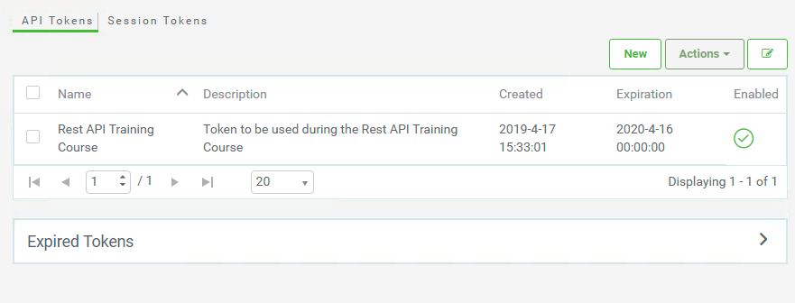
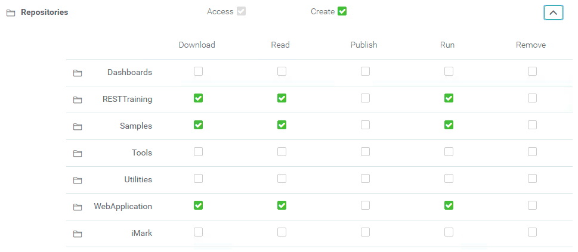
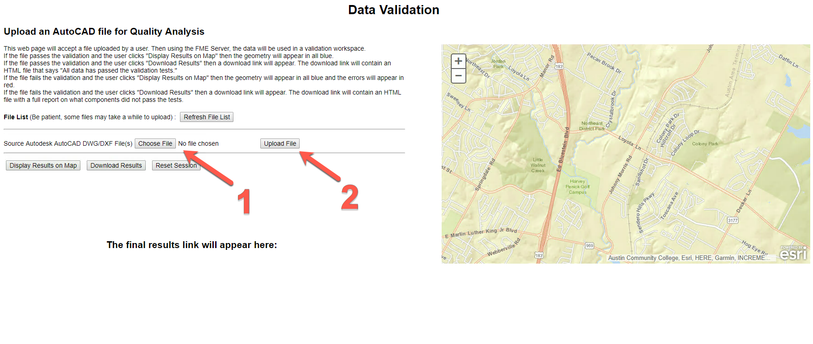
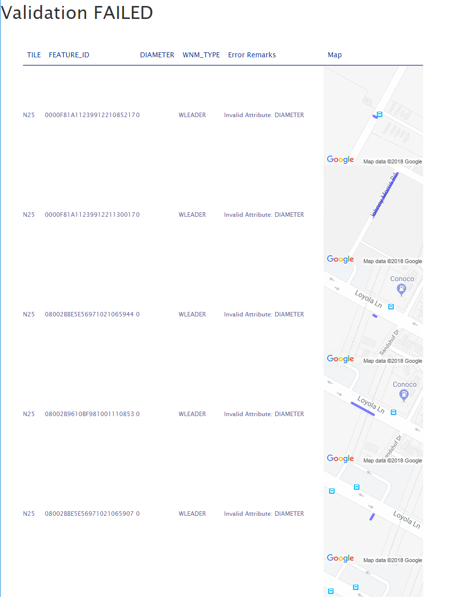

<table style="border-spacing: 0px;border-collapse: collapse;font-family:serif">
<tr>
<td width=25% style="vertical-align:middle;background-color:darkorange;border: 2px solid darkorange">
<i class="fa fa-cogs fa-lg fa-pull-left fa-fw" style="color:white;padding-right: 12px;vertical-align:text-top"></i>
<span style="color:white;font-size:x-large;font-weight: bold">Exercise 21</span>
</td>
<td style="border: 2px solid darkorange;background-color:darkorange;color:white">
<span style="color:white;font-size:x-large;font-weight: bold"> Data Upload and Validation </span>
</td>
</tr>

<tr>
<td style="border: 1px solid darkorange; font-weight: bold">Data</td>
<td style="border: 1px solid darkorange">C:\FMEData2019\Resources\RESTAPI\myFifthApp\Data\bad_data.dwg
C:\FMEData2019\Resources\RESTAPI\myFifthApp\Data\good_data.dwg</td>
</tr>

<tr>
<td style="border: 1px solid darkorange; font-weight: bold">Overall Goal</td>
<td style="border: 1px solid darkorange"> To display how to use the FME Server JavaScript API to upload files to FME Server and run them through a workspace.  </td>
</tr>

<tr>
<td style="border: 1px solid darkorange; font-weight: bold">Demonstrates</td>
<td style="border: 1px solid darkorange"> How to create a data validation application with a data streaming component. </td>
</tr>

<tr>
<td style="border: 1px solid darkorange; font-weight: bold">Starting HTML </td>
<td style="border: 1px solid darkorange">C:\FMEData2019\Resources\RESTAPI\myFifthApp\myFifthAppBegin.html  </td>
</tr>

<tr>
<td style="border: 1px solid darkorange; font-weight: bold">Completed HTML </td>
<td style="border: 1px solid darkorange">C:\FMEData2019\Resources\RESTAPI\myFifthApp\myFifthAppCompleted.html  </td>
</tr>

<tr>
<td style="border: 1px solid darkorange; font-weight: bold"> Completed workspaces </td>
<td style="border: 1px solid darkorange"> C:\FMEData2019\Resources\RESTAPI\myFifthApp\webapp.kml.fmw
C:\FMEData2019\Resources\RESTAPI\myFifthApp\webapp.downloadresults.fmw
</td>
</tr>


</table>

This exercise begins from the [last exercise](https://s3.amazonaws.com/gitbook/Server-REST-API-2019/FMESERVER_RESTAPI9CustomApplications/9.8.ExerciseUpload.html) and displays how you can modify these exercises to create an application specific to your needs. In this example, you are given a workspace and two tester files to work with and create a data validation app. In the project file we recently uploaded to FME Server, it included an additional workspace for this exercise. We are now going to customize the web page for data validation.


<!--Warning Section-->

<table style="border-spacing: 0px">
<tr>
<td style="vertical-align:middle;background-color:darkorange;border: 2px solid darkorange">
<i class="fa fa-exclamation-triangle fa-lg fa-pull-left fa-fw" style="color:white;padding-right: 12px;vertical-align:text-top"></i>
<span style="color:white;font-size:x-large;font-weight: bold;font-family:serif">WARNING</span>
</td>
</tr>

<tr>
<td style="border: 1px solid darkorange">
<span style="font-family:serif; font-style:italic; font-size:larger">
This exercise uses completed workspaces imported from the project folder that was uploaded to the FME Server during <a href="https://s3.amazonaws.com/gitbook/Server-REST-API-2019/FMESERVER_RESTAPI9CustomApplications/9.6.ExerciseVisualization.html">Exercise 19</a>. If you did not do this, you may upload the workspaces located in the myFifthApp folder.
</span>
</td>
</tr>
</table>

<br>**1) Open the JS Fiddle Below**

Go to the JS Fiddle below.

<iframe width="100%" height="300" src="//jsfiddle.net/siennaemery/ekcht9xp/6/embedded/" allowfullscreen="allowfullscreen" allowpaymentrequest frameborder="0"></iframe>  

<br>**2) Review the head section**

In the head section of the HTML (lines 1-11). Here, like the past exercises, there are connections to the FME Server Example CSS and the FME Server JavaScript.

There are additional connections to ArcGIS JavaScript and the CSS file.

<br>**3) Review the body section**

In this exercise we are using the previous application as a template and adding functionality to it to meet the needs of a Data Validation application.

Lines 20-32 explain the purpose of the application. A user can upload a file to FME Server. If the user wants, they can display the results on a map on the page. Or they can download the results and see what sections need to be fixed.

This will allow the user to check their data on the web map. Errors within data will be highlighted in red. The user can then click Download Results to receive a Data Validation report.

After the instructions we need to create buttons to activate the functions in the JavaScript.

Lines 34-37 are from the last exercise and serve the same function. On line 34, there is a button created so users can view the files previously uploaded to FME Server. This function is called getFiles. Below, the button to getFiles, there is an empty div for the fileList (line 35). This div will be populated with the files uploaded to the server in the current session. After the fileList div, there is an empty form that will list the user parameters in the workspace (line 37). Line 39 contains a button which will activate the streamResults function. This will display the results of the Data Validation on the map on the website. On line 40 there is a button to download the results. Here, the results are returned to the user through a URL. The URL will contain a report on the errors present in the AutoCAD file.

After this, we have a div for the ArcGIS map which will be added to the website (line 49). Then, we have a div where the results of the translation will be displayed (line 53).

<br>**4) Review the beginning of the JavaScript**

This exercise contains many components from previous exercises. However, new components have been added to specialize this application for Data Validation and to add extra functionality.

Line 1, has the same variables as the last application. However, line 2 has additional variables. These are the variables required to stream data to the ArcGIS map. These variables are the map and the layer.

<br>**5) Modify the window.onload function**

The window.onload function (line 5-34), is similar to the last exercise however, additional code is added for the ArcGIS Maps components. On line 7 there are modules imported from the ArcGIS JavaScript, these will allow us to enable a web map.

Lines 11-14 initialize FME Server. In the previous exercise we could use https://localhost for the Server URL. However, now because we are using ArcGIS Maps we need to use our Public IP Address.

To find your Public IP Address, visit [What Is My IP.](https://www.whatismyip.com/what-is-my-public-ip-address/) Find your Public IP and add it to the Server section on line 12. Then, on line 13 update the token to your fmetoken.   

```JavaScript
FMEServer.init(
        {
            server: "http://18.206.217.227", //Update to your IP Address
            token: "725240dd2a68b7010e2e269000825888e5a6bf09" //Update to your fmetoken
        });
```
*Please note the current IP Address and token are not valid. Please update to your own training machine.*

Line 16-23 are the same as the previous exercise. The setWorkspace function (line 17) is used to get the variables for the Repository and Workspace. Next, the getSession function (line 20) is used to generate a JSID for the session. The JSID is used keep each data upload unique. The JSID is a randomly generated number. The data will be uploaded to a folder with this number. This prevents users uploading a file with the same name from overwriting previous files. Next, the generateOptions function is used, this function will get the Public Parameters in the workspace and display it for the user.

Next, the map is initialized (lines 25-30).

We now have to specify that we are using the "streets" basemap on line 98. We are centering the map where the AutoCAD file will be centered. If we centered the web map in the wrong location, the data would appear to have never loaded. The zoom should also be set to a value appropriate to the data. If the web map is too far zoomed in, the user may miss important data.

On line 98 set basemap: "streets",

Then on line 99 change center to center: [-97.650, 30.299],

Finally on line 100 set  zoom: 14,

The results will look like the JavaScript below.

```JavaScript
map = new Map("mapDiv",
      {
          basemap: "streets",
          center: [-97.650, 30.299],
          zoom: 14,
          minZoom: 5,
          smartNavigation: false
      });
```

<iframe width="100%" height="300" src="//jsfiddle.net/siennaemery/tsd4m85q/2/embedded/" allowfullscreen="allowfullscreen" allowpaymentrequest frameborder="0"></iframe>

<br>**6) Modify the setWorkspace function**

The setWorkspace function (line 36-40) is different from the setWorkspace function in the previous exercise. In the original, the values were set by a form where the user could enter the workspace and the repository. However, in this application there is only one workspace and repository that the user is interested in. Therefore, we can hard code the values in. In this function the Public IP address is added as well. This Public IP will be used to create a data streaming link which will stream the data directly to the web map on our page. On line 37 set the repository to "WebApplication"; On line 38 set the workspace to "webapp.kml.fmw"; and set the server to your Public IP Address. Then, change "&lt;yourToken>" to your token created in [exercise 1.](https://s3.amazonaws.com/gitbook/Server-REST-API-2019/FMESERVER_RESTAPI1Overview/1.5.UserCreation.html)

```JavaScript
function setWorkspace()
{
    repository = "WebApplication";
    workspace = "webapp.kml.fmw";
    server = "http://18.206.217.227"; //Update to your Public IP address
    token = "<yourToken>"
}
```

<iframe width="100%" height="300" src="//jsfiddle.net/siennaemery/q5djLarm/3/embedded/" allowfullscreen="allowfullscreen" allowpaymentrequest frameborder="0"></iframe>

<br>**7) Review the generateOptions function**

The generateOptions function (line 43-48) is the same as the previous exercise. Here, setWorkspace is called to get the repository and the workspace. Then getWorkspaceParameters is used to get the published parameters from the workspace. The published parameters are sent to the callback function, buildOptions.

<br>**8) Review the buildOptions function**

The buildOptions function (line 59-78) is the same as the previous exercise as well. generateFormItems is used to create inputs for the user to fill the published parameters. Then, a loop is used to create the button for the user to upload their data.

<br>**9) Review the uploadFile function**

The uploadFile function (line 80-85) is the same as the previous exercise, the dataUpload function is used to upload the file to FME Server. The file is uploaded to a folder named after the JSID. The JSID is a randomly generated number assigned when the getSession function has run.

<br>**10) Modify the streamResults function**

The streamResults function (line 112-136) is new to this exercise. Its purpose is to stream a new layer to the web map. This layer is created in the workspace webapp.kml.fmw.

On line 113, the function begins by checking if there is a layer present already in the web map. If this is the case we would like to remove it. On line 115 the layer is removed if it present.

Insert layer into the if statement it should now read if(layer)

```JavaScript
if (layer)
{
    map.removeLayer(layer);
}
```

Next, the function is using the classes the Esri KMLLayer and Parser. The if statements find if there are files are defined or if the archives are defined. If archives are defined then the archives are assigned to the files variable.

```JavaScript

require([
    "esri/layers/KMLLayer", "dojo/parser"
  ], function(
    KMLLayer, parser
  ) {
    if (files != undefined || archives != undefined) {
      if (archives != undefined) {
        files = archives;
      }
```

After, this a data streaming link is created. This is using the server, repository, workspace, jsid, and filename variables.

On line 128 replace //jsid variable with jsid

```JavaScript
resultUrl = server + '/fmedatastreaming/' + repository + '/' + workspace + '?token=' + token + '&SourceDataset_ACAD=%24(FME_SHAREDRESOURCE_SYSTEM)%2Ftemp%2Fupload%2F' + repository + '%2F' + workspace + '%2F' + jsid + '%2F' + filename;

```

This workspace has one public parameter, this is the where the file is stored. The full path where the file is stored will be in the temporary upload folder. Inside the upload folder, there is another folder called repository, then workspace, then jsid. Inside all of these folders there will be the file the user uploaded. The resultUrl will be a functioning data streaming link we need to incorporate into the new Esri layer.

On lines 131-133 a new layer is created using the resultURL created on line 128.


```JavaScript
layer = new KMLLayer(resultUrl);
   map.addLayer(layer, 1000);
   layer.on("load", function() {

```


<br>**11) Review the downloadWorkspace function**

The downloadWorkspace function (line 140-156), is very similar to the streamWorkspace function. It is different because it no longer has the Esri components required for streaming the KMLLayer directly to the map. Here the user will receive a link they can click to open up a page with an HTML Report.

Lines 150-154 have been added to append the finalResults section to include the Web Hook URL.

<br>**12) Modify the newSession function**

The newSession function (line 176-197) is used to create a new session for the user. Without this function, the user could upload one file, check if it is valid and get the validation report. However, if they tried to upload a new file, it would upload to the same folder in FME Server. If a user wanted to check multiple files, FME Server would not know which one to select if they were stored in the same folder. This is why the newSession function is used. It essentially repeats the same steps at the beginning of the web application.

The first function that should be used is getSession.

To do this on line 177 replace:

FMEServer.//Function to create the new session (repository, workspace, setVars);

With:

```JavaScript
FMEServer.getSession(repository, workspace, setVars);
```

After, we have created a newSession we need to refresh the file list so the user will not see the files.

To do this on line 178 replace:

FMEServer.//Function to get the new files(repository, workspace, jsid, processFiles);

With:

```JavaScript
FMEServer.getDataUploads(repository, workspace, jsid, processFiles);
```

We have also included the processFiles function to process refresh the current fileList.

Once the user selects the newSession function the fileList should be empty and they should receive a new JSID.

Save the JS Fiddle.

<iframe width="100%" height="300" src="//jsfiddle.net/siennaemery/f5Lwyejq/1/embedded/" allowfullscreen="allowfullscreen" allowpaymentrequest frameborder="0"></iframe>

<br>**13) Update the tokens permission**

We need to update our token to give it permissions to use the WebApplication repository.

Log into FME Server. Click on the User Icon and select Manage Tokens.


Click on the token we created earlier in the course. This should be called Rest API Training Course.



Then, find the Repositories tab and find the RESTTraining repository. From here, we can select the Download, Read, and Run permissions.




<br>**14) Test Out the Application**

Click Run to start the application.



After, the file has been uploaded to FME Server, select Display Results on Map. The errors in the AutoCAD file are displayed in red.  Then, select Download Results.


The Download Results button will return and HTML page with the following format.




---

<!--Exercise Congratulations Section-->

<table style="border-spacing: 0px">
<tr>
<td style="vertical-align:middle;background-color:darkorange;border: 2px solid darkorange">
<i class="fa fa-thumbs-o-up fa-lg fa-pull-left fa-fw" style="color:white;padding-right: 12px;vertical-align:text-top"></i>
<span style="color:white;font-size:x-large;font-weight: bold;font-family:serif">CONGRATULATIONS</span>
</td>
</tr>

<tr>
<td style="border: 1px solid darkorange">
<span style="font-family:serif; font-style:italic; font-size:larger">
By completing this exercise you have learned how to:
<br>
<ul><li>Use an FME workspace to create a data validation app</li>
<li> Upload a file using the FME Server JavaScript API</li>
<li>Use the getSession and generateOptions functions </li>


</span>
</td>
</tr>
</table>
