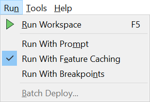
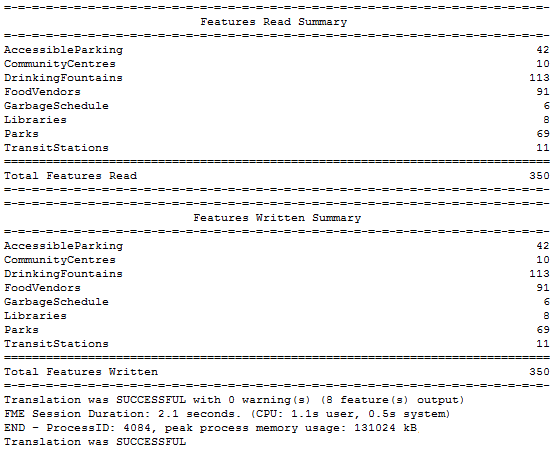

## Running a Workspace ##

The green arrow (or 'play' button) on the Workbench toolbar starts a translation:

Alternatively, look under Run on the menubar:

The same toolbar options appear on both the menubar and toolbar. Notice the shortcut option F5 can be used instead: 

---

<!--Tip Section--> 

<table style="border-spacing: 0px">
<tr>
<td style="vertical-align:middle;background-color:darkorange;border: 2px solid darkorange">
<i class="fa fa-info-circle fa-lg fa-pull-left fa-fw" style="color:white;padding-right: 12px;vertical-align:text-top"></i>
TIP
</td>
</tr>

<tr>
<td style="border: 1px solid darkorange">

The action of the Run button can be modified by a series of options including the ability to prompt the user for input (Run with Prompt), the ability to cache intermediate data (Run with Full Inspection) and the ability to run in debug mode (Run with Breakpoints). These are toggle options that can be turned on and off at will.

</td>
</tr>
</table>

---
 
## Workspace Results ##
After running a workspace, related information and statistics are found in the translation log, which is displayed in the Workbench log window.

The translation log reveals whether the translation succeeded or failed, how many features were read from the source and written to the destination, and how long it took to perform the translation.

In this example the log file reveals that 350 features were read (from an Esri Geodatabase) and written out (to a GML dataset).

The overall process was a success, with zero warnings. The elapsed time for the translation was 2.1 seconds.

---

<!--Person X Says Section-->

<table style="border-spacing: 0px">
<tr>
<td style="vertical-align:middle;background-color:darkorange;border: 2px solid darkorange">
<i class="fa fa-quote-left fa-lg fa-pull-left fa-fw" style="color:white;padding-right: 12px;vertical-align:text-top"></i>
Miss Vector says...
</td>
</tr>

<tr>
<td style="border: 1px solid darkorange">

I bet you've got all of the questions correct so far! Well done. Now see if you can get these:
  Which of these is NOT a way to set the format of a translation?
  <a href="http://52.73.3.37/fmedatastreaming/Manual/QAResponse2017.fmw?chapter=1&question=8&answer=1&DestDataset_TEXTLINE=C%3A%5CFMEOutput%5CQAResponse.html">1. Typing the format name</a>
 <a href="http://52.73.3.37/fmedatastreaming/Manual/QAResponse2017.fmw?chapter=1&question=8&answer=2&DestDataset_TEXTLINE=C%3A%5CFMEOutput%5CQAResponse.html">2. Selecting the format from a drop-down list</a>
 <a href="http://52.73.3.37/fmedatastreaming/Manual/QAResponse2017.fmw?chapter=1&question=8&answer=3&DestDataset_TEXTLINE=C%3A%5CFMEOutput%5CQAResponse.html">3. Browsing for the format in the formats gallery</a>
 <a href="http://52.73.3.37/fmedatastreaming/Manual/QAResponse2017.fmw?chapter=1&question=8&answer=4&DestDataset_TEXTLINE=C%3A%5CFMEOutput%5CQAResponse.html">4. By selecting a dataset with a known file extension</a>
 <a href="http://52.73.3.37/fmedatastreaming/Manual/QAResponse2017.fmw?chapter=1&question=8&answer=5&DestDataset_TEXTLINE=C%3A%5CFMEOutput%5CQAResponse.html">5. None of the above (they are all valid ways to set the format)</a>
  Which key is a shortcut to run a workspace?
  <a href="http://52.73.3.37/fmedatastreaming/Manual/QAResponse2017.fmw?chapter=1&question=9&answer=1&DestDataset_TEXTLINE=C%3A%5CFMEOutput%5CQAResponse.html">1. F4</a>
 <a href="http://52.73.3.37/fmedatastreaming/Manual/QAResponse2017.fmw?chapter=1&question=9&answer=2&DestDataset_TEXTLINE=C%3A%5CFMEOutput%5CQAResponse.html">2. F5</a>
 <a href="http://52.73.3.37/fmedatastreaming/Manual/QAResponse2017.fmw?chapter=1&question=9&answer=3&DestDataset_TEXTLINE=C%3A%5CFMEOutput%5CQAResponse.html">3. F5.6</a>
 <a href="http://52.73.3.37/fmedatastreaming/Manual/QAResponse2017.fmw?chapter=1&question=9&answer=4&DestDataset_TEXTLINE=C%3A%5CFMEOutput%5CQAResponse.html">4. F#</a>

</td>
</tr>
</table>