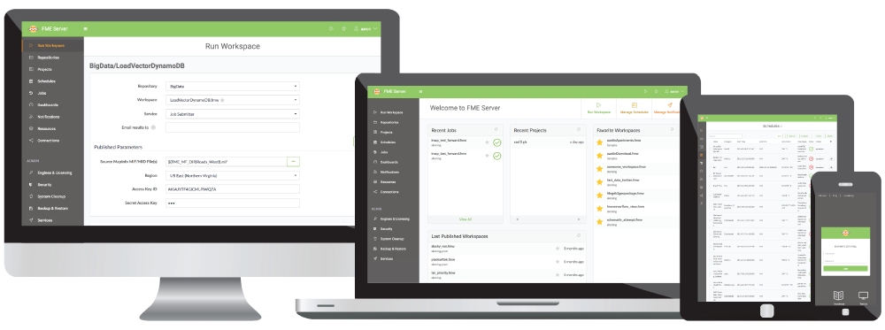

<!--This file duplicates a little of the content to follow, but is added here because the content of this file is used for the landing page on GitBook-->

# Workspace Authoring for FME Server Training Manual #

This is the manual for the training course Workspace Authoring for FME Server.

This training provides a framework for authoring workspaces for FME Server. We hope that you will learn all the tools upon which to base your work, and go home with many new FME ideas!

## Course Structure ##

The full course is made up of five main sections. These sections are:

- Introduction to FME Server
- Running Workspaces on FME Server
- Self-Serve with FME Server
- Real-Time with FME Server
- Automation with FME Server

## Current Status ##

The current status of this manual is: **INCOMPLETE**: this manual should **NOT** be used for training.

This manual is for **FME2017**

The status of each chapter is:

- Chapter 0: Incomplete content. No exercises
- Chapter 1: Incomplete content and exercises
- Chapter 2: Incomplete content and exercises
- Chapter 3: Incomplete content and exercises
- Chapter 4: Incomplete content and exercises
- Chapter 5: Incomplete content and exercises
- Chapter 6: Incomplete content. No exercises
 
***NB:*** *Even for completed content, Safe Software Inc. assumes no responsibility for any errors in this document or their consequences, and reserves the right to make improvements and changes to this document without notice. See the full licensing agreement for further details.*
