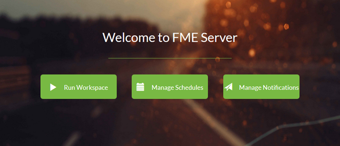

<!--This file duplicates a little of the content to follow, but is added here because the content of this file is used for the landing page on GitBook-->

# Workspace Authoring for FME Server Training Manual #

This is the manual for the training course Workspace Authoring for FME Server.

This training provides a framework for authoring workspaces for FME Server. We hope that you will learn all the tools upon which to base your work, and go home with many new FME ideas!

## Course Structure ##

The full course is made up of five main sections. These sections are:

- Introduction to FME Server
- Running Workspaces on FME Server
- Self-Serve with FME Server
- Real-Time with FME Server
- Automation with FME Server