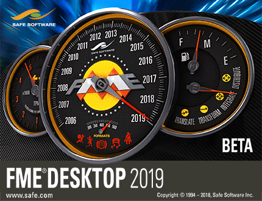

<!--This file duplicates a little of the content to follow, but is added here because the content of this file is used for the landing page on GitBook-->

# FME Desktop Basic Training Manual #

This is the manual for the introductory-level training course for Safe Software’s FME Desktop application.

The training will introduce basic concepts and terminology, help students become efficient users of FME, and direct you to resources to help apply the product to your own needs.

## Course Structure ##

The full course is made up of five main sections. These sections are:

- Data Translation Basics
- Data Transformation
- Workspace Design
- Practical Transformer Use
- Best Practice
 
## Current Status ##

The current status of this manual is: **COMPLETE**: this manual can be used for training.

This manual applies to **FME2018.0**

The status of each chapter is:

- Chapter 0: Complete content. No exercises
- Chapter 1: Complete content and exercises
- Chapter 2: Complete content and exercises
- Chapter 3: Complete content and exercises
- Chapter 4: Complete content and exercises
- Chapter 5: Complete content and exercises
- Chapter 6: Complete content. No exercises
- Slides: Complete
- FMEData: Complete
- Course Outline: Complete

***NB:*** *Even for completed content, Safe Software Inc. assumes no responsibility for any errors in this document or their consequences, and reserves the right to make improvements and changes to this document without notice. See the full licensing agreement for further details.*