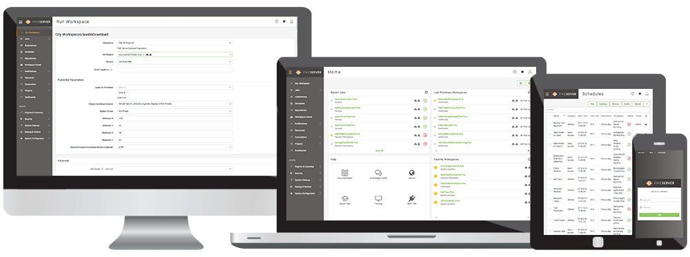

 <!--This file duplicates a little of the content to follow, but is added here because the content of this file is used for the landing page on GitBook-->

# FME Server Administration Training Manual #

This is the manual for the training course System Administration for FME Server.

The training will assist you to install and administer an FME Server installation and its users.

## Course Structure ##

The full course is made up of seven sections. These sections are:

- Planning an FME Server Installation
- FME Server Connectivity
- FME Server Customization/Enterprise
- Scalability and Performance
- Migration and Upgrades
- FME Server Security
- Troubleshooting

## Current Status ##

The current status of this manual is: **INCOMPLETE**. This manual should **NOT** be used for training.

This manual applies to **FME2018.0**

The status of each chapter is:

- Chapter 0: Incomplete content. No exercises
- Chapter 1: Incomplete content and exercises
- Chapter 2: Incomplete content and exercises
- Chapter 3: Incomplete content and exercises
- Chapter 4: Incomplete content and exercises
- Chapter 5: Incomplete content and exercises
- Chapter 6: Incomplete content. No exercises
- Chapter 7: Incomplete content. No exercises
- Chapter 8: Incomplete content. No exercises
- Slides: Incomplete
- FMEData: Incomplete
- Course Outline: Incomplete

***NB:*** *Even for completed content, Safe Software Inc. assumes no responsibility for any errors in this document or their consequences, and reserves the right to make improvements and changes to this document without notice. See the full licensing agreement for further details.*
