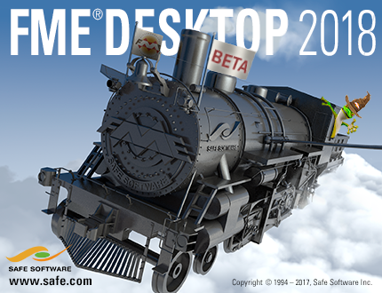

# FME Desktop Advanced Training Manual #

This is the manual for the advanced-level training course for Safe Software’s FME Desktop application.

<!--This file duplicates a little of the content to follow, but is added here because the content of this file is used for the landing page on GitBook-->

The training builds upon basic training to cover functionality that is important to all FME users wishing to take their skills to the next level.

## Course Structure ##

The full course is made up of five main sections. These sections are:

- User Parameters
- Performance
- Custom Transformers
- Advanced Reading/Writing
- Advanced Attribute Handling

## Current Status ##

The current status of this manual is: **COMPLETE**: this manual **CAN** be used for training

It is valid for **FME2017.0** and **FME2017.1**  

The status of each chapter is:

- Chapter 0: Complete content. No exercises
- Chapter 1: Content and exercises complete
- Chapter 2: Content and exercises complete
- Chapter 3: Content and exercises complete
- Chapter 4: Content and exercises complete
- Chapter 5: Content and exercises complete
- Chapter 6: Complete content. No exercises
- Slides: Complete
- FMEData: Complete
- Course Outline: Updated
 
***NB:*** *Even for completed content, Safe Software Inc. assumes no responsibility for any errors in this document or their consequences, and reserves the right to make improvements and changes to this document without notice. See the full licensing agreement for further details.*
