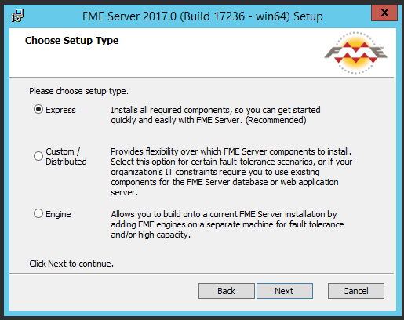
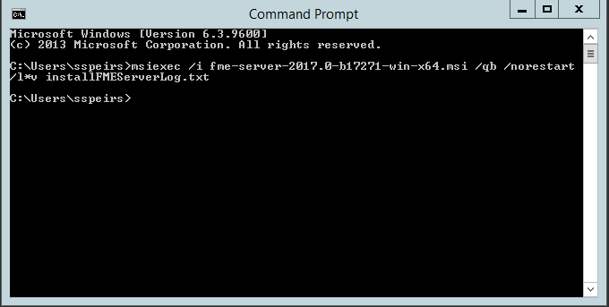

# Installation Types #

There are three options when you install FME Server: Express, Custom/Distributed or Engine, as well as the option to do a Silent installation.

 
## Express Installation ##

The Express option allows you to package all the components, or layers, of the FME Server Architecture into a single machine. It is the quickest and easiest of the installation options since all components are provided for you, and you only need to provide a single server to host the installation.

Use the Express installation for any of these scenarios:

- You are not concerned about planning for 2or 3-tier architecture or fault tolerance. You want to get started quickly with a single installation of FME Server.
- You want to implement an Active-Active architecture for fault tolerance and/or high capacity. In this scenario, you conduct multiple Express installations (as many as you plan for your network), which you link together using your third-party load balancer.

## N-tier Installation ##
Another option is to install with the Distributed option. With Distributed, you can physically distribute the components into 3-tier or 2-tier configurations:

A 3-tier architecture distributes the FME Server Web Services, FME Server Application (including the FME Server Core and FME Engines), and the FME Server Database across three physically separate servers. If you choose 3-tier architecture, you must provide and manage:

- A web application server to run the FME Server Web Services. You can run the FME Server Web Services on your own servlet (Apache Tomcat and Oracle WebLogic are supported), or use an Apache Tomcat servlet provided with the installation.
- A database server to host the FME Server Database (Oracle, PostgreSQL, and SQL Server are supported).
- A remote file system to host shared resources.

With 2-tier architecture, an Apache Tomcat servlet is provided to run the FME Server Web Services, and is installed along with the FME Server Core and Engines. Only FME Server Database is installed separately, on a server you provide, along with a remote file system.

### Benefits of a N-tier Architecture ###

Implementing a 2- or 3-tier architecture is good if you want to keep components separate so that each can be managed by the appropriate expert team, or if you want to implement an Active-Passive system for failover. You also have finer control over applying security updates to the FME Server Web Application and Database servers when you supply your own. If you use the default FME provided components, you do not have the same amount of control for security.

### Implementing a N-tier Architecture ###

You can implement a N-tier architecture by:

1. Choosing one of the Distributed Installation options at installation time, or
2. After an Express installation, by performing one or both of the following reconfigurations:
	- Moving the Web Applications Server to another machine.
	- Changing the database provider for the FME Server database.

## Engine Installation ##
The third option for FME Server installation is an Engine installation. The Engine installation allows you to build onto a current FME Server installation by adding FME Engines on a separate machine for fault tolerance and/or high capacity. By installing additional FME Engines on a separate computer from the FME Server Core, you can add processing capacity to your FME Server.

## Silent Installation ##
There is also the option for Silent installation with either Linux or Windows. 

If doing a Silent installation you can overriding any default installation properties to customize the installation. Installation properties can be set in advanced, or run with their default values.

The following image shows an example of a silent installation for Windows for an install with all default options (similar to an Express install), with logging enabled:

##

<!--sister intuitive Section--> 

<table style="border-spacing: 0px">
<tr>
<td style="vertical-align:middle;background-color:darkorange;border: 2px solid darkorange">
<i class="fa fa-info-circle fa-lg fa-pull-left fa-fw" style="color:white;padding-right: 12px;vertical-align:text-top"></i>
Sister Intuitive says..
</td>
</tr>

<tr>
<td style="border: 1px solid darkorange">

The above example assumes you are running a command line from a directory that contains an installer named fme-server-2017.0-b17271-win-x64.msi

</td>
</tr>
</table>